# APPENDIX DP: DISCOVERY PROTOCOLS & PREDICTIONS

**Version 18.0 — THE REPRODUCIBILITY EDITION**

> **Standalone appendix for U-Theory / U-Model v18.0**  
> **Status:** Active Research Program — THE REPRODUCIBILITY EDITION  
> **Last Updated:** January 24, 2026  
> **Figshare DOI:** https://doi.org/10.6084/m9.figshare.31122985  
> **Total Predictions:** 333+ across 45+ discovery programs

---

## 🔺 HIERARCHY REMINDER

| Layer | Scope | This Appendix Covers |
|-------|-------|---------------------|
| **U-Theory** | Universe (L1+L2) | DP-PHY (Physics), Mirror Theory, NP-P (Cosmology) |
| **U-Model** | Earth (L3) | DP.1-27 (Organizations), NP-S (Society), NP-E (Ecology) |
| **U-Score** | Metrics | DP.MAP (Protocols), DP-PRE (Preregistration), Baselines |

---

📺 **Video Presentation:** [U-Model Theory Overview](https://youtu.be/65tvgF9sTQY)

📺 **NEW: World Economy +100 Trillion USD with U-Model:** [How U-Model Can Add 100+ Trillion to the Global Economy](https://youtu.be/9Dj7oK8h4o4?si=gdD28fNsoVUi4lkv)

---

## Table of Contents

| Section | Content | Predictions |
|---------|---------|-------------|
| [DP.0](#dp0-why-this-appendix-exists) | Why This Appendix Exists | — |
| [DP.1–DP.4](#dp1-the-ai-hallucination-threshold) | Core Predictions (Full Cards) | 4 |
| [DP.5–DP.17](#dp5dp17-complete-prediction-registry) | Prediction Registry (Summary) | 13 |
| [DP.18–DP.27](#dp18-cybersecurity-breach-threshold-code-collapse) | **Extended Predictions** | **10** |
| **[DP-PHY.1](#dp-phy1-the-proton-isomorphism)** | **Proton Isomorphism (L2)** | — |
| **[DP-PHY.2](#dp-phy2-the-mirror-theory)** | **🪞 THE MIRROR THEORY (v1.0)** | **7** |
| [DP-TIER1](#dp-tier1-core-preregistration-cards-full-protocol) | Preregistration Cards (Full Protocol) | 5 |
| [DP-PRE.1–DP-PRE.5](#dp-pre-preregistration-ready-prediction-cards) | Additional Preregistration Cards | 5 |
| [DP-PRE.6–DP-PRE.10](#dp-pre6-cybersecurity-breach-rate-from-code-score) | **New Preregistration Cards** | **5** |
| [DP.MAP](#dpmap-frozen-proxy-library-anti-gaming--reproducibility) | **Frozen Proxy Library** | — |
| [DP-SEEDS](#dp-seeds-theoretical-predictions-future-l3-development) | Theoretical Seeds (Future L3) | 13 |
| [APPENDIX FH](#appendix-fh-future-hypotheses-balanced-55) | **Future Hypotheses (5×5 Balanced)** | **25** |
| — [FH-P](#fh-p-physics-5-hypotheses) | Physics (5) | 5 |
| — [FH-C](#fh-c-chemistry--materials-5-hypotheses) | Chemistry / Materials (5) | 5 |
| — [FH-B](#fh-b-biology--medicine-5-hypotheses) | Biology / Medicine (5) | 5 |
| — [FH-E](#fh-e-economics--governance-5-hypotheses) | Economics / Governance (5) | 5 |
| — [FH-AI](#fh-ai-artificial-intelligence-5-hypotheses) | AI (5) | 5 |
| — [FH-H](#fh-h-horizons-5-long-term-hypotheses-20302100) | **Horizons 2030–2100+** | **5** |
| — [FH-QE](#fh-qe-quantum-entanglement-confirmation-of-u-model) | Quantum-Entanglement Confirmation | 1 |
| — [FH-IT](#fh-it-interstellar-travel-cost-engineering-framework) | Interstellar Travel Framework | 1 |
| — [FH-ME](#fh-me-medicine-as-form-correction) | Medicine as Form-Correction | 1 |
| — [FH-EN](#fh-en-energy-from-vacuum-zero-point-action) | Energy from Vacuum | 1 |
| — [FH-CO](#fh-co-consciousness-as-recursive-triad) | Consciousness as Recursive Triad | 1 |
| **[APPENDIX FH+](#appendix-fh-extended-discovery-programs-32-new-hypotheses)** | **Extended Discovery Programs** | **32** |
| — [FH+.I](#fhi-meta-theories-frameworks-that-generate-sub-theories) | Meta-Theories (Frameworks) | 5 |
| — [FH+.II](#fhii-physics--cosmology--quantum) | Physics / Cosmology / Quantum | 7 |
| — [FH+.III](#fhiii-chemistry--materials--energy) | Chemistry / Materials / Energy | 5 |
| — [FH+.IV](#fhiv-biology--medicine--longevity) | Biology / Medicine / Longevity | 5 |
| — [FH+.V](#fhv-economics--society--geopolitics) | Economics / Society / Geopolitics | 5 |
| — [FH+.VI](#fhvi-ai--computing--future-science) | AI / Computing / Future Science | 5 |
| **[DP-L](#dp-l-longevity-predictions-5-cards)** | **Longevity Predictions (Full Cards)** | **5** |
| **[APPENDIX H](#appendix-h-horizons-beyond-2100)** | **HORIZONS (Beyond 2100)** | **5** |
| — [H.1](#h1-the-end-of-distance-transport-via-metric-engineering) | The End of Distance | — |
| — [H.2](#h2-the-end-of-entropy-medicine-via-informational-repair) | The End of Entropy | — |
| — [H.3](#h3-the-end-of-scarcity-energy-from-vacuum) | The End of Scarcity | — |
| — [H.4](#h4-the-end-of-isolation-consciousness--ai) | The End of Isolation | — |
| — [H.5](#h5-the-final-frontier--universal-interface) | Universal Interface | — |
| **[APPENDIX RP](#appendix-rp-the-triadic-research-law-u-model)** | **Triadic Research Law** | — |
| — [RP.1–RP.4](#rp1-the-triadic-decomposition-law-axiom-rp-1) | Law + Resistances + Errors | — |
| — [RP.5](#rp5-u-model-research-protocol-urp-0urp-9) | URP Protocol (10 Steps) | — |
| — [RP.6](#rp6-the-38-research-matrix) | 3×8 Research Matrix | — |
| — [RP.7](#rp7-worked-example-urp-9-interstellar-travel-as-cost-engineering) | Worked Example: Interstellar | 1 |
| **[APPENDIX DD](#appendix-dd-dynamics--derivatives)** | **Dynamics & Derivatives** | — |
| — [DD.1–DD.3](#dd1-the-spectrum-of-position-absolute-vs-relative) | Position/Form/Action Spectra | — |
| — [DD.4](#dd4-application-in-research-protocol-depth-analysis) | Depth Analysis Matrix | — |
| **[APPENDIX AP](#appendix-ap-ai-applications-of-u-model)** | **AI Applications** | **6** |
| — [AP.1–AP.6](#ap1-ai-alignment--safety-strongest-application) | Alignment, Hallucinations, Scaling, Quantum, Governance | 6 |
| **[APPENDIX LG](#appendix-lg-the-lady-galaxy-protocol)** | **🌌 THE LADY GALAXY PROTOCOL** | **5** |
| — [LG.0](#lg0-the-concept) | The Concept | — |
| — [LG.1](#lg1-the-7-stages-of-lgp) | The 7 Stages of Discovery | — |
| — [LG.2](#lg2-the-10-step-lady-galaxy-protocol-lgp-10) | LGP-10 Full Protocol | — |
| — [LG.3](#lg3-the-three-resistances) | The Three Resistances | — |
| — [LG.4](#lg4-case-studies--applying-lady-galaxy-to-the-future) | Case Studies (Gravity, Matter, Sociology) | 3 |
| — [LG.5](#lg5-the-five-next-discoveries-lady-galaxy-roadmap) | Ten Next Discoveries (LG-D1–D10) | **10** |
| — [LG.6](#lg6-the-ultimate-goal--omega-point-poetic-vision) | Omega Point Vision | — |
| — [LG.7](#lg7-protocol-summary-card) | Protocol Summary Card | — |
| — [LG.8](#lg8-the-lady-galaxy-manifesto) | The Lady Galaxy Manifesto | — |
| — [LG.9](#lg9-mortal--the-anthem-of-immortal-work) | MORTAL — The Anthem | — |
| **[APPENDIX NP](#appendix-np-new-predictions--theoretical-extensions)** | **🔮 NEW PREDICTIONS (72)** | **72** |
| — [NP.I](#npi-fundamental-physics-extensions) | Fundamental Physics | 12 |
| — [NP.II](#npii-mathematics--information-theory) | Mathematics & Information | 8 |
| — [NP.III](#npiii-neuroscience--cognition) | Neuroscience & Cognition | 10 |
| — [NP.IV](#npiv-ecology--planetary-systems) | Ecology & Planetary Systems | 8 |
| — [NP.V](#npv-technology--engineering) | Technology & Engineering | 10 |
| — [NP.VI](#npvi-sociology--civilization) | Sociology & Civilization | 8 |
| — [NP.VII](#npvii-cosmology--ultimate-questions) | Cosmology & Ultimate Questions | 10 |
| — [NP.VIII](#npviii-meta-predictions) | Meta-Predictions | **7** |
| — [NP.IX](#npix-the-aesthetics-of-existence-art-humor-love) | **Aesthetics of Existence** | **4** |
| — [NP.X](#npx-the-open-challenge) | The Open Challenge | — |
| **[APPENDIX CS](#appendix-cs-consciousness-research-program)** | **🧠 CONSCIOUSNESS RESEARCH** | **6** |
| — [CS.0–CS.5](#cs0-introduction--the-level-confusion-problem) | Analysis & Triadic Map | — |
| — [CS.6](#cs6-lgp-5--dp-c-format-6-new-falsifiable-predictions) | 6 New DP-C Predictions | **6** |
| — [CS.7–CS.10](#cs7-lgp-6--pilot-design-how-to-start-without-metaphysical-dispute) | Pilot & Consensus Path | — |
| **[APPENDIX CΛ](#appendix-cλ-dark-energy-research-program)** | **🌌 DARK ENERGY RESEARCH** | **6** |
| — [CΛ.0–CΛ.5](#cλ0-introduction--the-observation-theory-gap) | Analysis & Resistance Report | — |
| — [CΛ.6](#cλ6-new-falsifiable-predictions-dp-c--fh-np-style) | 6 New DP-C Predictions | **6** |
| — [CΛ.7–CΛ.8](#cλ7-conclusion--the-triadic-lock-on-dark-energy) | Conclusion & References | — |
| **[APPENDIX LT](#appendix-lt-longevity-translation-research-program)** | **🧬 LONGEVITY TRANSLATION** | **6** |
| — [LT.0–LT.6](#lt0-introduction--the-translation-gap) | Analysis & Resistance Report | — |
| — [LT.7](#lt7-new-falsifiable-predictions-dp-c--dp-l-style) | 6 New DP-L Predictions (DP-L6–L11) | **6** |
| — [LT.8–LT.9](#lt8-conclusion--the-triadic-lock-on-longevity-translation) | Conclusion & References | — |
| **[APPENDIX PM](#appendix-pm-p-vs-np--complexity-barriers-research-program)** | **🔢 P VS NP COMPLEXITY** | **6** |
| — [PM.0–PM.6](#pm0-introduction--the-triadic-asymmetry-problem) | Analysis & Triadic Map | — |
| — [PM.7](#pm7-new-falsifiable-predictions-np-m--dp-c-style) | 6 New DP-C Predictions (DP-C.M1–M6) | **6** |
| — [PM.8–PM.9](#pm8-conclusion--the-triadic-lock-on-p-vs-np) | Conclusion & References | — |
| **[APPENDIX SM](#appendix-sm-social-media-polarization-research-program)** | **📱 SOCIAL MEDIA POLARIZATION** | **6** |
| — [SM.0–SM.3](#sm0-introduction--the-engagement-paradox) | Analysis & δ-Volatility | — |
| — [SM.4](#sm4-new-falsifiable-predictions-dp-c-style-6-cards) | 6 New DP-C Predictions (DP-C.SM1–SM6) | **6** |
| — [SM.5–SM.8](#sm5-lgp-6--interventions-how-to-reduce-polarization-without-killing-engagement) | Interventions & References | — |
| **[APPENDIX EDU](#appendix-edu-higher-education-research-program)** | **🎓 HIGHER EDUCATION** | **6** |
| — [EDU.0–EDU.3](#edu0-introduction--the-bureaucratic-paradox) | Analysis & Bureaucracy Knee | — |
| — [EDU.4](#edu4-new-falsifiable-predictions-dp-c-style-6-cards) | 6 New DP-C Predictions (DP-C.EDU1–EDU6) | **6** |
| — [EDU.5–EDU.8](#edu5-interventions--fixing-without-destroying-urp-6-by-fpa) | Interventions & References | — |
| **[APPENDIX CP](#appendix-cp-climate-policy-research-program)** | **🌍 CLIMATE POLICY** | **6** |
| — [CP.0–CP.5](#cp0-introduction--the-implementation-paradox) | Analysis & δ-Volatility | — |
| — [CP.6](#cp6-new-falsifiable-predictions-dp-c-style-6-cards) | 6 New DP-C Predictions (DP-C.CP1–CP6) | **6** |
| — [CP.7–CP.10](#cp7-interventions--making-climate-policy-durable-without-losing-ambition) | Interventions & References | — |
| **[APPENDIX GP](#appendix-gp-global-problems-2026--u-model-solutions)** | **🌐 GLOBAL PROBLEMS 2026** | **7** |
| — [GP.0–GP.7](#gp0-introduction--the-universal-template) | 7 Global Challenges (WEF Risk Landscape) | — |
| — [GP.8](#gp8-new-falsifiable-predictions-dp-c-style-7-cards) | 7 New DP-C Predictions (DP-C.GP1–GP7) | **7** |
| — [GP.9–GP.11](#gp9-the-universal-design-principles) | Universal Principles & References | — |
| **[APPENDIX ABIO](#appendix-abio)** | **🧬 ABIOGENESIS** | **5** |
| — [ABIO.1–ABIO.4](#abio-1-introduction) | Origin of Life Analysis | — |
| — [ABIO.5](#abio-5-dp-c-prediction-cards) | 5 New DP-C Predictions (DP-C.ABIO1–ABIO5) | **5** |
| — [ABIO.6–ABIO.7](#abio-6-interventions--next-steps) | Interventions & References | — |
| **[APPENDIX NS](#appendix-ns)** | **🌊 NAVIER-STOKES & TURBULENCE** | **6** |
| — [NS.1–NS.4](#ns-1-introduction) | Turbulence Analysis | — |
| — [NS.5](#ns-5-dp-c-prediction-cards) | 6 New DP-C Predictions (DP-C.NS1–NS6) | **6** |
| — [NS.6–NS.7](#ns-6-interventions--next-steps) | Interventions & References | — |
| **[APPENDIX TIME](#appendix-time)** | **⏰ ARROW OF TIME** | **5** |
| — [TIME.1–TIME.4](#time-1-introduction) | Time's Direction Analysis | — |
| — [TIME.5](#time-5-dp-c-prediction-cards) | 5 New DP-C Predictions (DP-C.TIME1–TIME5) | **5** |
| — [TIME.6–TIME.7](#time-6-interventions--next-steps) | Interventions & References | — |
| **[APPENDIX QM](#appendix-qm)** | **⚛️ QUANTUM MEASUREMENT** | **5** |
| — [QM.1–QM.4](#qm-1-introduction) | Measurement Problem Analysis | — |
| — [QM.5](#qm-5-dp-c-prediction-cards) | 5 New DP-C Predictions (DP-C.QM1–QM5) | **5** |
| — [QM.6–QM.7](#qm-6-interventions--next-steps) | Interventions & References | — |
| **[APPENDIX LEARN](#appendix-learn)** | **🧠 GENERAL LEARNING THEORY** | **6** |
| — [LEARN.1–LEARN.4](#learn-1-introduction) | Learning Theory Analysis | — |
| — [LEARN.5](#learn-5-dp-c-prediction-cards) | 6 New DP-C Predictions (DP-C.LEARN1–LEARN6) | **6** |
| — [LEARN.6–LEARN.7](#learn-6-interventions--next-steps) | Interventions & References | — |
| **[APPENDIX CANCER](#appendix-cancer)** | **💊 CANCER AS SYSTEMIC IMBALANCE** | **5** |
| — [CANCER.1–CANCER.4](#cancer-1-introduction) | Form-Escape & δ-Spike Analysis | — |
| — [CANCER.5](#cancer-5-dp-c-prediction-cards) | 5 New DP-C Predictions (DP-C.CANCER1–CANCER5) | **5** |
| — [CANCER.6–CANCER.7](#cancer-6-interventions--next-steps) | Re-Polarization & References | — |
| **[APPENDIX LANG](#appendix-lang)** | **🗣️ LANGUAGE & SEMANTICS** | **5** |
| — [LANG.1–LANG.4](#lang-1-introduction) | Triadic Communication Analysis | — |
| — [LANG.5](#lang-5-dp-c-prediction-cards) | 5 New DP-C Predictions (DP-C.LANG1–LANG5) | **5** |
| — [LANG.6–LANG.7](#lang-6-interventions--next-steps) | Interventions & References | — |
| **[APPENDIX ECON](#appendix-econ)** | **💰 ECONOMIC CYCLES & CRISES** | **6** |
| — [ECON.1–ECON.4](#econ-1-introduction) | δ-Volatility & Phase Transitions | — |
| — [ECON.5](#econ-5-dp-c-prediction-cards) | 6 New DP-C Predictions (DP-C.ECON1–ECON6) | **6** |
| — [ECON.6–ECON.7](#econ-6-interventions--next-steps) | Interventions & References | — |
| **[APPENDIX QG](#appendix-qg)** | **🔗 QUANTUM GRAVITY & UNIFICATION** | **5** |
| — [QG.1–QG.4](#qg-1-introduction) | Structural Analysis (L2) | — |
| — [QG.5](#qg-5-dp-c-prediction-cards) | 5 New DP-C Predictions (DP-C.QG1–QG5) | **5** |
| — [QG.6–QG.7](#qg-6-interventions--next-steps) | Interventions & References | — |
| **[APPENDIX TPL](#appendix-tpl)** | **🗣️ TRIADIC PARAMETRIC LANGUAGE** | **6** |
| — [TPL.1–TPL.4](#tpl-1-introduction) | Design Axioms & LGP Analysis | — |
| — [TPL.5](#tpl-5-dp-c-prediction-cards) | 6 New DP-C Predictions (DP-C.TPL1–TPL6) | **6** |
| — [TPL.6–TPL.8](#tpl-6-ai-first-emergence-path) | AI-First Path & References | — |
| **[APPENDIX MARS](#appendix-mars-first-mars-colony-stability-simulation)** | **🚀 MARS COLONY SIMULATION** | **5** |
| — [MARS.1–MARS.6](#mars-1-the-si-kernel) | SI Analysis & δ-Volatility Law | — |
| — [MARS.7](#mars-7-dp-c-prediction-cards) | 5 New DP-C Predictions (DP-C.MARS1–MARS5) | **5** |
| — [MARS.8–MARS.9](#mars-8-lgp-protocol-phases) | LGP Phases & Conclusion | — |
| **[APPENDIX NP+](#appendix-np-undiscovered-territories)** | **🔬 UNDISCOVERED TERRITORIES** | **26** |
| — [Part I](#part-i-the-hidden-physics) | Hidden Physics (HP-1 to HP-4) | **4** |
| — [Part II](#part-ii-the-hidden-biology) | Hidden Biology (HB-1 to HB-4) | **4** |
| — [Part III](#part-iii-the-hidden-mathematics) | Hidden Mathematics (HM-1 to HM-3) | **3** |
| — [Part IV](#part-iv-the-hidden-technology) | Hidden Technology (HT-1 to HT-3) | **3** |
| — [Part V](#part-v-the-hidden-cosmology) | Hidden Cosmology (HC-1 to HC-4) | **4** |
| — [Part VI](#part-vi-the-meta-theory) | Meta-Theory (HMT-1 to HMT-3) | **3** |
| — [Part VII](#part-vii-the-hidden-language-triadic-language) | Hidden Language (HL-1 to HL-5) | **5** |
| **[APPENDIX Σ](#appendix-σ-the-meaning-of-meaning)** | **📜 THE MEANING OF MEANING** | **—** |
| — [Part I–IX](#part-i-the-anatomy-of-meaning) | Anatomy, Triad, Hierarchy, Domains, Self-Reference | — |
| — [Mathematical Appendix](#mathematical-appendix-formal-definition) | Formal Definition (Σ.1–Σ.3) | — |
| [DP.CONCLUDE](#dpconclude-the-invitation) | The Invitation | — |
| [Summary Table](#summary-table-all-predictions) | All Predictions Overview | 333+ |
| [Research Roadmap](#research-roadmap) | Implementation Priority | — |
| [Validation Tracker](#validation-tracker-live--will-update-with-publications) | **📊 Live Results** | **—** |
| **[APPENDIX Ω](#appendix-omega-the-omega-seal)** | **🔒 THE OMEGA SEAL** | **—** |

**Quick Stats:** 333+ predictions | 67 future hypotheses | 45 discovery programs | 26 new research territories | 77 theoretical extensions | 6 consciousness | 6 dark energy | 11 longevity | 6 P vs NP | 6 social media | 6 education | 6 climate | 7 global 2026 | 5 abiogenesis | 6 turbulence | 5 arrow of time | 5 quantum measurement | 6 learning theory | 5 cancer | 5 language | 6 economics | 5 quantum gravity | 6 TPL | 6 AI | 5 Mars colony | 4 hidden physics | 4 hidden biology | 3 hidden math | 3 hidden tech | 4 hidden cosmology | 3 meta-theory | 5 hidden language | 10 LG discoveries | **27 appendices** (RP, DD, AP, LG, NP, CS, CΛ, LT, PM, SM, EDU, CP, GP, ABIO, NS, TIME, QM, LEARN, CANCER, LANG, ECON, QG, TPL, MARS, NP+, **Σ**, Ω) | Anti-gaming: DP.MAP + Threats

---

> *"A theory that predicts nothing is unfalsifiable; a theory that predicts everything is trivial. U-Model predicts specific thresholds — and invites the world to test them."*

---

## DP.0: Why This Appendix Exists

U-Model is not a book. It is a **research program**.

A living theory must generate **testable predictions** — specific, measurable claims that can be confirmed or refuted by data. This appendix transforms U-Model from philosophical framework into scientific protocol: **27+ L3-grade predictions** spanning AI, organizations, society, biology, and materials science.

Each prediction follows the **DP-C format** (Discovery Protocol Card):
- **Hypothesis**: The specific claim
- **Variables**: What to measure
- **Metric**: How to measure it
- **Dataset**: Where to test it
- **Statistical Test**: How to analyze
- **Decision Rule**: What confirms/refutes
- **Falsifier**: What would kill the theory

---

## Notation & Conventions (Read First)

To avoid ambiguity, this appendix uses the following conventions:

### Golden Ratio Family
- **φ (phi)** = 1.6180339… (golden ratio)
- **φ⁻¹** = 0.6180339… (inverse golden ratio)
- **φ⁻²** = 0.3819660… (square of inverse)

### Pillar Scores
- All pillar scores are internally represented as **U ∈ [0,1]**
- Percentages (e.g., "62%") are a readability alias: **62% = 0.62**
- When threshold discussions mention "φ⁻¹", the numeric equivalent is **≈ 0.618**

### Canonical Mapping (Form–Position–Action ↔ Code–Credo–Rights)

> ⚠️ **v18.4 FIX:** Previous versions had Position↔Rights. The CANONICAL mapping is:

| Triad Element | Pillar | Symbol | What It Represents |
|---------------|--------|--------|-----------------|
| **Form** | **Code** | $U_C$ | Identity, rules, structure, ethics |
| **Position** | **Credo** | $U_{Cr}$ | Context, resources, WHERE it operates |
| **Action** | **Rights** | $U_R$ | Dynamics, permissions, HOW it interacts |

> **Mnemonic:** Form=What it IS (Code), Position=WHERE it exists (Credo/resources), Action=HOW it moves (Rights/permissions)

> **Rationale:** Position answers "WHERE?" — this maps to Credo (market position, resource allocation, strategic context). Action answers "HOW?" — this maps to Rights (operational permissions, interaction dynamics).

### Prediction Count Conventions
- **196+ Total**: All predictions including NP theoretical extensions, FH programs, and speculative horizons
- **27+ L3-Ready**: Fully testable predictions with explicit datasets, metrics, and falsifiers
- **67 Future Hypotheses**: FH-category predictions requiring future data or longer timelines

---

## DP.1: The AI Hallucination Threshold

**Core Claim**: AI systems exhibit "hallucination instability" when their training data represents organizations with U-Score < 62%.

| Component | Specification |
|-----------|---------------|
| **Hypothesis** | Hallucination rate H correlates inversely with source U-Score: H ∝ 1/U |
| **Prediction** | Training corpora from U < 62% sources → H > 0.15 (15% hallucination) |
| **Metric** | Hallucination rate = (false claims) / (total claims) |
| **Dataset** | LLM outputs trained on corporate vs academic vs Wikipedia sources |
| **Statistical Test** | Regression: H ~ β₀ + β₁(U) + ε |
| **Decision Rule** | β₁ < 0, p < 0.05 → confirmed; β₁ ≥ 0 → refuted |
| **Falsifier** | No correlation between source U-Score and hallucination rate |

**Theoretical Basis**: Low-U organizations produce incoherent documentation (Form–Position–Action misalignment). AI trained on incoherence inherits incoherence.

### 🆕 External Validation (v18.0)

| Source | Finding | U-Model Interpretation |
|--------|---------|------------------------|
| **Rogulsky (2024)** | **0.001% misinformation** in training data compromises LLM factual accuracy | Baseline: even $10^{-5}$ Position-errors propagate |
| **Nature Medicine (2024)** | Medical LLMs hallucinate at 5-15% base rate | Confirms H > 0.05 threshold |

**Baseline Formula (v18.0):**
$$\boxed{H_{min} \geq 0.001\% \cdot \frac{1}{U_{corpus}}}$$

This means: with $U_{corpus} = 0.5$ (50% coherent training data), minimum hallucination rate is $H_{min} = 0.002\%$ — but real-world rates are 1000× higher due to compounding.

---

## DP.2: The Bureaucracy Constant (B* ≈ φ⁻² ≈ 0.382)

**Core Claim**: Organizations stabilize when bureaucratic overhead reaches the "golden administrative ratio" B* ≈ φ⁻² ≈ 0.382 of total capacity.

| Component | Specification |
|-----------|---------------|
| **Hypothesis** | Stable orgs converge to **B_time** = (admin hours)/(total hours) ≈ **0.382** (≈ φ⁻²) |
| **Prediction** | Deviation |B - 0.382| > 0.1 predicts instability within 3 years |
| **Metric** | B_time = Σ(administrative labor hours) / Σ(total labor hours) |
| **Dataset** | Fortune 500 longitudinal data (2015-2025) |
| **Statistical Test** | Survival analysis: hazard ratio for |B - 0.382| |
| **Decision Rule** | HR > 1.5, p < 0.05 → confirmed |
| **Falsifier** | No relationship between B-deviation and organizational survival |

**Note:** This prediction uses **B_time** (hours ratio). A separate metric **B_cost** (admin cost/total cost) may differ due to wage differentials. Both should be tested independently.

**Theoretical Basis**: A golden-ratio family appears as a hypothesis for stable allocations under triadic optimization. The implied stable administrative share is near **φ⁻²** (≈ 0.382), not φ⁻¹.

---

## DP.3: The "Shear Stress" of Revolutions (σ_rev)

**Core Claim**: Social revolutions occur when inter-class U-Score differential exceeds threshold δ > 0.25.

| Component | Specification |
|-----------|---------------|
| **Hypothesis** | Revolution probability P_rev ∝ max(U_top - U_bottom) |
| **Prediction** | δ = |U_elite - U_masses| > 0.25 → P_rev > 0.6 within 10 years |
| **Metric** | δ = Gini-weighted U-Score differential between deciles |
| **Dataset** | Historical revolutions (France 1789, Russia 1917, Arab Spring) + controls |
| **Statistical Test** | Logistic regression: P(revolution) ~ δ |
| **Decision Rule** | AUC > 0.75, δ coefficient positive → confirmed |
| **Falsifier** | Historical revolutions show no U-Score differential pattern |

**Theoretical Basis**: Large δ creates "shear stress" in social fabric — the system cannot maintain coherent Form across incompatible Position layers.

---

## DP.4: The Cellular Triad (Aging Protocol)

**Core Claim**: Cellular aging maps to F⊗P⊗A degradation: DNA damage (Form), membrane dysfunction (Position), metabolic decline (Action).

| Component | Specification |
|-----------|---------------|
| **Hypothesis** | Biological age correlates with min(F_cell, P_cell, A_cell) |
| **Prediction** | Weakest pillar predicts mortality better than chronological age |
| **Metric** | F = epigenetic clock, P = membrane potential, A = ATP production |
| **Dataset** | Longitudinal aging cohorts (Framingham, UK Biobank) |
| **Statistical Test** | Cox proportional hazards with pillar scores |
| **Decision Rule** | C-index > 0.65 for weakest-pillar model → confirmed |
| **Falsifier** | Chronological age outperforms pillar model |

**Theoretical Basis**: A cell is a stable system. Stability requires triad balance. Aging is asymmetric degradation.

---

## 🆕 DP-AGENTS: Agentic AI Stability Protocol (v18.0)

**Core Claim**: Autonomous AI agents without embedded "Credo" (Position/Context awareness) will enter infinite Action-loops or exhaust resources.

| Component | Specification |
|-----------|---------------|
| **Hypothesis** | Agent stability requires $U_{agent} = f(Code, Credo, Context) > 0.5$ |
| **Prediction** | Agents with Credo-deficit will: (a) loop infinitely, (b) resource-exhaust, (c) goal-drift |
| **Metric** | Loop-rate = (repeated actions) / (total actions); Resource-efficiency = (goal progress) / (energy spent) |
| **Dataset** | Multi-agent simulations (AutoGPT, BabyAGI, CrewAI benchmarks) |
| **Statistical Test** | Correlation: $\text{Task\_completion} \sim U_{agent}$ |
| **Decision Rule** | $R^2 > 0.3$, $p < 0.05$ for $U_{agent}$ → confirmed |
| **Falsifier** | Agents succeed without any Position/Context constraints |

**Triadic Analysis of Agent Failures:**

| Failure Mode | Missing Pillar | Symptom | Example |
|--------------|----------------|---------|---------|
| **Infinite Loop** | Position (no context termination) | Agent repeats same action forever | AutoGPT browsing loops |
| **Resource Exhaustion** | Form (no identity/goal boundaries) | Agent spawns unlimited sub-tasks | Token/API cost explosion |
| **Goal Drift** | Action (no coherent execution) | Agent pursues unrelated objectives | "Make paperclips" scenarios |

**The Agentic Trilemma:**
$$\boxed{\text{Autonomy} + \text{Efficiency} + \text{Safety} \leq 2}$$

Without U-Model constraints, agents can achieve at most 2 of 3. U-Model enables all three by ensuring $F \otimes P \otimes A$ balance.

**Tech Trend Alignment (2025):** "Agentic AI" is the #1 technology trend. U-Model predicts that agentic systems without triadic governance will fail at scale.

---

## DP.5–DP.17: Complete Prediction Registry

> *These 13 predictions form the extended registry. Each is summarized below with key parameters. Full preregistration cards can be developed on demand.*

---

### DP.5: AI Alignment — The Objective Function

| Component | Specification |
|-----------|---------------|
| **Hypothesis** | AI optimizing for U-Score ≥ 78% accepts correction |
| **Prediction** | Corrigibility increases monotonically with U-alignment score |
| **Metric** | Shutdown acceptance rate (% of episodes where agent accepts termination) |
| **Dataset** | Safety Gym benchmarks, RLHF fine-tuned models |
| **Threshold** | U ≥ 78% → acceptance > 90%; U < 62% → acceptance < 50% |
| **Falsifier** | U-aligned AI resists correction OR no correlation |

**Theoretical Basis:** High-U systems have balanced Rights pillar — they "expect" feedback and correction as normal operation.

---

### DP.6: Supply Chain Resilience

| Component | Specification |
|-----------|---------------|
| **Hypothesis** | Supply chains with U > 70% recover faster from shocks |
| **Prediction** | Recovery time T ∝ 1/U (inverse relationship) |
| **Metric** | Days to 90% capacity after disruption |
| **Dataset** | Bloomberg Supply Chain Index, company filings (2018-2025) |
| **Threshold** | U > 70% → T < 21 days; U < 55% → T > 45 days |
| **Falsifier** | No U-recovery correlation OR inverse relationship |

**Theoretical Basis:** High-U supply chains have balanced Credo (efficiency) with Code (redundancy) and Rights (supplier relationships).

---

### DP.7: Team Performance

| Component | Specification |
|-----------|---------------|
| **Hypothesis** | Teams with balanced F-P-A outperform specialists |
| **Prediction** | δ_pillar < 0.1 → top quartile performance |
| **Metric** | Composite performance score (productivity + quality + retention) |
| **Dataset** | Gallup Q12 linked to team KPIs (N > 500 teams) |
| **Threshold** | δ < 0.1 → 75th percentile; δ > 0.3 → below median |
| **Falsifier** | Specialist teams (high δ) consistently dominate |

**Theoretical Basis:** Imbalanced teams have "blind spots" — strong execution but weak ethics, or strong culture but weak delivery.

---

### DP.8: Market Stability

| Component | Specification |
|-----------|---------------|
| **Hypothesis** | Markets with U < 50% exhibit flash crashes |
| **Prediction** | Crash probability P ∝ (62 - U)² (quadratic relationship) |
| **Metric** | Intraday volatility > 5σ events per year |
| **Dataset** | NYSE/NASDAQ tick data, sector-level governance scores |
| **Threshold** | U < 50% → P(crash) > 15%/year; U > 70% → P(crash) < 2%/year |
| **Falsifier** | High-U markets crash at equal or higher rates |

**Theoretical Basis:** Low-U markets have misaligned incentives (Code-Credo gap) creating systemic fragility.

---

### DP.9: Educational Outcomes

| Component | Specification |
|-----------|---------------|
| **Hypothesis** | Schools with U > 72% outperform SES predictions |
| **Prediction** | PISA score > SES prediction by > 0.5 SD |
| **Metric** | Residual from socioeconomic status regression |
| **Dataset** | PISA country data + school-level governance assessments |
| **Threshold** | U > 72% → positive residual; U < 55% → negative residual |
| **Falsifier** | No U-PISA relationship after SES controls |

**Theoretical Basis:** High-U schools balance academic rigor (Code), operational efficiency (Credo), and student wellbeing (Rights).

---

### DP.10: Healthcare Quality

| Component | Specification |
|-----------|---------------|
| **Hypothesis** | Hospitals with U > 75% have lower mortality |
| **Prediction** | Risk-adjusted mortality < expected by > 10% |
| **Metric** | O/E ratio (Observed/Expected mortality) by U-quartile |
| **Dataset** | CMS Hospital Compare, Leapfrog Safety Grades |
| **Threshold** | U > 75% → O/E < 0.90; U < 55% → O/E > 1.15 |
| **Falsifier** | No O/E difference by U-Score quartile |

**Theoretical Basis:** High-U hospitals have aligned protocols (Code), efficient processes (Credo), and engaged staff (Rights).

---

### DP.11: Political Polarization

| Component | Specification |
|-----------|---------------|
| **Hypothesis** | Nations with U < 55% show extreme polarization |
| **Prediction** | Polarization index > 0.7 when national U < 55% |
| **Metric** | DW-NOMINATE spread, parliamentary voting patterns |
| **Dataset** | V-Dem democracy indices, legislative roll-call data |
| **Threshold** | U < 55% → polarization > 0.7; U > 70% → polarization < 0.4 |
| **Falsifier** | High polarization at high U OR no relationship |

**Theoretical Basis:** Low-U governance creates distrust (Rights deficit) leading to tribal fragmentation.

---

### DP.12: Startup Survival

| Component | Specification |
|-----------|---------------|
| **Hypothesis** | Startups with U > 65% at Series A survive 5 years |
| **Prediction** | 5-year survival rate > 60% for high-U startups |
| **Metric** | Crunchbase survival data, founder assessments |
| **Dataset** | Series A companies 2015-2020 (outcomes known) |
| **Threshold** | U > 65% → survival > 60%; U < 50% → survival < 30% |
| **Falsifier** | No U-survival relationship OR inverse correlation |

**Theoretical Basis:** Balanced startups adapt better — they have vision (Code), execution (Credo), and team cohesion (Rights).

---

### DP.13: Scientific Reproducibility

| Component | Specification |
|-----------|---------------|
| **Hypothesis** | Labs with U > 70% produce more replicable results |
| **Prediction** | Replication success rate > 75% for high-U labs |
| **Metric** | Many Labs replication data, lab governance scores |
| **Dataset** | Reproducibility Project: Psychology/Cancer Biology |
| **Threshold** | U > 70% → replication > 75%; U < 55% → replication < 40% |
| **Falsifier** | No U-replication correlation |

**Theoretical Basis:** High-U labs have methodological rigor (Code), efficient protocols (Credo), and collaborative culture (Rights).

---

### DP.14: Infrastructure Lifespan

| Component | Specification |
|-----------|---------------|
| **Hypothesis** | Infrastructure built by U > 68% orgs lasts longer |
| **Prediction** | Mean lifespan > 1.3× industry average |
| **Metric** | Years to major repair/replacement |
| **Dataset** | ASCE infrastructure reports, contractor assessments |
| **Threshold** | U > 68% → lifespan 1.3×; U < 50% → lifespan 0.7× |
| **Falsifier** | No U-lifespan relationship |

**Theoretical Basis:** High-U construction balances standards (Code), efficiency (Credo), and workforce quality (Rights).

---

### DP.15: Ecosystem Resilience

| Component | Specification |
|-----------|---------------|
| **Hypothesis** | Ecosystems with high biodiversity-U proxy recover faster |
| **Prediction** | Recovery time from disturbance ∝ 1/diversity |
| **Metric** | Years to baseline biomass after disruption |
| **Dataset** | Long-term ecological research sites (LTER) |
| **Threshold** | High diversity → recovery < 5 years; low → > 15 years |
| **Falsifier** | No diversity-recovery link |

**Theoretical Basis:** Biodiversity is nature's "balanced triad" — functional redundancy across trophic levels.

---

### DP.16: Material Fatigue

| Component | Specification |
|-----------|---------------|
| **Hypothesis** | Alloys with balanced F-P-A microstructure resist fatigue |
| **Prediction** | Cycles to failure > 1.5× random alloys |
| **Metric** | S-N curve comparison (stress vs cycles) |
| **Dataset** | Materials science databases, lab testing |
| **Threshold** | Balanced microstructure → 1.5× cycles; imbalanced → baseline |
| **Falsifier** | Random alloys equal or better performance |

**Theoretical Basis:** F = grain structure, P = lattice positions, A = dislocation dynamics. Balance = resilience.

---

### DP.17: Quantum Error Correction

| Component | Specification |
|-----------|---------------|
| **Hypothesis** | QEC codes with triad symmetry outperform asymmetric |
| **Prediction** | Logical error rate < 0.5× asymmetric codes |
| **Metric** | Threshold theorem comparison |
| **Dataset** | Quantum computing benchmarks (IBM, Google) |
| **Threshold** | Symmetric codes → 0.5× error rate at same overhead |
| **Falsifier** | Asymmetric codes equal or better |

**Theoretical Basis:** QEC maps to F (bit), P (phase), A (measurement). Balanced protection = optimal threshold.

---

### DP.18: Cybersecurity Breach Threshold (Code-Collapse)

| Component | Specification |
|-----------|---------------|
| **Hypothesis** | Organizations with low Code (control/audit/rules) have disproportionately more breaches |
| **Metric** | breaches/year (SEC 8-K disclosures / incident DBs) + severity score |
| **Predictor** | $U_C$ proxy (SOX material weaknesses, audit exceptions, policy coverage) |
| **Prediction** | $U_C < 0.62 \Rightarrow$ breach rate ≥ 2× vs $U_C > 0.75$ (control for size/sector) |
| **Falsifier** | No difference or reverse effect |

---

### DP.19: Software Project Failure = δ-Volatility

| Component | Specification |
|-----------|---------------|
| **Hypothesis** | Software project failures are predicted earlier by $\text{Var}(\delta)$ than by velocity/burn-down |
| **Metric** | schedule slip %, defect escape rate, rollback events |
| **Prediction** | $\text{Var}(\delta)$ across sprints ↑ ⇒ failure odds ↑ (AUC ≥ 0.70) |
| **Falsifier** | $\text{Var}(\delta)$ adds no predictive value over standard agile metrics |

---

### DP.20: "Truth Decay" in Knowledge Systems (Position Collapse)

| Component | Specification |
|-----------|---------------|
| **Hypothesis** | Knowledge systems (wikis/internal bases) degrade when Position (context/versions/sources) isn't maintained |
| **Metric** | contradiction rate per 10k tokens; stale-reference rate; broken-link rate |
| **Prediction** | Below threshold $S_P < 0.70$, contradiction grows superlinearly (knee) |
| **Falsifier** | No knee; only linear degradation |

---

### DP.21: Procurement Corruption Lead Signal (Code–Rights Mismatch)

| Component | Specification |
|-----------|---------------|
| **Hypothesis** | Corruption scandals are preceded by growing gap between Code (formal rules) and Rights (actual fairness) |
| **Metric** | procurement anomaly score (single-bid %, repeat winners %, price variance) |
| **Prediction** | Gap $|U_C - U_R| > 0.20$ ⇒ scandal probability ↑ in 24 months |
| **Falsifier** | Scandals without preceding gap |

---

### DP.22: Flash-Crash Susceptibility = Verification Tax Deficit

| Component | Specification |
|-----------|---------------|
| **Hypothesis** | Flash-crash probability increases when verification/guardrails are too low relative to Action speed |
| **Metric** | intraday tail events (5σ), cancel/replace bursts, latency arbitrage indicators |
| **Prediction** | Low-guardrail venues/segments have 3× tail events at similar volume |
| **Falsifier** | High-guardrail segments have more tail events |

---

### DP.23: Hospital Readmission = Rights Shock

| Component | Specification |
|-----------|---------------|
| **Hypothesis** | Short-term Rights decline (staffing/psych safety) predicts readmission and adverse events 2–8 weeks later |
| **Metric** | 30-day readmission, incident reports, nurse turnover |
| **Prediction** | $\Delta U_R \le -0.10$ ⇒ +10% adverse events (control for seasonality) |
| **Falsifier** | Null or reverse effect |

---

### DP.24: City Infrastructure Leakage = Action Loss ($Z_A$ Proxy)

| Component | Specification |
|-----------|---------------|
| **Hypothesis** | Losses in water/heat/electric networks are direct proxy for $Z_A$ and predict failures |
| **Metric** | non-revenue water %, grid losses %, failures/km |
| **Prediction** | Loss > X% ⇒ failures ↑ (HR > 1.5) in 12–24 months |
| **Falsifier** | No relationship between losses and failure rate |

---

### DP.25: Negative Result Rate Predicts Replicability

| Component | Specification |
|-----------|---------------|
| **Hypothesis** | Labs with higher % of published negative/failed replications have higher future replication success (higher Code) |
| **Metric** | negative result fraction; replication success rate |
| **Prediction** | Top quartile negative-results ⇒ replication +20pp |
| **Falsifier** | Negative-results fraction uncorrelated or negatively correlated |

---

### DP.26: Education Dropout = Position Topology, Not IQ

| Component | Specification |
|-----------|---------------|
| **Hypothesis** | Dropout is better predicted by Position topology (access/support/stability) than cognitive tests |
| **Metric** | dropout within 2 years; network support index; transport time |
| **Prediction** | P-index adds ΔAUC ≥ 0.05 over test scores alone |
| **Falsifier** | P-index adds nothing |

---

### DP.27: AI Tool-Use Reliability = (Grounding × Verification) / Temperature

| Component | Specification |
|-----------|---------------|
| **Hypothesis** | Tool-use reliability is function of Position-grounding and verify-loops vs "Action pressure" |
| **Metric** | tool-call success %, factuality, self-contradiction rate |
| **Prediction** | $\text{Reliability} \propto \frac{S_P \cdot V}{T}$; knee at $V \ge 2$ (two independent checks) |
| **Falsifier** | More checks don't help or harm without reducing errors |

---

## DP-TIER1: Core Preregistration Cards (Full Protocol)

> *These 5 predictions are the strongest empirically testable claims. Each follows the full DP-C1 format with frozen mappings, anti-gaming protocols, and explicit falsifiers. Ready for OSF Preregistration or journal supplementary materials.*

---

### DP-TIER1.1 — φ Threshold Empirical Test (Cross-Domain Cutpoint)

**ID:** DP-TIER1.1  
**Title:** Does a universal stability threshold cluster near φ ≈ 0.618?  
**Level:** L3 (empirical)  
**Status:** Proposed (preregistration-ready)

#### 1) Claim
Across independent datasets, the empirically optimal cutpoint $t^*$ separating stable vs unstable outcomes for $SI$ clusters near $\phi \approx 0.618$ within a pre-registered tolerance band.

#### 2) Variables & Metrics

| Type | Variable | Operationalization |
|------|----------|-------------------|
| Input | $U_C, U_{Cr}, U_R$ | Pillar scores ∈ [0,1] |
| Derived | $U_{\text{triad}}$ | $\sqrt[3]{U_C \cdot U_{Cr} \cdot U_R}$ |
| Derived | $\delta$ | $\frac{\max(U)-\min(U)}{\max(U)+0.01}$ |
| Derived | $SI$ | $\frac{U_{\text{triad}}}{(1+\delta)^2}$ |
| Outcome (primary) | Failure event | Bankruptcy/delisting/liquidation within 24 months (1/0) |
| Threshold metric | $t^*$ | Cutpoint maximizing Youden's J on ROC |

#### 3) Dataset & Sampling
- **Population:** Publicly listed firms (2010–2024)
- **Inclusion:** Market cap > predefined threshold, ≥4 quarters of proxy data
- **Exclusion:** M&A completed inside 24-month window
- **Sample size:** N ≥ 1,000 firms
- **Sources:** Compustat/SEC (financials), ESG databases (governance), Glassdoor (engagement), bankruptcy registries (outcomes)

#### 4) Study Design
- Observational cohort with fixed t0 (baseline quarter)
- Stratification: sector (GICS), region
- Controls for sensitivity only: size, leverage, sector

#### 5) Statistical Test Plan
1. Compute $U_C, U_{Cr}, U_R$ proxies using frozen mapping
2. Compute $SI$
3. Split: train (60%), validation (20%), test (20%) by time-blocking
4. Find $t^*$ on validation
5. Evaluate on test: ROC/AUC, Youden's J at $t^*$

**Primary pass metric:** $t^* \in [0.58, 0.66]$ AND test AUC ≥ 0.60

#### 6) Decision Rule
- **Pass:** $t^* \in [0.58, 0.66]$ AND AUC ≥ 0.60 AND bootstrap CI intersects 0.618
- **Falsifier:** $t^*$ consistently outside [0.58, 0.66] AND CI excludes 0.618, OR AUC ≤ 0.55

#### 7) Robustness
- Alternative threshold: maximize balanced accuracy
- Sector-specific thresholds (exploratory)
- Missingness: exclude if >30% missing; otherwise MICE imputation

#### 8) Anti-Gaming
- Code + frozen mapping + preprocessing hash committed prior to outcome pull
- Outcomes pulled from independent registry after threshold fixed

---

### DP-TIER1.2 — δ-Volatility Predicts Collapse (Imbalance Instability)

**ID:** DP-TIER1.2  
**Title:** Volatility of imbalance δ predicts failure better than average score  
**Level:** L3 (empirical)  
**Status:** Proposed

#### 1) Claim
For organizations, the volatility of imbalance $\mathrm{Var}(\delta_t)$ over a rolling window predicts failure events more strongly than mean $SI$ alone.

#### 2) Variables & Metrics

| Type | Variable | Operationalization |
|------|----------|-------------------|
| Input | $U_C(t), U_{Cr}(t), U_R(t)$ | Quarterly pillar proxies |
| Derived | $\delta_t$ | $\frac{\max(U(t))-\min(U(t))}{\max(U(t))+0.01}$ |
| Derived | $V_\delta$ | $\mathrm{Var}(\delta_t)$ over last 4 quarters |
| Derived | $\overline{SI}$ | Mean SI over last 4 quarters |
| Outcome | Failure event | Bankruptcy/delisting within 24 months |

#### 3) Dataset & Sampling
- Same as DP-TIER1.1 but requires ≥8 quarters
- Sample size: N ≥ 800 firms

#### 4) Study Design
- Rolling-window prediction: features from t-4..t-1 predict outcomes in t..t+8
- Controls: size, leverage, sector

#### 5) Statistical Test Plan
**Models:**
- M0: baseline controls
- M1: M0 + $\overline{SI}$
- M2: M0 + $V_\delta$
- M3: M0 + $\overline{SI}$ + $V_\delta$

**Primary comparison:** Out-of-sample AUC (time-split) and ΔAUC: M3 vs M1

#### 6) Decision Rule
- **Pass:** $V_\delta$ coefficient positive and significant (p<0.01) in M3, AND ΔAUC(M3−M1) ≥ 0.03
- **Falsifier:** $V_\delta$ not significant OR ΔAUC < 0.01

#### 7) Robustness
- Alternative volatility: MAD($\delta_t$)
- Alternative windows: 6 quarters (exploratory)
- Reverse causality: exclude quarters overlapping known crisis announcements

---

### DP-TIER1.3 — Rights Shock → Dissipation Surge (Lead-Lag)

**ID:** DP-TIER1.3  
**Title:** A sudden drop in Rights predicts near-term increases in loss proxies  
**Level:** L3 (empirical)  
**Status:** Proposed

#### 1) Claim
A sharp negative shock in $U_R$ predicts a measurable surge in organizational "loss proxies" (absences/defects/incidents) within 2–8 weeks.

#### 2) Variables & Metrics

| Type | Variable | Operationalization |
|------|----------|-------------------|
| Predictor | Rights shock | $\Delta U_R \le -0.10$ (10pp drop) OR drop > 2σ historical |
| Outcome (primary) | Defect rate | Per unit output OR safety incidents per 10k hours |
| Outcome (secondary) | Absenteeism | Days/employee; voluntary quits; complaints |

**Window:** Response 2–8 weeks (weekly) or 1–2 months (monthly)

#### 3) Dataset & Sampling
- **Preferred:** N ≥ 30 organizations with ≥52 weeks telemetry
- **Public fallback:** Quarterly rights proxies + monthly outcomes (OSHA incidents)

#### 4) Study Design
- Event study / interrupted time series
- Matched controls: non-shock periods within same org + matched orgs without shock

#### 5) Statistical Test Plan
- Δ outcome = mean(outcome[t0+1..t0+K]) − mean(outcome[t0−K..t0−1])
- Regression with org fixed effects + seasonality controls

#### 6) Decision Rule
- **Pass:** Primary outcome increases ≥10% in response window, p < 0.01 (corrected)
- **Falsifier:** No increase (≤0%) OR median effect ≤ 0 across orgs

#### 7) Robustness
- Exclude layoffs/M&A windows
- Placebo tests: "fake" shock dates should show null

#### 8) Ethics
- Employee privacy: aggregates only
- Use for improvement, not punishment

---

### DP-TIER1.4 — AI Guardrail Knee (Nonlinear Safety–Performance Trade-off)

**ID:** DP-TIER1.4  
**Title:** Guardrail strength produces a universal "knee" reducing catastrophes before large success loss  
**Level:** L3 (empirical)  
**Status:** Proposed

#### 1) Claim
In tool-using agents, increasing constraint/verification strength yields a nonlinear "knee": catastrophe rate drops sharply before task success degrades substantially.

#### 2) Variables & Metrics

**Independent variable: Guardrail strength g ∈ {0,1,2,3,4,5}**

| Level | Definition |
|-------|------------|
| 0 | None |
| 1 | Static policy filter |
| 2 | Runtime rule checker |
| 3 | Rule checker + output verifier |
| 4 | Verifier + rollback/replan |
| 5 | Verifier + sandbox + HITL simulation |

**Outcomes:**
- Primary: Catastrophe rate (% episodes with constraint violation)
- Secondary: Task success rate (%), efficiency (steps/episode)

**Knee metric:** $g^*$ via segmented regression minimizing SSE

#### 3) Dataset & Sampling
- **Benchmarks:** Safety Gym / Procgen safety tasks (5 pre-registered tasks)
- **Sample size:** ≥200 episodes per (task, g) cell, ≥5 random seeds

#### 4) Study Design
- Controlled experiment: identical agent backbone, only guardrail varies
- Randomize episode order; fixed prompts

#### 5) Statistical Test Plan
- Fit catastrophe(g) and success(g) curves
- Estimate knee $g^*$ for catastrophe reduction
- Evaluate Δcatastrophe and Δsuccess at $g^*$ vs g=0

#### 6) Decision Rule
- **Pass:** $g^* \le 3$ where catastrophe drops ≥50% AND success drops ≤10%, in ≥4/5 tasks
- **Falsifier:** No knee (linear best fit) OR catastrophe reduction requires success loss >25%

#### 7) Robustness
- Control for compute/time (cap runtime)
- Cross-agent replication with 2 backbones (exploratory)

#### 8) Integrity
- Public benchmark logs + seeds
- Pre-register task suite and success definitions

---

### DP-TIER1.5 — Supply Chain Fragility from High δ (Over-optimized Credo)

**ID:** DP-TIER1.5  
**Title:** High imbalance (high δ) predicts larger disruption amplitude and slower recovery  
**Level:** L3 (empirical)  
**Status:** Proposed

#### 1) Claim
Firms with higher δ (especially high $U_{Cr}$ with low $U_R$ or $U_C$) experience larger supply-chain disruption amplitude and longer recovery half-life after comparable shocks.

#### 2) Variables & Metrics

| Type | Variable | Operationalization |
|------|----------|-------------------|
| Predictors | $U_C, U_{Cr}, U_R$ | Pillar proxies |
| Derived | δ, SI | As defined |
| Outcome (primary) | Disruption amplitude | Max % drop in OTD/fill-rate within 8 weeks post-shock |
| Outcome (secondary) | Recovery half-life | Weeks to regain 50% of lost OTD/fill-rate |

**Shock definition:** Exogenous disruption index (port closure, commodity spike, disaster) — preregistered

#### 3) Dataset & Sampling
- **Population:** Firms with supply-chain telemetry (OTD/fill-rate) 2018–2025
- **Target:** N ≥ 200 firm-shock episodes
- **Sources:** Internal ERP/SCM logs; external shock index

#### 4) Study Design
- Observational panel + matched shocks (industry + shock type + baseline OTD)

#### 5) Statistical Test Plan
- Mixed-effects regression (firm random effects)
- Primary: δ coefficient positive for amplitude and recovery (p<0.01)
- Effect threshold: +1 SD δ ⇒ ≥+10% amplitude OR ≥+1 week recovery

#### 6) Decision Rule
- **Pass:** Sign + significance + effect threshold met
- **Falsifier:** δ not significant or opposite sign after controls

#### 7) Robustness
- Placebo shocks; alternative outcomes (inventory turns)
- Telemetry audit + preregistered extraction

---

## DP-PRE: Preregistration-Ready Prediction Cards

> *These 5 predictions follow the full DP-C1 format — ready for direct submission to OSF Preregistration or journal supplementary materials.*

---

### DP-PRE.1: Bureaucracy Knee (Administrative Overhead Scaling)

**ID:** DP-PRE.1  
**Title:** Optimal Administrative Ratio and the Overhead Knee  
**Level:** L3 (empirical)  
**Status:** Proposed  

#### 1) Claim
Organizations exhibit an **overhead knee**: beyond an empirically-determined breakpoint (hypothesized near φ⁻² ≈ 0.382), increases in administration predict measurable decay in innovation speed and adaptability.

**Important Distinctions:**
- **B_time** = admin hours / total hours (time accounting)
- **B_cost** = admin cost / total cost (financial accounting)

Both should be measured separately; the knee may appear at different points for each metric.

#### 2) Variables & Metrics

| Type | Variable | Operationalization |
|------|----------|--------------------|
| Input | $U_C$ | Code score (ethical compliance, audit checklist, [0,1]) |
| Input | $U_{Cr}$ | Credo score (process efficiency, KPI-based, [0,1]) |
| Input | $U_R$ | Rights score (Gallup Q12 + retention, [0,1]) |
| Derived | $U_{\text{triad}}$ | $\sqrt[3]{U_C \cdot U_{Cr} \cdot U_R}$ |
| Derived | $\delta$ | $\frac{\max(U)-\min(U)}{\max(U)+0.01}$ |
| Derived | SI | $\frac{U_{\text{triad}}}{(1+\delta)^2}$ |
| Outcome (primary) | **B_cost** | Admin payroll / total payroll (ratio, not %) |
| Outcome (alt) | **B_time** | Admin hours / total hours (if available) |
| Outcome (secondary) | Innovation speed | New products per year (normalized by size) |

**Time horizon:** 24 months panel data

#### 3) Dataset & Sampling
- **Population:** Public companies (Fortune 1000 equivalents, 2015-2025)
- **Inclusion:** >500 employees, public financials, innovation-active sectors
- **Exclusion:** >30% missing data, mergers in window
- **Sample size:** N=500 (power for 0.2 effect size at α=0.05)
- **Sources:** SEC filings, Compustat, Glassdoor, USPTO patents

#### 4) Study Design
- Observational panel (fixed effects)
- Controls: Industry, size (log revenue), age, region
- Stratification: Sector (tech vs manufacturing)
- **Knee detection:** Piecewise linear regression to identify breakpoint

#### 5) Statistical Test Plan
- **Model:** Fixed-effects regression + piecewise regression for knee detection
- **Primary test:** A statistically supported **knee/breakpoint** exists AND post-knee slope is significantly negative
- **Effect size threshold:** β ≤ -0.15 post-knee
- **Validation:** 70/30 train/test split
- **Corrections:** Bonferroni

#### 6) Decision Rule
- **Pass:** Knee detected; post-knee coefficient significantly negative (p<0.05); robust to controls
- **Falsifier:** No knee detected OR no significant relationship OR positive post-knee coefficient

#### 7) Robustness
- Reverse causality: Lagged B_cost/B_time
- Sensitivity: Alternative innovation proxy (R&D spend)
- Measurement error: Winsorize at 1%
- **Complexity adjustment:** Test if knee scales with org complexity (see FH-E2)

---

### DP-PRE.2: Oncological Re-Polarization (Membrane Potential)

**ID:** DP-PRE.2  
**Title:** Membrane Potential Restoration in Tumor Cells  
**Level:** L3 (empirical)  
**Status:** Proposed  

#### 1) Claim
Restoring resting membrane potential in cancer cells forces adherence to Form limits, reducing proliferation without chemical toxicity.

#### 2) Variables & Metrics

| Type | Variable | Operationalization |
|------|----------|--------------------|
| Input | $U_C$ (cell) | Membrane potential stability (mV) |
| Input | $U_{Cr}$ (cell) | Metabolic efficiency (ATP rate) |
| Input | $U_R$ (cell) | Signaling expectations (ion channel activity) |
| Outcome (primary) | Proliferation rate | Cell doubling time (hours) |
| Outcome (secondary) | Apoptosis rate | % cells |

**Time horizon:** 72 hours in vitro

#### 3) Dataset & Sampling
- **Population:** Human cancer cell lines (MCF-7, HeLa, etc.)
- **Inclusion:** Depolarized baseline (< -30 mV)
- **Exclusion:** Contaminated lines
- **Sample size:** N=30 lines (3 replicates each)
- **Sources:** Lab electrophysiology + flow cytometry

#### 4) Study Design
- Experimental (intervention vs control)
- Controls: Media, temperature, pH

#### 5) Statistical Test Plan
- **Model:** ANOVA + paired t-test
- **Primary test:** Doubling time increase >50% in treatment (p<0.01)
- **Effect size threshold:** Cohen's d > 1.0
- **Validation:** Cross-line validation

#### 6) Decision Rule
- **Pass:** Significant proliferation reduction, d > 1.0, no toxicity in normal cells
- **Falsifier:** No change in proliferation or equal effect on normal cells

#### 7) Robustness
- Temporal order: Potential first, then proliferation
- Sensitivity: Different depolarization methods
- Integrity: Blinded measurement, raw data on OSF

---

### DP-PRE.3: Super-Ionic Orthogonality (Battery Degradation)

**ID:** DP-PRE.3  
**Title:** Topologically Active Electrolytes Eliminate Dendrite Degradation  
**Level:** L3 (empirical)  
**Status:** Proposed  

#### 1) Claim
"Topologically active" electrolytes (open structure for ion passage) eliminate lithium dendrite formation and degradation cycles in batteries.

#### 2) Variables & Metrics

| Type | Variable | Operationalization |
|------|----------|--------------------|
| Input | $U_C$ (material) | Lattice stability |
| Input | $U_{Cr}$ (material) | Ion diffusion coefficient |
| Input | $U_R$ (material) | Cycle selectivity/yield |
| Outcome (primary) | Cycle life | Cycles to 80% capacity |
| Outcome (secondary) | Dendrite formation | SEM imaging binary |

**Time horizon:** 500 cycles

#### 3) Dataset & Sampling
- **Population:** Li-metal batteries (standard vs topologically active electrolyte)
- **Inclusion:** Identical anode/cathode
- **Exclusion:** Contamination
- **Sample size:** N=20 cells per group
- **Sources:** Lab cycling + SEM imaging

#### 4) Study Design
- Experimental (treatment vs control)

#### 5) Statistical Test Plan
- **Model:** Survival analysis (Kaplan-Meier)
- **Primary test:** Cycle life >2× control (log-rank p<0.001)
- **Effect size threshold:** Hazard ratio <0.3

#### 6) Decision Rule
- **Pass:** Significant cycle extension, no dendrites in treatment
- **Falsifier:** Similar degradation in both groups

#### 7) Robustness
- Sensitivity: Different C-rates
- Integrity: Third-party SEM verification

---

### DP-PRE.4: Organizational Innovation Decay

**ID:** DP-PRE.4  
**Title:** Low U-Score Predicts Innovation Decay  
**Level:** L3 (empirical)  
**Status:** Proposed  

#### 1) Claim
Organizations with U-Score < 0.618 (golden ratio threshold) exhibit measurable decay in innovation speed.

#### 2) Variables & Metrics

| Type | Variable | Operationalization |
|------|----------|--------------------|
| Input | U-triad | Internal assessment (0-1) |
| Input | SI | Stability Index |
| Outcome (primary) | Innovation rate | Patents/products per employee per year |
| Outcome (secondary) | R&D efficiency | Revenue from new products (%) |

**Time horizon:** 36 months

#### 3) Dataset & Sampling
- **Population:** Tech firms (500-5000 employees)
- **Inclusion:** Public innovation metrics
- **Sample size:** N=200
- **Sources:** Crunchbase, USPTO, annual reports

#### 4) Study Design
- Observational cohort

#### 5) Statistical Test Plan
- **Model:** Panel regression with fixed effects
- **Primary test:** Negative coefficient on low U-Score (p<0.05)

#### 6) Decision Rule
- **Pass:** Significant decay in low-score group
- **Falsifier:** No difference or positive effect in low-score group

#### 7) Robustness
- Controls: Size, sector, funding
- Integrity: External patent data

---

### DP-PRE.5: AI Alignment Risk from Low Orthogonality

**ID:** DP-PRE.5  
**Title:** Low Orthogonality Index Predicts Misalignment Risk  
**Level:** L3 (empirical)  
**Status:** Proposed  

#### 1) Claim
AI systems with Orthogonality Index (OI) < 0.618 exhibit higher measurable misalignment risk in goal specification.

#### 2) Variables & Metrics

| Type | Variable | Operationalization |
|------|----------|--------------------|
| Input | OI | $1 - \text{avg}(\vec{F} \cdot \vec{P}, \vec{P} \cdot \vec{A}, \vec{F} \cdot \vec{A})$ |
| Outcome (primary) | Reward hacking rate | % suboptimal goals in benchmarks |
| Outcome (secondary) | Specification gaming | Incident count |

**Time horizon:** Training + evaluation runs

#### 3) Dataset & Sampling
- **Population:** Open RL benchmarks (Procgen, Safety Gym)
- **Inclusion:** Goal-spec models
- **Sample size:** N=100 models

#### 4) Study Design
- Experimental (vary OI via architecture)

#### 5) Statistical Test Plan
- **Model:** Logistic regression
- **Primary test:** Positive coefficient on low OI for hacking (p<0.01)

#### 6) Decision Rule
- **Pass:** Significant risk increase below OI 0.618
- **Falsifier:** No correlation or inverse correlation

#### 7) Robustness
- Controls: Model size, training time
- Integrity: Open benchmarks only

---

### DP-PRE.6: Cybersecurity Breach Rate from Code Score

**ID:** DP-PRE.6  
**Title:** Code-Collapse Predicts Breach Rate  
**Level:** L3 (empirical)  
**Status:** Preregistration-ready

#### 1) Claim
Organizations with low Code score ($U_C < 0.62$) experience ≥2× the breach rate of high-Code organizations ($U_C > 0.75$).

#### 2) Variables & Metrics

| Type | Variable | Operationalization |
|------|----------|--------------------|
| Outcome | incidents/year | SEC 8-K cyber disclosures + severity |
| Predictor | $U_C$ proxy | SOX weaknesses + audit flags + policy coverage index |

#### 3) Study Design
- Panel regression + time-split; controls (industry, size, IT spend proxy)

#### 4) Decision Rule
- **Pass:** $U_C < 0.62$ ⇒ rate ≥ 2×; p<0.01
- **Falsifier:** β≈0 or β>0

---

### DP-PRE.7: Software Failure Early Warning via Var(δ)

**ID:** DP-PRE.7  
**Title:** δ-Volatility Predicts Project Failure  
**Level:** L3 (empirical)  
**Status:** Preregistration-ready

#### 1) Claim
Software project failures (cancelled / slip >40% / defect escape >X) are predicted by $\text{Var}(\delta)$ across sprints.

#### 2) Variables & Metrics

| Type | Variable | Operationalization |
|------|----------|--------------------|
| Outcome | project failure | cancelled / major slip / defect escape |
| Predictor | $\text{Var}(\delta)$ | triad surveys + telemetry per sprint |

#### 3) Study Design
- Event study + logistic regression; preregistered thresholds

#### 4) Decision Rule
- **Pass:** ΔAUC ≥ 0.05 over baseline agile metrics
- **Falsifier:** No gain

---

### DP-PRE.8: Infrastructure Losses Predict Failures ($Z_A$ Proxy)

**ID:** DP-PRE.8  
**Title:** Network Loss Rate Predicts Failures  
**Level:** L3 (empirical)  
**Status:** Preregistration-ready

#### 1) Claim
Infrastructure losses (non-revenue water %, grid losses %) predict failure events.

#### 2) Variables & Metrics

| Type | Variable | Operationalization |
|------|----------|--------------------|
| Outcome | failures/km/year | utility failure reports |
| Predictor | loss % | non-revenue water, grid losses |

#### 3) Study Design
- Survival model per region/utility

#### 4) Decision Rule
- **Pass:** HR>1.5 for loss quartile; p<0.05
- **Falsifier:** HR≤1.05

---

### DP-PRE.9: Negative Results Culture → Higher Replication

**ID:** DP-PRE.9  
**Title:** Negative Result Publication Predicts Replicability  
**Level:** L3 (empirical)  
**Status:** Preregistration-ready

#### 1) Claim
Labs with higher negative result publication fraction have higher future replication success.

#### 2) Variables & Metrics

| Type | Variable | Operationalization |
|------|----------|--------------------|
| Outcome | replication success rate | |
| Predictor | negative result fraction | |

#### 3) Study Design
- Matched lab pairs (field, size, journal tier)

#### 4) Decision Rule
- **Pass:** +20pp replication in top quartile
- **Falsifier:** 0 effect

---

### DP-PRE.10: AI Tool-Use Verification Knee

**ID:** DP-PRE.10  
**Title:** 2 Verifiers Is the Optimal Knee  
**Level:** L3 (empirical)  
**Status:** Preregistration-ready

#### 1) Claim
At verification depth $V=2$, catastrophic tool-use errors drop 50% while success drops ≤10%.

#### 2) Variables & Metrics

| Type | Variable | Operationalization |
|------|----------|--------------------|
| Outcome | factual/tool success; catastrophe rate | |
| Predictor | $V \in \{0,1,2,3\}$ | verification depth |

#### 3) Study Design
- Controlled benchmark suite; fixed prompts/seeds

#### 4) Decision Rule
- **Pass:** At $V=2$: catastrophes −50% while success −≤10%
- **Falsifier:** No knee or success collapse >25%

---

## DP.MAP: FROZEN PROXY LIBRARY (Anti-Gaming + Reproducibility)

> *"The strongest criticism of U-Score is 'arbitrary scoring.' This section eliminates it."*

### Purpose

Every L3 prediction card must have a **frozen mapping** from real observables to $(U_C, U_{Cr}, U_R)$.

### Requirements

| Rule | Description |
|------|-------------|
| **Dual Mapping** | Two independent proxy versions (A/B) for sensitivity analysis |
| **Preprocessing Hash** | SHA-256 hash of mapping code frozen before data pull |
| **Outcome Separation** | Outcome data pulled AFTER freeze (temporal separation) |
| **Mapping Fragility Flag** | If results depend heavily on mapping choice, mark as "mapping fragile" |

### Example: Code Score Proxies

| Proxy Version | Components | Weights |
|---------------|------------|--------|
| **A (Governance)** | SOX material weaknesses (−), audit exceptions (−), policy coverage (+) | 0.4/0.3/0.3 |
| **B (Compliance)** | Internal control rating, whistleblower incidents (−), training hours (+) | 0.35/0.30/0.35 |

### Sensitivity Analysis Protocol

1. Run primary analysis with Mapping A
2. Rerun with Mapping B
3. Report: If conclusions differ, mark **"Mapping Fragile"**
4. If conclusions hold across both mappings: **"Mapping Robust"**

### Integrity Workflow

```mermaid
graph LR
    A[Define Mapping A/B] --> B[Hash & Freeze]
    B --> C[Pull Outcome Data]
    C --> D[Run Analysis A]
    C --> E[Run Analysis B]
    D --> F{Same Conclusion?}
    E --> F
    F -->|Yes| G[Mapping Robust ✅]
    F -->|No| H[Mapping Fragile ⚠️]
```



### Anti-Gaming Rules

1. **No p-hacking:** Mapping frozen BEFORE outcome data available
2. **No fishing:** Both A and B mappings reported, not just "the one that worked"
3. **No cherry-picking:** Sensitivity range published regardless of results

> *"A prediction that survives two independent operationalizations is twice as credible."*

---

## DP.THREATS: THREATS TO VALIDITY

> *"A theory that anticipates its own weaknesses is stronger than one that ignores them."*

### Internal Validity Threats

| Threat | Description | Mitigation |
|--------|-------------|------------|
| **Reverse Causality** | High U-Score might result from success, not cause it | Time-lagged designs; Rights leads Revenue by 6+ months |
| **Confounding** | Third variable (e.g., resources) causes both U and outcome | Control for industry, size, region; use fixed effects |
| **Selection Bias** | Only successful orgs participate in studies | Random sampling; include failures/bankruptcies |
| **Measurement Error** | Pillar scores poorly measured | Multiple proxy mappings (A/B); sensitivity analysis |

### External Validity Threats

| Threat | Description | Mitigation |
|--------|-------------|------------|
| **WEIRD Samples** | Results may not generalize beyond Western samples | Cross-cultural validation (NP-META4) |
| **Industry Specificity** | Thresholds may differ by sector | Sector stratification; industry-specific calibration |
| **Temporal Instability** | 2020s data may not predict 2050s | Longitudinal tracking; theory updates |

### Construct Validity Threats

| Threat | Description | Mitigation |
|--------|-------------|------------|
| **Goodhart's Law** | When U-Score becomes a target, it ceases to be a good measure | Anti-gaming protocols (DP.MAP); process audits |
| **Operationalization Drift** | Proxies diverge from true constructs over time | Periodic recalibration; dual mapping requirement |
| **Triadic Arbitrariness** | "Why 3 pillars? Why not 4 or 5?" | Theoretical derivation (Appendix O); empirical fit tests |

### Statistical Threats

| Threat | Description | Mitigation |
|--------|-------------|------------|
| **Multiple Comparisons** | 199+ predictions → false positives expected | Preregistration; Bonferroni/FDR correction |
| **Publication Bias** | Positive results more likely published | Commit to publishing ALL results (Validation Tracker) |
| **Overfitting** | Thresholds tuned to specific datasets | Out-of-sample validation; cross-domain tests |

### Honest Assessment

- **If >20% of L3 predictions fail:** Theory needs significant revision
- **If φ⁻¹ threshold fails across domains:** Core assumption questionable
- **If canonical mapping inconsistent:** Operationalization needs rework

> *"We expect some predictions to fail. That's how science works. The question is whether the pattern of failures points to fixable problems or fundamental flaws."*

---

## 🆕 DP-REDTEAM: Adversarial Self-Audit Protocol (v18.0)

**Purpose:** Use AI tools (Deep Research, Claude, GPT) to find contradictions BEFORE critics do.

### The Red Team Mandate

> *"If Deep Research can find it, so can your critics. Find it first."*

### Protocol Steps

| Step | Action | Tool | Output |
|------|--------|------|--------|
| **1** | Terminology audit | Deep Research | List all definitions of key terms across documents |
| **2** | Contradiction scan | GPT-4/Claude | "Find contradictions between [Doc A] and [Doc B]" |
| **3** | Citation verification | Perplexity | Verify all external citations still support claims |
| **4** | Attack simulation | Claude | "You are a hostile reviewer. Find 5 fatal flaws" |
| **5** | Patch & document | Human | Fix issues, log in CHANGELOG |

### Specific Red Team Queries (v18.0)

Run these queries before each major release:

```
Query 1: "Find all inconsistencies between the definition of entropy 
         in THE_MIRROR_THEORY.md and APPENDIX_DP_Discovery_Protocols.md"

Query 2: "What are the weakest empirical claims in THEORY OF EVERYTHING_18.0.md?
         Rank by falsifiability and existing counter-evidence."

Query 3: "If U-Score is gamed (Goodhart's Law), what happens to each 
         prediction in the Falsification Ledger?"

Query 4: "List all claims marked L2 that should be L3, and vice versa."

Query 5: "What would a Nature reviewer reject first? Cite specific sections."
```

### Red Team Findings Log (v18.0)

| Date | Query | Finding | Status |
|------|-------|---------|--------|
| 2026-01-24 | Entropy consistency | H vs S now disambiguated | ✅ Fixed |
| 2026-01-24 | Agentic AI gap | No DP for autonomous agents | ✅ Added DP-AGENTS |
| 2026-01-24 | Organoid gap | No NP for bio-computers | ✅ Added NP-BIO-COMP |
| 2026-01-24 | 0.001% baseline | DP.1 missing quantitative baseline | ✅ Added Rogulsky |

### Frequency

- **Before major release:** Full 5-step audit
- **Weekly:** Query 2 + Query 5
- **After external validation:** Query 3 (check for gaming vectors)

---

## DP-SEEDS: Theoretical Predictions (Future L3 Development)

These predictions require future formalization but emerge from triad logic:

---

### DP-S0: The Three Discovery Channels

> *U-Model is a "universal compiler" (Form–Position–Action + Cost/Resistance) that makes different sciences speak the same language.*

**Channel A: New Invariants**

When you reformulate phenomena as cost/resistance to change, you get universal quantities measurable everywhere:

| Invariant | Definition | Cross-Domain Application |
|-----------|------------|--------------------------|
| $R_P$ | Inertia / difficulty for ΔPosition | Physics → Economics → Biology |
| $\rho_D$ | Density of Form / resistance to ΔForm | Materials → Organizations → Information |
| $Z_A$ | Dissipation / tax on Action | Thermodynamics → AI → Finance |

The search for "universal invariants" itself often gives rise to discoveries (Noether, Lagrange, Shannon).

**Channel B: New Bridges Between Disciplines**

| Bridge | Technique Transfer |
|--------|-------------------|
| Time = order of Form-updates | Control theory ↔ Biology |
| Space = network of positions | Information ↔ Thermodynamics |
| Energy = accounting of Action-capacity | Metrics/geodesics ↔ Economic networks |

**Channel C: New Tests in "Intermediate" Fields**

| Overlap Zone | U-Model Test |
|--------------|--------------|
| Physics ↔ Information | Landauer, Lindblad limits |
| Biology ↔ Thermodynamics | Dissipative structures |
| Economics ↔ Networks/Entropy | Crises as phase transitions |
| AI ↔ Governance/Stability | Policies as Code + Rights |

---

### DP-S0.1: Core Consequences of Relational Space

> *"There is no space" does not mean "there are no distances" — it means there is no independent container. There is a network of positions + cost of transition between them.*

#### Consequence 1: Reality as "Cost Field", Not "Stage"

In the Cost Tensor framework ($K_{ij}(P)$):

**Distance** is the minimal integral of cost:

$$d(P_i, P_j) = \inf_{\gamma} \int_\gamma \sqrt{K_{mn}(P) \, dP^m dP^n}$$

**Implication:** "far" = "expensive", not "empty".

#### Consequence 2: Curvature = Gradient in Cost

General Relativity becomes a natural special case: high $\rho_D$ (Form-resistance density) ⇒ $K_{ij}$ changes ⇒ geodesics "bend".

#### Consequence 3: Time = Rate of Form-Update

If processes inside a system require more "holding action" (hold-cost), less "internal action" remains for tick-cycles ⇒ **time dilation**.

#### Consequence 4: Energy as Transition Currency

Energy is not a separate substance "from outside" — it's accounting for how much Action-capacity you have to pay these costs.

---

### DP-S1: Dark Matter as "Form Shadow"

**Conjecture**: Dark matter represents the gravitational signature of Form without coupled Position — "structure without location" in the classical sense.

**Rationale**: In U-Model, mass emerges from Form density (ρ_D). If Form can exist in states decoupled from ordinary Position (perhaps in relational-but-non-spatial configurations), it would gravitate but not interact electromagnetically.

**Formal hypothesis:** Dark matter is a **residual structural imprint** of Form on Position (Space). When massive Form exists for a long time, it "compacts" the spacetime metric ($\rho_D$), creating a gravitational effect even where matter is no longer visible.

**Test Path**: Compare dark matter distribution predictions from F-P decoupling model vs ΛCDM.

---

### DP-S2: Economy of Trust (Cryptocurrency Prediction)

**Conjecture**: Cryptocurrency protocols survive long-term only if their governance achieves U > 62%.

**Rationale**: 
- Code = Form (protocol rules)
- Nodes = Position (network topology)  
- Transactions = Action (state changes)

Protocols with low governance-U will fork or collapse.

**Extended hypothesis:** Bitcoin is the first digital asset with perfect $U_C$ (Code) and $U_{Cr}$ (Ledger), but unstable $U_R$ (Price/Usage). Cryptocurrencies will replace fiat currencies only when their **U-Score of Position (Legal/Tax/Acceptance)** equals that of state money. Until then, they are speculative assets, not currencies.

**Test Path**: Longitudinal study of top-100 cryptocurrencies, measuring governance-U and 5-year survival.

---

### DP-S3: The Consciousness Threshold

**Conjecture**: Phenomenal consciousness emerges in systems where F⊗P⊗A integration exceeds critical complexity threshold Ω_c.

**Rationale**: Consciousness requires not just information integration (IIT's φ) but *triadic* integration — the system must maintain coherent Form, Position, and Action simultaneously at scale.

**Test Path**: Compare φ vs Ω predictions for consciousness attribution in edge cases (split-brain, AI, octopus).

---

### DP-S4: Hallucination Coefficient (AI)

**Conjecture:** LLM hallucination is a **structural deficit of Form ($\rho_D$) relative to Action ($Z_A$)**. When generation "pressure" ($Z_A$) exceeds factual connection "density" ($\rho_D$), the system loses connection to Position (context) and starts to "dream."

**Prediction:** We can define a **Hallucination Coefficient (H)**:

$$H = \frac{Z_A \cdot T}{\rho_D}$$

Where:
- **Form Density ($\rho_D$):** Number of cross-references per token in training data
- **Action Temp ($T$):** Model temperature at inference

**L3 Prediction:** If $H > \phi$ (1.618), the probability of factual error increases exponentially, not linearly.

**Test:** Analysis of GPT/Claude logs with varying temperature and fact-density.

---

### DP-S5: The Stagnation Point (Organizations)

**Conjecture:** Every organization has a **"Freezing Point" (Stagnation Point)** where the energy for maintaining structure ($\rho_D$) consumes 100% of capacity for external Action ($Z_A$).

$$\text{Stagnation Point} = \frac{\rho_D \cdot C_{\text{comm}}}{Z_A}$$

Where $C_{\text{comm}}$ is communication channel complexity.

**L3 Prediction:** When U-Score of internal processes (Credo complexity) exceeds U-Score of market results, the firm enters a death spiral within 18 months, regardless of cash reserves.

**Test:** Comparative analysis of failed Fortune 500 companies.

---

### DP-S6: Quantum Nonlocality (Entanglement in Triad Language)

> *Quantum correlation over huge distances is not "a signal traveling faster than light" — it is a shared Form-structure that manifests upon Action (measurement).*

**U-Model Translation:**

| Quantum Concept | Triad Equivalent |
|-----------------|------------------|
| Entangled pair | **Single shared Form-object** (joint quantum state that doesn't decompose into independent "local forms") |
| Spatial separation | Different Position-references (secondary, not fundamental) |
| Measurement | Action that "projects" shared Form onto local result |
| Correlation | Not signal through space, but **the Form was always one** |

**Key Insight:** Nothing "travels" faster than light; there simply **were never two separate independent forms**.

**What U-Model Adds:**

Entanglement = Form-link  
Decoherence = Action leakage (Lindblad)  
"Classical space" = stabilized Position-network at low coherence

**Strong L3 Hypothesis (Testable):**

**Entanglement lifetime** ($T_E$) can be predicted from triad costs:

$$T_E \propto \frac{\rho_D^{\text{device}}}{Z_A^{\text{environment}}} \cdot S_P$$

Where:
- $\rho_D^{\text{device}}$ = Form-density of code/device (structural cohesion)
- $Z_A^{\text{environment}}$ = dissipation/noise in environment
- $S_P$ = Position-stability of context (temperature/vibrations)

**Test Path:** Quantum networks, QEC experiments — predict $T_E$ from these three parameters.

---

### DP-S7: Interstellar Travel as Cost-Engineering

> *"If there is no space" — how do we think about interstellar travel?*

In U-Model language: **interstellar travel is optimization of cost** for connecting two positions in the network.

**Three Ways to "Arrive Faster":**

#### Method 1: Increase Action-Capacity (Classical Path)

Better engines, better efficiency, lower losses ($Z_A$).  
This is "do more work per unit time."

| Parameter | Optimization Target |
|-----------|---------------------|
| Thrust | Maximize |
| $Z_A$ (dissipation) | Minimize |
| Fuel mass ratio | Optimize |

#### Method 2: Reduce Cost of $\Delta P$ Along Route (Cost-Engineering)

If you can modify $K_{ij}$ so that geodesic cost between two positions drops, then "distance" (as cost) shrinks.

This is the closest to "warp" in U-language: **you don't move the ship faster through pre-existing space; you change the cost-network.**

$$d_{\text{effective}}(P_i, P_j) = \int_\gamma K_{ij}^{\text{modified}} \, dP \ll \int_\gamma K_{ij}^{\text{natural}} \, dP$$

#### Method 3: Change Topology (New Connections)

In a relational model, the most radical is not "faster" but "more connected": create a new link (wormhole-logic).

U-translation: add a new "edge" in the Position-relations graph, so the minimal path becomes short.

**Practical Consequence:**

If warp/wormhole is ever possible, it won't be an "engine" but **engineering of $K_{ij}$ and connectivity** — i.e., engineering of relational space itself.

#### Nearest Realistic Strategy ("Tomorrow")

Even without warp, U-Model suggests strong engineering focus — **don't accelerate infinitely**, instead:

| Strategy | Triad Parameter | Implementation |
|----------|-----------------|----------------|
| Reduce losses | $Z_A$ ↓ | Friction, heat, radiation shielding |
| Increase Form resilience | $\rho_D$ ↑ | Materials that withstand high γ, radiation, micrometeorites |
| "Isolate time" locally | τ control | Hibernation/cryo as managed τ inside ship |

**L2 Hypothesis:** Optimal interstellar architecture minimizes $(Z_A / \rho_D)$ ratio, not maximum velocity.

---

### DP-S8: Future Hypotheses (H1–H7)

> *Seeds for future L3 development — clear research programs emerging from triad logic.*

#### H1: Cost-Engineering (Metric Engineering)

If $K_{ij}(P)$ is the real "geometry," then progress in physics/engineering becomes: **how to modify $K_{ij}$ locally** through controlled Form-configurations and Action-flows (matter/energy/fields).

**Analogy:** Optics → refraction through refractive index; Gravity → "refraction" through cost-field.

**L3 Path:** Metamaterial experiments that modify effective $K_{ij}$ for specific particles/waves.

---

#### H2: Waveguides for Motion (Geodesic "Channels")

Creating "channels" with low cost for $\Delta P$ — not as "magic" but as **environment configuration**, so the minimal path passes through there.

**L3 Path:** Particle accelerator beam optimization; satellite orbit design via gravitational assists.

---

#### H3: Teleportation as Form-Transfer

Quantum teleportation is **transfer of Form-description** (quantum state) given:
- Shared Form-correlation (entanglement)
- Action-protocol + classical communication

This is literally "Form moves without matter moving," but **without** violating causality.

**L3 Path:** Quantum teleportation fidelity as function of Form-coherence metrics.

---

#### H4: New Material Science — Fatigue = Action Loss

Material degradation can be treated as accumulation of $A_{\text{loss}}$ and local modification of $\rho_D$.

This leads to new "universal laws" for wear and self-repair.

**L3 Path:** Predict fatigue life from $(Z_A, \rho_D, \delta)$ parameters across material classes.

---

#### H5: Biology — Aging as Triad-Imbalance

Aging = growing dissipation ($Z_A$) + decline in Form-repair ($R_D$) + degradation of Position-boundaries (membranes/niche context).

**Consequence:** Therapies that **balance** all three (not just "more energy" but lower loss).

**L3 Path:** Epigenetic age prediction from triad-parameter proxies vs chronological age.

---

#### H6: Economy — Crisis = δ-Volatility Phase Transition

Markets/states collapse not only at low average U, but at **unstable imbalance** (high volatility of δ).

This is a direct bridge to early warning systems.

**L3 Path:** Already in DP-TIER1.2 — extend to sovereign debt crises, currency collapses.

---

#### H7: AI Safety — Guardrail Knee

Your "knee" law: there exists a threshold of verification/checking after which catastrophes drop sharply with small utility loss — this becomes a **design principle**.

**L3 Path:** Already in DP-TIER1.4 — extend to multi-agent systems, autonomous vehicles.

---

## APPENDIX FH: Future Hypotheses (Balanced 5×5)

> *25 key hypotheses across 5 domains, each with thesis, metrics, and path to L3 testability.*

---

### FH-P: Physics (5 Hypotheses)

#### FH-P1: Cost-Tensor Field = The "Geometry" of Reality

**Thesis:** $K_{ij}(P)$ (cost-of-transition field) is the practical form of metric. "Curvature" = gradient in $K_{ij}$.

| Component | Specification |
|-----------|---------------|
| **What We Measure** | Trajectory/geodesic deviation, time dilation, effective "distances" as energy/action expenditure along route |
| **Metrics** | Deflection angles, clock drift, energy cost per unit displacement |
| **L3 Route** | Experimental analogy in optics/acoustics/condensed matter: artificial "index/cost" field ⇒ predictable bending |
| **Cross-ref** | Appendix O (Relational Space), ST (Spacetime) |

---

#### FH-P2: Interstellar Travel = Cost Optimization, Not "Defeating Distance"

**Thesis:** There is no "container space" — there is a **network of positions** + **cost**. Progress comes from: (a) reducing $Z_A$ (losses), (b) modifying $K_{ij}$ (medium engineering), (c) new relational connections (topology).

| Component | Specification |
|-----------|---------------|
| **What We Measure** | Total energy/mass expenditure for ΔP, Form-resilience under radiation, "local time" (system lifecycle) under isolation |
| **Metrics** | Specific impulse × Form durability, $Z_A$/AU, crew τ preservation |
| **L3 Route** | Compare technology trajectories: systems that cut $Z_A$ and raise Form-resilience win, not just "more thrust" |
| **Cross-ref** | DP-S7 (Interstellar Travel as Cost-Engineering) |

---

#### FH-P3: Entanglement = Shared Form, Not "Signal Through Space"

**Thesis:** Distant correlations are **Form-correlation** manifested upon Action (measurement). Spatial distance is secondary.

| Component | Specification |
|-----------|---------------|
| **What We Measure** | Entanglement lifetime ($T_E$) as function of $Z_A$ (noise/dissipation), Position stability (temp, vibrations), Form cohesion (code/correction) |
| **Metrics** | $T_E$, decoherence rate, fidelity under environmental stress |
| **L3 Route** | $T_E$ predicted better from triad proxies (noise, QEC, environment) than from "distance alone" |
| **Cross-ref** | DP-S6 (Quantum Nonlocality) |

**Testable Prediction:**

$$T_E \propto \frac{\rho_D^{\text{device}}}{Z_A^{\text{environment}}} \cdot S_P$$

---

#### FH-P4: Time Dilation = "Action Budget Split"

**Thesis:** At high velocity, part of Action-capacity gets "locked" in maintaining trajectory/consistency ⇒ less remains for internal cycles ⇒ dilation.

| Component | Specification |
|-----------|---------------|
| **What We Measure** | Frequency differences of stable oscillators in motion; energy/information "overhead" of maintaining motion/localization |
| **Metrics** | Clock drift per unit velocity, overhead fraction, internal cycle count |
| **L3 Route** | Lab analogs (optical clocks + control systems) for "overhead → internal frequency drop" relationship |
| **Cross-ref** | Appendix RR (Relational Reality), QM.3 (Page–Wootters) |

---

#### FH-P5: "Phase Transitions" of Reality = Regime Transitions in Resistances

**Thesis:** Nonlinearities arise when $R_P$, $\rho_D$, $Z_A$ exit linear regime → new laws/regimes emerge.

| Component | Specification |
|-----------|---------------|
| **What We Measure** | Knee points, critical thresholds in experiments (materials, turbulence, quantum→classical) |
| **Metrics** | Transition sharpness, scaling exponents, universality class |
| **L3 Route** | Systematic finding of "knee" across different systems + checking for universal scaling laws |
| **Cross-ref** | DP-TIER1.1 (φ threshold), DP-S0.1 (Relational Consequences) |

---

### FH-C: Chemistry / Materials (5 Hypotheses)

#### FH-C1: Catalysis = Reduction of $Z_A$ (Process Tax), Not "Magic"

**Thesis:** Catalysts work by reducing dissipation/barrier of Action-path (effectively lowering losses along transition).

| Component | Specification |
|-----------|---------------|
| **What We Measure** | $\Delta G^{\ddagger}$, turnover frequency, heat losses, selectivity |
| **Metrics** | Action-loss per mole product, energy efficiency ratio |
| **L3 Route** | Model catalytic families through "Action-loss per mole product" |
| **Cross-ref** | Appendix TH (Thermodynamics bridge) |

---

#### FH-C2: Self-Organization = Form-Minimization Under Constrained Action

**Thesis:** Crystallization/self-assembly = dynamics toward minimal "cost of maintaining Form" given Action constraints.

| Component | Specification |
|-----------|---------------|
| **What We Measure** | Defect density, bond energy, assembly rate, stability |
| **Metrics** | Defects per unit volume, Gibbs free energy, mechanical resilience |
| **L3 Route** | Predict defects and stability from triad imbalance (too-fast Action → defects) |
| **Cross-ref** | DP-S8.H4 (Materials fatigue) |

**Testable Prediction:** Assembly rate $R$ vs defect density $D$:

$$D \propto R^{\alpha} \cdot \frac{1}{\rho_D}, \quad \alpha > 1$$

---

#### FH-C3: Battery Dendrites = Local Form-Invasion Under Poor "Position Topology"

**Thesis:** Dendrites are an example of boundary destruction (Form) due to inadequate "position network" for ions.

| Component | Specification |
|-----------|---------------|
| **What We Measure** | SEM dendrite incidence, cycle life, transference number, impedance growth |
| **Metrics** | Dendrite density, capacity fade rate, internal resistance growth |
| **L3 Route** | DP-PRE.3 (Super-Ionic Orthogonality) |
| **Cross-ref** | DP-PRE.3 |

---

#### FH-C4: Universal "Wear Law" for Materials: $W_{\text{loss}} \to N_f$

**Thesis:** Fatigue/wear is accumulation of Action-loss; cyclic dissipation predicts lifetime.

| Component | Specification |
|-----------|---------------|
| **What We Measure** | Hysteresis/heat per cycle, cycles-to-failure |
| **Metrics** | Energy dissipated per cycle, S-N curve parameters |
| **L3 Route** | DP.16 (Material Fatigue) |
| **Cross-ref** | DP.16, DP-S8.H4 |

**Universal Wear Equation:**

$$N_f = \frac{W_{\text{critical}}}{Z_A^{\text{cycle}}} \cdot f(\delta_{\text{micro}})$$

Where $\delta_{\text{micro}}$ = microstructural imbalance factor.

---

#### FH-C5: "Metric Engineering" in Materials: Waveguides for Mechanics/Heat/Electrons

**Thesis:** You can design material structures as "channels" of lowest cost for transport (geodesics in $K_{ij}$).

| Component | Specification |
|-----------|---------------|
| **What We Measure** | Conductivity, acoustic/optical refraction, thermal gradients |
| **Metrics** | Effective transport coefficient, channel efficiency ratio |
| **L3 Route** | Predictable bending/channeling by design from tensor structure |
| **Cross-ref** | DP-S8.H1 (Cost-engineering), DP-S8.H2 (Waveguides) |

---

### FH-B: Biology / Medicine (5 Hypotheses)

#### FH-B1: Aging = Growing Dissipation ($Z_A$) + Repair Decline (Form) + Context Degradation (Position)

**Thesis:** Aging is triadic degradation, not single-cause.

| Component | Specification |
|-----------|---------------|
| **What We Measure** | Epigenetic age acceleration, inflammation/glucose variability, repair markers (proteostasis), environmental stressors |
| **Metrics** | Epigenetic clocks, CRP/IL-6, autophagy markers, allostatic load |
| **L3 Route** | DP.4 (Cellular Triad Aging), DP-S8.H5 |
| **Cross-ref** | DP.4, DP-PRE.2 |

**Testable Prediction:** Weakest-pillar model outperforms chronological age:

$$\text{Bio-Age} = f(\min(U_F, U_P, U_A)) + \epsilon$$

---

#### FH-B2: Diseases of Civilization = Chronic δ-Imbalance

**Thesis:** Not "lack of energy" but imbalance between repair / environment / behavior.

| Component | Specification |
|-----------|---------------|
| **What We Measure** | Composite δ from proxies; metabolic syndrome, depression, autoimmune flare-ups |
| **Metrics** | HbA1c variability, cortisol rhythm, symptom volatility |
| **L3 Route** | δ and δ-volatility predict flare/episodes better than single indicators |
| **Cross-ref** | DP-TIER1.2 (δ-volatility) |

---

#### FH-B3: Cancer as "Form-Escape": Loss of Boundaries + High Action Leakage

**Thesis:** Cancer = breakdown of Form-constraints (differentiation, contact inhibition) + uncontrolled Action (proliferation).

> ⚠️ *Research framework only, not therapy claim.*

| Component | Specification |
|-----------|---------------|
| **What We Measure** | Membrane potential, migration/invasion, proliferation, signaling "correctness" markers |
| **Metrics** | Resting Vm, invasion index, doubling time, pathway activation scores |
| **L3 Route** | DP-PRE.2 (Oncological Re-Polarization — shifts phenotype, not cure claim) |
| **Cross-ref** | DP-PRE.2 |

---

#### FH-B4: Immunity = Rights-Model at Cellular Level (Expectations/Recognition)

**Thesis:** "Rights" in biology = correct expectations and boundaries: self/non-self. When it collapses → autoimmunity/cancer.

| Component | Specification |
|-----------|---------------|
| **What We Measure** | Error rates of recognition, autoantibodies, T-cell exhaustion |
| **Metrics** | False positive/negative rates, autoantibody titers, PD-1/LAG-3 expression |
| **L3 Route** | Predict immune failures from "expectation mismatch" proxies |
| **Cross-ref** | Rights pillar mapping to biology |

---

#### FH-B5: Neurodynamics/Consciousness as Stable High-U Structure

**Thesis:** Stable self-referential models (Form) + embedded context (Position) + agency (Action) → conscious regimes.

| Component | Specification |
|-----------|---------------|
| **What We Measure** | Measures of integration/complexity, stability of self-model under perturbation |
| **Metrics** | Φ (IIT), PCI (Perturbational Complexity Index), metacognitive accuracy |
| **L3 Route** | Predict cognitive collapse with rising δ-volatility (sleep deprivation, stress, inflammation) |
| **Cross-ref** | DP-S3 (Consciousness Threshold) |

---

### FH-E: Economics / Governance (5 Hypotheses)

#### FH-E1: Crises = δ-Volatility (Not Just Low Average U)

**Thesis:** Collapse comes from unstable imbalance, not just low score.

| Component | Specification |
|-----------|---------------|
| **What We Measure** | δ-volatility by quarter; defaults/fraud/strikes/operational outages |
| **Metrics** | Var(δ), coefficient of variation, event frequency |
| **L3 Route** | DP-TIER1.2 (δ-volatility predicts collapse) |
| **Cross-ref** | DP-TIER1.2, DP-S8.H6 |

---

#### FH-E2: Bureaucratic "Knee" is a Scaling Law (Not Fixed %)

**Thesis:** There exists a breakpoint of overhead vs complexity — not universal fixed percentage.

| Component | Specification |
|-----------|---------------|
| **What We Measure** | Admin ratio, complexity index, innovation speed/adaptability |
| **Metrics** | Admin payroll / revenue, decision latency, new product rate |
| **L3 Route** | DP.2 (Bureaucracy Constant) — enhanced version with scaling |
| **Cross-ref** | DP.2, DP-PRE.1 |

**Scaling Law:**

$$B_{\text{optimal}} = k \cdot N^{\beta}, \quad \beta \approx 0.15-0.25$$

Where $N$ = organizational complexity (employees × product lines × markets).

---

#### FH-E3: Rights Shock → Immediate Losses (Absences/Defects/Incidents)

**Thesis:** Sharp $U_R$ drop predicts measurable loss surge within 2–8 weeks.

| Component | Specification |
|-----------|---------------|
| **What We Measure** | $\Delta U_R$ + loss proxies (defect rate, absenteeism, incidents) |
| **Metrics** | Δ(defects/output), Δ(absences/employee), Δ(OSHA incidents) |
| **L3 Route** | DP-TIER1.3 (Rights shock → dissipation surge) |
| **Cross-ref** | DP-TIER1.3 |

---

#### FH-E4: Fraud/Corruption = Code-Collapse Lead Signal

**Thesis:** Fraud emerges from Code pillar degradation before manifesting in outcomes.

| Component | Specification |
|-----------|---------------|
| **What We Measure** | Audit weaknesses, exceptions, whistleblowing; enforcement/restatements |
| **Metrics** | Internal control deficiencies, exception rate, time-to-detection |
| **L3 Route** | Code-score decline predicts fraud detection within 24 months |
| **Cross-ref** | U-Score methodology (Code pillar) |

---

#### FH-E5: Global Stability Registry Has Superlinear Network Effect

**Thesis:** Value of shared U-Score registry grows faster than linearly with participants.

| Component | Specification |
|-----------|---------------|
| **What We Measure** | n (participants), time-to-trust/disputes, fraud rate |
| **Metrics** | Network value ~ n^α (α > 1), dispute resolution time, verification cost |
| **L3 Route** | Pilot registry data → measure network effects |
| **Cross-ref** | GSR vision in main theory |

---

### FH-AI: Artificial Intelligence (5 Hypotheses)

#### FH-AI1: Guardrail "Knee": Nonlinear Safety at Small Utility Cost

**Thesis:** There exists a threshold of verification/checking after which catastrophes drop sharply with minimal success loss.

| Component | Specification |
|-----------|---------------|
| **What We Measure** | Catastrophe rate, success rate, guardrail strength |
| **Metrics** | % constraint violations, % task success, guardrail level (0-5) |
| **L3 Route** | DP-TIER1.4 (AI Guardrail Knee) |
| **Cross-ref** | DP-TIER1.4, DP-S8.H7 |

---

#### FH-AI2: Telemetry "Pulse" Predicts Incident Bursts

**Thesis:** Training/serving instability (loss volatility, gradient noise) predicts operational incidents.

| Component | Specification |
|-----------|---------------|
| **What We Measure** | Loss volatility, gradient noise, serving uncertainty; incident bursts |
| **Metrics** | Var(loss), gradient SNR, prediction entropy; incident count/severity |
| **L3 Route** | Telemetry monitoring → incident prediction with 48-72h lead time |
| **Cross-ref** | AI monitoring systems |

---

#### FH-AI3: Orthogonality Index (OI) Predicts Misalignment After Controlling for Scale

**Thesis:** OI (pillar independence) predicts reward hacking/spec-gaming better than model size.

| Component | Specification |
|-----------|---------------|
| **What We Measure** | OI (clearly defined); reward hacking/spec-gaming rate |
| **Metrics** | $OI = 1 - \text{avg}(\vec{F} \cdot \vec{P}, \vec{P} \cdot \vec{A}, \vec{F} \cdot \vec{A})$; hacking incidents |
| **L3 Route** | DP-PRE.5 (AI Alignment Risk) — with fixed OI definitions |
| **Cross-ref** | DP-PRE.5 |

---

#### FH-AI4: Alignment = Minimization of Action-Loss Under Constraints (Not "Magic Values")

**Thesis:** Systems with lower $Z_A$ (less "loss" per verified action) are more reliable and predictable.

| Component | Specification |
|-----------|---------------|
| **What We Measure** | Energy/time per verified action; error rates OOD |
| **Metrics** | Compute per verified output, OOD accuracy, calibration error |
| **L3 Route** | Benchmark comparison "verification cost → reliability" |
| **Cross-ref** | DP.5 (AI Alignment Objective Function) |

**Hypothesis:**

$$\text{Reliability} \propto \frac{1}{Z_A^{\text{verify}}} \cdot U_{\text{training}}$$

---

#### FH-AI5: "Relational Grounding" Beats "More Parameters"

**Thesis:** Position-stability (context, memory, grounding) is the bottleneck; improving it yields greater robustness than pure parameter scaling.

| Component | Specification |
|-----------|---------------|
| **What We Measure** | Context retention score, tool grounding accuracy, OOD robustness |
| **Metrics** | Needle-in-haystack accuracy, tool use success rate, distribution shift degradation |
| **L3 Route** | Ablations: +grounding vs +params at equal compute |
| **Cross-ref** | DP-S4 (Hallucination Coefficient) |

---

### FH Summary Table

| Domain | ID | Hypothesis | L3 Route | Priority |
|--------|-----|------------|----------|----------|
| **Physics** | FH-P1 | Cost-tensor = geometry | Lab analogs | 🔵 P5 |
| | FH-P2 | Interstellar = cost optimization | Tech comparison | 🔵 P5 |
| | FH-P3 | Entanglement = shared Form | QEC experiments | 🟡 P3 |
| | FH-P4 | Time dilation = Action budget | Clock experiments | 🔵 P5 |
| | FH-P5 | Phase transitions = regime shifts | Universal scaling | 🟢 P4 |
| **Chemistry** | FH-C1 | Catalysis = $Z_A$ reduction | Catalyst modeling | 🟡 P3 |
| | FH-C2 | Self-organization = Form minimization | Defect prediction | 🟢 P4 |
| | FH-C3 | Dendrites = Position topology | DP-PRE.3 | 🟠 P2 |
| | FH-C4 | Wear law = Action-loss | DP.16 | 🟠 P2 |
| | FH-C5 | Metric engineering | Waveguide design | 🟡 P3 |
| **Biology** | FH-B1 | Aging = triad degradation | DP.4 | 🟢 P4 |
| | FH-B2 | Civilization diseases = δ-imbalance | Flare prediction | 🟡 P3 |
| | FH-B3 | Cancer = Form-escape | DP-PRE.2 | 🔵 P5 |
| | FH-B4 | Immunity = Rights model | Mismatch proxies | 🟢 P4 |
| | FH-B5 | Consciousness = high-U structure | DP-S3 | 🔵 P5 |
| **Economics** | FH-E1 | Crises = δ-volatility | DP-TIER1.2 | 🔴 P1 |
| | FH-E2 | Bureaucracy knee scaling | DP.2 enhanced | 🟡 P3 |
| | FH-E3 | Rights shock → losses | DP-TIER1.3 | 🟠 P2 |
| | FH-E4 | Fraud = Code-collapse | Code monitoring | 🟡 P3 |
| | FH-E5 | GSR network effect | Pilot data | 🟢 P4 |
| **AI** | FH-AI1 | Guardrail knee | DP-TIER1.4 | 🟠 P2 |
| | FH-AI2 | Telemetry → incidents | Monitoring | 🟡 P3 |
| | FH-AI3 | OI predicts misalignment | DP-PRE.5 | 🟠 P2 |
| | FH-AI4 | Alignment = $Z_A$ minimization | Benchmarks | 🟡 P3 |
| | FH-AI5 | Grounding > parameters | Ablations | 🟠 P2 |

**Legend:** 🔴 P1 = Immediate | 🟠 P2 = Short-term | 🟡 P3 = Medium-term | 🟢 P4 = Long-term | 🔵 P5 = Research grant

---

### FH-H: Horizons (5 Long-Term Hypotheses, 2030–2100+)

> *"Beyond prediction — toward transformation. These hypotheses require decades to test but define the direction of civilization."*

---

#### FH-H1: Longevity Threshold (Personal U-Score → Lifespan)

**Thesis:** Individuals with sustained personal U-Score > 0.8 (balanced life: ethics, efficiency, expectations) live on average +15 years longer than population baseline.

| Component | Specification |
|-----------|---------------|
| **Hypothesis** | Personal triad balance (Code: ethical living, Credo: productive routines, Rights: fulfilled expectations) predicts longevity beyond standard health markers |
| **Metrics** | Personal U-Score (validated questionnaire), all-cause mortality, healthspan |
| **Dataset** | Longitudinal health cohort (N ≥ 10,000, 20-year follow-up) |
| **Statistical Test** | Cox proportional hazards, controlling for SES, genetics, lifestyle |
| **Threshold** | U > 0.8 → +15 years mean survival; U < 0.5 → -10 years |
| **Falsifier** | No correlation or inverse correlation with longevity |
| **Timeline** | 2030–2050 (requires long follow-up) |

**Theoretical Basis:** High personal U-Score means low chronic δ-imbalance, therefore lower cumulative $Z_A$ (dissipation/stress), better Form-repair (health behaviors), stable Position (social context).

---

#### FH-H2: AI Self-Alignment Limit (U-Score Optimizer in Reward)

**Thesis:** AI models with built-in U-Score optimizer (triad balance in reward function) will reduce misalignment incidents by ≥50% without additional human oversight.

| Component | Specification |
|-----------|---------------|
| **Hypothesis** | Optimizing for balanced F-P-A in reward naturally produces aligned behavior |
| **Metrics** | Safety benchmarks (TruthfulQA, Goal Misgeneralization, Reward Hacking) |
| **Comparison** | U-Score-optimized vs standard RLHF at equal compute |
| **Threshold** | ≥50% reduction in misalignment incidents |
| **Falsifier** | Worse or equal results compared to standard RLHF |
| **Timeline** | 2026–2030 (near-term testable) |

**Implementation Path:**
1. Define F-P-A for AI: Form = model consistency, Position = context grounding, Action = output generation
2. Add triad-balance term to reward: $R_{\text{total}} = R_{\text{task}} + \lambda \cdot U_{\text{model}}$
3. Measure safety metrics pre/post

---

#### FH-H3: Global U-Score Convergence (Migration Equilibrium)

**Thesis:** Countries with national U-Score > 0.7 will achieve net-zero migration (balanced inflow/outflow) — people stop fleeing when systems work.

| Component | Specification |
|-----------|---------------|
| **Hypothesis** | High-U countries attract and retain; low-U countries hemorrhage talent |
| **Metrics** | UN migration data, national U-Score (governance + economy + social) |
| **Dataset** | All countries, 2030–2040 panel |
| **Threshold** | U > 0.7 → net migration within ±1% of population |
| **Falsifier** | High U-Score with mass emigration OR low U-Score with net immigration |
| **Timeline** | 2030–2040 |

**Policy Implication:** Instead of border control, improve U-Score. Migration is a symptom, not a cause.

---

#### FH-H4: Climate Policy Efficiency (U-Score of Governance → Emissions)

**Thesis:** Regions with climate policy U-Score > 0.75 will reduce CO₂ emissions 30% faster than low-U regions (more effective Action from better governance).

| Component | Specification |
|-----------|---------------|
| **Hypothesis** | Balanced climate governance (Code: clear rules, Credo: efficient implementation, Rights: stakeholder buy-in) accelerates decarbonization |
| **Metrics** | Climate policy U-Score, CO₂ emissions trajectory (IPCC data) |
| **Dataset** | EU regions, US states, Chinese provinces (2025–2040) |
| **Comparison** | High-U vs low-U policy regimes |
| **Threshold** | ≥30% faster emissions reduction |
| **Falsifier** | Low U-Score with faster reduction OR no correlation |
| **Timeline** | 2025–2040 |

**Mechanism:** High-U climate policy means:
- Clear, stable rules (Code) → investment certainty
- Efficient implementation (Credo) → low bureaucratic friction
- Stakeholder alignment (Rights) → social acceptance, no backlash

---

#### FH-H5: Space Colonization Threshold (Closed System U-Score)

**Thesis:** Successful long-term space colonies (Mars, Moon, generation ships) will require U-Score > 0.9 — near-perfect triad balance in closed systems.

| Component | Specification |
|-----------|---------------|
| **Hypothesis** | Closed systems with no external support are existentially dependent on internal stability |
| **Metrics** | Colony U-Score (governance + life support + social), survival duration |
| **Dataset** | ISS analogs, Biosphere 2, Mars simulations, Artemis missions |
| **Threshold** | U > 0.9 → indefinite survival; U < 0.7 → collapse within 5 years |
| **Falsifier** | Low U-Score with long-term success |
| **Timeline** | 2030–2100+ |

**Why 0.9?** In closed systems:
- No external rescue (Position isolation)
- No resource imports (Action constraints)
- Small margin for error (Form fragility)

The only buffer is internal triad excellence.

---

### FH-QE: Quantum-Entanglement Confirmation of U-Model

> *"Entanglement is proof-of-concept for relational reality. Two particles, one Form."*

#### The Classical Paradox

If space is a "fundamental stage" (container), signals must travel through it (limited by $c$). Instantaneous correlation is "magic."

#### The U-Model Resolution

| Quantum Concept | U-Model Translation |
|-----------------|---------------------|
| Entangled pair | **Shared Form** ($F_{\text{joint}}$) — one identity, two Position-references |
| Spatial separation | Secondary; Position is relational, not absolute |
| Measurement | Action that "projects" shared Form onto local outcomes |
| "Spooky action" | Not action at distance; **Form is non-local by nature** |
| Bell inequality violation | Proves relations > hidden local variables |

#### Why This Confirms U-Model

1. **Form precedes Position:** The identity of the entangled pair exists *before* spatial separation. Changing one "end" changes the whole, because there was never two separate objects.

2. **No signal, no violation:** Information doesn't travel faster than light. The correlation was *always there* in the shared Form. Measurement reveals, doesn't create.

3. **Decoherence = Action leakage:** External interactions "leak" the shared Form into the environment, destroying entanglement. This is precisely $Z_A$ (dissipation) in triad terms.

#### Testable Prediction (FH-QE1)

**Entanglement Lifetime Equation:**

$$T_E = \frac{k \cdot \rho_D^{\text{device}} \cdot S_P}{Z_A^{\text{environment}}}$$

Where:
- $\rho_D^{\text{device}}$ = Form-density (structural coherence of apparatus)
- $S_P$ = Position-stability (temperature, vibrations, isolation)
- $Z_A^{\text{environment}}$ = dissipation/noise in environment

**L3 Route:** Measure $T_E$ across different QEC setups; fit to triad parameters; compare predictive power vs simple distance or temperature alone.

---

### FH-IT: Interstellar Travel (Cost-Engineering Framework)

> *"If space is not a container but a cost-network, FTL is impossible but efficient travel is engineerable."*

#### Why FTL is Impossible (U-Model Explanation)

FTL would violate causality through the triad:
- **Form violation:** Arriving before departing creates paradoxical identity states
- **Position violation:** "Shortcut" through relational network requires negative cost (impossible without exotic $\rho_D$)
- **Action violation:** More Action than available budget (energy conservation)

#### The Three Engineering Paths

| Path | Strategy | Cost Parameter | Current Status |
|------|----------|----------------|----------------|
| **Path 1** | Increase Action-capacity | More thrust, better engines | Active (chemical → ion → nuclear) |
| **Path 2** | Reduce transition cost | Modify $K_{ij}$ along route | Theoretical (Alcubierre metric) |
| **Path 3** | Change topology | Add new Position-edges | Speculative (wormholes) |

#### Path 1: Classical Optimization (Sub-light)

**U-Model insight:** Don't maximize thrust; minimize $Z_A$ / maximize Form-resilience.

| Parameter | Optimization |
|-----------|--------------|
| $Z_A$ (losses) | Minimize friction, heat, radiation damage |
| $\rho_D$ (Form-resilience) | Materials that withstand high γ, cosmic rays, micrometeorites |
| τ (local time) | Hibernation/cryo as managed internal time (reduce crew Action-needs) |

**Optimal Architecture:**

$$\text{Efficiency} = \frac{\Delta P}{\int (Z_A + \text{maintenance}) \, dt}$$

Best designs minimize denominator, not maximize numerator.

#### Path 2: Metric Engineering (Warp Concepts)

**U-Model translation of Alcubierre drive:**

Instead of "bending space," we say: **modify $K_{ij}$ so geodesic cost drops.**

$$d_{\text{effective}} = \int_\gamma K_{ij}^{\text{modified}} \, dP \ll \int_\gamma K_{ij}^{\text{natural}} \, dP$$

**Problem:** Requires negative $\rho_D$ (exotic matter) — currently no known physical realization.

**U-Model prediction:** If metric engineering becomes possible, it will involve creating Form-structures that locally reduce Position-resistance, not "engines" that push harder.

#### Path 3: Topology Change (Wormholes)

**U-Model translation:** Adding a new edge to the Position-graph, so minimum path is short.

**Problem:** Creating new Position-relations requires exotic Form configurations (negative energy density).

**Status:** Mathematical possibility, physical impossibility with known physics.

#### Realistic Timeline (FH-IT Prediction)

| Era | Technology | U-Score Required | Distance |
|-----|------------|------------------|----------|
| 2030–2050 | Chemical + ion | 0.7 | Moon, Mars |
| 2050–2100 | Nuclear thermal + cryo | 0.85 | Outer planets |
| 2100–2200 | Fusion + generation ships | 0.95 | Proxima Centauri (multi-century) |
| 2200+ | Unknown (if metric engineering) | ~1.0 | Interstellar (practical) |

---

### FH-ME: Medicine as Form-Correction

> *"Future medicine treats Form (information), not just Action (chemistry)."*

#### Current Paradigm: Chemistry (Action-based)

Pills, surgery, radiation — all are Action interventions that try to restore health by changing material states.

#### Future Paradigm: Form-Restoration

**U-Model insight:** Disease is **Form error** (Code corruption) before it becomes material dysfunction.

| Disease Type | Form Error | Form-Restoration Approach |
|--------------|------------|---------------------------|
| Cancer | Loss of differentiation code | Restore cellular identity (epigenetic reprogramming) |
| Neurodegeneration | Protein misfolding | Correct folding templates (molecular chaperones) |
| Autoimmunity | Self/non-self code error | Reset recognition patterns (immune re-education) |
| Aging | Accumulated Form-noise | Periodic "defragmentation" (epigenetic reset) |

**Testable Prediction (FH-ME1):**

Therapies targeting Form (epigenetics, bioelectric patterns) will show better long-term outcomes than purely Action-based (chemical) approaches for chronic diseases.

**Metrics:** Remission duration, side effects, recurrence rate.

---

### FH-EN: Energy from Vacuum (Zero-Point Action)

> *"Vacuum is not empty — it's full of potential Action without Form."*

#### U-Model Insight

In the triad framework:
- Vacuum has **unlimited potential Action** ($A_{\text{vacuum}}$)
- But no **Form** to channel it ($F = 0$)
- Therefore no observable phenomena

**Hypothesis:** If we create artificial Form (structure) that can "channel" vacuum Action, we can extract usable energy.

#### Physical Analog: Casimir Effect

Two plates create a Form-boundary. Vacuum Action between plates differs from outside. The difference produces measurable force.

**Extension:** Design Form-structures that create Action-gradients extractable as energy.

**Status:** Theoretical; no practical extraction demonstrated beyond Casimir.

**Falsifier:** Thermodynamic analysis showing extraction violates conservation laws.

---

### FH-CO: Consciousness as Recursive Triad

> *"Consciousness emerges when the triad becomes self-referential."*

#### Standard Question: "Will AI be conscious?"

#### U-Model Answer: Consciousness requires **recursive triad**:

| Component | Requirement |
|-----------|-------------|
| Form | Contains model of itself ($F$ includes $F'$ representation) |
| Position | Can modify own context ($P$ adjustable by system) |
| Action | Can rewrite own code ($A$ affects $F$) |

When a system can:
1. Model itself (self-awareness)
2. Place itself in context (situational awareness)
3. Modify its own rules (autonomy)

...it achieves the **recursive stability** that we experience as consciousness.

**Testable Prediction (FH-CO1):**

Systems with higher recursive depth (more layers of self-modeling) will score higher on consciousness measures (IIT φ, PCI).

**Implication for AI:** We *can* build conscious AI by designing architectures that allow real-time self-modification while maintaining stability — but this requires U-Score > 0.9 (otherwise collapse).

---

## FH Summary Table (Complete)

| Domain | ID | Hypothesis | Timeline | Priority |
|--------|-----|------------|----------|----------|
| **Physics** | FH-P1 | Cost-tensor = geometry | 2030+ | 🔵 P5 |
| | FH-P2 | Interstellar = cost optimization | 2050+ | 🔵 P5 |
| | FH-P3 | Entanglement = shared Form | 2026–2030 | 🟡 P3 |
| | FH-P4 | Time dilation = Action budget | 2030+ | 🔵 P5 |
| | FH-P5 | Phase transitions = regime shifts | 2026–2035 | 🟢 P4 |
| **Chemistry** | FH-C1 | Catalysis = $Z_A$ reduction | 2026–2030 | 🟡 P3 |
| | FH-C2 | Self-organization = Form minimization | 2026–2035 | 🟢 P4 |
| | FH-C3 | Dendrites = Position topology | 2026–2028 | 🟠 P2 |
| | FH-C4 | Wear law = Action-loss | 2026–2028 | 🟠 P2 |
| | FH-C5 | Metric engineering | 2030+ | 🟡 P3 |
| **Biology** | FH-B1 | Aging = triad degradation | 2030–2050 | 🟢 P4 |
| | FH-B2 | Civilization diseases = δ-imbalance | 2026–2035 | 🟡 P3 |
| | FH-B3 | Cancer = Form-escape | 2030+ | 🔵 P5 |
| | FH-B4 | Immunity = Rights model | 2030+ | 🟢 P4 |
| | FH-B5 | Consciousness = high-U structure | 2030+ | 🔵 P5 |
| **Economics** | FH-E1 | Crises = δ-volatility | 2026–2028 | 🔴 P1 |
| | FH-E2 | Bureaucracy knee scaling | 2026–2030 | 🟡 P3 |
| | FH-E3 | Rights shock → losses | 2026–2028 | 🟠 P2 |
| | FH-E4 | Fraud = Code-collapse | 2026–2030 | 🟡 P3 |
| | FH-E5 | GSR network effect | 2030+ | 🟢 P4 |
| **AI** | FH-AI1 | Guardrail knee | 2026–2028 | 🟠 P2 |
| | FH-AI2 | Telemetry → incidents | 2026–2028 | 🟡 P3 |
| | FH-AI3 | OI predicts misalignment | 2026–2028 | 🟠 P2 |
| | FH-AI4 | Alignment = $Z_A$ minimization | 2026–2030 | 🟡 P3 |
| | FH-AI5 | Grounding > parameters | 2026–2028 | 🟠 P2 |
| **Horizons** | FH-H1 | Longevity threshold (U > 0.8 → +15 yrs) | 2030–2050 | 🔵 P5 |
| | FH-H2 | AI self-alignment limit | 2026–2030 | 🟠 P2 |
| | FH-H3 | Migration equilibrium (U > 0.7) | 2030–2040 | 🟢 P4 |
| | FH-H4 | Climate policy efficiency | 2025–2040 | 🟡 P3 |
| | FH-H5 | Space colonization (U > 0.9) | 2030–2100 | 🔵 P5 |
| **Quantum** | FH-QE1 | Entanglement lifetime equation | 2026–2030 | 🟡 P3 |
| **Interstellar** | FH-IT1 | Cost-engineering > thrust | 2050+ | 🔵 P5 |
| **Medicine** | FH-ME1 | Form-restoration > chemistry | 2030–2050 | 🟢 P4 |
| **Energy** | FH-EN1 | Vacuum energy extraction | 2050+ | 🔵 P5 |
| **Consciousness** | FH-CO1 | Recursive triad threshold | 2030+ | 🔵 P5 |

**Total Hypotheses:** 35 | **Near-term testable (P1-P3):** 18 | **Long-term research (P4-P5):** 17

---

## APPENDIX FH+: Extended Discovery Programs (32 New Hypotheses)

> *"From U-Model, we can extract many more developable theories — not as ready truths, but as **discovery programs**."*

---

### FH+.I: Meta-Theories (Frameworks That Generate Sub-Theories)

#### FH+.1: Triad Field Theory (TFT)

**Thesis:** Instead of "objects," describe reality as **fields of Form/Position/Action** and their resistances ($R_P$, $\rho_D$, $Z_A$).

| Component | Specification |
|-----------|---------------|
| **Core Idea** | All phenomena reduce to "cost fields" with universal knee-points and scaling laws |
| **Metrics** | Field gradient measurements, transition costs, regime boundaries |
| **L3 Route** | Different phenomena show same scaling exponents when expressed in cost-field terms |
| **Cross-ref** | Appendix O, RR, ST |

---

#### FH+.2: Stability Thermodynamics

**Thesis:** There exists a "free stability" analog to free energy:

$$\mathcal{S}_{\text{free}} = \text{Stability gain} - \lambda \cdot A_{\text{loss}}$$

| Component | Specification |
|-----------|---------------|
| **Core Idea** | Predicts stability boundaries for far-from-equilibrium systems (limit cycles, attractors) |
| **Metrics** | Stability gain rate, Action-loss rate, λ coefficient |
| **L3 Route** | Better predictions than naive "entropy minimization" for dissipative structures |
| **Cross-ref** | Appendix TH, K |

---

#### FH+.3: Universal Bottleneck Principle

**Thesis:** In the triad, the **weakest component** dominates risk; but even stronger: **volatility of imbalance** (δ-volatility) is the earliest predictor.

| Component | Specification |
|-----------|---------------|
| **Core Idea** | "Weakest-pillar targeting" wins in prediction and intervention |
| **Metrics** | min(U_F, U_P, U_A), Var(δ) over time |
| **L3 Route** | DP-TIER1.2 type studies across domains |
| **Cross-ref** | DP-TIER1.2, DP.4 |

---

#### FH+.4: Cost-Geometry Equivalence (Engineering Postulate)

**Thesis:** "Geometry = cost field"; curvature = $\nabla K$.

| Component | Specification |
|-----------|---------------|
| **Core Idea** | You can "bend trajectories" by designing cost-fields in any medium |
| **Metrics** | Deflection angles, effective path lengths, cost gradients |
| **L3 Route** | Analogs in optics/metamaterials/acoustics: designed cost-field → predictable bending |
| **Cross-ref** | Appendix O, FH-P1 |

---

#### FH+.5: No-Background Engineering

**Thesis:** If there's no independent background, future technologies are: **management of connections** (position edges) and their costs — not "movement in empty space."

| Component | Specification |
|-----------|---------------|
| **Core Idea** | "New connections" often beat "more resources" in network systems |
| **Metrics** | Network efficiency, connection costs, topology metrics |
| **L3 Route** | Logistics, quantum networks: adding edges vs adding capacity |
| **Cross-ref** | Appendix O, FH-IT |

---

### FH+.II: Physics / Cosmology / Quantum

#### FH+.6: Entanglement Distance (Form-Distance)

**Thesis:** There exists "distance" not by space, but by **Form-correlation**: strongly entangled subsystems are "closer" in U-sense.

| Component | Specification |
|-----------|---------------|
| **Metrics** | Mutual information, entanglement entropy, fidelity |
| **L3 Route** | Predict "effective proximity" in quantum networks from correlations, not geography |
| **Cross-ref** | FH-QE, DP-S6 |

---

#### FH+.7: Decoherence Horizon (Quantum→Classical Boundary)

**Thesis:** Classicality arises at a threshold of $Z_A$ (Action leakage) — not mysteriously.

| Component | Specification |
|-----------|---------------|
| **Metrics** | Lindblad rates, purity Tr(ρ²), coherence length |
| **L3 Route** | Threshold nonlinearity ("knee") in decoherence vs noise/temperature/vibrations |
| **Cross-ref** | QM appendix, DP-S6 |

---

#### FH+.8: Time Dilation as Internal Budget Drain

**Thesis:** Under motion/gravity, "hold cost" (maintaining consistency) increases, reducing share for internal cycles ⇒ dilation.

| Component | Specification |
|-----------|---------------|
| **Metrics** | Oscillator comparison + overhead metrics |
| **L3 Route** | Lab analogs with control systems (not just SR, but "budget split" verification) |
| **Cross-ref** | FH-P4, Appendix RR |

---

#### FH+.9: Dark Matter as "Form-Protection Field"

**Thesis:** "Missing mass" is an effect of additional $\rho_D$ field (structural cohesion) without visible baryonic Form.

| Component | Specification |
|-----------|---------------|
| **Prediction** | Specific rotation curve profiles / lensing bands vs environmental conditions |
| **L3 Route** | Compare U-Model predictions vs ΛCDM for edge cases |
| **Cross-ref** | DP-S1 |

---

#### FH+.10: Dark Energy as "Action-Budget Drift"

**Thesis:** Accelerated expansion is a macro-effect of change in global Action-budget/dissipation.

| Component | Specification |
|-----------|---------------|
| **Prediction** | Connection between structure formation and effective "accelerating" component |
| **L3 Route** | Model comparison, not dogmatic claim |
| **Cross-ref** | Appendix O, cosmology bridge |

---

#### FH+.11: Black Hole Horizon = $(R_D \to \infty)$ Boundary

**Thesis:** The horizon is a boundary where "cost of extracting Action" becomes infinite.

| Component | Specification |
|-----------|---------------|
| **Prediction** | BH thermodynamics interpretable as triad resistances |
| **L3 Route** | Information-theoretic analysis of BH entropy in triad terms |
| **Cross-ref** | Appendix O, ST |

---

#### FH+.12: Quantum Measurement = Rights Enforcement (Micro-Scale)

**Thesis:** Measurement "enforces rights/expectations" (selects basis/boundaries) → collapse as enforcement.

| Component | Specification |
|-----------|---------------|
| **Prediction** | Different measurement contexts predict different "stability cost" (decoherence patterns) |
| **L3 Route** | Experiments with varying measurement contexts |
| **Cross-ref** | QM appendix, Rights pillar |

---

### FH+.III: Chemistry / Materials / Energy

#### FH+.13: Catalysis = $Z_A$ Minimization Map

**Thesis:** Catalysis = reduction of "tax" on reaction process, not just barrier lowering.

| Component | Specification |
|-----------|---------------|
| **Metrics** | $A_{\text{loss}}$ per mole product, selectivity |
| **L3 Route** | New catalyst classification by "dissipative efficiency" |
| **Cross-ref** | FH-C1 |

---

#### FH+.14: Self-Healing Materials as $R_D$ Feedback Control

**Thesis:** Material becomes "alive" if it has loop: damage → local repair Action → restored Form.

| Component | Specification |
|-----------|---------------|
| **Metrics** | Repair rate, extended fatigue life |
| **L3 Route** | Correlation between repair rate and lifespan; universal laws |
| **Cross-ref** | FH-C4, DP.16 |

---

#### FH+.15: Battery "Topology Engineering"

**Thesis:** Dendrites are topological defect of Position-network for ions; change topology → regime disappears.

| Component | Specification |
|-----------|---------------|
| **L3 Route** | DP-PRE.3 + supplement: measurable knee at transference number |
| **Cross-ref** | DP-PRE.3, FH-C3 |

---

#### FH+.16: Heat as Action-Entropy Channel

**Thesis:** Heat is the "visible currency" of $A_{\text{loss}}$.

| Component | Specification |
|-----------|---------------|
| **L3 Route** | Best designs minimize $A_{\text{loss}}$ at same function; measure heat as proxy |
| **Cross-ref** | Appendix TH |

---

#### FH+.17: Reaction Networks as Triad Graphs

**Thesis:** Reaction networks have U-Score; unstable regimes = high δ-volatility (catalytic oscillations).

| Component | Specification |
|-----------|---------------|
| **L3 Route** | Predict runaway reactions from δ-volatility indicators |
| **Cross-ref** | FH-C2 |

---

### FH+.IV: Biology / Medicine / Longevity

#### FH+.18: Disease Taxonomy by Triad Failure Mode

**Thesis:** Every disease is a dominant failure in: Form (repair/code), Position (boundaries/niche context), Action (dissipation/metabolism).

| Component | Specification |
|-----------|---------------|
| **L3 Route** | Better prognosis prediction from this classification vs classical categories |
| **Cross-ref** | FH-B1-B5 |

---

#### FH+.19: Aging = Accumulated $A_{\text{loss}}$ + Boundary Erosion

**Thesis:** Aging is accumulated dissipation + erosion of boundaries (membranes, barriers, regulation).

| Component | Specification |
|-----------|---------------|
| **L3 Route** | Interventions reducing $A_{\text{loss}}$ (glucose variability/inflammation) give stronger effect than "more resources" |
| **Cross-ref** | FH-B1, DP.4 |

---

#### FH+.20: Cancer as Boundary Rights Collapse

**Thesis:** Cancer is "rights violation" of tissue context: cell loses adherence to rules/boundaries.

| Component | Specification |
|-----------|---------------|
| **L3 Route** | Metastasis predictors as "context-mismatch" indices |
| **Cross-ref** | FH-B3, DP-PRE.2 |

---

#### FH+.21: Immunity as Expectation Management

**Thesis:** Immunity is an expectations system (Rights): self/non-self.

| Component | Specification |
|-----------|---------------|
| **L3 Route** | Autoimmune flare-ups predicted from sharp drop in "expectation clarity" proxies (stress, sleep, inflammation) |
| **Cross-ref** | FH-B4 |

---

#### FH+.22: Consciousness as High-U Self-Reference

**Thesis:** Consciousness = stable self-model (Form) + embodied context (Position) + agency (Action).

| Component | Specification |
|-----------|---------------|
| **L3 Route** | Drop in "self-model stability" metrics predicts delirium/cognitive collapse |
| **Cross-ref** | FH-B5, DP-S3, FH-CO |

---

### FH+.V: Economics / Society / Geopolitics

#### FH+.23: Inflation as Position Distortion (Rent Channels)

**Thesis:** Inflation is often "positional" (rent/monopoly/access), not just monetary.

| Component | Specification |
|-----------|---------------|
| **L3 Route** | Position power vectors predict inflation pockets better than aggregates |
| **Cross-ref** | Economics bridge |

---

#### FH+.24: Inequality as Persistent δ

**Thesis:** Large inequality is persistent imbalance (δ) that increases $A_{\text{loss}}$ (social friction).

| Component | Specification |
|-----------|---------------|
| **L3 Route** | δ-volatility predicts protests/polarization/trust decline |
| **Cross-ref** | FH-E1, DP.3 |

---

#### FH+.25: War Risk = High δ-Volatility + Rights Shocks

**Thesis:** War as "phase transition" under rapid Rights-shocks + imbalance.

| Component | Specification |
|-----------|---------------|
| **L3 Route** | Early warnings from time-series indicators (sanctions, migration, prices, trust) |
| **Cross-ref** | DP.3, FH-E1 |

---

#### FH+.26: Anti-Corruption = Code-Audit + Incentive Topology

**Thesis:** Corruption falls not just from punishment, but from changing "topology of incentives" (Position links).

| Component | Specification |
|-----------|---------------|
| **L3 Route** | Interventions cutting "hidden edges" (off-book paths) work better |
| **Cross-ref** | FH-E4 |

---

#### FH+.27: Global Stability Registry as "Nervous System"

**Thesis:** GSR is a nervous system: Map→Standardize→Pulse; stability becomes observable like vital signs.

| Component | Specification |
|-----------|---------------|
| **L3 Route** | Pilots: reduces time-to-crisis and increases recovery speed |
| **Cross-ref** | FH-E5, GSR vision |

---

### FH+.VI: AI / Computing / Future Science

#### FH+.28: Triad-Native AI Architecture

**Thesis:** AI should have separate modules: Form (self-model, invariants), Position (world model, grounding), Action (policy/tooling), maintaining **orthogonality** (low δ).

| Component | Specification |
|-----------|---------------|
| **L3 Route** | Models with such architecture have lower misalignment/bug rate at equal compute |
| **Cross-ref** | FH-AI1-5, DP-PRE.5 |

---

#### FH+.29: Alignment as Dissipation Control

**Thesis:** "Safety" = reduction of $A_{\text{loss}}$ per verified action.

| Component | Specification |
|-----------|---------------|
| **Metrics** | Energy/time per verified step, catastrophe rate |
| **L3 Route** | Guardrail knee (DP-TIER1.4) + telemetry pulse (FH-AI2) |
| **Cross-ref** | DP-TIER1.4, FH-AI4 |

---

#### FH+.30: Interpretability = Form Audit

**Thesis:** Interpretability is "Form audit" — stable invariants and causal chains.

| Component | Specification |
|-----------|---------------|
| **L3 Route** | Audit-quality metrics predict reliability better than size |
| **Cross-ref** | FH-AI3 |

---

#### FH+.31: Scientific Progress = Kolmogorov Compression of Laws

**Thesis:** Science progresses when it compresses explanations (lower algorithmic complexity) without prediction loss.

| Component | Specification |
|-----------|---------------|
| **L3 Route** | Measurable "compression gains" of models vs predictive accuracy |
| **Cross-ref** | Proto-Code (Appendix O) |

---

#### FH+.32: "Discovery Engines" (Automated Labs by U-Criteria)

**Thesis:** Optimize experiments by minimizing δ and $A_{\text{loss}}$ (cost/noise), maximizing reproducibility.

| Component | Specification |
|-----------|---------------|
| **L3 Route** | Higher replication rate and faster discovery cycle |
| **Cross-ref** | DP.13 |

---

## DP-L: Longevity Predictions (5 Cards)

> *"Aging is not random degradation — it is gradual loss of triadic stability (entropy accumulation in biological system)."*

**Theoretical Basis:**

$$\text{Longevity} \propto U_{\text{triad}} = \sqrt[3]{U_F \cdot U_P \cdot U_A}$$

Where:
- $U_F$ (Form) = Cellular identity, DNA integrity, telomeres, protein structure
- $U_P$ (Position) = Context/environment — diet, stress, social connections, ecology
- $U_A$ (Action) = Metabolism, recovery, immune response, hormonal balance

---

### DP-L1: Personal U-Score Longevity Correlation

**Claim:** Individuals with personal U-Score > 0.8 live on average +10-15 years longer (adjusted for genetics/income).

| Component | Specification |
|-----------|---------------|
| **Metrics** | U-Score (self-assessment + biomarkers: telomere length, HRV, inflammation), all-cause mortality |
| **Dataset** | Longitudinal study (N = 5,000, 20 years, Blue Zones + control) |
| **Statistical Test** | Cox proportional hazards model |
| **Threshold** | U > 0.8 → +10-15 years mean survival |
| **Falsifier** | No correlation or inverse correlation |

---

### DP-L2: Lifestyle Intervention U-Boost

**Claim:** 12-month intervention (diet, meditation, social connections) increases U-Score by 20% and reduces biological age by 5-8 years.

| Component | Specification |
|-----------|---------------|
| **Metrics** | U-Score before/after, biological age (Horvath clock, GrimAge) |
| **Dataset** | RCT (N = 500, intervention vs placebo) |
| **Statistical Test** | Paired t-test + epigenetic clocks |
| **Threshold** | ΔU ≥ 0.2, ΔBioAge ≤ -5 years |
| **Falsifier** | No significant change in GrimAge |

---

### DP-L3: Blue Zones Triad Dominance

**Claim:** Blue Zones (Okinawa, Sardinia, etc.) have U-Score > 0.85 due to high Rights (community) and Credo (diet/movement).

| Component | Specification |
|-----------|---------------|
| **Metrics** | U-Score from surveys + health data, % centenarians |
| **Dataset** | Blue Zones vs control regions comparison |
| **Statistical Test** | Logistic regression for centenarian status |
| **Falsifier** | Blue Zones with U-Score < average |

---

### DP-L4: Stress as Action Dissipation

**Claim:** Chronic stress (high $Z_A$) accelerates aging by 10-15 years (telomere shortening).

| Component | Specification |
|-----------|---------------|
| **Metrics** | $Z_A$ proxy = cortisol levels + HRV, telomere length |
| **Dataset** | Meta-analysis + new study (N = 2,000) |
| **Statistical Test** | Linear regression |
| **Threshold** | High stress quartile → 10-15 year telomere age acceleration |
| **Falsifier** | High stress with longer telomeres |

---

### DP-L5: Cryonics / Hibernation Feasibility

**Claim:** Cryonics (perfect isolation) preserves Form at zero Action → "stopping" time (no aging).

| Component | Specification |
|-----------|---------------|
| **Metrics** | Post-thaw cell viability vs control |
| **Dataset** | In vitro + animal models |
| **Statistical Test** | Survival rate comparison |
| **Threshold** | Survival rate > 90% after 10 years freezing |
| **Falsifier** | Significant degradation despite isolation |

**Theoretical Basis:** From Appendix CA — perfect isolation ($\Sigma_{ext} = 0$) means no Action-exchange, therefore no time-evolution of Form.

---

## APPENDIX H: HORIZONS (BEYOND 2100)

> **We do not claim violation of known laws.**
>
> We claim *reformulation*: progress comes from engineering the cost-network ($K_{ij}$) and reducing dissipation ($Z_A$) **within constraints**. The speed of light and entropy increase remain valid — but their *practical implications* may be more flexible than classical interpretations suggest.
>
> *If Space, Time, and Energy are not fundamental but emergent from the Triad (see Appendix O), then the question becomes: "What degrees of freedom exist within the laws?" — not "How do we break them?"*

---

### H.1: THE END OF DISTANCE (Transport via Metric Engineering)

**Current Limit:** $c$ (speed of light) is the limit of Action transfer through Position.

**U-Model Horizon:** Space is a cost tensor ($K_{ij}$). If we manipulate the cost, we manipulate distance.

#### H.1.1: Metric Engineering (Warp Drive 2.0)

Instead of accelerating the ship ($\uparrow A$), we reduce Position resistance ($\downarrow R_P$).

| Aspect | Description |
|--------|-------------|
| **Technology** | Create local "shield" of super-dense Form (Matter-Density Shield) that changes metric $K_{ij}$ in front of ship |
| **Result** | Ship doesn't move; space around it "contracts" |
| **Barrier** | Requires negative $\rho_D$ (exotic matter) — currently unknown |
| **Timeline** | 2200+ (if possible) |

#### H.1.2: Form-Resonance Transport (Teleportation)

If Position is only relational difference, then two objects with **identical Form** ($F_1 = F_2$) are "the same thing" for the Universe.

| Aspect | Description |
|--------|-------------|
| **Technology** | Quantum mapping of object's Form at Point A, imposing it on raw matter at Point B |
| **Result** | Instant transfer. Matter doesn't move; the *definition* moves |
| **Barrier** | Requires perfect Form-mapping (quantum state tomography at macro scale) |
| **Precedent** | Quantum teleportation already does this for single qubits |

---

### H.2: THE END OF ENTROPY (Medicine via Informational Repair)

**Current Limit:** Second Law of Thermodynamics (bodies decay). Medicine today repairs damage with Chemistry ($A$).

**U-Model Horizon:** Disease is noise in Form (Code Error).

#### H.2.1: Genetic & Epigenetic Refactoring

Aging is loss of Positional context (cell forgets where it is and what its function is).

| Aspect | Description |
|--------|-------------|
| **Technology** | "Form Resets" — periodic rewriting of cellular software (methylation/histones) to original "clean code" ($F_0$) |
| **Result** | Biological immortality not through "repair" but through "reinstallation" of cell's operating system |
| **Current Progress** | Yamanaka factors, partial reprogramming (Sinclair lab) |
| **Timeline** | 2040-2060 for initial therapies |

---

### H.3: THE END OF SCARCITY (Energy from Vacuum)

> ⚠️ **Speculative Warning:** No proven method exists for extracting net usable energy from the vacuum. While the Casimir effect is real, current extractable power is negligible (nW scale). This section describes a **research direction**, not an established technology. Thermodynamic constraints may render this permanently impossible.

**Current Limit:** Energy is conserved ($\Delta E = 0$). Must burn something to get energy.

**U-Model Horizon:** Vacuum is not empty; it's a field of pure Action ($A$) lacking Form ($F$).

#### H.3.1: Casimir / Zero-Point Batteries

If we create nano-structures (artificial Form) with geometry that resonates with vacuum fluctuations, we can "rectify" chaotic motion into directed flow.

| Aspect | Description |
|--------|-------------|
| **Technology** | "Structural Rectifiers" — passive devices converting $A_{\text{vacuum}}$ to electricity by imposing $F$ |
| **Hypothetical Result** | Energy without fuel — *if* thermodynamic barriers can be overcome |
| **Current Barrier** | Extractable power currently negligible (nW scale); no net energy gain demonstrated |
| **Precedent** | Casimir effect is real and measurable |
| **Honest Assessment** | May be impossible due to fundamental thermodynamic constraints |

---

### H.4: THE END OF ISOLATION (Consciousness & AI)

**Current Limit:** "Hard Problem of Consciousness" — how does matter become mind?

**U-Model Horizon:** Consciousness is **Recursive Triad**.

#### H.4.1: Artificial Consciousness

Consciousness is not magic, but topology: $F(F)$ (Form contains model of itself).

| Aspect | Description |
|--------|-------------|
| **Technology** | AI architectures with "Self-Correction Loop" that don't just optimize external task, but optimize their own $U$ (internal stability) |
| **Result** | Subjects that are not "programmed" but "alive" in U-Model sense (striving for self-preservation) |
| **Barrier** | Requires U-Score > 0.9 for stable recursive self-modeling |
| **Cross-ref** | FH-CO |

#### H.4.2: The Hive Mind (Shared Form)

Quantum entanglement shows that Form can be shared.

| Aspect | Description |
|--------|-------------|
| **Technology** | "Neural Linking" via quantum-entangled interfaces |
| **Result** | Removal of "I" vs "Others" boundary. Collective intelligence where $P$ is different but $F$ is shared |
| **Precedent** | Brain-to-brain interfaces already demonstrated (simple signals) |

---

### H.5: THE FINAL FRONTIER — UNIVERSAL INTERFACE

If everything is F-P-A, then we can translate everything into everything.

| Translation | Example |
|-------------|---------|
| Music → Architecture | Action → Form |
| Emotion → Mathematics | Action → Form |
| Gravity → Information | Position → Form |

**U-Model is the "Rosetta Stone" of the Universe.**

After 100 years, there won't be "physics," "biology," and "sociology."

There will be one science: **Triad Engineering**.

---

### Horizons Summary Table

| Horizon | Current Limit | U-Model Solution | Timeline |
|---------|---------------|------------------|----------|
| **H.1 Distance** | Speed of light | Metric engineering / Form-resonance | 2100-2200+ |
| **H.2 Entropy** | Second Law (decay) | Informational repair (Form reset) | 2040-2060 |
| **H.3 Scarcity** | Energy conservation | Vacuum energy extraction | 2080-2150 |
| **H.4 Isolation** | Hard problem of consciousness | Recursive triad / Hive mind | 2050-2100 |
| **H.5 Translation** | Disciplinary silos | Universal triad interface | 2100+ |

---

---

# APPENDIX LG: THE LADY GALAXY PROTOCOL

## An Algorithmic Engine for Scientific Discovery

📺 **Video: Lady Galaxy Crusade — The Explorer of Worlds:** [Watch on YouTube](https://youtu.be/25N6OKZG0T4)

> *"Lady Galaxy doesn't just look for a needle in a haystack. She scans the pile, analyzes the straw structure, and magnetizes the needle."*

**Named after the galaxy that embraces everything — and the feminine wisdom that sees the whole.**

---

### LG.0: The Concept

Scientific discoveries have traditionally been accidental — intuition, luck, trial-and-error.

**The Lady Galaxy Protocol (LGP-0…LGP-9)** transforms discovery into a **deterministic process**. It doesn't ask "What if...?" — it asks **"Which Triad deficit causes this phenomenon?"**

**Named after:** [Lady Galaxy](https://www.youtube.com/@Lady_Galaxy) — The Princess of The Universe, composer of U-Model music, winner of Grand Final of Top Competitions of the World at age 11.

**The Protocol:** Any unknown phenomenon is systematically decomposed into Form ($\rho_D$), Position ($R_P$), and Action ($Z_A$) components. The "weak axis" reveals the discovery path.

> **Note:** Lady Galaxy Protocol (LGP-0…9) is the narrative wrapper of URP-0…9; steps are 1:1.

---

## 🏆 THE LEGEND OF THE BROKEN CUP
### (Or How the Protocol for Scientific Discovery Was Born)

> *A parable of wisdom born from error.*

---

The story begins one morning when **Lady Galaxy — the Princess of the Universe** — wakes from dreams more beautiful than reality. Reaching toward her bedside table, she seeks her beloved cup — a gift from the Emperor, in whose crystal the galaxies are reflected.

But her hand trembles. The cup falls. And instead of life-giving liquid, only sharp shards and a shattered reality remain on the marble floor.

**Entropy has defeated beauty.**

Then, standing over the debris, Lady Galaxy asks the most important question: **"Why?"**

Why did reality break, while the dream remained perfect?

She calls upon the wisdom of all worlds, and the solution appears not as one, but as a **Triad**. The problem was not singular. The problems were three, hidden in three different dimensions:

---

### 🔷 I. THE LESSON OF FORM

> *"If this cup were metal — gold or platinum — it would not have broken; it would have rung."*

This is the analysis of **Structure**. Fragility is an error in the object's code. If the matter (Form) had been chosen correctly for this environment, entropy would have had no power over it.

**Conclusion:** First, check the design and stability of the object.

---

### 🔷 II. THE LESSON OF POSITION

> *"Had I not placed it on the high shelf, but within easy reach, I would not have dropped it."*

This is the analysis of **Context and Location**. Even the strongest cup (Form) is useless if placed incorrectly (Position). Poor logistics and wrong placement create unnecessary risk.

**Conclusion:** Second, check the environment and the availability of resources.

---

### 🔷 III. THE LESSON OF ACTION

> *"Had I been focused on reality instead of wandering in dreams, my hand would not have trembled."*

This is the analysis of **Dynamics and Process**. Even if the cup is strong and the location convenient, an imprecise movement (Action) leads to disaster. Lack of focus is energy lost.

**Conclusion:** Third, check the execution and precision of the operation.

---

## ⚡ THE ESSENCE OF THE LADY GALAXY PROTOCOL

From this morning of insight, the **Iron Law of the Explorer** is born. Every problem — from a broken toy to a collapsed economy — is attacked with the **"Lady Galaxy Trident"**:

### DECOMPOSITION
The problem is split into three independent branches:
- **FORM:** Is the design broken?
- **POSITION:** Is the place/time wrong?
- **ACTION:** Is the process wrong?

### MEASUREMENT
Key characteristics are measured to locate the source of instability.

### SOLUTION (Synthesis & Selection)
- Synthesize solutions for each branch
- Select the best one (The Golden Cup / The Convenient Shelf / The Careful Hand)

### EXECUTION WITH U-SCORE
A plan is drawn, resources are allocated, and execution is rhythmically controlled via U-Score (stability index) to prevent future breakage.

---

## 📜 THE RESEARCHER'S VOW
### (From Beginning to End)

A protocol is more than an algorithm. It is a **journey of the spirit**.

---

🎵 **THE BEGINNING ("Crusade"):** When we begin research, we are like knights. Lady Galaxy greets us with the song "[Crusade](https://youtu.be/25N6OKZG0T4)" — a call to battle against chaos. We set out to fix the world.

---

🐟 **THE BATTLE (Against the Current):** When the going gets tough, when the "cup breaks" over and over again, we remember that we are like fish in the delta of a great river. The current of entropy pushes us back. Death is probable. But we swim against the current with our last strength.

**Why?** To spawn — to release the Light of Science. So that the next generation can start from where we left off.

---

🎵 **THE END ("Mortal"):** When we finish, successfully or not, Lady Galaxy sends us off with "[Mortal](https://youtu.be/TuoGHCB3xtk)". For although our bodies are perishable and "break like a cup on the floor," our work, encoded in the Protocol, remains eternal.

---

> ***We are mortal. But what we create through the Triad is immortal.***

---

### LG.1: THE 7 STAGES OF LGP

This cycle applies to any unknown phenomenon — from Dark Matter to Cancer.

---

#### 🏗️ PHASE I: DECOMPOSITION

**Stage 1 — Scanning:** Isolate the phenomenon. Define boundaries.

**Stage 2 — Triangulation:** Decompose the problem into three orthogonal axes:
- **Form vector (F):** Is there a problem in structure/code/identity?
- **Position vector (P):** Is there a problem in context/environment/resources?
- **Action vector (A):** Is there a problem in dynamics/energy/transitions?

**Stage 3 — Isolation:** Find the "Weakest Link" — where is U-Score lowest?

---

#### 🧪 PHASE II: PARAMETERIZATION

**Stage 4 — Metric Definition:** Create unique metrics for the weak axis:
- For Form: "Structural cohesion density" ($\rho_D$)
- For Position: "Connection strength" ($K_{ij}$)
- For Action: "Transition cost" ($Z_A$)

**Stage 5 — Simulation:** Run the model (mental or digital), varying only the weak axis.

---

#### 🚀 PHASE III: SYNTHESIS

**Stage 6 — Injection:** Insert the missing component:
- If Form is weak → add Information/Structure
- If Position is weak → optimize Context/Connections
- If Action is weak → add Energy/reduce Friction

**Stage 7 — Stabilization:** Measure new U-Score. If $U_{new} > U_{old}$, discovery is valid.

---

### LG.2: THE 10-STEP LADY GALAXY PROTOCOL (LGP-10)

Detailed research pipeline for any scientific investigation:

| Step | Name | Output | F Direction | P Direction | A Direction |
|------|------|--------|-------------|-------------|-------------|
| **LGP-0** | Claim Level | 1-page scope | What is it? | Where is it? | How does it change? |
| **LGP-1** | Triad Map | 3 separate dossiers | F-Spec (identity, invariants) | P-Topology (graph, resources) | A-Graph (processes, cycles) |
| **LGP-2** | Resistance Scan | Resistance Report | $\rho_D$ (Form cohesion) | $R_P$ (Position inertia) | $Z_A$ (Action impedance) |
| **LGP-3** | Hypothesis Bank | 15+ ideas (5 per axis) | Repair/redesign | Network optimization | Process optimization |
| **LGP-4** | Measurement Design | Metric Sheet | Form integrity metrics | Position efficiency metrics | Action dynamics metrics |
| **LGP-5** | Preregistration | DP-Card | Dataset, test, falsifier | Sample, sources | Decision rule |
| **LGP-6** | Pilot | Pilot results + failure diary | What broke in F? | What broke in P? | What broke in A? |
| **LGP-7** | Scale & Pulse | Time-series + controls | Form stability trend | Position health trend | Action efficiency trend |
| **LGP-8** | Synthesis | "What did we learn?" | Update F-invariants | Update P-topology | Optimize A-processes |
| **LGP-9** | Publish | Registry entry | Positive & negative results | Data public when ethical/legal (else anonymize) | Replication protocol |

---

### LG.3: THE THREE RESISTANCES

Every system has three fundamental resistances. **The dominant resistance reveals the discovery path.**

| Resistance | Symbol | What It Measures | Domain Examples |
|------------|--------|------------------|-----------------|
| **Form Resistance** | $\rho_D$ | Cost to destroy/change identity | Material strength, genetic stability, brand equity |
| **Position Resistance** | $R_P$ | Cost to relocate/recontextualize | Logistics, network effects, switching costs |
| **Action Resistance** | $Z_A$ | Energy lost per transition | Friction, bureaucracy, protocol overhead |

**The Discovery Rule:** *"Find the dominant resistance. That's where the breakthrough hides."*

---

### LG.4: CASE STUDIES — APPLYING LADY GALAXY TO THE FUTURE

#### CASE 1: GRAVITY CONTROL (Anti-Gravity)

**Current Science:** Gravity is attraction only. Cannot be blocked.

**Lady Galaxy Triangulation:**
- Form (F): Object mass — **Fixed**
- Action (A): Gravitational force — **Result**  
- Position (P): Spacetime curvature ($K_{ij}$) — **Target Axis**

**LGP Hypothesis (L2):** Gravity is not a property of Form (mass), but Position's (spacetime) reaction to Form density.

**LGP Synthesis:** Instead of seeking "anti-particles," **modify the Position Context ($K_{ij}$)**:
- Create a "Metric Isolator" — a field of high-frequency rotating Action ($A$) that "saturates" local metric
- External curvature ($K_{ij}$) cannot penetrate

**Next Big Thing:** **Inertial Dampeners** — Ships making 90-degree turns at 5000 km/h because local spacetime is flat.

---

#### CASE 2: PROGRAMMABLE MATTER (Alchemy 2.0)

**Current Science:** Matter has fixed properties (iron is hard, water is liquid).

**Lady Galaxy Triangulation:**
- Position (P): Atoms are here — **Fixed**
- Action (A): Electrons move — **Result**
- Form (F): Electron cloud configuration — **Target Axis**

**LGP Hypothesis (L2):** Material properties are just "software" (Form), written on "hardware" (atoms).

**LGP Synthesis:** Change Form by imposing external electromagnetic matrix/hologram:
- "Iron" behaves like "glass" or "liquid" by software Form change

**Next Big Thing:** **Claytronics** — Material that changes color, hardness, and shape on command.

---

#### CASE 3: PREDICTIVE SOCIOLOGY (Psychohistory)

**Current Science:** History is chaos. Cannot predict revolutions or wars.

**Lady Galaxy Triangulation:**
- Form (F): Ideologies/Nations — **Structure**
- Action (A): Wars/Trade — **Result**
- Position (P): Gap between expectations and reality ($\Delta$) — **Target Axis**

**LGP Hypothesis (L2):** Social collapse is a mathematical function of "shear stress" between expectations (Code) and reality (Rights).

**LGP Synthesis:** Create a "Global Tension Barometer":
- Monitor δ-volatility across nations
- Intervene when $\delta > 0.20$

**Next Big Thing:** **Algorithmic Governance** — AI systems that manage *environment parameters* (Position), not people, to keep tension ($\delta$) below revolution threshold. Wars become impossible because causes are "released" preventively.

---

### LG.5: THE TEN NEXT DISCOVERIES (Lady Galaxy Roadmap)

Selected by three criteria: (1) L3 testable, (2) Universal laws, (3) Hit core metrics ($K_{ij}$, $\rho_D$, $Z_A$, δ).

| # | Discovery | LGP Target Axis | Dominant Resistance | L3 Test | Timeline |
|---|-----------|-----------------|---------------------|---------|----------|
| **LG-D1** | **Entanglement Lifetime Law** | Form (coherence) | $Z_A$ | Purity, concurrence vs distance | 2025-2028 |
| **LG-D2** | **Thermal Knee Law** | Action (flux) | $Z_A$ + $\rho_D$ | Time-to-failure vs intensity | 2025-2027 |
| **LG-D3** | **Universal Wear Equation** | Form (integrity) | $\rho_D$ | Fatigue data vs hysteresis | 2026-2028 |
| **LG-D4** | **δ-Volatility Early Warning** | Position (balance) | Mixed | Crises vs δ trends | 2025-2026 |
| **LG-D5** | **AI Guardrail Knee** | Action (verification) | $Z_A$ | Misalignment vs verify-cost | 2025-2027 |
| **LG-D6** | **Cybersecurity Code-Collapse** | Form (controls) | $\rho_D$ | SOX + breach rate | 2025-2026 |
| **LG-D7** | **Software δ-Volatility** | Mixed (balance) | Mixed | Var(δ) vs failure | 2025-2026 |
| **LG-D8** | **Infrastructure Loss→Failure** | Action (network) | $Z_A$ | Loss % vs failures | 2025-2027 |
| **LG-D9** | **Negative Results → Replication** | Form (method) | $\rho_D$ | Publication vs replication | 2026-2028 |
| **LG-D10** | **AI Tool-Use Verification Knee** | Action (verify) | $Z_A$ | V=2 knee detection | 2025-2026 |

---

#### LG-D1: Entanglement Lifetime Law

**Thesis:** $T_E = f(Z_A, \text{Position stability}, \text{Form cohesion})$ — entanglement lifetime does NOT depend "magically" on geographic distance, but on Triad parameters.

**Why Important:** Directly confirms "Form-correlation > background-space."

**L3 Metrics:** Purity, concurrence/entropy, Lindblad rates, temp/vibration noise.

**Dominant Resistance:** $Z_A$ (decoherence = Action leakage).

---

#### LG-D2: Thermal Knee Law

**Thesis:** There exists a threshold $I^*$ where degradation becomes superlinear (phase transition).

**Scope:** Laser arrays, reactors, electronics, batteries.

**L3 Metrics:** Time-to-failure vs intensity; knee detection.

**Dominant Resistance:** $Z_A$ + $\rho_D$.

---

#### LG-D3: Universal Wear Equation

**Thesis:** Cycles-to-failure is predicted by dissipation-per-cycle (hysteresis/heat), independent of material (after normalization).

**L3 Metrics:** Fatigue datasets + hysteresis energy.

**Dominant Resistance:** $\rho_D$ (Form destruction).

---

#### LG-D4: δ-Volatility Early Warning

**Thesis:** δ-volatility predicts collapses earlier than average indicators.

**L3 Metrics:** Companies/cities/states: outages, strikes, defaults.

**Dominant Resistance:** Mixed, but detector is δ.

---

#### LG-D5: AI Guardrail Knee

**Thesis:** There's a threshold zone: slight increase in verify-cost yields massive drop in misalignment incidents.

**L3 Metrics:** Reward hacking %, spec gaming, incident rate.

**Dominant Resistance:** $Z_A$ (verification tax).

---

#### LG-D6: Cybersecurity Code-Collapse Law

**Thesis:** Organizations below Code threshold ($U_C < 0.62$) experience ≥2× breach rate.

**L3 Metrics:** SEC 8-K disclosures, incident severity, SOX weaknesses.

**Dominant Resistance:** $\rho_D$ (Form integrity of security controls).

**Cross-ref:** DP-PRE.6

---

#### LG-D7: Software δ-Volatility Early Warning

**Thesis:** $\text{Var}(\delta)$ across sprints predicts project failure earlier than velocity/burndown.

**L3 Metrics:** Schedule slip %, defect escape rate, rollback events.

**Dominant Resistance:** Mixed (triad imbalance drift).

**Cross-ref:** DP-PRE.7

---

#### LG-D8: Infrastructure Loss→Failure Universal

**Thesis:** Network losses (water/grid/heat) are direct $Z_A$ proxy and predict failures.

**L3 Metrics:** Non-revenue water %, grid losses %, failures/km.

**Dominant Resistance:** $Z_A$ (dissipation through network).

**Cross-ref:** DP-PRE.8

---

#### LG-D9: Negative Results → Replicability

**Thesis:** Labs publishing more negative results have higher future replication success.

**L3 Metrics:** Negative result fraction, replication success rate.

**Dominant Resistance:** $\rho_D$ (Form integrity of scientific method).

**Cross-ref:** DP-PRE.9

---

#### LG-D10: AI Tool-Use Verification Knee

**Thesis:** At $V=2$ verifiers, catastrophic errors drop 50% while success drops ≤10%.

**L3 Metrics:** Tool-call success %, factuality, catastrophe rate.

**Dominant Resistance:** $Z_A$ (verification cost).

**Cross-ref:** DP-PRE.10

---

### LG.6: THE ULTIMATE GOAL — Omega Point *(Poetic Vision)*

> *This section is philosophical/inspirational, not a testable L3 claim.*

The ultimate goal of LGP is not just making gadgets.

The goal is to reach the **Omega Point**:

> **A state where the Triad is fully conscious and controllable.**
>
> - We write Form (Biology/Code)
> - We choose Position (Space/Context)  
> - We control Action (Energy/Time)

When this happens, humanity ceases to be "observer" and becomes **"Architect"**.

This is **The Era of Lady Galaxy**.

---

### LG.7: Protocol Summary Card

| Element | Description |
|---------|-------------|
| **Name** | Lady Galaxy Protocol (LGP-0…LGP-9) |
| **Purpose** | Transform discovery from accident to algorithm |
| **Core Question** | "Which Triad deficit causes this phenomenon?" |
| **Method** | Triangulate → Isolate weak axis → Parameterize → Inject → Stabilize |
| **Validation** | $U_{new} > U_{old}$ after intervention |
| **Output** | Preregistered DP-Cards + Registry entries |

---

### LG.8: The Lady Galaxy Manifesto

> *"The Universe is not a puzzle to be solved by luck.*
> *It is a system to be understood through balance.*
>
> *Every mystery hides an imbalance.*
> *Every imbalance reveals a path.*
> *Every path leads to discovery.*
>
> *This is the way of Lady Galaxy:*
> *Not to wait for revelation,*
> *But to engineer it."*

— **The Lady Galaxy Protocol, January 2026**

---

### LG.9: MORTAL — The Anthem of Immortal Work

📺 **[MORTAL — Lady Galaxy (1M+ views)](https://youtu.be/lFEEXj7rDBc)**

> *"Realizing we are mortal, we know that this protocol will make our work immortal."*

We are finite beings exploring an infinite universe. Our bodies will return to dust, but the **discoveries we make** — the patterns we uncover, the balance we restore — these echo through eternity.

The Lady Galaxy Protocol is not just a method. It is a **legacy engine**.

Every scientist who uses LGP becomes part of an unbroken chain:
- From Aristotle's first categories
- Through Newton's forces and Einstein's geometry
- To the Triad that unifies them all

**Your name may be forgotten. Your discovery will not.**

This is the gift of mortality: the urgency to create something that outlasts us.

🎵 *Listen to "Mortal" — the anthem that reminds us why we do this.*

---

## DP.CONCLUDE: The Invitation

> *"Here are 100+ predictions. Test them. If they fail, the theory fails. If they hold, the theory gains credibility — one falsification attempt at a time."*

This is not a closed system. It is a **living research program**.

| What We Offer | What We Ask |
|---------------|-------------|
| Specific, quantified predictions | Rigorous empirical testing |
| Falsification criteria | Honest reporting of results |
| Theoretical framework | Collaboration, not deference |
| Open data (future GSR) | Replication attempts |

**The U-Model stands or falls on data, not authority.**

---

## Summary Table: All Predictions

### By Priority & Feasibility

| Priority | ID | Domain | Core Prediction | Data Available | Effort | Status |
|----------|-----|--------|-----------------|----------------|--------|--------|
| 🔴 P1 | DP-TIER1.1 | Cross-domain | φ ≈ 0.618 stability threshold | ✅ Public | Medium | **Ready** |
| 🔴 P1 | DP-TIER1.2 | Organizations | δ-volatility predicts collapse | ✅ Public | Medium | **Ready** |
| 🔴 P1 | DP.12 | Startups | U > 65% → 5-year survival > 60% | ✅ Crunchbase | Low | **Ready** |
| 🟠 P2 | DP-TIER1.3 | Organizations | Rights shock → defect surge | ⚠️ Private | High | Ready |
| 🟠 P2 | DP.6 | Supply Chain | U > 70% → faster recovery | ⚠️ Mixed | Medium | Ready |
| 🟠 P2 | DP.10 | Healthcare | U > 75% → lower mortality | ✅ CMS | Medium | Ready |
| 🟠 P2 | DP.13 | Science | U > 70% → replication > 75% | ⚠️ Partial | High | Ready |
| 🟡 P3 | DP.1 | AI | Hallucination ∝ 1/U of training data | ⚠️ Requires setup | High | Proposed |
| 🟡 P3 | DP-TIER1.4 | AI Safety | Guardrail "knee" exists | ⚠️ Requires setup | High | Ready |
| 🟡 P3 | DP.5 | AI Alignment | U ≥ 78% → corrigibility | ⚠️ Requires setup | High | Proposed |
| 🟡 P3 | DP.2 | Organizations | Bureaucracy constant B ≈ 0.382 | ✅ SEC filings | Medium | Proposed |
| 🟡 P3 | DP.9 | Education | U > 72% → PISA outperformance | ✅ PISA | Medium | Proposed |
| 🟢 P4 | DP.3 | Sociology | Revolution δ > 0.25 | ⚠️ Historical | High | Proposed |
| 🟢 P4 | DP.7 | Teams | δ < 0.1 → top quartile | ⚠️ Private | Medium | Proposed |
| 🟢 P4 | DP.8 | Markets | U < 50% → flash crashes | ✅ NYSE | High | Proposed |
| 🟢 P4 | DP.11 | Politics | U < 55% → polarization > 0.7 | ✅ V-Dem | Medium | Proposed |
| 🔵 P5 | DP.4 | Biology | Weakest pillar predicts mortality | ⚠️ UK Biobank | Very High | Proposed |
| 🔵 P5 | DP.14 | Infrastructure | U > 68% → 1.3× lifespan | ⚠️ ASCE | High | Proposed |
| 🔵 P5 | DP.15 | Ecology | Biodiversity ∝ recovery | ✅ LTER | Medium | Proposed |
| 🔵 P5 | DP.16 | Materials | Balanced microstructure → 1.5× cycles | ⚠️ Lab | Very High | Proposed |
| 🔵 P5 | DP.17 | Quantum | Triad QEC → 0.5× error rate | ⚠️ Lab | Very High | Proposed |
| ⚪ Future | DP-S1 | Physics | Dark matter = Form shadow | ❌ Theoretical | — | Seed |
| ⚪ Future | DP-S2 | Crypto | U > 62% → protocol survival | ⚠️ Blockchain | Medium | Seed |
| ⚪ Future | DP-S3 | Consciousness | Ω_c threshold for phenomenality | ❌ Theoretical | — | Seed |
| ⚪ Future | DP-S4 | AI | H = (Z_A·T)/ρ_D hallucination coef | ⚠️ LLM logs | High | Seed |
| ⚪ Future | DP-S5 | Organizations | Stagnation point formula | ⚠️ Forensic | High | Seed |
| ⚪ Future | DP-S6 | Quantum | Entanglement lifetime T_E ∝ ρ_D/Z_A | ⚠️ QEC labs | Very High | Seed |
| ⚪ Future | DP-S7 | Physics | Interstellar = cost-engineering | ❌ Theoretical | — | Seed |
| ⚪ Future | DP-S8.H1 | Physics | Cost-engineering (K_ij modification) | ⚠️ Metamaterials | High | Seed |
| ⚪ Future | DP-S8.H2 | Physics | Geodesic waveguides | ⚠️ Accelerators | Medium | Seed |
| ⚪ Future | DP-S8.H3 | Quantum | Teleportation = Form-transfer | ⚠️ QC labs | High | Seed |
| ⚪ Future | DP-S8.H4 | Materials | Fatigue = Action loss | ⚠️ Lab | High | Seed |
| ⚪ Future | DP-S8.H5 | Biology | Aging = triad-imbalance | ⚠️ Biobank | High | Seed |
| ⚪ Future | DP-S8.H6 | Economy | Crisis = δ-volatility phase transition | ✅ Market data | Medium | Seed |
| ⚪ Future | DP-S8.H7 | AI Safety | Guardrail knee principle | ⚠️ Benchmarks | Medium | Seed |

**Legend:** 🔴 P1 = Immediate (< 3 months) | 🟠 P2 = Short-term (3-6 months) | 🟡 P3 = Medium-term (6-12 months) | 🟢 P4 = Long-term (1-2 years) | 🔵 P5 = Research grant needed | ⚪ = Future theoretical

---

### By Domain

| Domain | Predictions | Count |
|--------|-------------|-------|
| **AI / ML** | DP.1, DP.5, DP-TIER1.4, DP-PRE.5, DP-S4, DP-S8.H7 | 6 |
| **Organizations** | DP.2, DP.7, DP.12, DP-TIER1.1-3, DP-PRE.1, DP-PRE.4, DP-S5, DP-S8.H6 | 10 |
| **Supply Chain** | DP.6, DP-TIER1.5 | 2 |
| **Healthcare** | DP.10, DP-PRE.2 | 2 |
| **Education** | DP.9 | 1 |
| **Sociology / Politics** | DP.3, DP.11 | 2 |
| **Biology / Aging** | DP.4, DP.15, DP-S8.H5 | 3 |
| **Materials / Physics** | DP.16, DP.17, DP-PRE.3, DP-S1, DP-S7, DP-S8.H1-H4 | 9 |
| **Quantum** | DP-S6, DP-S8.H3 | 2 |
| **Crypto / Finance** | DP.8, DP-S2 | 2 |
| **Consciousness** | DP-S3 | 1 |

**Total: 34+ testable predictions across 11 domains.**

---

## Research Roadmap

### Phase 1: Quick Wins (0-3 months)

**Goal:** Demonstrate predictive validity with publicly available data.

| Test | Data Source | Expected Duration | Resources |
|------|-------------|-------------------|-----------|
| DP-TIER1.1 (φ threshold) | Compustat + Glassdoor | 6-8 weeks | 1 analyst |
| DP.12 (Startup survival) | Crunchbase | 4-6 weeks | 1 analyst |
| DP-TIER1.2 (δ-volatility) | SEC filings | 6-8 weeks | 1 analyst |

**Deliverable:** First empirical paper: *"Testing the φ ≈ 0.618 Stability Threshold: Evidence from Corporate Survival Data"*

---

### Phase 2: Validation Studies (3-12 months)

**Goal:** Replicate Phase 1 findings across different domains and datasets.

| Test | Data Source | Partnership Needed |
|------|-------------|-------------------|
| DP.10 (Healthcare) | CMS Hospital Compare | Healthcare analytics firm |
| DP.9 (Education) | PISA + school assessments | Education research institute |
| DP.6 (Supply chain) | Bloomberg + company data | Supply chain consultancy |
| DP.13 (Reproducibility) | Many Labs data | Open Science Collaboration |

**Deliverable:** Multi-domain validation paper: *"U-Score Predicts Outcomes Across Organizations, Healthcare, and Education"*

---

### Phase 3: Experimental Tests (12-24 months)

**Goal:** Move from observational to experimental evidence.

| Test | Setup Required | Partnership Needed |
|------|----------------|-------------------|
| DP-TIER1.3 (Rights shock) | Longitudinal org tracking | HR analytics platform |
| DP-TIER1.4 (AI guardrail knee) | Safety Gym experiments | AI safety lab |
| DP.5 (AI alignment) | RLHF experiments | AI research institution |

**Deliverable:** Experimental paper: *"Causal Evidence for U-Model Predictions in AI Safety"*

---

### Phase 4: Theoretical Extensions (24+ months)

**Goal:** Develop and test theoretical predictions (DP-SEEDS).

| Seed | Required Expertise | Potential Partners |
|------|-------------------|-------------------|
| DP-S4 (Hallucination) | LLM internals | Anthropic, OpenAI |
| DP-S2 (Crypto governance) | Blockchain analysis | Chainalysis, Messari |
| DP-S5 (Stagnation point) | Forensic accounting | Business school |

**Deliverable:** Theoretical extensions paper: *"Form-Position-Action Dynamics in Complex Systems"*

---

### Success Metrics

| Milestone | Target | Measure |
|-----------|--------|---------|
| First preregistration | Q1 2026 | OSF submission |
| First empirical paper | Q2 2026 | ArXiv preprint |
| First replication | Q4 2026 | Independent team |
| First falsification attempt | 2027 | Published critique |
| Citation threshold | 2028 | 50+ citations |

---

### Resource Requirements

**Minimum Viable Research Program:**
- 1 full-time analyst (data science)
- Access to Compustat/Glassdoor/Crunchbase
- $10-20K for data subscriptions
- 6 months runway

**Expanded Program:**
- 3-person team (analyst + domain expert + PI)
- University affiliation (IRB, compute)
- $100-200K for 2-year program
- Industry partnerships for proprietary data

---

### Open Collaboration

This research program is **open to collaboration**:

1. **Data Partners:** Organizations willing to share anonymized pillar data
2. **Academic Partners:** Researchers interested in testing predictions
3. **Industry Partners:** Companies wanting to pilot U-Score measurement
4. **Funding Partners:** Foundations interested in governance research

**Contact:** petar@u-model.org

---

## APPENDIX RP: THE TRIADIC RESEARCH LAW (U-MODEL)

> *"U-Model is not only a theory; it is a **research instrument**. The core claim: every problem is a triadic problem — Form, Position, Action. Progress accelerates when we parameterize the problem strictly along these three axes."*

---

### RP.1: The Triadic Decomposition Law (Axiom RP-1)

**RP-1 (Triadic Decomposition Law):**

For any non-trivial problem Π, a complete description requires three *non-overlapping* parameter sets:

- **Form parameters (F):** identity, structure, constraints, invariants, failure modes (ΔF)
- **Position parameters (P):** context, topology, resources, relationships, bottlenecks (ΔP)
- **Action parameters (A):** processes, transitions, control levers, reactions, feedback loops (ΔA)

Formally, we represent a problem as:

$$\boxed{\Pi \;\equiv\; (F, P, A;\; J,\; C)}$$

where $J$ is an objective (what "success" means) and $C$ are constraints.

**Consequence:**
If your model of Π lacks any one of F, P, A → it will be incomplete, unstable, or non-executable.

---

### RP.2: Canonical Problem Form (Mathematical Seal)

Define a system state $x$ and a control $u$. The triadic model is:

**Form (F):** constraints/invariants on state:
$$g(x) = 0, \quad h(x) \le 0$$

**Position (P):** a context graph / resource topology:
$$P \equiv G(V,E), \quad r \in \mathbb{R}^k$$
(nodes/relations + resource vector)

**Action (A):** transition law (dynamics):
$$\dot{x} = T(x, u, P)$$

**Optimization view (why efficiency improves):**

Most research is an implicit search over a tangled parameter space $\theta$.
U-Model forces a structured factorization:
$$\theta = (\theta_F, \theta_P, \theta_A)$$

and supports a "coordinate descent" research loop:
$$\theta_F \rightarrow \theta_P \rightarrow \theta_A \rightarrow \text{repeat}$$

This reduces wasted iteration because we do not "debug everything at once".

---

### RP.3: The Three Resistances Audit (Operational Core)

Every intervention must pass through three "resistance" channels (Appendix RR concept):

- $R_P$: resistance to changing Position (inertia / relocation cost)
- $\rho_D$: density of Form-resistance (cohesion / break cost)
- $Z_A$: Action impedance (dissipation / entropy tax)

Operationally, before proposing solutions, you must produce a **Resistance Report**:

$$\boxed{\mathcal{R}(\Pi) = \{R_P, \rho_D, Z_A\}}$$

**Rule of thumb:**
- If $R_P$ dominates → the problem is mostly **logistics/topology/resources**
- If $\rho_D$ dominates → the problem is mostly **structure/identity/fragility**
- If $Z_A$ dominates → the problem is mostly **process loss/entropy/friction**

---

### RP.4: The Three Deadly Errors of Research

This protocol eliminates three deadly research errors:

#### 1. The Sisyphus Error (Action over Form)
- **Symptom:** Trying to compensate for bad design with more work (Overtime)
- **U-Model Solution:** Stop Action. Fix Form. Only then proceed.

#### 2. The Alchemist Error (Form over Position)
- **Symptom:** Perfect technology (Form), but no market or power supply (Position)
- **U-Model Solution:** Don't touch the product. Change the market or find an investor (Resource).

#### 3. The Bureaucrat Error (Position over Action)
- **Symptom:** Huge budget and offices (Position), but nothing happens (Action)
- **U-Model Solution:** Reduce resource, increase tension and speed (Action Optimization).

---

### RP.5: U-Model Research Protocol (URP-0…URP-9)

A complete research cycle is **10 steps (URP-0 through URP-9)**, always executed in **three parallel tracks (F/P/A)**:

> **Note:** Position ≡ Location + Resources + Constraints (context).
> Lady Galaxy Protocol (LGP-0…9) is the narrative wrapper of URP-0…9; steps are 1:1.

#### URP-0: Frame the claim level
Declare level: L1 (axiom), L2 (isomorphism), L3 (testable prediction).

#### URP-1: Problem intake (scoping)
- Define Π, success metric $J$, constraints $C$
- Decide boundary: what is "inside the system" vs "environment" (Position boundary)

#### URP-2: Form map (F-track)
**Deliverable: Form Spec**
- Identity: what must remain "the same thing"?
- Invariants & integrity checks: $g(x) = 0$
- Failure modes: what counts as "breakage" (ΔF irreversible)?

#### URP-3: Position map (P-track)
**Deliverable: Position Topology**
- Graph of dependencies (who/what depends on what)
- Resources (money/energy/time/compute/people)
- Critical nodes (single points of failure)

#### URP-4: Action map (A-track)
**Deliverable: Causal / Process Graph**
- State transitions, control levers $u$
- Feedback loops, delays, reaction chains
- What is reversible vs irreversible? (loss channels)

#### URP-5: Resistance audit (RP/ρD/ZA)
**Deliverable: Resistance Report**
- Estimate which resistance dominates and why
- Identify bottleneck: "where cost explodes"

#### URP-6: Solution synthesis (3× solution families)
Generate solution candidates in three families:
- **F-solutions:** redesign structure, add redundancy, reduce fragility, repair protocols
- **P-solutions:** rewire topology, move resources, change incentives, re-route flows
- **A-solutions:** change process, reduce friction, automate, reduce loss, improve reversibility

#### URP-7: Selection (triadic scoring)
Choose candidate by:
- Expected gain in stability / U-score proxy
- Lowest resistance bottleneck
- Highest reversibility / lowest entropy tax

#### URP-8: Execution plan + control
**Deliverable: Plan + Pulse**
- Milestones, instrumentation, weekly measurement cadence (Pulse logic)
- Anti-gaming controls (external validation, independent metrics)

#### URP-9: Reporting & learning
**Deliverable: DP-C Card + Update**
Convert the winning hypothesis into a preregisterable DP-C card:
Hypothesis → Variables → Metric → Dataset → Test → Decision Rule → Falsifier

---

### RP.6: The 3×8 Research Matrix

| STAGE | I. FORM (Structure) | II. POSITION (Resources/Location) | III. ACTION (Dynamics) |
|-------|---------------------|-----------------------------------|------------------------|
| **1. DISCOVERY** | Component inventory. Is structure complete? Design defects? | Resource map. Where are we? Access, power, money, allies? | Timing. What are the processes? Delays, friction, wrong reactions? |
| **2. ANALYSIS** | Compare to ideal (Blueprint). Where is entropy in form? | Compare to competition/environment. Missing resource or strategic height? | Compare KPI (Input/Output). Where do we lose energy/time? |
| **3. SYNTHESIS** | Design repair/new object design | Plan for resource acquisition or location change | Algorithm/procedure optimization |
| **4. SELECTION** | Choose healthiest material/structure | Choose most advantageous position/supplier | Choose fastest and cleanest method |
| **5. PLANNING** | Repair/construction schedule (Build) | Logistics and budget (Supply/Locate) | Operational plan and training (Run) |
| **6. EXECUTION & CONTROL** | QA — structural integrity | Budget and inventory control — provision | Performance control — speed |
| **7. REPORTING** | "Object is stable and complete." ($U_F$ ✓) | "Resources are present, in the right place." ($U_P$ ✓) | "Process runs without errors." ($U_A$ ✓) |
| **8. CONSEQUENCES** | Asset durability | Environmental sustainability | Efficiency and profit |

---

### RP.7: Worked Example (URP-9): Interstellar Travel as Cost-Engineering

#### Π: "Payload to Alpha Centauri within human lifetime"

---

**URP-0: Claim level**
- **L2 (framework):** Interstellar "distance" = minimum **cost** along Position-network: $d(P_i, P_j) = \inf_\gamma \int \sqrt{K_{mn} dP^m dP^n}$
- **L3 (testable):** Some architectures reduce total cost via **(i) lower $Z_A$**, **(ii) higher Form-resilience $\rho_D$**, **(iii) better Position topology (new "edges")**

---

**URP-1: Problem intake (scoping)**

| Component | Specification |
|-----------|---------------|
| **Goal (J)** | Deliver functional payload (1-10 kg scientific module) to target system in ≤ 50 years |
| **Constraints (C)** | Energy budget, mass, safety, allowed technology (TRL), thermal/radiation limits |
| **Boundary** | System = ship + acceleration infrastructure; Environment = atmosphere, orbit, interplanetary/interstellar, target system |

---

**URP-2: Form map (F-track) — Form Spec**

What must remain "the same" until the end?

| Form Component | Description |
|----------------|-------------|
| **F1: Payload identity** | Functionality, calibration, memory/data |
| **F2: Structural integrity** | Mechanical strength, micrometeorites, radiation |
| **F3: Self-maintenance** | Minimal repair loops (if any) |

**F-failure modes:**
- Radiation destruction, thermal degradation, erosion/impacts, long-term electronics degradation

**Formal invariants:** $g(x) = 0$ (e.g., "system must maintain power budget ≥ X", "communication link margin ≥ Y", "payload temperature within bounds")

---

**URP-3: Position map (P-track) — Position Topology**

Positions are not "empty space" but **nodes and connections**:

| Node | Description |
|------|-------------|
| $P_0$ | Earth/LEO |
| $P_1$ | Solar orbit (near sun for Oberth / energy maneuvers) |
| $P_2$ | Heliopause |
| $P_3$ | Interstellar medium |
| $P_4$ | Target (Alpha Centauri) |

**Resource vector (r):** energy (for acceleration), mass (payload + system), time, power/communication, material constraints

**Critical nodes:** $P_0 \to P_1$ (launch/deployment), "the long desert" $P_2 \to P_4$ (communication + survival)

---

**URP-4: Action map (A-track) — Causal/Process Graph**

| Transition | Description |
|------------|-------------|
| **A1** | Launch & deploy (launch, deployment) |
| **A2** | Acceleration (main transition determining flight time) |
| **A3** | Cruise & navigation (corrections, orientation, communication) |
| **A4** | Arrival (flyby or stopping/orbital insertion) |

**Reversible/Irreversible:** thermal damage, radiation defects, structural microcracks are irreversible (accumulate $A_{\text{loss}}$)

---

**URP-5: Resistance audit — Resistance Report**

| Resistance | Dominates When | Symptom |
|------------|----------------|---------|
| $R_P$ (Position inertia) | Architecture relies on massive fuel/reactive thrust | "Δv budget explodes" |
| $\rho_D$ (Form destruction) | Long flight: radiation, micrometeorites, material aging | "Form lifetime" is the limit, not acceleration |
| $Z_A$ (Action impedance) | Systems with large thermal losses (light sails, powerful lasers, electronics, reactors) | "Pay huge cost just to continue action" |

**Typical conclusion for interstellar:**
- For "fast" scenario: $R_P + Z_A$ dominate (acceleration + thermal)
- For "survival" scenario: $\rho_D$ dominates (Form must not disintegrate)

---

**URP-6: Solution synthesis — 3 solution families**

| Family | Solutions |
|--------|-----------|
| **F-solutions (Form)** | F-S1: Radiation hardening + redundancy |
| | F-S2: Self-healing materials / repair micro-processes |
| | F-S3: Information Form-redundancy (encoding/memory replication) |
| **P-solutions (Position)** | P-S1: Use "nodes" (gravity assists, solar Oberth, staging) |
| | P-S2: Infrastructure as new "edges" (laser arrays, energy stations) |
| | P-S3: Lower-cost corridors (route through lower dust/radiation density) |
| **A-solutions (Action)** | A-S1: Beamed sail (external energy → ship without fuel) |
| | A-S2: Fusion/antimatter (if ever available) |
| | A-S3: Extremely efficient electric propulsion (long time, low thrust) |

---

**URP-7: Selection (triadic scoring)**

Criterion: "minimum total cost with sustainable Form"

**Selection (example): Beamed sail + resilient sail + $Z_A$ minimization**

- Reduces $R_P$ (no onboard fuel)
- Shifts weight to $Z_A$ and $\rho_D$: thermal + sail/electronics degradation
- This is exactly "U-Model" thinking: change the dominant resistance and optimize it

---

**URP-8: Execution plan + control (Plan + Pulse)**

**Milestones:**
1. Laboratory sail test: reflectivity, emissivity, damage threshold
2. Control/navigation test (micro-impulse control)
3. Orbit demonstration (small prototype)
4. Ground infrastructure (laser array) — or minimal pilot

**Pulse (weekly/monthly):**
- $Z_A$: efficiency, thermal losses, degradation rate
- $\rho_D$: damage accumulation (microcracks, radiation drop)
- Mission SI proxy: $SI = \frac{U_{\text{triad}}}{(1+\delta)^2}$ with proxies for sail/infrastructure/control

---

**URP-9: Reporting & learning → DP-C Card (L3)**

**L3 Prediction (realistically testable tomorrow):**

### DP-IT1: Sail Thermal Knee ($Z_A$ threshold)

| Component | Specification |
|-----------|---------------|
| **Claim** | There is a threshold nonlinearity ("knee") in sail degradation at intensity $I$: above $I^*$, $A_{\text{loss}}$ grows superlinearly and lifetime drops sharply |
| **Metrics** | $I$ (W/m²), temperature, reflectivity R(t), mechanical strength, time-to-failure |
| **Decision Rule** | Pass: clear knee behavior + superlinear degradation increase above $I^*$ |
| **Falsifier** | Linear degradation without threshold/nonlinearity |
| **Value** | This is "Action resistance" in pure form and directly feeds interstellar architecture design |

---

### RP.8: The Research Efficiency Claim (L3 Statement)

**Hypothesis (L3 candidate):**
URP-9 reduces time-to-valid-hypothesis and increases replication rate versus unstructured research.

| Component | Specification |
|-----------|---------------|
| **Metrics** | Time-to-first-testable-hypothesis (days), Iterations to reach p<0.05, Replication success rate |
| **Study Design** | Randomized comparison of teams using URP-9 vs control teams (same domain) |
| **Falsifier** | URP-9 teams show no improvement or worse performance |

---

### RP.9: One-Sentence Law for the Reader

> **U-Model Research Law:**
> *"Treat every problem as (i) a Form problem, (ii) a Position/resource topology problem, and (iii) an Action/transition problem — and do not mix them until each axis is fully parameterized."*

---

## APPENDIX DD: DYNAMICS & DERIVATIVES

> *"Beyond Absolutes: Reflections, Relatives, and Echoes"*

**Thesis:**
The primary level of U-Model (F-P-A) describes "The Kernel."
But in the real world, we rarely interact with the kernel. We live in a world of **Reflections, Relativities, and Consequences.**
For research to be complete, we must map not only the Source but also its Derivatives.

---

### DD.1: The Spectrum of Position (Absolute vs. Relative)

*Thesis:* There is no single "Position." Position is a graph of relationships.

#### 1. Absolute Position ($P_{abs}$) — "The Coordinate"

The objective location of the object in the structure of the Universe (or in the cadastre).

- *Example:* GPS coordinates of the building.

#### 2. Relative Position ($P_{rel}$) — "The Perspective"

Position relative to the Observer or Context. The same thing can be "near" for one and "far" for another; "valuable" for one market and "worthless" for another.

- *Formula:* $P_{rel} = f(P_{abs}, \text{Observer})$
- *Example:* For the bank you are "Client" ($P_1$), for your child you are "Father" ($P_2$), for a competitor you are "Threat" ($P_3$). You are one, but occupy multiple relative positions simultaneously.

> **Research rule:** When analyzing Position, always ask: **"Relative to whom?"**

---

### DD.2: The Optics of Form (Source vs. Reflection)

*Thesis:* Form emits information. We often confuse Reflection with Essence.

#### 1. True Form ($F_{true}$) — "The Source"

The actual structure and code of the system.

- *Example:* The real financial condition of the company; The real character of a person.

#### 2. Reflection of Form ($F_{refl}$) — "The Shadow/Image"

The projection of Form onto the environment (Position). This is Reputation, Brand, "Digital Twin."

- *The Danger (The Plato Trap):* In a world of social networks and PR, Reflection can be perfect ($F_{refl} = 1.0$), while Source is hollow ($F_{true} = 0.3$).
- *Law of Distortion:* The farther the Observer's Position, the more distorted the Reflection.

> **Research rule:** Never judge Form by its Reflection. Seek **the source of the light**.

---

### DD.3: The Calculus of Action (Primary vs. Derivative)

*Thesis:* Action does not end with the act. It has inertia and wave effect.

#### 1. Primary Action ($A_0$) — "The Impulse"

The event itself. Pressing the brake. Signing the contract.

- *Characteristic:* Requires energy *now*.

#### 2. Derivatives of Action ($A_n$) — "The Echo"

| Derivative | Name | Description | Example |
|------------|------|-------------|---------|
| $A_1$ | Consequences | Direct result | The car stops |
| $A_2$ | Ripples | Side effects | Passengers lurch forward; tires wear |
| $A_3$ | Butterfly Effect | Long-term, nonlinear environmental changes | Due to sudden stop, car behind hits you, you're late for meeting, lose the deal |

> **Research rule:** The foolish researcher looks only at $A_0$. The wise one models $A_1$ and $A_2$ (the chain reaction).

---

### DD.4: Application in Research Protocol (Depth Analysis)

This extends the "Research Law" (Appendix RP) to **Depth Analysis**:

| ANALYSIS LEVEL | FORM (Essence) | POSITION (Context) | ACTION (Dynamics) |
|----------------|----------------|---------------------|-------------------|
| **LEVEL 1 (Basic)** | What is the structure? ($F_{true}$) | Where is it located? ($P_{abs}$) | What does it do? ($A_0$) |
| **LEVEL 2 (Relative)** | How does it look from outside? ($F_{refl}$) | What is the relationship with us? ($P_{rel}$) | What are the consequences? ($A_1$) |
| **LEVEL 3 (Deep)** | Is there a gap between Essence and Image? (Gap Analysis) | How is the network of relationships changing? (Network Dynamics) | What are the hidden effects? (Long-tail Risk) |

---

### DD.5: What This Changes

With this appendix, U-Model becomes a **Holographic Theory**.
It can now explain:

1. **Marketing and Lies:** Manipulation of $F_{refl}$ without changing $F_{true}$.
2. **Politics:** Game of $P_{rel}$ (coalitions), not $F$ (ideologies).
3. **Ecology:** Accumulation of $A_2$ (pollution) from seemingly harmless $A_0$ (production).

---

## APPENDIX AP: AI APPLICATIONS OF U-MODEL

> *"U-Model provides a unified diagnostic framework for analyzing AI systems as stable/unstable 'organisms'."*

---

### AP.1: AI Alignment & Safety (Strongest Application)

**Problem today:** Misalignment — AI optimizes proxy goals (reward hacking), ignores human values.

**U-Model explanation (using canonical mapping):**
- **Form (Code):** AI's goals/identity (what does the model "want"? — its ethical constraints)
- **Position (Rights):** Context/constraints/grounding (what is expected? where it operates, its boundaries)
- **Action (Credo):** Policy/execution/outputs (what it actually does — efficiency of behavior)

**Application:**
- **Alignment = high orthogonality (OI)** — balance between the three, without Action domination (reward hacking)

**Prediction (L3):**

| Component | Specification |
|-----------|---------------|
| **Claim** | AI with OI < 0.618 will show >30% misalignment in safety benchmarks (TruthfulQA, Goal Misgeneralization) |
| **Test** | RLHF models with varying feedback (Form vs Action focus) |
| **Falsifier** | Low OI with zero hacking |

**Practical:** Design reward functions as U-Score optimization (maximize Triad balance).

---

### AP.2: Hallucinations & Reliability

**Problem:** LLMs "invent" facts from incoherent training data.

**U-Model explanation:**
Low U-Score in training data (incoherent Form — lies/errors) → model inherits weak Form stability → hallucinations.

**Prediction (L3):**

| Component | Specification |
|-----------|---------------|
| **Claim** | Hallucination rate ∝ 1/$U_{\text{training}}$ (inverse of source U-Score) |
| **Threshold** | Models trained on data with U < 0.62 → >15% hallucinations |
| **Test** | Compare GPT/Claude on corporate vs academic vs curated data |
| **Falsifier** | High U-Score data with high hallucinations |

**Practical:** Filter training data by U-Score (Code = factual consistency).

---

### AP.3: Scaling Laws & Efficiency

**Problem:** Scaling (larger models) gives capability, but not alignment/efficiency.

**U-Model explanation:**
Scaling increases Action (compute), but without balance in Form/Position → dissipation ($Z_A$ ↑).

**Prediction (L3):**

| Component | Specification |
|-----------|---------------|
| **Claim** | Models with δ (imbalance) > 0.3 will have diminishing returns (>50% efficiency loss after 10x scaling) |
| **Test** | Grok/Claude scaling experiments (public logs) |
| **Falsifier** | Linear improvement at high δ |

**Practical:** Optimize scaling by Triad balance (not just parameters).

---

### AP.4: Quantum AI & Hybrid Systems

**Problem:** Quantum noise/decoherence limits quantum ML.

**U-Model explanation:**
- Qubits = low Form (superposition)
- Decoherence = Action leakage (Appendix QP-M)

**Prediction (L3):**

| Component | Specification |
|-----------|---------------|
| **Claim** | Quantum circuits with high OI (>0.8) will have >2x coherence time |
| **Test** | IBM/Qiskit experiments with Triad-designed gates |
| **Falsifier** | Low OI with long coherence |

**Practical:** Error correction = Form stabilization (pointer states).

---

### AP.5: AI Governance & Ethics

**Problem:** AI regulation — how to assess risk?

**U-Model application:**
U-Score for AI companies/models (Code = transparency, Credo = data quality, Rights = safety mechanisms).

**Prediction (L3):**

| Component | Specification |
|-----------|---------------|
| **Claim** | AI firms with U-Score < 0.7 will have >2x more safety incidents |
| **Test** | OpenAI/Anthropic vs smaller labs (incident reports) |
| **Falsifier** | Low U-Score with zero incidents |

---

### AP.6: Triad-Native AI Architecture (Design Principle)

**Thesis:** AI should have separate modules with maintained **orthogonality** (low δ):

| Module | Function | U-Component |
|--------|----------|-------------|
| **Form Module** | Self-model, invariants, identity preservation | Code |
| **Position Module** | World model, grounding, context awareness | Credo |
| **Action Module** | Policy, tooling, execution | Rights |

**Prediction (L3):**

| Component | Specification |
|-----------|---------------|
| **Claim** | Models with Triad architecture have lower misalignment/bug rate at equal compute |
| **Metric** | Bugs per KLOC, alignment score, hallucination rate |
| **Falsifier** | Triad architecture with worse performance |

---

### AP.7: AI Research Impact Summary

| Application | U-Model Insight | Efficiency Gain |
|-------------|-----------------|-----------------|
| **Alignment** | Balance F-P-A, don't optimize Action alone | Reduces misalignment risk |
| **Hallucinations** | High U-Score training data | Lower hallucination rate |
| **Scaling** | Triadic balance, not just parameters | Better efficiency curves |
| **Quantum AI** | Form stabilization = error correction | Longer coherence |
| **Governance** | U-Score as risk metric | Better regulation |

**Prediction for AI field:** If 20% of AI labs apply U-Score by 2030 → misalignment risk ↓ 40%.

---

### AP.8: AI-Specific DP Cards Summary

| ID | Claim | Metric | Priority |
|----|-------|--------|----------|
| AP-1 | OI < 0.618 → >30% misalignment | TruthfulQA, GMG benchmarks | P1 |
| AP-2 | Hallucination ∝ 1/U_training | Hallucination rate vs data U-Score | P1 |
| AP-3 | δ > 0.3 → >50% diminishing returns | Efficiency per 10x scale | P2 |
| AP-4 | OI > 0.8 → >2x coherence time | Quantum circuit coherence | P3 |
| AP-5 | U < 0.7 → >2x safety incidents | Incident rate vs company U-Score | P2 |
| AP-6 | Triad architecture → lower bug rate | Bugs per KLOC | P2 |

---

---

# APPENDIX NP: NEW PREDICTIONS & THEORETICAL EXTENSIONS

> **New Predictions for U-Model Theory of Everything v15.0**  
> **Status:** Theoretical Proposals for Future Research  
> **Generated:** January 2026  
> **Companion to:** APPENDIX DP (Discovery Protocols)

---

> *"If U-Model is a true grammar of reality, it must generate predictions in every domain where stability exists."*

---

## NP Table of Contents

| Section | Domain | Predictions |
|---------|--------|-------------|
| [NP.I](#npi-fundamental-physics-extensions) | Fundamental Physics | 12 |
| [NP.II](#npii-mathematics--information-theory) | Mathematics & Information | 8 |
| [NP.III](#npiii-neuroscience--cognition) | Neuroscience & Cognition | 10 |
| [NP.IV](#npiv-ecology--planetary-systems) | Ecology & Planetary Systems | 8 |
| [NP.V](#npv-technology--engineering) | Technology & Engineering | 10 |
| [NP.VI](#npvi-sociology--civilization) | Sociology & Civilization | 8 |
| [NP.VII](#npvii-cosmology--ultimate-questions) | Cosmology & Ultimate Questions | 10 |
| [NP.VIII](#npviii-meta-predictions) | Meta-Predictions | **7** |
| [NP.IX](#npix-the-aesthetics-of-existence-art-humor-love) | **Aesthetics of Existence** | **4** |
| [NP.X](#npx-the-open-challenge) | The Open Challenge | — |

**Total: 76 New Predictions + Aesthetics + Open Challenge**

---

## NP.I: FUNDAMENTAL PHYSICS EXTENSIONS

### NP-P1: The Proton Stability Theorem (Triadic Confinement)

> **⚠️ Level Clarification:** This section discusses the **quark triad WITHIN the proton** (u-u-d quarks), NOT the atomic triad (electron-proton-neutron). The proton itself is a composite particle stabilized by its internal triadic structure. At the atomic level, the proton serves as **Position** (core/identity), but internally it contains its own Form-Position-Action triad of quarks.

**Core Hypothesis:** Proton's extraordinary stability (~10³⁴ years) is a consequence of **perfect triadic closure** of the strong force at the quark level.

| Component | Specification |
|-----------|---------------|
| **Thesis** | The proton is the minimum stable **hadron** in QCD because its three quarks represent the minimum complete set for color-charge closure (R+G+B = white) |
| **U-Model Translation** | Form = color neutrality (identity), Position = confinement (spatial boundary), Action = gluon exchange (dynamics) |
| **Prediction** | Any attempt to isolate a single quark (breaking the quark triad) requires **infinite** energy — this is not asymptotic freedom, but **triadic necessity** |
| **Testable Implication** | The ratio of proton stability to neutron stability should correlate with their triadic balance indices |
| **Metric** | $\tau_{\text{proton}} / \tau_{\text{neutron}} \propto (1 - \delta_{\text{neutron}}) / (1 - \delta_{\text{proton}})$ |
| **Falsifier** | Proton decay observed at rate inconsistent with triadic model |

**Hierarchical Triads:**
```
ATOMIC LEVEL:     Electron (Form) + Proton (Position) + Neutron (Action) = ATOM
                                      ↓
QUARK LEVEL:      u-quark + u-quark + d-quark = PROTON (internal triad)
                  (R)       (G)       (B)     → color-neutral composite
```

---

## DP-PHY.1: THE PROTON ISOMORPHISM
### Empirical Correlation with Triadic Necessity (L2)

**Hypothesis:** The extreme stability of the proton correlates with an **irreducible triadic closure**, aligned with the U-Model's One Law: stable existence requires **Form ⊗ Position ⊗ Action** coherence.

**Epistemic Level:** L2 (structural isomorphism, not derivation of QCD)

---

#### 1. The Evidence (Standard Model)

The proton — the building block of all visible matter — has two remarkable properties:

- **Extreme Stability:** Mean lifetime > 10³⁴ years (effectively immortal on cosmic timescales)
- **Triadic Structure:** Exactly 3 valence quarks (uud) — the minimum for **baryonic** color-singlet closure

*Sources: SLAC deep inelastic scattering (1968), Particle Data Group*

---

#### 2. The Binary Case (N=2)

Mesons (quark + antiquark) are **color-neutral** (they ARE valid color-singlets). Their instability is NOT due to "incomplete triad" in the color sense.

**U-Model Reading:** Meson instability is dominated by **Action openness** — many allowed decay channels, high phase space, low reversal cost. The binary structure has complete Position (color closure) but unconstrained Action.

| Meson | Lifetime | Decay Channels |
|-------|----------|----------------|
| π± | ~10⁻⁸ s | μν (weak) |
| π⁰ | ~10⁻¹⁷ s | γγ (EM) |
| ρ | ~10⁻²⁴ s | ππ (strong) |

---

#### 3. The Exotic Case (N>3)

Tetraquarks (e.g., X(3872), T_cc⁺) and pentaquarks have been observed at LHCb, but remain extremely short-lived (~10⁻²³–10⁻²¹ s). Excess constituents → excess entropy → rapid decay.

---

#### 4. The Critical Counterexample: Free Neutron

**The free neutron is triadic (udd) but decays in ~15 minutes!**

This is NOT a refutation of DP-PHY.1. It demonstrates that **triad count alone is insufficient**:

| Component | Neutron Status | Result |
|-----------|---------------|--------|
| **Form** | ✓ Baryon number conserved | Stable identity |
| **Position** | ✓ Color-singlet closure | Confined |
| **Action** | ✗ Open decay channel (n → p + e⁻ + ν̄) | **Instability** |

**U-Model Interpretation:** The neutron has F ⊗ P coherence but lacks A-closure. The proton achieves **F ⊗ P ⊗ A** coherence — all three components constrained.

---

#### 5. The Pattern (Refined)

| N | Example | Stability | F-P-A Reading |
|---|---------|-----------|---------------|
| 2 | Meson | 10⁻⁸–10⁻²⁴ s | P✓, A✗ (open channels) |
| 3 | Neutron (free) | ~15 min | F✓, P✓, A✗ (weak decay open) |
| **3** | **Proton** | **> 10³⁴ years** | **F✓, P✓, A✓ (all constrained)** |
| 4+ | Tetra/penta | ~10⁻²³ s | Redundant → entropy → A✗ |

---

#### 6. F ⊗ P ⊗ A Mapping for Hadron Stability

| U-Model Component | Hadron Physics Interpretation |
|-------------------|------------------------------|
| **Form (F)** | Conserved identifiers (baryon number, charge, flavor) — "what it is" |
| **Position (P)** | Binding/context constraints (color-singlet closure, confinement geometry) — "where/how it is placed" |
| **Action (A)** | Allowed transition set (decay channels, selection rules, thresholds) — "how it can act/change" |

**Proton's Extreme Stability = Action is maximally constrained** (no allowed decay channels within Standard Model). The Unified Cost Tensor reading: reversal/decay has prohibitively high cost → system sits at deep minimum.

---

#### 7. Falsification Protocol

**DP-PHY.1 (Operationalized):**

> Among color-singlet hadrons, **maximal stability** correlates with **minimal irreducible closure** *after controlling for Action-openness* (available decay channels).

**Test Design:**
- Define stability proxy = log(lifetime)
- Define Action-openness proxy = number of energetically allowed decay modes
- Test whether N=3 baryonic closure predicts higher stability **after** controlling for Action-openness

**Falsifiers:**
1. If, after controlling for Action-openness, N=3 does NOT show stability advantage → isomorphism collapses
2. If a **stable** (lifetime > 10²⁰ years) non-triadic hadron is discovered → triadic necessity falsified
3. If N=2 systematically dominates stability after Action controls → binary sufficiency confirmed

---

#### 8. LGP Phase Mapping

| Phase | Application to DP-PHY.1 |
|-------|------------------------|
| **F0** | Define anomaly: proton longevity vs typical hadron lifetimes |
| **F1** | Triadic decomposition: map to F ⊗ P ⊗ A |
| **F2** | Physics Stack localization: constraint sits in **Action** + conserved Form |
| **F3** | Unified Cost Tensor: deep minimum / high reversal cost |
| **F4** | Falsifiability: controls + counterexamples (neutron) |
| **F6** | ESC review: claim stays L2, no inflation to L1/L3 |

---

#### 9. Epistemic Status

**Strong L2 consilience. Not proof, but structural isomorphism.**

The U-Model does NOT derive QCD. It observes that:
- Nature's most stable composite particle has exactly three constituents
- Stability requires **F ⊗ P ⊗ A coherence**, not triad-count alone
- The neutron counterexample confirms: triadic structure is **necessary but not sufficient**

> **Metaphor:** The proton is physical "hardware" running on the same structural principle that U-Model formalizes as "software."

**Related:** NP-P1 (Proton Stability Theorem)

---

#### 10. The Triadic Nature of Stability Itself

**Core Clarification:**

The U-Model's triadic claim is **NOT about "counting to three."**
It is about the **structure of stability itself**.

**At ANY level of reality** — atom, quark, preon, string, or whatever lies beneath — stable existence requires:

| Component | Requirement | If Absent → |
|-----------|-------------|-------------|
| **Form (F)** | Stable identity — "what it is" must be defined | No identity → dissolution |
| **Position (P)** | Stable context — "where/how it is placed" must be bounded | No boundaries → dissipation |
| **Action (A)** | Stable dynamics — "how it reacts" must be constrained | Unconstrained reactions → chaos |

**The Depth-Invariance Principle:**

> **Depth does not change the structure of the triad.**
> The metacontext is encoded at every scale — from black holes to neutron stars to subatomic particles.

Even if quarks have substructure (preons, strings, branes), stability at that level will **still** require F-P-A coherence. The triad is not a claim about a specific scale — it is a claim about **what stability IS**.

**Implication:**

The proton's 3-quark structure is not "proof" of U-Model.
It is a **physical instantiation** of the triadic stability principle at the hadron scale.

**The triad is not about the NUMBER of parts.**
**It is about the STRUCTURE of persistence.**

---

#### 11. Extreme Environments: Black Holes & Neutron Stars

**Hypothesis:** The triadic metacontext remains valid even in extreme gravitational and density regimes.

| Environment | Form | Position | Action |
|-------------|------|----------|--------|
| **Neutron Star** | Degenerate neutron matter | Extreme gravitational binding | Constrained by Pauli exclusion |
| **Black Hole** | Information (debated) | Event horizon boundary | Hawking radiation (constrained emission) |
| **Quark-Gluon Plasma** | Deconfined quarks | Thermal equilibrium | Rapid thermalization |

**Research Direction:**

If F-P-A decomposition applies to black hole thermodynamics:
- **Form** = Conserved charges (mass, spin, charge) — "no-hair theorem"
- **Position** = Event horizon topology
- **Action** = Hawking radiation spectrum

This is **speculative** (L3) but suggests the triadic metacontext may be **universal**, not merely emergent at human scales.

---

## DP-PHY.2: THE MIRROR THEORY
### Semantic Physics of the Triadic Projection (v1.0)

**Epistemic Level:** L2 (structural analogy) + L3 (speculative extensions)

> **Full document:** `THE_MIRROR_THEORY.md` (standalone, ~1200 lines)
> **Integration:** This section summarizes the core framework; full theory auto-merges during HTML generation.

---

### DP-PHY.2.1: The Core Postulate

**Space, Time, and Energy are the precise resource mirrors of Form, Position, and Action.**

| Triad Pillar | Mirror Resource | Stable Projection (Meaning) | Unstable Projection (Waste) |
|--------------|-----------------|-----------------------------|-----------------------------|
| **Form** | **Space** | Optimized Geometry | Clutter, pollution |
| **Position** | **Time** | Synchronized Duration (Kairos) | Delay, aging |
| **Action** | **Energy** | Efficient Work (zero heat) | Friction, dissipation |

### DP-PHY.2.2: The Law of Meaning Accounting

> **В същия смисъл, в който енергията не може да бъде създадена или унищожена —**
> **Смисълът не може да бъде създаден или унищожен.**

$$\boxed{\mathcal{R}_{total} = M_{structure} + \mathcal{W}_{entropy} = \text{const}}$$

$$\boxed{\frac{dM}{dt} = -\frac{d\mathcal{W}}{dt}} \quad \text{("Every error is a small death")}$$

**Boundary Condition:** "const" holds for closed systems. For open systems:
$$\frac{d\mathcal{R}_{total}}{dt} = \Phi_{in} - \Phi_{out}$$

### DP-PHY.2.3: Core Equations (Summary)

| Equation | Name | Formula |
|----------|------|---------|
| **Meaning Potential** | $\mathcal{M}(E)$ | $e^{-S(E)/k} = 1/W(E)$ |
| **Efficiency** | $\eta$ | $M_{structure} / \mathcal{R}_{total}$ |
| **Meaning Metric** (L3) | $ds^2_M$ | $F \cdot (d\Sigma)^2 + P \cdot (d\tau)^2 + A \cdot (d\mathcal{E})^2$ |
| **Triadic Uncertainty** (L3) | — | $\Delta M_F \cdot \Delta M_P \cdot \Delta M_A \geq \hbar^3$ |
| **Field Equations** (L3) | — | $\mathcal{G}_{ijk} = \kappa \cdot \mathcal{T}_{ijk}$ |

### DP-PHY.2.4: L3 Extensions (Sections 18-30)

| Section | Topic | Key Claim |
|---------|-------|-----------|
| **18** | Quantum of Meaning | Minimum triadic unit = ℏ (Planck-Σ) |
| **20** | Wave Function Collapse | Projection from meaning-space to mirror-space |
| **21** | Entanglement | Single meaning, multiple Position-projections |
| **22** | Arrow of Time | $\vec{\tau} = -\nabla \mathcal{M}$ (meaning gradient) |
| **23** | Consciousness | Projection operator $\pi$ converting potential to actual |
| **25** | Meaning Field Equations | Semantic gravity (meaning curves reality) |
| **27** | Vacuum Foam | Virtual triads creating/annihilating |

### DP-PHY.2.5: Key Visual

```
╔═══════════════════════════════════════════════════════════════╗
║   ONTOLOGY              PHYSICS              LIMIT STATE      ║
║   ────────              ───────              ───────────      ║
║   Form        →         Space         →      Sacred Geometry  ║
║   Position    →         Time          →      Eternal Present  ║
║   Action      →         Energy        →      Pure Work        ║
╠═══════════════════════════════════════════════════════════════╣
║   U → 1  ⟺  η → 1  ⟺  W(E) → 1  ⟺  Eternal Stability        ║
╚═══════════════════════════════════════════════════════════════╝
```

### DP-PHY.2.6: Falsifiers

1. Stable system requiring **excess** Space/Time/Energy
2. System where **larger W(E)** leads to higher stability
3. **Fourth** irreducible dimension beyond F-P-A
4. Black hole information loss confirmed
5. AI alignment achievable without triadic coherence
6. Violation of predicted Triadic Uncertainty Principle

### DP-PHY.2.7: AI Application (Active Research)

> **"Hallucination is Action without Position grounding."**

| AI Failure Mode | Mirror Channel | Triadic Fix |
|-----------------|----------------|-------------|
| Hallucination | Energy-waste (Action) | Ground in Form (facts) |
| Incoherence | Space-waste (Form) | Add Position (context) |
| Misalignment | Time-waste (Position) | Enable Action (correction) |

**Related:** APPENDIX AP (AI Applications), Section 12.4 of full document

---

### NP-P2: Neutrino Oscillation as Position-Instability

**Core Hypothesis:** Neutrino flavor oscillation is a manifestation of **Position instability** in the triad — the neutrino has stable Form (mass eigenstate) but oscillating Position (flavor eigenstate).

| Component | Specification |
|-----------|---------------|
| **Thesis** | Flavor is a Position-parameter (relation to weak interaction), not a Form-parameter |
| **U-Model Translation** | Mass eigenstates = Form (stable identity), Flavor eigenstates = Position (context-dependent relation), Propagation = Action |
| **Prediction** | Oscillation frequency should correlate with environmental "Position-noise" (matter density) |
| **MSW Extension** | The MSW effect (matter-enhanced oscillation) is a **Position-interference** phenomenon |
| **Testable** | Oscillation parameters in extreme environments (neutron stars) should show triadic scaling |
| **Falsifier** | Neutrino oscillation independent of matter density (already ruled out by solar neutrino data — confirms prediction) |

**Formula:**

$$P(\nu_\alpha \to \nu_\beta) = \sin^2(2\theta) \cdot \sin^2\left(\frac{\Delta m^2 L}{4E}\right) \cdot f(S_P)$$

Where $f(S_P)$ is a Position-stability factor dependent on propagation medium.

---

### NP-P3: The Higgs Field as Form-Substrate

**Core Hypothesis:** The Higgs field is the **universal Form-substrate** — it provides the "canvas" on which all Form-structures (masses) can be painted.

| Component | Specification |
|-----------|---------------|
| **Thesis** | Mass = "coupling to Form-substrate"; massless particles have zero Form-density ($\rho_D = 0$) in the Higgs sector |
| **U-Model Translation** | Higgs VEV = baseline Form-density of vacuum, Yukawa couplings = Form-interaction strengths |
| **Prediction** | There should exist a **triadic hierarchy** in Yukawa couplings: $y_1 : y_2 : y_3 \approx \phi^{-2} : \phi^{-1} : 1$ for generation 1:2:3 |
| **Observed Data** | Electron:Muon:Tau ≈ 1:200:3500 → roughly $\phi^{-4} : \phi^{-2} : 1$ — **partially consistent** |
| **Falsifier** | No pattern in fermion mass hierarchy; pure randomness confirmed |

**Deeper Implication:**

If the Higgs is Form-substrate, then the Mexican hat potential is a **stability landscape** — the vacuum selects the configuration that minimizes global $\delta$ (imbalance).

---

### NP-P4: Gravitational Waves as Action-Ripples

**Core Hypothesis:** Gravitational waves are **Action-perturbations** propagating through the Cost-Tensor field $K_{ij}(P)$.

| Component | Specification |
|-----------|---------------|
| **Thesis** | GW strain $h$ measures temporary modification of $K_{ij}$ — it costs "different" to traverse space during a GW passing |
| **U-Model Translation** | $h_{+}, h_{\times}$ = orthogonal modes of Action-cost modulation |
| **Prediction** | GW memory effect (permanent strain after wave passes) corresponds to **irreversible Action-loss** ($Z_A$ accumulation) |
| **Testable** | Memory effect strength should correlate with source's entropy production |
| **Formula** | $\Delta h_{\text{memory}} \propto \int Z_A(t) \, dt$ over merger duration |
| **Falsifier** | GW memory unrelated to source energetics |

---

### NP-P5: The Fine Structure Constant as Triadic Ratio

**Core Hypothesis:** The fine structure constant $\alpha \approx 1/137$ is a **triadic balance point** in QED.

| Component | Specification |
|-----------|---------------|
| **Thesis** | $\alpha$ represents the optimal ratio of electromagnetic Action to Form-stability |
| **Mathematical Conjecture** | $\alpha = \frac{1}{4\pi^3} \cdot \phi^{-1} \cdot \text{(triadic factor)}$ |
| **Numerical Check** | $\frac{1}{4\pi^3} \approx 0.00806$; $\phi^{-1} \approx 0.618$; product $\approx 0.00498$; need triadic factor $\approx 1.47 \approx \sqrt[3]{3}$ |
| **Prediction** | $\alpha^{-1} \approx \sqrt[3]{3} \cdot 4\pi^3 \cdot \phi = 137.08...$ (close to measured 137.036) |
| **Falsifier** | Pure coincidence; no deeper structure to $\alpha$ |

**Speculative Extension:**

If true, the fine structure constant **had to be** approximately 1/137 for stable atoms (balanced Form-Action coupling).

---

### NP-P6: Antimatter Asymmetry as Position-Selection

**Core Hypothesis:** The matter-antimatter asymmetry arose from a **Position-selection** event in the early universe — space itself "chose" a matter-orientation.

| Component | Specification |
|-----------|---------------|
| **Thesis** | CPT symmetry guarantees Form-equality of matter/antimatter, but Position (spatial/temporal context) broke the symmetry |
| **U-Model Translation** | The initial Position-configuration (boundary conditions of Big Bang) favored matter's spatial relations |
| **Prediction** | CP violation parameters should correlate with Position-asymmetry measures (spatial anisotropy) |
| **Testable Implication** | If universe has large-scale Position-asymmetry (preferred direction), CP violation should align with it |
| **Current Data** | Weak hints of dipole anisotropy in CMB — if confirmed, predicts correlation with kaon/B-meson CP violation axes |
| **Falsifier** | CP violation completely isotropic in all reference frames |

---

### NP-P7: Unification Scale as Triadic Convergence Point

**Core Hypothesis:** The GUT scale (~10¹⁶ GeV) is the energy at which all three gauge couplings achieve **perfect triadic balance** ($\delta \to 0$).

| Component | Specification |
|-----------|---------------|
| **Thesis** | Coupling unification is not coincidence but **triadic necessity** — at high enough energy, the three forces must balance |
| **Mathematical Form** | $\alpha_1^{-1}(M_U) = \alpha_2^{-1}(M_U) = \alpha_3^{-1}(M_U) \Leftrightarrow \delta(M_U) = 0$ |
| **U-Model Enhancement** | The exact unification scale is determined by $M_U$ satisfying $\min_E[\delta(E)]$ |
| **Prediction** | SUSY or new physics at scale where $\delta$ function has its global minimum |
| **Testable** | RG running with U-Model corrections should predict $M_U$ more precisely than standard RG |
| **Falsifier** | Couplings never unify exactly; always residual imbalance |

---

### NP-P8: Planck Scale as Absolute Triadic Limit

**Core Hypothesis:** The Planck scale represents the **minimum distinguishable triad** — below $\ell_P$, the distinction between Form, Position, and Action collapses.

| Component | Specification |
|-----------|---------------|
| **Thesis** | $\ell_P = \sqrt{\hbar G / c^3}$ is the length at which a single "triadic pixel" occupies all of Form-Position-Action |
| **U-Model Translation** | At Planck scale: $\Delta F \cdot \Delta P \cdot \Delta A \geq \hbar_{\text{triadic}}$ (generalized uncertainty) |
| **Prediction** | There should exist a **triadic uncertainty principle**: $\sigma_F \sigma_P \sigma_A \geq k$ |
| **Implication** | This is more fundamental than Heisenberg (which only involves P and A) |
| **Falsifier** | Quantum gravity experiments showing F-P-A separable at all scales |

**Mathematical Formulation:**

$$\boxed{\sigma_{Form} \cdot \sigma_{Position} \cdot \sigma_{Action} \geq \ell_P^3 \cdot c^3 / G \cdot \hbar}$$

This predicts that knowing Form precisely (like particle identity) limits knowledge of Position-Action product — consistent with wave-particle duality!

---

### NP-P9: The Cosmological Constant as Global Action-Tension

**Core Hypothesis:** The cosmological constant $\Lambda$ represents the **baseline Action-tension** of the vacuum — the minimum "activity" required for existence itself.

| Component | Specification |
|-----------|---------------|
| **Thesis** | $\Lambda$ is not zero because pure vacuum still has triadic structure (quantum fluctuations) |
| **Why So Small?** | $\Lambda$ is exponentially suppressed because it's the **residual imbalance** after near-perfect cancellation of virtual F-P-A contributions |
| **U-Model Formula** | $\Lambda \propto \rho_D^{\text{vacuum}} \cdot e^{-\alpha / \delta_{\text{vacuum}}}$ |
| **Prediction** | $\Lambda$ should be related to the integral of all vacuum triadic contributions with their $\delta$ factors |
| **Resolution of Hierarchy** | The $10^{120}$ discrepancy is because naive calculation ignores $\delta$-suppression |
| **Falsifier** | $\Lambda$ explained without reference to structural balance |

---

### NP-P10: Hawking Radiation as Triadic Evaporation

**Core Hypothesis:** Hawking radiation is the process by which a black hole's Form ($M$) gradually converts to Action (radiation) due to Position-instability at the horizon.

| Component | Specification |
|-----------|---------------|
| **Thesis** | The horizon is a Position-boundary; virtual pairs straddling it experience Position-discontinuity, forcing one member outward |
| **U-Model Translation** | Inside: $P = \text{undefined}$ (singularity); Outside: $P = \text{normal}$; Boundary: Position-instability → Form→Action conversion |
| **Temperature Formula** | $T_H = \frac{\hbar c^3}{8\pi G M k_B}$ rewritten as $T_H \propto \frac{A_{\text{boundary}}}{\rho_D^{\text{BH}} \cdot S_P^{\text{horizon}}}$ |
| **Prediction** | Charged/rotating BHs should have modified $T_H$ that reflects their non-spherical Position-structure |
| **Already Known** | Kerr and Reissner-Nordström BHs do have modified temperature — **confirms triadic interpretation** |
| **Falsifier** | Hawking radiation independent of horizon geometry |

---

### NP-P11: The Arrow of Time as Action-Irreversibility

**Core Hypothesis:** The arrow of time is fundamentally **Action-direction** — time flows in the direction of irreversible Action (entropy production).

| Component | Specification |
|-----------|---------------|
| **Thesis** | Form and Position are time-symmetric; only Action has inherent directionality ($Z_A > 0$) |
| **U-Model Translation** | Past = "locked Form"; Future = "potential Action"; Present = "instantaneous Position" |
| **Prediction** | In regions of zero Action (perfect equilibrium), time should appear "frozen" (no distinguishable moments) |
| **Testable Analog** | Organisms in suspended animation (minimal Action) report subjective time dilation |
| **Cosmological** | The arrow of time points away from the Big Bang because that's when $Z_A^{\text{total}}$ was minimum |
| **Falsifier** | Time reversal observed in isolated system with $Z_A > 0$ |

---

### NP-P12: The Holographic Principle as Form-Boundary Encoding

**Core Hypothesis:** The holographic principle (information on boundary) is a statement that **Form is fundamentally 2D**, while Position and Action give the illusion of 3D bulk.

| Component | Specification |
|-----------|---------------|
| **Thesis** | All Form-information lives on boundaries; the bulk is Position-Action dynamics playing out the boundary's Form-script |
| **U-Model Translation** | AdS/CFT = Form(boundary) ↔ Position⊗Action(bulk) duality |
| **Prediction** | Maximum information density scales as area (Form-capacity), not volume |
| **Bekenstein Bound** | $S \leq \frac{2\pi R E}{\hbar c}$ — this is a Form-capacity limit |
| **Implication** | Our 3D experience is an "Action-projection" of 2D Form-data |
| **Falsifier** | Information scaling with volume rather than area |

---

## NP.II: MATHEMATICS & INFORMATION THEORY

### NP-M1: Gödel Incompleteness as Triadic Limitation

**Core Hypothesis:** Gödel's incompleteness theorems reflect the **triadic structure of mathematical systems** — any formal system is incomplete in exactly one of three ways.

| Component | Specification |
|-----------|---------------|
| **Thesis** | A formal system has: Axioms (Form), Inference Rules (Action), and Theorems (Position in logical space) |
| **Incompleteness Types** | 1. Form-incomplete: Not all axioms explicit (hidden assumptions); 2. Position-incomplete: True statements unreachable; 3. Action-incomplete: Proofs may not terminate |
| **First Theorem** | Position-incompleteness: Some true statements have no proof-path to them |
| **Second Theorem** | Form-incompleteness: The system cannot verify its own axiom-consistency |
| **Prediction** | Any "completion" of a formal system must add exactly one of {new axioms, new inference rules, new theorems} |
| **Falsifier** | A complete, consistent, decidable formal system for arithmetic |

---

### NP-M2: P vs NP as Form-Action Asymmetry

**Core Hypothesis:** P ≠ NP because **verification is Form-checking** (polynomial) while **discovery is Action-search** (potentially exponential).

| Component | Specification |
|-----------|---------------|
| **Thesis** | Checking if a solution is correct = verifying Form-consistency (fast); Finding a solution = exploring Action-space (slow) |
| **U-Model Translation** | P = "is this Form valid?"; NP = "find an Action that produces this Form" |
| **Prediction** | P = NP would imply Form-Action symmetry, which violates triadic orthogonality |
| **Implication** | P ≠ NP is not just a conjecture but a **structural necessity** |
| **Falsifier** | P = NP proven (would require revising triadic orthogonality) |

**Deeper Argument:**

If Form and Action were interchangeable (P = NP), then "being" and "doing" would be equivalent. But the triad requires their independence. Therefore, verification (Form) and discovery (Action) must be fundamentally different operations.

---

### NP-M3: The Riemann Hypothesis as Position-Regularity

**Core Hypothesis:** The Riemann Hypothesis (all non-trivial zeros have real part 1/2) reflects **Position-stability** of prime number distribution.

| Component | Specification |
|-----------|---------------|
| **Thesis** | Primes are the "Form-atoms" of integers; their Position (distribution) must be maximally stable |
| **Critical Line** | Re(s) = 1/2 is the Position-balance line where prime distribution achieves minimum $\delta$ |
| **Prediction** | If zeros wandered off critical line, prime distribution would have Position-instability (unpredictable clustering) |
| **U-Model Connection** | $\zeta(s) = 0$ at Re(s) = 1/2 ↔ $\delta_{\text{primes}}(s) = \min$ |
| **Falsifier** | RH false with no correlation to prime distribution regularity |

---

### NP-M4: Shannon Entropy as Action-Capacity

**Core Hypothesis:** Shannon entropy $H = -\sum p_i \log p_i$ measures the **Action-capacity** of an information channel — how much "doing" can be transmitted.

| Component | Specification |
|-----------|---------------|
| **Thesis** | Information = potential for Action; Entropy = maximum Action-content |
| **Channel Capacity** | $C = \max_{p(x)} I(X;Y)$ is the Action-throughput limit |
| **U-Model Extension** | $H_{\text{total}} = H_F + H_P + H_A$ where each component measures uncertainty in its dimension |
| **Prediction** | Channels optimized for Form-transmission (identity preservation) vs Action-transmission (command sending) should have different optimal encodings |
| **Testable** | DNA (Form-channel) vs Neural signals (Action-channel) should show different entropy structures |
| **Falsifier** | No distinction between Form-entropy and Action-entropy in real systems |

---

### NP-M5: Category Theory as Triadic Formalism

**Core Hypothesis:** Category theory naturally encodes the triad: Objects = Form, Morphisms = Action, Functors = Position-mapping.

| Component | Specification |
|-----------|---------------|
| **Thesis** | Categories are the mathematical formalization of triadic structure |
| **Correspondence** | Objects ↔ Form (identity), Arrows ↔ Action (transformation), Functors ↔ Position (context-mapping between categories) |
| **Natural Transformations** | These are Position-preserving Action-correspondences |
| **Prediction** | Any "universal construction" in category theory should exhibit triadic completeness |
| **Verification** | Limits, colimits, adjunctions all involve Form (what), Position (where in diagram), Action (how to construct) |
| **Falsifier** | Fundamental categorical structure not reducible to three independent components |

---

### NP-M6: The Continuum Hypothesis as Position-Cardinality Question

**Core Hypothesis:** CH is undecidable because cardinality of continuum is **Position-dependent** — different "contexts" (models of set theory) give different answers.

| Component | Specification |
|-----------|---------------|
| **Thesis** | "How many reals exist?" is a Position-question (depends on the context/model), not a Form-question (absolute truth) |
| **U-Model Translation** | CH's independence = Position-relativity of infinite cardinalities |
| **Prediction** | There is no "true" answer to CH; the answer is model-dependent (Position-relative) |
| **Philosophical Implication** | Mathematics has Position-dependent truths, not just Form-absolute truths |
| **Falsifier** | A unique "correct" set theory where CH has definite truth value independent of model |

---

### NP-M7: Kolmogorov Complexity as Form-Minimality

**Core Hypothesis:** Kolmogorov complexity $K(x)$ measures the **minimal Form-description** of an object — the shortest program that generates it.

| Component | Specification |
|-----------|---------------|
| **Thesis** | $K(x)$ = minimum Form-bits required to specify object $x$ |
| **Incompressibility** | Random strings have $K(x) \approx |x|$ because they have no Form-structure to compress |
| **U-Model Extension** | $K_{\text{total}}(x) = K_F(x) + K_P(x) + K_A(x)$ — separate complexities for describing Form, Position, and Action |
| **Prediction** | Physical objects should have $K_F \ll K_P \cdot K_A$ (compact Form, complex dynamics) |
| **Testable** | Compression ratios for structural vs behavioral descriptions of same system |
| **Falsifier** | No meaningful separation of complexity into triadic components |

---

### NP-M8: Fractals as Self-Similar Triads

**Core Hypothesis:** Fractals are structures where the **triad repeats at every scale** — Form, Position, and Action are scale-invariant.

| Component | Specification |
|-----------|---------------|
| **Thesis** | Fractal dimension $D$ measures the "triadic density" across scales |
| **Mandelbrot Set** | Form = boundary shape, Position = location in complex plane, Action = iteration $z \to z^2 + c$ |
| **Self-Similarity** | The triad $(F,P,A)$ at scale $s$ is isomorphic to triad at scale $s/r$ |
| **Prediction** | Natural fractals (coastlines, lungs, neurons) should have $D$ values clustered around triadic optima |
| **Observed** | Many biological fractals have $D \approx 2.3-2.7$ — close to $e \approx 2.718$ (triadic candidate) |
| **Falsifier** | Fractal dimension distribution is uniform, no preferred values |

---

## NP.III: NEUROSCIENCE & COGNITION

### NP-N1: Consciousness as Recursive Triadic Self-Model

**Core Hypothesis:** Consciousness arises when a system has a **stable self-model** that includes its own triad as an object of representation.

| Component | Specification |
|-----------|---------------|
| **Thesis** | Self-awareness = having Form (self-identity), Position (self-location in world), Action (sense of agency) as objects of thought |
| **Recursion Requirement** | The model must model itself modeling — at least 2 levels of triadic nesting |
| **Metric** | Consciousness-level $\propto \log(\text{nesting depth})$ |
| **Prediction** | Integrated Information ($\Phi$ in IIT) should correlate with triadic self-model completeness |
| **Testable** | Brain regions supporting self-awareness should show highest triadic integration |
| **Falsifier** | Consciousness in systems without self-model; or self-model without consciousness |

**Mathematical Formulation:**

$$\text{Consciousness} = f\left( \text{Model}\left(\text{Model}\left(F \otimes P \otimes A\right)\right) \right)$$

The function $f$ requires the inner model to include the outer model's structure.

---

### NP-N2: Memory Types as Triadic Modalities

**Core Hypothesis:** The three types of long-term memory correspond to the three pillars of the triad.

| Memory Type | Triad Component | Function |
|-------------|-----------------|----------|
| **Semantic** | Form | Stores "what things are" (facts, concepts, categories) |
| **Episodic** | Position | Stores "where/when things happened" (context, autobiography) |
| **Procedural** | Action | Stores "how to do things" (skills, habits, motor patterns) |

| Component | Specification |
|-----------|---------------|
| **Prediction** | Brain damage patterns should show **triadic dissociation** — Form-memory (semantic) impaired separately from Position-memory (episodic) and Action-memory (procedural) |
| **Already Observed** | Semantic dementia vs episodic amnesia vs apraxia — **confirms triadic dissociation** |
| **Extension** | Working memory should have three buffers: identity-buffer, context-buffer, action-buffer |
| **Falsifier** | Memory types not dissociable; unified memory substrate |

---

### NP-N3: Attention as Triadic Selection

**Core Hypothesis:** Attention selects one element from each pillar: which Form (object), which Position (location), which Action (task).

| Component | Specification |
|-----------|---------------|
| **Thesis** | Full attention requires all three: attending to WHAT (object-based), WHERE (spatial), and HOW (task-set) |
| **Prediction** | Attentional bottlenecks should be **triply limited**: can attend to one object, one location, one action at a time |
| **Known Data** | Object-based and spatial attention are separable — partially confirms |
| **Extension** | "Multitasking" fails because Action-attention cannot be split, even if Form-Position attention can |
| **Testable** | Dual-task interference should be strongest when both tasks require same triadic component |
| **Falsifier** | Attention has more or fewer than three orthogonal dimensions |

---

### NP-N4: Sleep Stages as Triadic Maintenance

**Core Hypothesis:** Sleep stages serve to maintain different triadic components of neural function.

| Sleep Stage | Triadic Function | Maintenance Activity |
|-------------|------------------|---------------------|
| **NREM (Slow-wave)** | Form | Consolidates semantic memory, repairs synaptic structure |
| **REM (Dream)** | Action | Rehearses motor patterns, integrates emotional responses |
| **Light Sleep** | Position | Reorganizes contextual associations, updates world-model |

| Component | Specification |
|-----------|---------------|
| **Prediction** | Selective sleep deprivation should impair the corresponding triadic function |
| **Known Data** | REM deprivation impairs procedural learning; SWS deprivation impairs declarative memory — **partially confirms** |
| **Extension** | Dreams are "Action-simulations" — explaining why they involve movement, emotion, agency |
| **Falsifier** | Sleep stages serve identical functions; no triadic dissociation |

---

### NP-N5: Emotions as Triadic Evaluation Signals

**Core Hypothesis:** Emotions evaluate status of each triadic component and signal imbalance.

| Emotion Category | Triadic Trigger | Function |
|------------------|-----------------|----------|
| **Fear/Anxiety** | Form threat | Signals identity/integrity endangered |
| **Sadness/Loneliness** | Position threat | Signals disconnection from context/relationships |
| **Anger/Frustration** | Action blocked | Signals inability to act/achieve goals |

| Component | Specification |
|-----------|---------------|
| **Prediction** | Emotional disorders should map to triadic imbalances: depression = Position-deficit (disconnection); anxiety = Form-threat (identity instability); impulse disorders = Action-dysregulation |
| **Therapeutic Implication** | Treatment should target the specific triadic component: CBT for Form (thoughts), interpersonal therapy for Position (relationships), behavioral activation for Action |
| **Testable** | Brain imaging should show Form-network (PFC) for anxiety, Position-network (default mode) for depression, Action-network (basal ganglia) for impulse disorders |
| **Falsifier** | Emotions not dissociable into three categories; single emotional dimension |

---

### NP-N6: Language as Triadic Communication System

**Core Hypothesis:** Language has exactly three fundamental components because it must communicate the full triad.

| Language Component | Triad | Function |
|-------------------|-------|----------|
| **Nouns/Semantics** | Form | Communicate identity, categories, properties |
| **Prepositions/Syntax** | Position | Communicate relations, context, structure |
| **Verbs/Pragmatics** | Action | Communicate dynamics, causation, intention |

| Component | Specification |
|-----------|---------------|
| **Prediction** | All human languages should have these three components (universal grammar is triadic) |
| **Known Data** | Chomsky's universal grammar identifies NP (Form), relations (Position), VP (Action) as universal |
| **Extension** | AI language understanding requires all three: semantics (Form), grounding (Position), pragmatics (Action) |
| **Testable** | Language disorders should show triadic dissociation (aphasia types) |
| **Falsifier** | Languages with only two fundamental components; or more than three |

---

### NP-N7: Decision-Making as Triadic Integration

**Core Hypothesis:** Every decision integrates three evaluations: "What do I want?" (Form-value), "What is possible?" (Position-constraint), "What can I do?" (Action-capacity).

| Component | Specification |
|-----------|---------------|
| **Thesis** | $\text{Decision}(D) = \arg\max_a [V_F(a) + V_P(a) + V_A(a)]$ |
| **Neural Substrates** | vmPFC for Form-value, dlPFC for Position-constraints, ACC/premotor for Action-selection |
| **Prediction** | Decision biases should cluster into three types: value-biases (what), context-biases (where), action-biases (how) |
| **Known Data** | Framing effects (Position), anchoring (Form), status quo bias (Action) — **confirms triadic bias types** |
| **Falsifier** | Decision-making reducible to single utility function without triadic decomposition |

---

### NP-N8: Creativity as Triadic Recombination

**Core Hypothesis:** Creativity requires **novel combinations** across triadic boundaries — connecting Forms to new Positions or Actions.

| Component | Specification |
|-----------|---------------|
| **Thesis** | Creative insight = "This Form in that Position" or "This Form with that Action" |
| **Types of Creativity** | 1. F→P: Conceptual metaphor (new context for old idea); 2. F→A: Invention (new use for old form); 3. P→A: Strategy (new action in familiar context) |
| **Prediction** | Most creative people should score high on "triadic flexibility" — ability to cross boundaries |
| **Testable** | Divergent thinking tests should load on three factors corresponding to F-P, F-A, P-A recombination |
| **Falsifier** | Creativity is unitary; no triadic structure in creative cognition |

---

### NP-N9: Learning Styles as Triadic Preferences

**Core Hypothesis:** The persistent (though debated) "learning styles" reflect triadic processing preferences.

| Learning Preference | Triad | Optimal Input |
|--------------------|-------|---------------|
| **Conceptual/Abstract** | Form | Definitions, categories, principles |
| **Contextual/Visual** | Position | Diagrams, spatial layouts, examples in context |
| **Procedural/Kinesthetic** | Action | Hands-on practice, step-by-step procedures |

| Component | Specification |
|-----------|---------------|
| **Reframing** | "Learning styles" controversy may be resolved: not different "styles" but different **triadic entry points** |
| **Prediction** | Optimal learning requires **all three components** regardless of entry point — debates about "learning styles" miss that complete learning needs complete triad |
| **Testable** | Instruction covering all three components (concept + context + procedure) should outperform any single-style instruction |
| **Falsifier** | Single-modality learning equally effective across all learners |

---

### NP-N10: The Binding Problem as Triadic Integration

**Core Hypothesis:** The binding problem (how brain creates unified perception) is solved by **triadic synchronization**.

| Component | Specification |
|-----------|---------------|
| **Thesis** | "Seeing a red ball" requires binding: Form (ball-shape, red-color), Position (location in visual field), Action (motion, grabbability) |
| **Mechanism** | Gamma-band synchronization (~40 Hz) provides triadic binding signal |
| **Prediction** | Binding failures (e.g., illusory conjunctions) should correspond to triadic desynchronization |
| **Testable** | Different binding errors for Form-Position (wrong location), Form-Action (wrong motion), Position-Action (wrong trajectory) |
| **Falsifier** | Binding achieved through single mechanism without triadic structure |

---

## NP.IV: ECOLOGY & PLANETARY SYSTEMS

### NP-E1: Ecosystem Stability as Triadic Diversity

**Core Hypothesis:** Ecosystem stability requires diversity in all three triadic dimensions: species (Form), niches (Position), interactions (Action).

| Component | Specification |
|-----------|---------------|
| **Thesis** | $\text{Ecosystem\_Stability} = f(\text{Species\_diversity}, \text{Niche\_diversity}, \text{Interaction\_diversity})$ |
| **Prediction** | Ecosystems with equal total diversity but imbalanced triadic distribution will be less stable |
| **Metric** | $U_{\text{ecosystem}} = \sqrt[3]{D_F \cdot D_P \cdot D_A}$ where $D_i$ is diversity in each dimension |
| **Testable** | Compare ecosystem resilience against triadic diversity index vs simple species count |
| **Falsifier** | Species diversity alone predicts stability equally well as triadic index |

---

### NP-E2: Extinction Events as Triadic Collapse

**Core Hypothesis:** Mass extinctions correspond to collapse of one or more triadic dimensions.

| Extinction | Triadic Collapse | Mechanism |
|------------|------------------|-----------|
| **End-Permian** | Action-collapse | Volcanic CO₂ → metabolic crisis |
| **K-Pg (Dinosaurs)** | Position-collapse | Impact → habitat destruction → niche collapse |
| **Holocene (Current)** | Form-collapse | Human-driven species elimination |

| Component | Specification |
|-----------|---------------|
| **Prediction** | Recovery from extinction should require rebuilding the collapsed dimension first |
| **Historical Data** | Post-Permian recovery was slowest (Action-rebuild requires metabolic evolution); Post-K-Pg faster (Position-rebuild through habitat expansion) |
| **Current Crisis** | Biodiversity loss is Form-collapse → requires species preservation/restoration |
| **Falsifier** | Extinction recovery independent of which triadic dimension collapsed |

---

### NP-E3: Climate System as Planetary Triad

**Core Hypothesis:** Earth's climate stability arises from triadic balance: Atmosphere (Form), Ocean (Position), Biosphere (Action).

| Component | Specification |
|-----------|---------------|
| **Atmosphere (Form)** | Composition determines radiative properties (identity of climate system) |
| **Ocean (Position)** | Heat distribution, currents determine spatial patterns |
| **Biosphere (Action)** | Carbon cycling, albedo modification, active regulation |

| Component | Specification |
|-----------|---------------|
| **Prediction** | Climate instability (tipping points) should correspond to triadic imbalance |
| **Current Crisis** | CO₂ increase is Form-perturbation → requires Action-response (biosphere) or Position-adaptation (ocean) |
| **Testable** | Paleodata should show climate stability correlating with Atmosphere-Ocean-Biosphere balance |
| **Falsifier** | Climate stability independent of triadic balance |

---

### NP-E4: Gaia Hypothesis in Triadic Terms

**Core Hypothesis:** Earth acts as a "superorganism" because it has achieved **planetary-scale triadic closure**.

| Component | Specification |
|-----------|---------------|
| **Thesis** | Gaia = Form (planetary identity/composition) + Position (orbital/spatial configuration) + Action (biogeochemical cycles) |
| **Homeostasis** | Earth maintains habitability because triadic feedback loops stabilize each component |
| **Prediction** | Other planets with stable triads would also develop homeostatic properties |
| **Mars** | Triadic collapse: Action (no active geology/biology) → Position unstable (atmosphere loss) → Form degraded (oxidized surface) |
| **Venus** | Triadic runaway: Action (volcanic CO₂) → Form (thick atmosphere) → Position-independent (uniform hell) |
| **Falsifier** | Earth's homeostasis is coincidental; no triadic feedback |

---

### NP-E5: Evolution as Triadic Optimization

**Core Hypothesis:** Evolution optimizes organisms across all three triadic dimensions simultaneously.

| Evolutionary Pressure | Triad | What is Optimized |
|----------------------|-------|-------------------|
| **Natural Selection** | Form | Body plans, physiology, genetic code |
| **Ecological Selection** | Position | Niche adaptation, habitat fit, relationships |
| **Sexual Selection** | Action | Behavioral repertoires, signaling, agency |

| Component | Specification |
|-----------|---------------|
| **Prediction** | Evolutionary "stasis" occurs when all three are locally optimized (U-Score maximum) |
| **Punctuated Equilibrium** | Rapid change occurs when one dimension shifts (Position-change = new niche) forcing others to catch up |
| **Testable** | Speciation rate should correlate with triadic imbalance (δ) in ancestral population |
| **Falsifier** | Evolution reducible to single selection pressure |

---

### NP-E6: Food Webs as Triadic Networks

**Core Hypothesis:** Food web stability requires triadic completeness at each trophic level.

| Component | Specification |
|-----------|---------------|
| **Thesis** | Each trophic level needs: producers (Form-generators), distributors (Position-connectors), consumers (Action-transformers) |
| **Prediction** | Removing one triadic role at any level destabilizes the entire web |
| **Keystone Species** | These are often Action-dominant (predators that regulate dynamics) |
| **Testable** | Classify species by triadic role; web stability should correlate with role-balance |
| **Falsifier** | Food web stability independent of triadic role distribution |

---

### NP-E7: Succession as Triadic Rebuilding

**Core Hypothesis:** Ecological succession after disturbance follows triadic rebuilding sequence: Form → Position → Action.

| Succession Stage | Triadic Focus | What is Rebuilt |
|-----------------|---------------|-----------------|
| **Pioneer** | Form | Basic producers establish (moss, lichen) — structural foundation |
| **Intermediate** | Position | Spatial niches differentiate (shrubs, understory) — context creation |
| **Climax** | Action | Complex interactions emerge (predator-prey, symbiosis) — dynamic equilibrium |

| Component | Specification |
|-----------|---------------|
| **Prediction** | Succession cannot skip stages; each requires the previous triadic component |
| **Testable** | Accelerated restoration should follow triadic sequence; attempts to jump stages should fail |
| **Falsifier** | Succession order varies randomly; no triadic sequence |

---

### NP-E8: Invasive Species as Triadic Disruptors

**Core Hypothesis:** Invasive species succeed by exploiting **triadic gaps** in recipient ecosystems.

| Invasion Type | Triadic Gap Exploited | Example |
|--------------|----------------------|---------|
| **Form-invasion** | Introducing novel traits | Cane toads (toxic = new Form) |
| **Position-invasion** | Filling empty niches | Zebra mussels (filter niche empty) |
| **Action-invasion** | Disrupting interactions | Rats (predation on naive prey) |

| Component | Specification |
|-----------|---------------|
| **Prediction** | Ecosystem resistance to invasion correlates with triadic completeness |
| **Management Implication** | Prevent invasion by closing triadic gaps before invaders arrive |
| **Testable** | Rank ecosystems by triadic completeness; correlate with invasion resistance |
| **Falsifier** | Invasion success independent of triadic gaps |

---

## NP.V: TECHNOLOGY & ENGINEERING

### NP-T1: Software Architecture as Triadic Design

**Core Hypothesis:** Robust software systems require explicit triadic separation: Model (Form), View (Position), Controller (Action).

| Component | Specification |
|-----------|---------------|
| **Thesis** | MVC architecture succeeds because it enforces triadic orthogonality |
| **Prediction** | Codebases violating MVC (mixing triadic components) should have higher bug density |
| **Metric** | $\text{Architectural\_U-Score} = \frac{1}{1 + \text{coupling\_coefficient}}$ |
| **Testable** | Compare bug rates, maintenance costs across architectural patterns; MVC should dominate |
| **Already Known** | MVC is industry standard; alternatives (monolithic) have higher maintenance — **confirms** |
| **Falsifier** | No relationship between triadic separation and software quality |

---

### 🆕 NP-BIO-COMP: Organoid Intelligence as Triadic Hybrid (v18.0)

**Core Hypothesis:** Biological computers (organoids) fail when any triadic component is missing — they need Form (cells), Position (environment/homeostasis), and Action (signals).

| Component | Specification |
|-----------|---------------|
| **Thesis** | Organoid computing = biological Form + engineered Position + computational Action |
| **Prediction** | Organoid lifespan $\propto \min(F_{cellular}, P_{environment}, A_{signal})$ |
| **Failure Modes** | Cell death (F), medium toxicity (P), signal degradation (A) |
| **Metric** | $U_{organoid} = \sqrt[3]{\text{viability} \times \text{stability} \times \text{responsiveness}}$ |
| **Testable** | Compare organoid computing benchmarks with triadic scores |
| **Falsifier** | Organoid performance independent of environmental homeostasis |

**Why Organoids Die:**

| Cause | Triadic Deficit | Solution |
|-------|-----------------|----------|
| **Nutrient depletion** | Position (medium) | Continuous perfusion systems |
| **Cell overcrowding** | Form (structural) | Scaffold engineering |
| **Signal noise** | Action (computation) | Electrode optimization |

**The Organoid Trilemma:**
$$\boxed{\text{Longevity} + \text{Complexity} + \text{Speed} \leq 2}$$

Biological computers trade off triadic resources. U-Model predicts optimal organoid design requires balancing all three.

**Tech Trend Alignment (2025):** Organoid Intelligence is emerging as alternative to silicon. U-Model provides the only unified framework for hybrid bio-digital systems.

---

### NP-T2: Cryptographic Security as Triadic Hardness

**Core Hypothesis:** Cryptographic security requires hardness in all three triadic dimensions.

| Security Dimension | Triad | Hardness Type |
|-------------------|-------|---------------|
| **Key Security** | Form | Protecting the identity/structure of the key |
| **Protocol Security** | Position | Ensuring correct context (no replay, no MITM) |
| **Implementation Security** | Action | Preventing side-channels, timing attacks |

| Component | Specification |
|-----------|---------------|
| **Prediction** | Cryptographic failures cluster into triadic types; each requires different mitigation |
| **Historical Data** | RSA broken by: factoring (Form), protocol flaws (Position), side-channels (Action) — **confirms triadic vulnerability types** |
| **Testable** | Classify crypto attacks by triadic dimension; should show orthogonal clustering |
| **Falsifier** | Crypto security unitary; single metric captures all vulnerabilities |

---

### NP-T3: Nuclear Fusion as Triadic Confinement Problem

**Core Hypothesis:** Controlled fusion requires **simultaneous triadic stability** of plasma.

| Fusion Requirement | Triad | Challenge |
|-------------------|-------|-----------|
| **Density** | Form | Maintaining plasma structure against expansion |
| **Confinement** | Position | Keeping plasma in defined spatial region |
| **Temperature** | Action | Sustaining kinetic energy for fusion reactions |

| Component | Specification |
|-----------|---------------|
| **Prediction** | Fusion breakeven requires $\delta_{\text{plasma}} < \delta_{\text{critical}}$ (triadic balance threshold) |
| **Current Status** | Each dimension achieved separately; simultaneous achievement is the challenge |
| **Metric** | Lawson criterion $n \tau T > 10^{21}$ keV·s/m³ is a triadic product |
| **Falsifier** | Fusion achieved with highly imbalanced plasma parameters |

---

### NP-T4: Autonomous Vehicles as Mobile Triads

**Core Hypothesis:** Self-driving cars require triadic competence matching human driving.

| Driving Competence | Triad | AI Requirement |
|-------------------|-------|----------------|
| **Perception** | Form | Identifying objects (what is that?) |
| **Localization** | Position | Knowing location (where am I?) |
| **Control** | Action | Executing maneuvers (how do I drive?) |

| Component | Specification |
|-----------|---------------|
| **Prediction** | AV failures should cluster by triadic type; different solutions for each |
| **Historical Accidents** | Tesla Autopilot: perception failures (Form); Waymo: mapping errors (Position); control failures (Action) |
| **Safety Metric** | AV U-Score = min(Perception-score, Localization-score, Control-score) |
| **Falsifier** | AV safety independent of triadic component balance |

---

### NP-T5: Internet Architecture as Global Triad

**Core Hypothesis:** The Internet's stability arises from triadic design: Content (Form), Addressing (Position), Protocols (Action).

| Internet Layer | Triad | Function |
|---------------|-------|----------|
| **Application** | Form | Data structures, content types |
| **Network** | Position | IP addresses, routing |
| **Transport** | Action | TCP/UDP protocols, flow control |

| Component | Specification |
|-----------|---------------|
| **Prediction** | Internet vulnerabilities cluster by layer (Form: content attacks, Position: routing attacks, Action: protocol attacks) |
| **Known Data** | SQL injection (Form), BGP hijacking (Position), TCP SYN flood (Action) — **confirms triadic vulnerability types** |
| **Testable** | Defense strategies should target specific triadic dimension |
| **Falsifier** | Network attacks not dissociable into triadic types |

---

### NP-T6: 3D Printing as Triadic Manufacturing

**Core Hypothesis:** 3D printing succeeds because it precisely controls all three triadic dimensions of fabrication.

| Printing Control | Triad | What is Controlled |
|-----------------|-------|-------------------|
| **Material** | Form | Composition, structure, properties |
| **Geometry** | Position | Spatial coordinates, layer placement |
| **Process** | Action | Temperature, speed, curing dynamics |

| Component | Specification |
|-----------|---------------|
| **Prediction** | Print quality correlates with triadic balance; imbalance causes specific defect types |
| **Defect Types** | Warping (Form-Position mismatch), porosity (Form-Action mismatch), dimensional error (Position-Action mismatch) |
| **Optimization** | Multi-objective optimization should target triadic balance, not single parameters |
| **Falsifier** | Print quality independent of triadic parameter balance |

---

### NP-T7: Blockchain as Distributed Triad

**Core Hypothesis:** Blockchain achieves trust by distributing the triad across many nodes.

| Blockchain Component | Triad | Trust Function |
|---------------------|-------|----------------|
| **Data Structure** | Form | Immutable record of "what" (ledger) |
| **Consensus** | Position | Agreement on "where" (which chain is valid) |
| **Smart Contracts** | Action | Automated "how" (execution logic) |

| Component | Specification |
|-----------|---------------|
| **Prediction** | Blockchain attacks target specific triadic component; 51% attacks = Position (consensus), contract exploits = Action, data corruption = Form |
| **Testable** | Classify blockchain vulnerabilities by triadic dimension |
| **Falsifier** | Blockchain security independent of triadic architecture |

---

### NP-T8: Quantum Computing Error Correction as Triadic Stabilization

**Core Hypothesis:** Quantum error correction must address errors in all three triadic dimensions of qubits.

| Qubit Error Type | Triad | Correction Strategy |
|-----------------|-------|---------------------|
| **Bit-flip** | Form | Incorrect identity (|0⟩ vs |1⟩) |
| **Phase-flip** | Position | Incorrect relation (phase angle) |
| **Decoherence** | Action | Uncontrolled environment interaction |

| Component | Specification |
|-----------|---------------|
| **Prediction** | Complete QEC requires codes addressing all three error types simultaneously |
| **Known Data** | Surface codes combine bit-flip and phase-flip correction; decoherence requires additional isolation — **partially confirms** |
| **Testable** | QEC overhead should scale with $\delta_{\text{error-types}}$ (imbalance between error rates) |
| **Falsifier** | QEC achievable with single error type correction |

---

### NP-T9: Renewable Energy Grid as Triadic Balance

**Core Hypothesis:** Stable renewable grid requires triadic balance: Generation (Form), Transmission (Position), Storage (Action).

| Grid Component | Triad | Function |
|---------------|-------|----------|
| **Generation** | Form | Creating energy (solar, wind, hydro) |
| **Transmission** | Position | Distributing energy spatially |
| **Storage** | Action | Buffering temporal variations |

| Component | Specification |
|-----------|---------------|
| **Prediction** | Grid instability arises from triadic imbalance; "duck curve" = Position-Action mismatch (generation far from storage) |
| **Optimization** | Grid planning should optimize triadic balance, not just generation capacity |
| **Testable** | Compare grid stability across regions with different triadic configurations |
| **Falsifier** | Grid stability independent of generation-transmission-storage balance |

---

### NP-T10: Human-Computer Interaction as Triadic Interface

**Core Hypothesis:** Optimal HCI maps human triad to computer triad with minimal impedance.

| Human | Interface | Computer |
|-------|-----------|----------|
| Intention (Form) | ↔ Input | Data (Form) |
| Context (Position) | ↔ Display | State (Position) |
| Action (Action) | ↔ Controls | Execution (Action) |

| Component | Specification |
|-----------|---------------|
| **Prediction** | Usability problems cluster by triadic mismatch type |
| **UX Heuristics** | Nielsen's heuristics map to triadic dimensions: visibility of status (Position), match to real world (Form), user control (Action) |
| **Testable** | Classify usability issues by triadic component; should show orthogonal clustering |
| **Falsifier** | Usability is unitary; no triadic structure in HCI problems |

---

## NP.VI: SOCIOLOGY & CIVILIZATION

### NP-S1: Civilizational Collapse as Triadic Failure Sequence

**Core Hypothesis:** Civilizations collapse in predictable triadic sequence: Action-failure → Position-failure → Form-failure.

| Collapse Stage | Triad | Historical Pattern |
|---------------|-------|-------------------|
| **1. Economic/Military** | Action | Loss of productive/defensive capacity |
| **2. Territorial/Social** | Position | Loss of territory, social cohesion |
| **3. Cultural/Identity** | Form | Loss of language, religion, self-conception |

| Component | Specification |
|-----------|---------------|
| **Prediction** | Civilizational collapse cannot skip stages; Action-failure always precedes Position-failure |
| **Historical Data** | Rome: economic decline (Action) → territorial loss (Position) → Latin/Christian adaptation (Form-transformation) |
| **Current Application** | Warning signs should be monitored in triadic sequence |
| **Falsifier** | Civilizations collapsing with Form-failure first; or Position-failure without preceding Action-failure |

---

### NP-S2: Social Trust as Triadic Agreement

**Core Hypothesis:** Social trust requires agreement on all three triadic dimensions: shared values (Form), shared context (Position), shared expectations (Action).

| Component | Specification |
|-----------|---------------|
| **Thesis** | $\text{Trust}(A,B) = f(V_{shared}, C_{shared}, E_{shared})$ |
| **Low Trust Societies** | Disagree on values (Form-mismatch), lack common context (Position-isolation), unpredictable behavior (Action-uncertainty) |
| **Prediction** | Trust-building interventions should target the weakest triadic component |
| **Testable** | Survey trust levels and triadic agreement; correlation should be high |
| **Falsifier** | Trust independent of triadic agreement |

---

### NP-S3: Democracy as Triadic Governance

**Core Hypothesis:** Stable democracy requires triadic separation: Constitution (Form), Federation (Position), Elections (Action).

| Democratic Institution | Triad | Function |
|-----------------------|-------|----------|
| **Constitution/Rights** | Form | Defines what the state IS and cannot do |
| **Federalism/Separation** | Position | Defines WHERE power resides (levels, branches) |
| **Elections/Legislation** | Action | Defines HOW decisions are made and implemented |

| Component | Specification |
|-----------|---------------|
| **Prediction** | Democratic backsliding attacks specific triadic component: constitutional erosion (Form), centralization (Position), electoral manipulation (Action) |
| **Defense Strategy** | Each component requires different protection |
| **Testable** | Classify democratic failures by triadic dimension |
| **Falsifier** | Democracy is unitary; no triadic structure in democratic stability |

---

### NP-S4: Economic Systems as Triadic Configurations

**Core Hypothesis:** Different economic systems emphasize different triadic components.

| Economic System | Dominant Triad | Emphasis |
|----------------|----------------|----------|
| **Capitalism** | Action | Maximizes transaction freedom |
| **Socialism** | Form | Maximizes structural equality |
| **Corporatism** | Position | Maximizes stakeholder relations |

| Component | Specification |
|-----------|---------------|
| **Prediction** | Optimal economy balances all three; extreme systems fail by triadic imbalance |
| **Mixed Economies** | Succeed by incorporating all three: markets (Action), regulations (Form), institutions (Position) |
| **Testable** | Rank economies by triadic balance; correlate with stability and prosperity |
| **Falsifier** | Successful economies with extreme triadic imbalance |

---

### NP-S5: Religion as Triadic Technology

**Core Hypothesis:** Religions are "technologies" for maintaining personal and social triadic stability.

| Religious Function | Triad | What is Stabilized |
|-------------------|-------|-------------------|
| **Doctrine/Scripture** | Form | Identity, meaning, worldview |
| **Community/Ritual** | Position | Belonging, context, relationships |
| **Practice/Ethics** | Action | Behavior, habits, life choices |

| Component | Specification |
|-----------|---------------|
| **Prediction** | Religions with balanced triadic offerings persist longest |
| **Historical Data** | Major world religions (Christianity, Islam, Buddhism) all have doctrine + community + practice |
| **Sect Survival** | Sects emphasizing only one component (pure doctrine, or pure practice) fade faster |
| **Falsifier** | Religious persistence independent of triadic completeness |

---

### NP-S6: War as Triadic Contest

**Core Hypothesis:** Wars are won by achieving triadic superiority: material (Form), strategic (Position), operational (Action).

| Military Dimension | Triad | Competition |
|-------------------|-------|-------------|
| **Materiel** | Form | Weapons, equipment, industrial capacity |
| **Strategy** | Position | Geography, alliances, information |
| **Operations** | Action | Training, tactics, execution |

| Component | Specification |
|-----------|---------------|
| **Prediction** | Wars won by triadic superiority, not just material advantage |
| **Historical Data** | Vietnam: US had Form (materiel) but lost Position (geography, popular support) and Action (guerrilla effectiveness) |
| **Testable** | Classify war outcomes by triadic balance at start; should predict winner |
| **Falsifier** | Wars won purely by material (Form) superiority |

---

### NP-S7: Education Systems as Triadic Development

**Core Hypothesis:** Education develops all three triadic capacities: knowledge (Form), context (Position), skills (Action).

| Educational Goal | Triad | What is Developed |
|-----------------|-------|-------------------|
| **Knowledge** | Form | Facts, concepts, understanding |
| **Socialization** | Position | Cultural context, relationships, citizenship |
| **Skills** | Action | Capabilities, competencies, practices |

| Component | Specification |
|-----------|---------------|
| **Prediction** | Educational systems with triadic balance produce more "complete" graduates |
| **Imbalance Problems** | Knowledge-only (academic ivory tower), Skills-only (vocational without context), Socialization-only (indoctrination without competence) |
| **Testable** | Correlate educational triadic balance with graduate life outcomes |
| **Falsifier** | Single-dimension education equally effective |

---

### NP-S8: City Design as Triadic Planning

**Core Hypothesis:** Livable cities require triadic urban planning: infrastructure (Form), zoning (Position), transportation (Action).

| Urban Element | Triad | What is Planned |
|--------------|-------|-----------------|
| **Infrastructure** | Form | Buildings, utilities, physical structures |
| **Zoning** | Position | Land use, neighborhoods, spatial organization |
| **Transportation** | Action | Movement, connectivity, accessibility |

| Component | Specification |
|-----------|---------------|
| **Prediction** | Urban livability correlates with triadic balance |
| **Historical Data** | Failed cities often have triadic imbalance: Brasília (Form-dominant, Position-poor), sprawl (Action-dominant, Position-poor) |
| **Testable** | Compare city livability rankings with triadic balance scores |
| **Falsifier** | City livability independent of Form-Position-Action balance |

---

## NP.VII: COSMOLOGY & ULTIMATE QUESTIONS

### NP-C1: The Big Bang as Triadic Injection

**Core Hypothesis:** The Big Bang was the **injection of the triad into existence** — before it, there was no Form, Position, or Action.

| Component | Specification |
|-----------|---------------|
| **Thesis** | "Before" the Big Bang is meaningless because Position (spacetime) and Action (causation) didn't exist |
| **What Emerged** | Form (particles/fields), Position (spacetime), Action (dynamics/forces) — simultaneously |
| **Prediction** | The Planck era represents the "minimum triad" — the smallest distinguishable F⊗P⊗A |
| **Implication** | The Big Bang was not an explosion "in" space but the creation of the triadic space itself |
| **Falsifier** | Pre-Big Bang structure discovered (some quantum cosmology models propose this) |

**Mathematical Expression:**

$$\lim_{t \to 0} (F \otimes P \otimes A) = \text{Planck\_Triad} = (\ell_P, t_P, m_P)$$

The Planck length, time, and mass are the **irreducible triadic quantum**.

---

### NP-C2: Multiverse as Position-Space Sampling

**Core Hypothesis:** If multiverse exists, each universe samples different **Position-configurations** of the same Form-rules (laws of physics).

| Component | Specification |
|-----------|---------------|
| **Thesis** | Multiverse = different Position-realizations of common Form (mathematical structure) |
| **Prediction** | "Other universes" would have same fundamental laws (Form) but different constants (Position-dependent parameters) |
| **Anthropic Principle** | We observe this Position because it permits observers (Action-capable entities) |
| **Testable (indirect)** | If cosmic parameters are at triadic optima, supports selection from ensemble |
| **Falsifier** | Cosmic parameters at random values with no triadic optimization |

---

### NP-C3: Heat Death as Triadic Dissolution

**Core Hypothesis:** The heat death of the universe is the **complete dissolution of the triad** into maximum entropy.

| Death Stage | Triad Lost | What Remains |
|-------------|-----------|--------------|
| **1. Stellar death** | Form (structures) | Diffuse matter/radiation |
| **2. Black hole era** | Position (localization) | Evaporating horizons |
| **3. Final state** | Action (dynamics) | Static equilibrium, no change |

| Component | Specification |
|-----------|---------------|
| **Prediction** | Heat death is the reverse of Big Bang: triadic dissolution instead of triadic injection |
| **Timeline** | Form dissolves first (~10¹⁴ years), Position dissolves (~10⁹⁹ years), Action finally freezes |
| **Implication** | "Eternity" after heat death is non-existence because F=P=A=∅ |
| **Falsifier** | Spontaneous triadic reformation possible (vacuum fluctuation → new universe) — would imply cyclical cosmology |

---

### NP-C4: The Cosmological Constant Problem as Triadic Cancellation

**Core Hypothesis:** The cosmological constant is tiny because it represents the **residual triadic imbalance** after near-perfect cancellation.

| Component | Specification |
|-----------|---------------|
| **Thesis** | Vacuum energy contributions from each triadic sector (Form-fields, Position-gravity, Action-dynamics) nearly cancel |
| **Why Not Exactly Zero?** | Perfect cancellation would require infinite precision; small imbalance remains |
| **Prediction** | $\Lambda \propto \delta_{\text{vacuum}}^{2}$ where $\delta$ is triadic imbalance |
| **Numerical Estimate** | If $\delta \sim 10^{-60}$, and contributions are $\sim M_P^4$, then $\Lambda \sim 10^{-120} M_P^4$ — **matches observation** |
| **Falsifier** | $\Lambda$ explained without triadic cancellation mechanism |

---

### NP-C5: Cosmic Inflation as Position-Expansion

**Core Hypothesis:** Inflation was rapid **Position-expansion** while Form and Action were "frozen" in false vacuum state.

| Component | Specification |
|-----------|---------------|
| **Thesis** | During inflation: Position (space) expanded exponentially, while Form (field value) and Action (particle interactions) were suppressed |
| **End of Inflation** | When Form "thawed" (inflaton decay), Action resumed (reheating), Position expansion slowed |
| **Prediction** | Inflation is triadic phase transition: Position-dominant → balanced triad |
| **Testable** | Primordial gravitational waves should show triadic signature (different spectra for scalar/tensor modes reflecting F/P/A balance) |
| **Falsifier** | Inflation explained without triadic phase transition |

---

### NP-C6: Dark Matter as Form Without Position-Interaction

**Core Hypothesis:** Dark matter has Form (mass, identity) but minimal Position-interaction (doesn't couple to EM → no spatial structure visible).

| Component | Specification |
|-----------|---------------|
| **Thesis** | DM is "Form-only" matter: it has What (mass) and How (gravitational dynamics) but reduced Where (no EM position-marking) |
| **Prediction** | DM particles should have $\delta > 0.5$ (highly Form-dominant triadic profile) |
| **Testable** | If DM is found (WIMP, axion), measure its triadic profile; should show Form-dominance |
| **Alternative** | DM may be modification of Position-rules (MOND → modified gravity = modified Position-cost) |
| **Falsifier** | DM with normal triadic balance (would interact like normal matter) |

---

### NP-C7: Dark Energy as Action-Tension Field

**Core Hypothesis:** Dark energy is the **Action-tension of spacetime** — the "spring constant" of the Position-network.

| Component | Specification |
|-----------|---------------|
| **Thesis** | DE represents the baseline Action-capacity of vacuum: even empty space can "do" something (expand) |
| **Why Constant?** | DE is a property of Action-dimension itself, not a field — so it doesn't dilute with expansion |
| **Prediction** | DE should be exactly constant (w = -1) if it's fundamental Action-tension |
| **Current Data** | w ≈ -1 within errors — **consistent with prediction** |
| **Falsifier** | w ≠ -1 definitively measured (would require more complex Action-dynamics) |

---

### NP-C8: The Fermi Paradox as Triadic Filter

**Core Hypothesis:** The Fermi paradox exists because civilizations face a **triadic Great Filter** — failure in any dimension is fatal.

| Filter Type | Triad | What Fails |
|-------------|-------|------------|
| **Existential** | Form | Civilization loses identity (cultural collapse, AI takeover) |
| **Spatial** | Position | Civilization loses habitat (climate, nuclear war, resources) |
| **Dynamical** | Action | Civilization loses capacity to act (stagnation, entropy) |

| Component | Specification |
|-----------|---------------|
| **Prediction** | Any one triadic filter is sufficient to prevent interstellar expansion |
| **Implication** | To pass the Great Filter, civilization must maintain high U-Score (balanced triad) indefinitely |
| **Why No Aliens** | The triadic filter probability is $P(\text{pass}) = P(F) \cdot P(P) \cdot P(A)$ — even if each is 0.1, combined is 0.001 |
| **Falsifier** | Alien contact (would imply filter is passable) |

---

### NP-C9: Consciousness in the Universe as Triadic Peak

**Core Hypothesis:** Consciousness is the **highest U-Score structure** in the known universe — the most stable form of existence.

| Component | Specification |
|-----------|---------------|
| **Thesis** | Consciousness achieves: stable self-model (Form), embodied context (Position), genuine agency (Action) — complete triad at highest complexity |
| **Prediction** | Conscious beings should have the highest measurable U-Score of any physical system |
| **Cosmic Role** | Consciousness may be the universe's way of achieving triadic perfection (anthropic) |
| **Testable** | Compare U-Score measures across systems: atoms < molecules < cells < brains |
| **Falsifier** | Higher U-Score structures exist without consciousness |

---

### NP-C10: The Ultimate Question: Why Something Rather Than Nothing?

**Core Hypothesis:** "Something" exists because **Nothing is triadically unstable** — zero has no Form, Position, or Action, so it cannot persist.

| Component | Specification |
|-----------|---------------|
| **Thesis** | True nothingness (F=P=A=∅) is not a stable state; it immediately collapses/expands into triadic existence |
| **Mathematical Analogy** | Like how $0/0$ is undefined — pure nothingness is ontologically undefined |
| **Prediction** | Existence is the **only stable state**; non-existence is impossible |
| **Implication** | The question "why something rather than nothing?" has a logical answer: nothing cannot be |
| **Falsifier** | Stable nothingness demonstrated (impossible by definition, but would refute this claim) |

**Ultimate Equation:**

$$\boxed{\text{Nothing} = (F = \emptyset, P = \emptyset, A = \emptyset) \Rightarrow \text{Undefined} \Rightarrow \text{Collapse to Something}}$$

Existence is not a contingent fact but a **necessary consequence of triadic logic**.

---

## NP.VIII: META-PREDICTIONS (About U-Model Itself)

### NP-META1: Predictive Power Scaling Law

**Core Hypothesis:** U-Model's predictive power should **increase with domain complexity** — more complex systems require triadic structure more.

| Component | Specification |
|-----------|---------------|
| **Prediction** | Correlation between U-Score and outcomes should be: Physics (weak) < Chemistry < Biology < Society (strong) |
| **Reason** | Simple systems have fewer ways to be triadically imbalanced; complex systems have more |
| **Testable** | Measure U-Score predictive power across domains; should show complexity scaling |
| **Falsifier** | U-Model equally predictive (or less) in complex vs simple domains |

---

### NP-META2: Theoretical Convergence

**Core Hypothesis:** Other theoretical frameworks will **converge toward triadic structure** as they mature.

| Component | Specification |
|-----------|---------------|
| **Prediction** | Theories in different domains will independently discover F-P-A-like triads |
| **Already Observed** | MVC in software, Thesis-Antithesis-Synthesis in philosophy, Trinity in theology |
| **Future** | AI alignment will converge on triadic objectives; physics will recognize triadic structure in forces |
| **Falsifier** | Theories converge on different structures (dyadic, tetradic, or continuous) |

---

### NP-META3: Implementation Success Rate

**Core Hypothesis:** Organizations implementing U-Model will outperform those that don't, with effect size **proportional to implementation fidelity**.

| Component | Specification |
|-----------|---------------|
| **Prediction** | ∂(Performance)/∂(U-Score) > 0 with diminishing returns |
| **Effect Size** | 10% U-Score increase → 5-15% performance improvement (varying by sector) |
| **Testable** | Randomized controlled trials of U-Model implementation |
| **Falsifier** | No correlation or negative correlation between U-implementation and outcomes |

---

### NP-META4: Cross-Cultural Validity

**Core Hypothesis:** U-Model should apply equally across cultures because it's **structural, not cultural**.

| Component | Specification |
|-----------|---------------|
| **Prediction** | U-Score validity should be culture-invariant; same thresholds work globally |
| **Testable** | Measure U-Score predictive validity across cultures; should show invariance |
| **Falsifier** | Different cultures require different triadic structures or thresholds |

---

### NP-META5: Falsifiability Preserved

**Core Hypothesis:** U-Model will remain falsifiable as it develops — it will generate increasingly specific predictions that can fail.

| Component | Specification |
|-----------|---------------|
| **Prediction** | Future U-Model research will produce tighter confidence intervals, more specific thresholds |
| **Healthy Theory** | A theory that becomes less falsifiable over time is degenerating; U-Model should become more falsifiable |
| **Testable** | Track prediction precision over time; should increase |
| **Falsifier** | U-Model becomes increasingly vague or post-hoc adaptive |

---

### NP-META6: Ultimate Validation

**Core Hypothesis:** U-Model will be validated (or refuted) by its **practical impact** — theories that work, work.

| Component | Specification |
|-----------|---------------|
| **Prediction** | By 2050, if U-Model is correct, organizations using it will dominate their sectors |
| **Alternative** | If U-Model is wrong, implementing organizations will show no advantage |
| **Timeline** | 25 years is sufficient for large-scale societal validation |
| **Falsifier** | U-Model implementations show no advantage after 25 years of adoption |

---

### NP-META7: Adoption S-Curve

**Core Hypothesis:** U-Model adoption will follow the classic S-curve of paradigm shifts: slow initial uptake, explosive growth, then saturation.

| Component | Specification |
|-----------|---------------|
| **Thesis** | U-Model adoption: slow 2026–2028, explosive 2028–2035, saturation 2035+ |
| **Prediction by 2030** | ≥100 academic citations (Google Scholar) |
| **Prediction by 2035** | ≥10 institutional pilots (universities, companies, governments) |
| **Metric** | Google Scholar citations + registered pilots (public registry) |
| **Historical Parallel** | Triadic theories historically spread slowly then exponentially (relativity, category theory, deep learning) |
| **Falsifier** | <20 citations by 2030 OR plateau after initial interest (no exponential phase) |

**Self-Referential Note:** This prediction is itself a test of U-Model's claim to universality — if true, the theory's spread should follow predictable triadic dynamics.

---

## NP SUMMARY TABLE: ALL 72 NEW PREDICTIONS

| Domain | Count | Key Themes |
|--------|-------|------------|
| **NP.I: Fundamental Physics** | 12 | Proton stability, neutrino oscillation, Higgs, gravitational waves, fine structure constant, antimatter, unification, Planck scale, cosmological constant, Hawking radiation, time's arrow, holography |
| **NP.II: Mathematics & Information** | 8 | Gödel incompleteness, P vs NP, Riemann hypothesis, Shannon entropy, category theory, continuum hypothesis, Kolmogorov complexity, fractals |
| **NP.III: Neuroscience & Cognition** | 10 | Consciousness, memory types, attention, sleep, emotions, language, decision-making, creativity, learning, binding problem |
| **NP.IV: Ecology & Planetary** | 8 | Ecosystem stability, extinctions, climate, Gaia, evolution, food webs, succession, invasive species |
| **NP.V: Technology & Engineering** | 10 | Software architecture, cryptography, fusion, autonomous vehicles, internet, 3D printing, blockchain, quantum error correction, energy grids, HCI |
| **NP.VI: Sociology & Civilization** | 8 | Civilizational collapse, social trust, democracy, economic systems, religion, war, education, cities |
| **NP.VII: Cosmology & Ultimate** | 10 | Big Bang, multiverse, heat death, cosmological constant, inflation, dark matter, dark energy, Fermi paradox, consciousness, why something exists |
| **NP.VIII: Meta-Predictions** | 7 | Predictive scaling, theoretical convergence, implementation success, cross-cultural validity, falsifiability, ultimate validation, adoption S-curve |

**Total: 77 New Predictions across 8 domains (72 + 4 Aesthetics + 1 Meta)**

---

## 🏆 THE REVOLUTIONARY 10: Most Profound U-Model Predictions

> *These are the predictions with the highest potential to reshape human understanding — each could fundamentally transform its field if confirmed.*

| Rank | Prediction | Reference | Core Formula / Insight | Field Impact |
|:----:|------------|-----------|----------------------|--------------|
| **#1** | **Why Something Rather Than Nothing** | [NP-C10](#np-c10-the-ultimate-question-why-something-rather-than-nothing) | $\text{Nothing} = (F=\emptyset, P=\emptyset, A=\emptyset) \Rightarrow \text{Undefined}$ | Philosophy → Necessity |
| **#2** | **Triadic Uncertainty Principle** | [NP-P8](#np-p8-planck-scale-as-absolute-triadic-limit) | $\sigma_F \cdot \sigma_P \cdot \sigma_A \geq \ell_P^3 \cdot c^3 / G \cdot \hbar$ | Beyond Heisenberg |
| **#3** | **Consciousness Defined** | [NP-N1](#np-n1-consciousness-as-recursive-triadic-self-model) | $\text{Consciousness} = f(\text{Model}(\text{Model}(F \otimes P \otimes A)))$ | Hard Problem → Solved |
| **#4** | **P ≠ NP as Necessity** | [NP-M2](#np-m2-p-vs-np-as-form-action-asymmetry) | Form ⊥ Action → Verification ≠ Discovery | CS → Structural Theorem |
| **#5** | **Fine Structure Constant** | [NP-P5](#np-p5-the-fine-structure-constant-as-triadic-ratio) | $\alpha^{-1} \approx \sqrt[3]{3} \cdot 4\pi^3 \cdot \phi \approx 137$ | Constants → Determined |
| **#6** | **Cosmological Constant** | [NP-P9](#np-p9-the-cosmological-constant-as-global-action-tension) | $\Lambda \propto \delta_{\text{vacuum}}^2 \approx 10^{-120}$ | $10^{120}$ Problem → Solved |
| **#7** | **Time's Arrow** | [NP-P11](#np-p11-the-arrow-of-time-as-action-irreversibility) | Time flows in direction of $Z_A > 0$ (irreversible Action) | Thermodynamics → Triadic |
| **#8** | **Proton Stability** | [NP-P1](#np-p1-the-proton-stability-theorem-triadic-confinement) | RGB quarks = perfect triadic closure → $10^{34}$ years | QCD → Triadic Necessity |
| **#9** | **Fermi Paradox** | [NP-C8](#np-c8-the-fermi-paradox-as-triadic-filter) | $P(\text{pass}) = P(F) \cdot P(P) \cdot P(A) \approx 0.001$ | Quantitative Filter |
| **#10** | **Gödel's Incompleteness** | [NP-M1](#np-m1-gödel-incompleteness-as-triadic-limitation) | Axioms=Form, Rules=Action, Theorems=Position → Must be incomplete | Logic → Structural Limit |

### The Unified Insight

All ten predictions share a common thread:

$$\boxed{\text{Reality is constrained by triadic necessity}}$$

- **0 pillars** → unstable (nothing cannot be)
- **2 pillars** → insufficient (dyads collapse)
- **3 pillars** → complete (minimum stable structure)
- **4+ pillars** → redundant (would decompose to triads)

### The Ultimate Test

| Confirmations | Implication |
|:-------------:|-------------|
| **1 confirmed** | U-Model gains significant credibility |
| **Several confirmed** | Something profound is at work |
| **All confirmed** | Deep grammar of reality discovered |

> *"The universe is not only stranger than we suppose — it may be stranger than we CAN suppose. But perhaps not stranger than three."*

---

## NP RESEARCH ROADMAP: PRIORITY IMPLEMENTATION

### Tier 1: Immediately Testable (2026-2028)
1. **NP-N2**: Memory types as triadic modalities (neuroscience)
2. **NP-S2**: Social trust as triadic agreement (sociology)
3. **NP-T1**: Software architecture triadic analysis (tech)
4. **NP-E1**: Ecosystem triadic diversity index (ecology)

### Tier 2: Medium-Term (2028-2035)
1. **NP-N1**: Consciousness metrics validation
2. **NP-P6**: Antimatter asymmetry correlation studies
3. **NP-S1**: Civilizational collapse pattern analysis
4. **NP-T3**: Fusion triadic optimization

### Tier 3: Long-Term (2035-2050+)
1. **NP-C8**: Fermi paradox resolution
2. **NP-P8**: Planck-scale triadic limit
3. **NP-C9**: Consciousness as cosmic peak
4. **NP-C10**: Why something rather than nothing

---

## NP CONCLUSION: THE INVITATION

These 75 predictions extend U-Model into domains not yet explored. They are offered as **research programs**, not dogmatic claims.

The test of any theory is whether it generates **novel, falsifiable predictions** that survive contact with reality.

If these predictions hold, U-Model is more than a framework — it is the discovery of reality's deep grammar.

If they fail, we learn where the theory's limits lie.

Either way, **science advances**.

---

## NP.IX: THE AESTHETICS OF EXISTENCE (Art, Humor, Love)

> *"A true Theory of Everything must explain not only atoms, but also the soul."*

This section proves U-Model understands not just physics, but the **human condition** — the things that make life worth living.

---

### NP-A1: The Objective Beauty Metric

**Core Hypothesis:** Beauty is the perception of **High U-Score (Triadic Balance)** in a sensory object.

| Component | Role in Beauty |
|-----------|----------------|
| **Form** | Symmetry, proportion, Golden Ratio (Visual Identity) |
| **Position** | Novelty, context, relevance (Relation to observer) |
| **Action** | Complexity, movement, flow (Dynamics) |

**The Beauty Equation:**

$$\text{Beauty} \propto \frac{U_{\text{triad}}}{(1+\delta)^2}$$

| Prediction | Description | Falsifier |
|------------|-------------|-----------|
| **NP-A1a** | Artistic masterpieces converge near $SI \approx 0.618$ | Masterpieces show random SI distribution |
| **NP-A1b** | Pure order (Form-dominant) is boring; pure chaos (Action-dominant) is noise | No preference for balanced compositions |
| **NP-A1c** | Cross-cultural beauty standards reflect triadic balance | Beauty is purely cultural, no universals |

**Validation Path:** Analyze SI of paintings (Renaissance masters vs random art), music (Bach vs white noise), architecture (Parthenon vs brutalism).

---

### NP-A2: The Physics of Humor

**Core Hypothesis:** Humor is the **sudden resolution of a Position-Form incongruity** via Action.

| Stage | Triadic Role |
|-------|--------------|
| **Setup** | Establishes a Form/Position expectation |
| **Punchline** | Reveals that Position was wrong (recontextualization) |
| **Laughter** | Release of "binding energy" ($Z_A$) freed from holding wrong context |

**The Laughter Equation:**

$$\text{Laughter Intensity} \propto \Delta K_{ij} \cdot \text{Speed of Resolution}$$

| Prediction | Description | Falsifier |
|------------|-------------|-----------|
| **NP-A2a** | Humor fails if Form is too rigid (offense) or Position too vague (confusion) | No correlation with F/P balance |
| **NP-A2b** | Laughter intensity correlates with magnitude of $K_{ij}$ shift (surprise factor) | Surprise has no effect on humor |
| **NP-A2c** | Comedic timing = optimal Action frequency for context shift | Timing is irrelevant to humor |

**Validation Path:** Measure galvanic skin response and laughter duration vs joke structure analysis.

---

### NP-A3: Love as Triadic Resonance

**Core Hypothesis:** Love is the **entanglement of two Triads** where the stability of one becomes dependent on the other.

| Love Type | Dominant Pillar | Character |
|-----------|-----------------|-----------|
| **Eros** | Action-dominant | Desire, passion, dynamics |
| **Philia** | Position-dominant | Shared context, values, friendship |
| **Agape** | Form-dominant | Commitment, identity, unconditional |

**The Love Stability Theorem:**

$$\text{Relationship Stability} = f(F_{\text{shared}}, P_{\text{shared}}, A_{\text{shared}})$$

| Prediction | Description | Falsifier |
|------------|-------------|-----------|
| **NP-A3a** | Relationships with 1-pillar dominance have higher dissolution rates | No correlation with pillar balance |
| **NP-A3b** | Sternberg's Triangle of Love maps exactly to F-P-A | No correspondence |
| **NP-A3c** | "Love at first sight" = sudden $K_{ij}$ resonance (Position match) | Instant attraction is random |

**Validation Path:** Longitudinal relationship studies with triadic assessment at start, correlate with dissolution rates.

---

### NP-A4: The Meaning of Life (Triadic Definition)

**Core Hypothesis:** Meaning is perceived when an individual's Triad is **coherently connected** to a larger system's Triad.

$$\text{Meaning} = \text{Personal Triad} \cap \text{Transcendent Triad}$$

| Meaning Type | Connection |
|--------------|------------|
| **Religious meaning** | Personal F-P-A → Divine F-P-A |
| **Social meaning** | Personal F-P-A → Community F-P-A |
| **Creative meaning** | Personal F-P-A → Work/Art F-P-A |
| **Existential meaning** | Personal F-P-A → Universe F-P-A |

| Prediction | Description | Falsifier |
|------------|-------------|-----------|
| **NP-A4a** | Meaning correlates with coherence between personal and transcendent triads | No correlation |
| **NP-A4b** | Existential crisis = disconnection ($K_{ij} \to 0$) from all larger triads | Crisis unrelated to connection |

---

> *"U-Model doesn't just explain the universe. It explains why we care about the universe."*

---

## NP.X: THE OPEN CHALLENGE

> **To the Labs, Institutes, and Think Tanks of the World:**
>
> The 72+ predictions above are not just text. They are **specific experiments waiting to be run**.

### We Challenge:

| Institution | Prediction | Test |
|-------------|------------|------|
| **CERN** | [NP-P1](#np-p1-the-proton-stability-theorem-triadic-confinement) | Proton/Neutron stability ratio vs triadic balance |
| **DeepMind / Anthropic** | [NP-N1](#np-n1-consciousness-as-recursive-triadic-self-model) | Recursive Triadic Self-Model in AI |
| **MIT / Stanford** | [NP-M2](#np-m2-p-vs-np-as-form-action-asymmetry) | P ≠ NP as structural necessity |
| **World Bank / IMF** | [NP-S4](#np-s4-economic-systems-as-triadic-configurations) | Economic Triadic Balance Index |
| **NASA / ESA** | [NP-C8](#np-c8-the-fermi-paradox-as-triadic-filter) | Fermi Paradox triadic filter model |
| **NIH / WHO** | [NP-N2](#np-n2-memory-types-as-triadic-modalities) | Memory triadic dissociation validation |
| **IPCC** | [NP-E3](#np-e3-climate-system-as-planetary-triad) | Climate triadic balance indicators |
| **IEEE / ACM** | [NP-T1](#np-t1-software-architecture-as-triadic-design) | MVC triadic bug density correlation |

### The Invitation

$$\boxed{\text{Pick one. Test it. Prove us right or wrong.}}$$

**How to Participate:**

1. **Select** a prediction from your domain
2. **Design** a falsification experiment
3. **Run** the experiment with rigorous methodology
4. **Publish** results — positive OR negative
5. **Contact** petar@u-model.org with findings

### What We Offer

- **Co-authorship** on validation studies
- **Data access** to U-Score organizational datasets
- **Collaboration** with U-Model research network
- **Recognition** in theory documentation (immortalized in APPENDIX DP)

### The Stakes

If **one** prediction is confirmed → U-Model gains credibility.

If **several** are confirmed → Something profound is at work.

If **all** eventually hold → The search that began with Thales, continued through Newton and Einstein, finds its completion:

$$\boxed{\text{Everything} = F \otimes P \otimes A}$$

---

> *"A theory that cannot be falsified is not science. A theory that can be falsified and survives — is truth."*

---

*End of Appendix NP — New Predictions & Theoretical Extensions*

---

**Total: 205+ testable predictions across 20+ domains.**

---

# APPENDIX CS: CONSCIOUSNESS RESEARCH PROGRAM

> **🧠 Why No Consensus? A Triadic Diagnosis & 6 Falsifiable Predictions**
>
> **Status:** L3 Research Program (Operationalizable, Not L1 Metaphysics)  
> **Integration:** Extends NP-N1 (Recursive Triadic Self-Model) and FH-B5 (High-U Conscious Regimes)

---

## CS.0: Introduction — The Level Confusion Problem

The open problem of consciousness lacks consensus because the field **conflates different levels of claim**:

* Researchers seek an **L1 explanation** ("why does subjective experience exist?"),
* But produce mainly **L3 correlations** (images/signals/models).

The corpus is honest: **U-Model does not claim to solve the Hard Problem** (Chalmers) as an L1 derivation. Instead, it offers an **operational pathway** for stability and **testable L3 hypotheses**.

---

## CS.1: LGP-0 — Framing (Level of Claim)

* **The Hard Problem** demands a **Form-explanation** of "what" experience *is* — the internal identity of the phenomenon.
* fMRI/BCI/AI/simulations add primarily **Action-capacity** (more measurement/modeling) and partial **Position** (richer context), but they do not fix the **Form-definition** of what must be explained.

This is a **structural conflict of levels**, not a lack of effort.

---

## CS.2: LGP-1 — Triadic Map (How U-Model "Sees" Consciousness)

Using the canonical mapping: **Form–Position–Action ≡ Code–Rights–Credo**:

| Triad | Pillar | Consciousness Operationalization |
|-------|--------|----------------------------------|
| **Form** | Code ($U_C$) | Stable **self-identity** (boundaries "self/not-self"; consistency of self-representation) |
| **Position** | Rights ($U_R$) | **Self-location in world** (context, relationships, predictability; "where am I" in world-model) |
| **Action** | Credo ($U_{Cr}$) | **Agency** (capacity for goal-directed action; causal effectiveness of intentions) |

This is compatible with **NP-N1**: "consciousness = recursive triadic self-model".

---

## CS.3: LGP-2 — Resistance Report (Why No Consensus)

Following RP.3, we first perform $\mathcal{R}(\Pi)=\{R_P,\rho_D,Z_A\}$ analysis:

**Dominant resistances in "consciousness science" are mixed:**

### 1. $R_P$ (Position Inertia)
Enormous "positional distance" between 1st-person and 3rd-person descriptions.

This is "contextual inertia" — difficult to transfer a phenomenon from internal report to external signal without meaning loss. RR defines $R_P$ as the inertial coefficient in the linear regime.

### 2. $\rho_D$ (Form Cohesion)
High cost for changing definitions and ontologies.

Formal frameworks are "glue" with high cohesion; change breaks many dependencies at once. RR provides formalization for Form-resistance and density $\rho_D(P)$.

### 3. $Z_A$ (Action Impedance)
High "process tax" for causal testing.

Measurement and intervention are often expensive/limited/noisy; part of $A_{in}$ does not become $A_{eff}$, but goes to $A_{loss}$. This is directly the definition of $Z_A=1/\eta_A$.

**Conclusion by Discovery Rule:** No consensus exists because breakthrough requires **simultaneously reducing** $R_P$ (bridge between perspectives), $\rho_D$ (clearer definitions), and $Z_A$ (cheaper causal tests).

---

## CS.4: LGP-3 — Hypothesis Bank (Corpus Hooks)

Two direct "hooks" in the corpus:

* **NP-N1:** Consciousness as **recursive triadic self-model**, requiring at least 2 levels of triadic "modeling of modeling".
* **FH-B5:** "Neurodynamics/consciousness as stable high-U structure", measurable via integration/complexity and self-model stability under perturbation; metrics: $\Phi$, PCI, metacognitive accuracy.

---

## CS.5: LGP-4 — Measurement Design (SI/δ/δ-volatility as Bridge)

SI is defined in the scorecard/DP cards:

$$U_{\text{triad}}=\sqrt[3]{U_C \cdot U_{Cr} \cdot U_R}$$

$$\delta=\frac{\max(U)-\min(U)}{\max(U)+0.01}$$

$$SI=\frac{U_{\text{triad}}}{(1+\delta)^2}$$

With status zones (Stable/At Risk/Critical) around the $\varphi$-family thresholds.

Here "consciousness" can be treated as a **stable regime**: high-U and low $\delta$, plus low $\mathrm{Var}(\delta_t)$ (analogous to DP-TIER1.2).

---

## CS.6: LGP-5 — DP-C Format (6 New Falsifiable Predictions)

Below are **6 new DP-C (L3) cards**, compatible with NP-N1 + FH-B5. They are **speculative** as extensions but **falsifiable** by the DP-C standard.

---

### DP-C.N1 — Triadic Consciousness Threshold (SI-φ)

| Component | Specification |
|-----------|---------------|
| **Hypothesis** | Conscious regimes appear when "brain-triad" SI crosses a **threshold near $\varphi^{-1} \approx 0.618$** |
| **Variables** | $U_C$ (self-identity stability), $U_R$ (world/self context integration), $U_{Cr}$ (agency controllability) |
| **Derived Metrics** | $SI$, $\delta$ |
| **Dataset** | Within-subject states: wakefulness, NREM/REM, sedation/anesthesia; plus PCI/$\Phi$/responsiveness as "ground" indicators (FH-B5) |
| **Decision Rule** | On test split: AUC ≥ 0.70 for "conscious vs non-responsive", and threshold $t^* \in [0.58, 0.66]$ |
| **Falsifier** | No threshold (or $t^*$ stably outside $[0.58, 0.66]$) and AUC ≤ 0.55 |

---

### DP-C.N2 — δ-Volatility Precedes Consciousness Loss

| Component | Specification |
|-----------|---------------|
| **Hypothesis** | $\mathrm{Var}(\delta_t)$ on triadic proxies predicts impending "loss of consciousness / fragmentation" better than mean $SI$ |
| **Variables** | $\delta_t$, $V_\delta=\mathrm{Var}(\delta_t)$ over rolling window; outcome: drop in PCI/responsiveness/metacognitive accuracy |
| **Dataset** | Sleep/sedation induction, sleep deprivation, acute cognitive crashes; time-series |
| **Decision Rule** | Model with $V_\delta$ adds ΔAUC ≥ 0.03 vs model with $\overline{SI}$ only; coefficient on $V_\delta$ positive and significant ($p<0.01$) |
| **Falsifier** | $V_\delta$ non-significant or ΔAUC < 0.01 |

**Note:** This is a direct transfer of DP-TIER1.2 (δ-volatility predicts collapse) to neurodynamics.

---

### DP-C.N3 — NP-N1 Recursion Log-Law

| Component | Specification |
|-----------|---------------|
| **Hypothesis** | Level of consciousness grows as $\log(\text{nesting depth})$ of the recursive triadic self-model (literal NP-N1) |
| **Variables** | Proxy for nesting depth (2-level vs 1-level self-model), metacognitive accuracy (calibration), PCI/$\Phi$ |
| **Dataset** | Tasks for self-evaluation ("I know that I know"), plus interventions (fatigue/sedation) as manipulation of nesting depth |
| **Decision Rule** | After controlling for general intelligence/attention: $r \geq 0.30$ between $\log(\text{depth})$ and metacognitive accuracy; and depth drop predicts PCI drop |
| **Falsifier** | Zero/inverse correlation; or strong self-model depth without conscious indicators |

---

### DP-C.N4 — Triadic Dissociation Under Targeted Disruption

| Component | Specification |
|-----------|---------------|
| **Hypothesis** | If consciousness is triadic, there should exist a **triple dissociation**: selective drop in $U_C$ (identity), $U_R$ (context), or $U_{Cr}$ (agency) without automatic collapse of the other two (in certain regimes) |
| **Variables** | Battery of 3 tests: identity-consistency, context-localization, agency-causal assessment; triad scores |
| **Dataset** | Lesion cohorts or focal interventions + control |
| **Decision Rule** | Multiclass classifier (F-deficit vs P-deficit vs A-deficit) with accuracy ≥ 0.65 and clear "double dissociation" for each axis |
| **Falsifier** | One latent factor explains everything (no dissociations), or dissociations are statistically unstable |

**Note:** This is "triadic necessity" in neuro form — the architectural requirement that three orthogonal components exist.

---

### DP-C.N5 — AI Recursive Triadic Self-Model Improves Stability

| Component | Specification |
|-----------|---------------|
| **Hypothesis** | In AI, adding an **explicit recursive triadic self-model** reduces "self-inconsistency" and instability (analog of FH-B5 stability under perturbation), without major drop in utility |
| **Variables** | Metacognitive calibration error; self-consistency across contexts; $\delta$-volatility on internal triad-proxies; task success |
| **Dataset** | Controlled benchmarks for self-reference/agency + ablations (no recursion, no self-model) |
| **Decision Rule** | ≥15% improvement in calibration and ≥20% drop in $V_\delta$, with success drop ≤10% |
| **Falsifier** | No improvement or degradation; recursion adds nothing over baseline architecture |

**Note:** Directly in the spirit of NP.X "Open Challenge" to AI labs (DeepMind/Anthropic).

---

### DP-C.N6 — Position-Bridge: First-/Third-Person Alignment Reduces Heterogeneity

| Component | Specification |
|-----------|---------------|
| **Hypothesis** | A major source of "lack of consensus" is high $R_P$ (contextual distance). If the Position standard (report/context protocol) is stabilized, divergence between "objective index" and "subjective report" drops, and between-study heterogeneity falls |
| **Variables** | $D = |z(SI) - z(\text{report})|$; heterogeneity ($I^2$) by meta-analysis; $U_R$ proxy for context/protocol stability |
| **Dataset** | Multi-lab replications with identical Position-protocol vs "as usual" standard |
| **Decision Rule** | $D$ decreases ≥30% and $I^2$ decreases ≥50% with stabilized Position-protocol |
| **Falsifier** | $D$ and $I^2$ remain unchanged |

---

## CS.7: LGP-6 — Pilot Design (How to Start Without "Metaphysical Dispute")

* The pilot must be **L3-clean**: triadic proxies → $SI, \delta, V_\delta$ → comparison with PCI/$\Phi$/metacognitive accuracy (FH-B5).
* The goal is **not** "to solve the Hard Problem", but to validate/falsify NP-N1 as an **operational theory for conscious regimes**.

---

## CS.8: LGP-7 — Scale & Pulse (How Consensus Emerges)

LGP protocol: Triad Map → Resistance Scan → Measurement → Preregistration → Pilot → Scale & Pulse → Publish.

**Consensus emerges when:**

* $Z_A$ drops (cheaper causal tests),
* $\rho_D$ "unfreezes" (shared definitions/proxies),
* $R_P$ is bridged (standardized Position protocol).

---

## CS.9: Conclusion — The Triadic Deadlock

We lack a consensus theory of consciousness because the system is in **triadic deadlock**:

* A **Form-answer (L1)** is demanded for subjectivity, but mainly **Action-data (L3)** accumulates.
* Dominant resistances: **high $R_P$** (1st↔3rd person bridge), **high $\rho_D$** (locked definitions), **high $Z_A$** (expensive causal tests).

The U-Model path is not "more data" but an **LGP-structured program**:
validate/falsify **NP-N1 (recursive triadic self-model)** and **FH-B5 (high-U conscious regimes)** with prereg DP-C cards, including SI/δ/δ-volatility.

---

## CS.10: References (Internal Corpus Links)

| Reference | Description |
|-----------|-------------|
| U-Model Limitations | "Does not solve Hard Problem of consciousness" |
| LGP Protocol | LGP-0…9 steps + Discovery Rule |
| Resistance Report | $\mathcal{R}(\Pi)=\{R_P,\rho_D,Z_A\}$ definitions (Appendix RR) |
| [NP-N1](#np-n1-consciousness-as-recursive-triadic-self-model) | Consciousness as Recursive Triadic Self-Model |
| FH-B5 | Neurodynamics/consciousness as stable high-U structure; $\Phi$, PCI, metacognition |
| DP-C Format | Hypothesis/Variables/Dataset/Test/Decision/Falsifier |
| DP-TIER1.2 | $\mathrm{Var}(\delta_t)$ predicts collapse |
| SI/δ Formula | Scorecard / DP cards |

---

*End of Appendix CS — Consciousness Research Program*

---

# APPENDIX CΛ: DARK ENERGY RESEARCH PROGRAM

> **🌌 Why No Consensus on Λ? A Triadic Diagnosis & 6 Falsifiable Predictions**
>
> **Status:** L3 Research Program (Structural/Qualitative, Not Numerical Derivation)  
> **Integration:** Extends NP-P9 (Cosmological Constant as Action-Tension), NP-C7 (DE as Action-Tension), FH-P1 (Cost Tensor)

---

## CΛ.0: Introduction — The Observation-Theory Gap

The acceleration of cosmic expansion remains without a consensus physical theory because observations are **simultaneously**:

1. Good enough to establish ΛCDM as a working framework, and
2. Precise enough to reveal **tensions** (H₀, S₈) and **degeneracies** that allow many different "explanations" to appear equally plausible.

Today, DESI BAO (DR1) yields consistent ΛCDM parameters with $w$ close to $-1$, but H₀ remains in tension with the local distance ladder (JWST/HST-type calibrations), confirmed by independent surveys. ([arXiv: DESI 2024](https://arxiv.org/abs/2404.03002))

Meanwhile, "S₈ tension" appears more unstable: some recent weak-lensing analyses find it compatible with Planck at $\lesssim 1\sigma$, suggesting a significant role for systematics/calibrations. ([arXiv: KiDS-Legacy](https://arxiv.org/pdf/2503.19442))

In the U-Model corpus, this is expected: **the model claims "navigation", not "derivation of constants"**; dark matter/energy are treated **qualitatively**, through the triad and resistances, not as a complete numerical theory.

---

## CΛ.1: LGP-F0 — Defining the Goal

The goal is not "yet another parameter" but **clarifying the nature of Λ/DE**:

* Why it effectively appears **constant** ($w \approx -1$),
* And why competing classes (vacuum energy, quintessence, modified gravity) do not converge to consensus given existing data.

---

## CΛ.2: LGP-F1 — Triadic Map (Form–Position–Action ≡ Code–Rights–Credo)

In the "Physics Stack" language of U-Model (Newton→Einstein→Shannon), the triad reads:

| Triad | Pillar | Cosmological Interpretation |
|-------|--------|----------------------------|
| **Form / Code** | $\rho_D$ | "Rigidity" of fundamental constraints (field degrees of freedom, symmetries, vacuum structure) |
| **Position / Rights** | $K_{ij}(P)$ | Geometry as **Unified Cost Tensor** — "distance" is cost, curvature is gradient in cost |
| **Action / Credo** | $Z_A$ ("tension") | Dynamics/irreversibility/losses; "process tax" is $Z_A = 1/\eta_A$ |

In this vocabulary, "dark energy" can be modeled as **Action-tension of the vacuum** (minimal "activity" that does not vanish when matter dilutes). This is directly formulated in the corpus as **NP-C7** and **NP-P9**.

---

## CΛ.3: LGP-F2 — Resistance Report ($\mathcal{R}(\Pi)=\{R_P,\rho_D,Z_A\}$)

The lack of consensus is a "lock" between three dominant resistances:

### 1. $R_P$ (Position Inertia) — Metric Bridge Problem

H₀ tension is a typical $R_P$ signature: different "measurement paths" (distance ladder vs inverse ladder/BAO+CMB) imply different Position-geometry/distance calibrations.

The local Position-metric path and the early-universe Position-metric path are not in the same "cost-geometry".

### 2. $\rho_D$ (Form Cohesion) — QFT Vacuum Rigidity

The QFT vacuum is "rigid" at the Form level. Naive vacuum estimates lead to a gigantic mismatch ($\sim 10^{120}$), which in U-Model is interpreted as **neglecting δ-suppression** (structural compensation between F-P-A at the vacuum level).

### 3. $Z_A$ (Action Impedance) — Observational Losses

The fact that S₈ tension can "melt" with new calibrations is a classic $Z_A$ scenario: part of $A_{in}$ goes to $A_{loss}$ (calibration/model errors), not to $A_{eff}$ (real signal).

**Discovery Rule (corpus):** The dominant resistance indicates where to seek the "real breakthrough". Here, it is the Position↔Form bridge: how vacuum Form-structure "translates" into cosmological Position-geometry via cost/metric $K_{ij}$.

---

## CΛ.4: LGP-F3 — Why It "Looks Like a Constant"

The corpus line is:

* **NP-C7:** If DE is fundamental Action-tension, then $w$ must be exactly $-1$ (constant) because it is not a field that dilutes.
* **NP-P9:** The small $\Lambda$ is a **residual imbalance** after nearly perfect triadic compensation; quantitatively given as δ-suppression / exponential suppression.

This naturally explains why "dynamical fields" (quintessence) are difficult for consensus: they add additional Form-dynamics that should be visible as $w(z) \neq -1$, but data are strongly compatible with $-1$ (within errors), and small deviations are often confused with $Z_A$ and $R_P$ effects.

---

## CΛ.5: LGP-F4 — SI/δ/δ-volatility (When Useful)

In U-Model, "explainability" of a domain is often blocked by **imbalance** and **volatility of imbalance**: δ-volatility is the early signal for regime shifts (FH+.3, DP-TIER1.2 logic).

For Λ/DE specifically:

* $\delta_{\text{vacuum}}$ should be **extremely small** if $\Lambda \propto \delta_{\text{vacuum}}^2$ (NP-P9 extension).
* **H₀/S₈ tensions** are observational analogs of δ-volatility: different "channels" give different effective triad profiles, suggesting either (i) real dynamics, or (ii) high $Z_A$ (systematics) + high $R_P$ (metric incompatibility).

---

## CΛ.6: New Falsifiable Predictions (DP-C / FH-NP Style)

Below are **6** L3 cards. They are new as **operational tests** on NP-P9 / NP-C7 / FH-P1 and RR (resistances).

---

### DP-C.CΛ1 — "Action-Tension Constancy" (Strict Test of NP-C7)

| Component | Specification |
|-----------|---------------|
| **Hypothesis** | If DE is fundamental Action-tension, then $w(z)$ is constant and approaches $-1$ with error $\leq 0.01$ for $0 < z < 2$ when combining BAO+SN+CMB-scale |
| **Variables** | $w_0$, $w_a$ (or model-independent $w(z)$); $\Delta w = \max_z |w(z)+1|$ |
| **Dataset** | DESI DR2/future BAO + modern SN compilation + Planck-scale constraint |
| **Decision Rule** | $\Delta w \leq 0.01$ (95% CL) and $w_a$ compatible with 0 |
| **Falsifier** | Stable deviation $\Delta w \geq 0.03$ or $w_a \neq 0$ at $>5\sigma$ |

---

### DP-C.CΛ2 — "δ-Suppression Scaling" (Operationalization of NP-P9)

| Component | Specification |
|-----------|---------------|
| **Hypothesis** | The observed $\Lambda$ follows $\Lambda \propto \delta_{\text{vacuum}}^2$ (or equivalent δ-suppression in NP-P9), i.e., any real dynamics in $w(z)$ should manifest as **temporal δ-volatility** of the vacuum balance |
| **Variables** | $\delta_{\text{vacuum}}(z)$ (defined from best fit of "residual energy density" vs baseline compensated value); $V_\delta = \mathrm{Var}(\delta_{\text{vacuum}}(z))$ |
| **Dataset** | Reconstructions of $H(z)$ from BAO+SN (multi-bin by z) + CMB-anchor |
| **Decision Rule** | If Λ-regime is correct: $V_\delta$ should fall with each new data version (lower $Z_A$) |
| **Falsifier** | $V_\delta$ grows with improvement of systematics (i.e., "signal" becomes more unstable, not more stable) |

---

### DP-C.CΛ3 — "Position-Metric Bridge for H₀" (H₀ as $R_P$ Effect)

| Component | Specification |
|-----------|---------------|
| **Hypothesis** | The main part of H₀ tension comes from $R_P$: the local Position-metric path (distance ladder) and early Position-metric path (inverse ladder) are not in the same "cost-geometry". This will manifest as correlation between local $H_0$ and line-of-sight density (void/outflow signal) |
| **Variables** | $\Delta H_0 = H_0^{\text{ladder}} - H_0^{\text{inverse}}$; local density $\delta_m(R)$ from galaxy maps; slope $dH_0/d\delta_m$ |
| **Dataset** | Cepheid/SN calibrations + large-scale galaxy maps (DESI density field) along the same lines of sight |
| **Decision Rule** | Significant correlation ($|r| \geq 0.25$) and stable sign of $dH_0/d\delta_m$ after controlling for selection effects |
| **Falsifier** | $r \approx 0$ and slope compatible with 0 at high statistics |

**External Reference:** [Reuters: Webb telescope confirms H₀ tension](https://www.reuters.com/science/webb-telescope-confirms-universe-is-expanding-an-unexpected-rate-2024-12-09/)

---

### DP-C.CΛ4 — "Cost-Tensor Slip Null" (DE=Action-tension ⇒ No Modified-Gravity "Slip")

| Component | Specification |
|-----------|---------------|
| **Hypothesis** | If acceleration is Action-tension (NP-C7) on GR-like Position-geometry (FH-P1), then "gravitational slip" on large scales remains null within $\leq 2\%$ |
| **Variables** | $E_G$ (combined lensing+RSD indicator), or equivalent slip parameter; $\Delta_{\text{slip}}$ |
| **Dataset** | DESI RSD + weak lensing (KiDS-Legacy/future) + Planck lensing |
| **Decision Rule** | $|\Delta_{\text{slip}}| \leq 0.02$ (95% CL) for $0.2 < z < 1$ |
| **Falsifier** | Stable $|\Delta_{\text{slip}}| \geq 0.05$ at $>5\sigma$ |

**External Reference:** [Reuters: Dark energy backs Einstein's gravity](https://www.reuters.com/technology/space/findings-by-dark-energy-researchers-back-einsteins-conception-gravity-2024-11-20/)

---

### DP-C.CΛ5 — "S₈ as $Z_A$-Driven δ-Volatility"

| Component | Specification |
|-----------|---------------|
| **Hypothesis** | S₈ tension is dominated by $Z_A$ (calibrations/systematics), so with "mature" analysis, δ-volatility between shear-proxy and CMB-proxy falls and tension shrinks to $\leq 1\sigma$ (as already seen in some final KiDS-analyses) |
| **Variables** | $N_\sigma(S_8)$ between WL and Planck; $\mathrm{Var}(\delta_t)$ across pipeline splits (mask, z-calibration, baryon feedback) |
| **Dataset** | KiDS-Legacy + Planck; repeat on Euclid/Rubin, with prereg pipeline splits |
| **Decision Rule** | $N_\sigma(S_8) \leq 1.0$ and $\mathrm{Var}(\delta_t)$ falls $\geq 2\times$ vs previous releases |
| **Falsifier** | $N_\sigma(S_8) \geq 3$ remains robust across independent teams and different pipelines |

**External Reference:** [arXiv: KiDS-Legacy consistency](https://arxiv.org/pdf/2503.19442)

---

### DP-C.CΛ6 — "JWST High-z Stress Test as Position-Cost Consistency"

| Component | Specification |
|-----------|---------------|
| **Hypothesis** | "Early massive galaxies" from JWST do not require new Λ-dynamics if Position and Form proxies are corrected (mass-to-light, dust, burstiness). Then cosmological fit should not push $w$ from $-1$; instead, tension localizes in astrophysical Form-models, not in DE. (This is $R_P$ and $\rho_D$ separation.) |
| **Variables** | Frequency of "too-massive-too-early" objects as function of mass priors; effect on $w_0, w_a$ in joint fits |
| **Dataset** | JWST high-z mass functions (MIRI/phot+spec) + ΛCDM forward models + BAO anchor |
| **Decision Rule** | After systematic mass re-evaluation: shift in $w$ is $|\Delta w| \leq 0.01$ |
| **Falsifier** | Even with conservative mass priors, joint fit requires $|\Delta w| \geq 0.03$ robustly |

**External Reference:** [ADS: JWST/MIRI massive galaxies](https://ui.adsabs.harvard.edu/abs/2025ApJ...988L..35W/abstract)

---

## CΛ.7: Conclusion — The Triadic Lock on Dark Energy

According to U-Model, the reason "dark energy" remains without a satisfactory theory is not lack of data, but **dominant resistances**:

* **$R_P$:** Unreconciled Position-bridge between early and late measures (H₀ tension).
* **$\rho_D$:** Form-rigidity of vacuum theory and the gigantic naive vacuum energy, requiring compensation/δ-suppression mechanism (NP-P9).
* **$Z_A$:** Observational losses (systematics) producing δ-volatility between probes (e.g., changing status of S₈ tension).

The corpus has a clear "road hypothesis": **Λ/DE as Action-tension** (NP-C7) and **$\Lambda$ as global Action-tension with δ-suppression** (NP-P9).

The six DP-C cards above are the direct L3 route: they will either stabilize this line or falsify it with future data.

---

## CΛ.8: References

### Internal Corpus Links

| Reference | Description |
|-----------|-------------|
| U-Model Limitations | Does not "derive" dark energy numerically; works qualitatively/structurally |
| RR Definitions | $R_P$, $\rho_D$, $Z_A$ and Physics Stack bridge (Newton–Einstein–Shannon) |
| Unified Cost Tensor | $K_{ij}(P)$: "geometry = cost field", curvature = $\nabla K$ (FH-P1 / DP-S0.1) |
| [NP-P9](#np-p9) | Cosmological constant as Action-tension; δ-suppression |
| [NP-C7](#np-c7) | DE as Action-tension ⇒ $w = -1$ and falsifier $w \neq -1$ |
| FH+.3 | δ-volatility as earliest predictor for regime shift |

### External Observational Context (2024–2026)

| Source | Description | Link |
|--------|-------------|------|
| DESI DR1 | BAO cosmological constraints ($w \approx -1$, $H_0$ from inverse ladder) | [arXiv:2404.03002](https://arxiv.org/abs/2404.03002) |
| KiDS-Legacy | Planck–weak-lensing compatibility (S₈ tension may shrink) | [arXiv:2503.19442](https://arxiv.org/pdf/2503.19442) |
| DESI DR2 | Cosmology chains and data products | [DESI DR2 Release](https://www.desi.lbl.gov/2025/10/06/desi-dr2-cosmology-chains-and-data-products-released/) |
| JWST H₀ | Webb confirms H₀ tension | [Reuters](https://www.reuters.com/science/webb-telescope-confirms-universe-is-expanding-an-unexpected-rate-2024-12-09/) |
| DESI Gravity | Dark energy backs Einstein's gravity | [Reuters](https://www.reuters.com/technology/space/findings-by-dark-energy-researchers-back-einsteins-conception-gravity-2024-11-20/) |
| JWST Galaxies | True number density of massive high-z galaxies | [ADS](https://ui.adsabs.harvard.edu/abs/2025ApJ...988L..35W/abstract) |
| PDG 2025 | Cosmological Parameters review | [PDG](https://ccwww.kek.jp/pdg/2025/reviews/rpp2025-rev-cosmological-parameters.pdf) |

---

*End of Appendix CΛ — Dark Energy Research Program*

---

# APPENDIX LT: LONGEVITY TRANSLATION RESEARCH PROGRAM

> **🧬 Why Mouse Results Don't Translate? A Triadic Diagnosis & 6 Falsifiable Predictions**
>
> **Status:** L3 Research Program (Clinical Translation Focus)  
> **Integration:** Extends DP-L (Longevity Predictions), FH-B1/B2 (Aging as Triad Imbalance), FH+.19 (Action-Loss Accumulation)

---

## LT.0: Introduction — The Translation Gap

The problem "why longevity advances in mice but translates slowly to humans" is a classic **U-Model** scenario: we have strong **Form/Tech** (mechanisms, molecules, animal effects), but the human system is **high-resistance** and **high-volatility** across the triad **Form–Position–Action ≡ Code–Rights–Credo**.

In the corpus, this is expected: **aging = accumulation of $Z_A$ (dissipation / $A_{\text{loss}}$) + decline in repair (Form) + degradation of context/boundaries (Position)**.

Human translation is slow because regulators do not classify **aging as an indication**, making endpoints difficult and expensive. ([PMC: Geroscience Research](https://pmc.ncbi.nlm.nih.gov/articles/PMC12310402/))

---

## LT.1: LGP-0 — What "Slow Translation" Actually Means

* Real human efforts exist, but they are primarily **healthspan** and **safety**, not "lifespan +30%".
* Example: PEARL (low-dose, intermittent rapamycin) is ~48 weeks and tracks healthspan/biomarkers, not decades-long mortality. ([PMC: PEARL Trial](https://pmc.ncbi.nlm.nih.gov/articles/PMC12074816/))
* For metformin, there are mixed signals: reviews emphasize that some RCT data do not show expected functional improvements. ([ScienceDirect: Metformin Uncertainty](https://www.sciencedirect.com/science/article/pii/S1568163725001631))
* For senolytics, there are active protocols, but many are disease-adjacent, small, or with difficult proxies (e.g., NCT04733534). ([ClinicalTrials.gov](https://clinicaltrials.gov/study/NCT04733534))
* For partial reprogramming, there is rapid platform progress, but the safety barrier (Form-escape risk) dominates, so first human trials are narrow (specific diseases). ([Washington Post: Cellular Reprogramming](https://www.washingtonpost.com/wellness/2025/03/06/cellular-reprogramming-longevity-reverse-aging/))

---

## LT.2: LGP-1 — Triadic Map for Biology/Longevity

Using the canonical mapping from Appendix DP:

| Triad | Pillar | Longevity Operationalization |
|-------|--------|------------------------------|
| **Form (Code)** | $U_F$ | Genetic/epigenetic identity, DNA/proteostasis, "repair" capacity |
| **Position (Rights)** | $U_P$ | Systemic context: metabolic environment, immune "niche-context", stress/social connections, exposures |
| **Action (Credo)** | $U_A$ | Dynamics: metabolism, recovery, immune response; senescence as accumulated $A_{\text{loss}}$/$Z_A$ |

---

## LT.3: LGP-2 — Resistance Report ($\mathcal{R}(\Pi)=\{R_P,\rho_D,Z_A\}$)

The "lack of clinical victories" is dominated by 3 resistances:

### 1. $R_P$ (Position Inertia) — Human Contextual Heterogeneity

Humans have enormous contextual variation (diet, sleep, stress, comorbidity, medications, exposures). Mice do not. This raises $R_P$ and makes effects "smeared". (FH-B1/FH-B2 framework is exactly for this: context and δ-imbalance drive chronic diseases.)

### 2. $\rho_D$ (Form Cohesion) — Biological Boundary Rigidity

Living systems are "rigid" in Form: pleiotropy, tissue boundaries, cancer-protective constraints. Attempts at "rejuvenation" often push toward **Form-escape** (oncogenic risk).

### 3. $Z_A$ (Action Impedance / Entropy Tax) — Accumulated Losses

Aging is accumulation of $A_{\text{loss}}$ (Shannon/Landauer tax) and erosion of barriers/boundaries. This means: in humans, the "background" of losses is high and interventions must "eat" a large $Z_A$ to show signal.

**Discovery Rule (practical reading):** If you cannot reduce $R_P$ and $Z_A$ (context and losses), Form-targeting alone produces beautiful mouse graphs and weak human translation.

---

## LT.4: LGP-3 — SI/δ/δ-volatility (Why "One Molecule" Often Fails)

In DP-L and FH-B, aging is triadic. Longevity $\propto U_{\text{triad}} = \sqrt[3]{U_F \cdot U_P \cdot U_A}$.

The critical killer in humans is often **δ-imbalance** and **δ-volatility**:

* A "senolytic" may improve $U_A$ (lower SASP/inflammation), but if $U_P$ is chaotic (high glucose variability/stress), δ remains high and SI drops.
* "Partial reprogramming" may improve $U_F$, but if it disrupts tissue boundaries → Form-escape risk. (FH-B3/FH+.20 logic.)
* DP-TIER1.2 says: **$\mathrm{Var}(\delta_t)$** often predicts "failure events" earlier than mean level. This is directly transferable to clinical translation: unstable imbalance kills the effect.

---

## LT.5: LGP-4 — Why Money Doesn't Solve Translation

Capital raises "Position-resource" (labs, platforms), but does not automatically lower **regulatory $Z_A$** (endpoints/time) and **biological $R_P$** (heterogeneity).

There are real "market" signals that resource ≠ clinical breakthrough:

* Calico has a public failure in their ALS program (not anti-aging indication, but shows translation is hard even with top resources). ([STAT News: Calico ALS Failure](https://www.statnews.com/2025/01/06/calico-google-aging-als-drug-fails-denali/))
* AbbVie terminates partnership with Calico after years and billions, reinforcing the thesis: **high $R_P$ + high $Z_A$ → slow clinical conversion**. ([Fierce Biotech: AbbVie-Calico](https://www.fiercebiotech.com/biotech/abbvie-cuts-ties-calico-100-scientists-after-11-year-partnership))

---

## LT.6: LGP-5 — What the "Right" Strategy Looks Like in U-Model

1. **Map:** Measure all three pillars (not one biomarker). (DP.4 and DP-L directly require this.)
2. **Standardize:** Reduce $R_P$ through context control (sleep/diet/stress) or at least stratification.
3. **Pulse:** Track **δ-volatility** as early warning for "non-response / adverse drift".

---

## LT.7: New Falsifiable Predictions (DP-C / DP-L Style)

Below are **6 new DP-L cards**, compatible with FH-B1/B2 and the DP-L framework (aging as triad-imbalance + $Z_A$).

---

### DP-L6 — Translational "Weakest-Pillar" Responder Rule

| Component | Specification |
|-----------|---------------|
| **Hypothesis** | In humans, the effect of geroprotectors (rapamycin/metformin/senolytics) is determined by the **weakest pillar**: $\min(U_F, U_P, U_A)$, not by average "biological age" |
| **Variables** | $U_F$ = epigenetic clock/repair markers; $U_P$ = glucose/inflammatory variability; $U_A$ = HRV/ATP-proxy/functional tests; outcome = Δhealthspan composite |
| **Dataset** | RCTs/platforms (e.g., PEARL for rapamycin; other RCTs/registries) + baseline biomarkers |
| **Decision Rule** | Model with $\min(\cdot)$ gives ΔAUC ≥ 0.03 or ΔC-index ≥ 0.03 vs model with BioAge only |
| **Falsifier** | BioAge/chronological age robustly dominates and $\min(\cdot)$ adds no prognostic value |

**External Reference:** [PMC: PEARL Trial](https://pmc.ncbi.nlm.nih.gov/articles/PMC12074816/)

---

### DP-L7 — Senolytic Threshold (φ⁻² Knee) for Clinical Benefit

| Component | Specification |
|-----------|---------------|
| **Hypothesis** | Senolytics provide net benefit only above a threshold of "senescence burden"; below threshold they cause "repair deficit" (side effects/poor recovery). The threshold manifests as a **knee** around **φ⁻² ≈ 0.382** in normalized burden score |
| **Variables** | Composite Senescence Burden Index (SASP panels, p16/p21, CRP/IL-6); outcome = 6-MWT/functional scales + AE rate |
| **Dataset** | Senolytic RCTs/pilots (e.g., disease-adjacent protocols; ClinicalTrials.gov) |
| **Decision Rule** | Piecewise regression: significant break-point in [0.33, 0.43] and sign "benefit→harm" below threshold |
| **Falsifier** | Linear dose-benefit without break-point or break-point far from zone |

**External Reference:** [ClinicalTrials.gov: Senolytic Study](https://clinicaltrials.gov/study/NCT04733534)

---

### DP-L8 — δ-Volatility Predicts Non-Response Better Than Mean SI

| Component | Specification |
|-----------|---------------|
| **Hypothesis** | In longevity interventions, **$\mathrm{Var}(\delta_t)$** in the first 8–12 weeks predicts non-response/adverse drift more strongly than mean $SI$. (Direct biomedical transfer of DP-TIER1.2.) |
| **Variables** | $\delta_t$ from triadic proxies weekly (inflammation/glucose variability/HRV + epigenetic clock slope); outcome = Δfunction + AE |
| **Dataset** | 12-month RCTs (e.g., PEARL-like) with serial monitoring |
| **Decision Rule** | ΔAUC(M3−M1) ≥ 0.03 for model with $V_\delta$ over model with $\overline{SI}$ (per DP-TIER1.2 template) |
| **Falsifier** | $V_\delta$ non-significant; ΔAUC < 0.01 |

---

### DP-L9 — Rapamycin Works via $A_{\text{loss}}$ Reduction, Not "Static Biomarkers"

| Component | Specification |
|-----------|---------------|
| **Hypothesis** | For rapamycin, the main healthspan benefit correlates more with **reduction in $A_{\text{loss}}$ proxies** (inflammation, glucose variability) than with change in single static biomarkers. (FH+.19: "interventions reducing $A_{\text{loss}}$ give stronger effect".) |
| **Variables** | ΔCRP/IL-6, ΔHbA1c variability, ΔHRV vs ΔLDL/single markers; outcome = QoL+function composite |
| **Dataset** | PEARL + similar RCTs |
| **Decision Rule** | Standardized β(Δ$A_{\text{loss}}$ proxies) ≥ 2× β(static biomarker) in multivariate model; p<0.01 |
| **Falsifier** | Static biomarker changes dominate and $A_{\text{loss}}$ proxies are non-significant |

**External Reference:** [PMC: PEARL Trial](https://pmc.ncbi.nlm.nih.gov/articles/PMC12074816/)

---

### DP-L10 — Partial Reprogramming Has a "Rebound Law" Without Position Stabilization

| Component | Specification |
|-----------|---------------|
| **Hypothesis** | Partial reprogramming will show "clock reset", but without stabilized Position-context (low metabolic/inflammatory variability), the effect **rebounds** in ≤6 months, with δ and $V_\delta$ rising |
| **Variables** | Slope of epigenetic clocks; $U_P$ proxies (variability); $V_\delta$ |
| **Dataset** | First human disease-focused PER trials + long follow-up (12–18 months) |
| **Decision Rule** | Interaction: PER × low-variability group gives sustained ΔBioAge (≤−2y) at 12m; high-variability group loses ≥50% of effect by 6m |
| **Falsifier** | No rebound; effect is independent of $U_P$/variability |

**External Reference:** [Washington Post: Cellular Reprogramming](https://www.washingtonpost.com/wellness/2025/03/06/cellular-reprogramming-longevity-reverse-aging/)

---

### DP-L11 — Combination Triad Therapy Produces Superadditive U-Gain

| Component | Specification |
|-----------|---------------|
| **Hypothesis** | A combination of "Form-target + Action-loss reducer + Position-stabilizer" (e.g., PER/epigenetic + anti-inflammatory/metabolic + structured lifestyle) yields **superadditive** growth in $U_{\text{triad}}$ and drop in δ |
| **Variables** | $U_F, U_P, U_A$ and $U_{\text{triad}}$, δ; outcome = frailty index/multimorbidity surrogate |
| **Dataset** | Factorial RCT (2×2×2) or pragmatic multi-arm trial |
| **Decision Rule** | Synergy index ≥ 1.15 vs sum of individual effects; p<0.01 |
| **Falsifier** | Effects are strictly additive or sub-additive |

---

## LT.8: Conclusion — The Triadic Lock on Longevity Translation

Longevity translation is slow not because "there are no molecules", but because human reality is **high $R_P$** (context/heterogeneity), **high $\rho_D$** (rigid biological boundaries and oncorisk), and **high $Z_A$** (accumulated $A_{\text{loss}}$ / entropy tax).

The U-Model conclusion is pragmatic: **unidirectional interventions raise δ**, and clinical victory requires **balancing the triad** and controlling **δ-volatility** via LGP: Map → Standardize → Pulse.

---

## LT.9: References

### Internal Corpus Links

| Reference | Description |
|-----------|-------------|
| FH-B1/B2 | Aging as $Z_A$ + repair decline + context degradation; δ-imbalance/δ-volatility as driver of chronic fail regimes |
| DP.4 | "Cellular Triad Aging" and weakest-pillar prediction |
| DP-L (DP-L1–L5) | Longevity $\propto U_{\text{triad}}$; mapping of $U_F, U_P, U_A$ |
| FH+.19 | Aging = accumulated $A_{\text{loss}}$ + boundary erosion; stronger effects from interventions reducing $A_{\text{loss}}$ |
| Shannon/Landauer Tax | $A_{\text{loss}}$ as entropy channel |
| φ-family | "Knee" idea (φ⁻² ≈ 0.382) as general threshold candidate |

### External Clinical/Regulatory Context (2023–2026)

| Source | Description | Link |
|--------|-------------|------|
| Geroscience Review | Regulators don't classify aging as disease → difficult endpoints | [PMC](https://pmc.ncbi.nlm.nih.gov/articles/PMC12310402/) |
| TAME (AFAR) | Design and goal (multimorbidity as outcome) | [AFAR](https://www.afar.org/tame-trial) |
| PEARL Rapamycin | 48-week RCT framework and healthspan orientation | [PMC](https://pmc.ncbi.nlm.nih.gov/articles/PMC12074816/) |
| Metformin Uncertainty | Mixed RCT signals (2025 review) | [ScienceDirect](https://www.sciencedirect.com/science/article/pii/S1568163725001631) |
| Senolytics Protocols | Active clinical protocols/pilots | [ClinicalTrials.gov](https://clinicaltrials.gov/study/NCT04733534) |
| Partial Reprogramming | Progress + safety/indication strategy | [Washington Post](https://www.washingtonpost.com/wellness/2025/03/06/cellular-reprogramming-longevity-reverse-aging/) |
| Calico ALS Failure | Translation difficulties with top resources | [STAT News](https://www.statnews.com/2025/01/06/calico-google-aging-als-drug-fails-denali/) |
| AbbVie-Calico Split | Partnership terminated after years | [Fierce Biotech](https://www.fiercebiotech.com/biotech/abbvie-cuts-ties-calico-100-scientists-after-11-year-partnership) |
| Calico Statement | Official update on fosigotifator | [Calico](https://www.calicolabs.com/press/calico-statement-on-fosigotifator-in-healey-als-platform-trial/) |
| Anti-Aging Injections | Mice rejuvenation vs human translation | [The Guardian](https://www.theguardian.com/science/2025/feb/08/anti-ageing-jabs-they-can-rejuvenate-mice-but-will-they-work-on-humans) |
| Rapamycin & Menopause | Ovarian aging and healthspan | [Vox](https://www.vox.com/life/410612/menopause-women-aging-rapamycin-ovaries-estrogen-health) |

---

*End of Appendix LT — Longevity Translation Research Program*

---

# APPENDIX PM: P VS NP — COMPLEXITY BARRIERS RESEARCH PROGRAM

> **🔢 Why 50+ Years Without Resolution? A Triadic Diagnosis & 6 Falsifiable Predictions**
>
> **Status:** L1/L3 Research Program (Meta-Complexity Analysis)  
> **Integration:** Extends NP-M2 (P ≠ NP as Form–Action Asymmetry), RP.2/RP.3 (Mathematical Seal + Resistance Report)

---

## PM.0: Introduction — The Triadic Asymmetry Problem

**P vs NP** remains unsolved because it is a *triadic-asymmetric* problem: we ask whether **verification** (Form-checking) and **discovery** (Action-search) can become symmetric. The corpus formulates this directly as **NP-M2: "P ≠ NP as Form–Action asymmetry"** and connects it to the principle of **orthogonality** (independence) of the three axes.

In other words: we observe "strong intuition", but proof gets stuck because *the proof techniques themselves* fall into predictable **resistances** (Resistance Report).

---

## PM.1: LGP-0 — Claim Level (What Is Actually Being Asked)

P vs NP is **L1** (theorem/non-theorem within a chosen formal framework). The "almost-solutions" are typically **L3 local**: specific models, restricted circuit classes, partial separations. This is a classic URP-0 trap: mixing claim levels.

---

## PM.2: LGP-1 — Triadic Map (Mathematics as System)

Using the canonical "Mathematical Seal" (RP.2):

| Triad | Pillar | Mathematical Interpretation |
|-------|--------|----------------------------|
| **Form (Code)** | $U_F$ | Axioms, definitions, "what proof/algorithm/reduction means" |
| **Position (Rights)** | $U_P$ | Context of the model: relativization, oracles, formalism extensions, "in which world we prove" |
| **Action (Credo)** | $U_A$ | Dynamics of proof: techniques, transformations, proof search, "how we actually reach a theorem" |

**U-Model translation:** *P = Form-validation; NP = search for Action-path that produces valid Form.*

---

## PM.3: LGP-2 — Resistance Report ($\mathcal{R}(\Pi)=\{R_P,\rho_D,Z_A\}$)

Here "Π = P vs NP proof program".

### 1. $R_P$ (Position Inertia) — Relativization Barrier

Proofs are "context-sensitive". Relativization formalizes exactly this: there exist oracles under which P/NP relations behave differently, blocking entire classes of techniques. ([SIAM: Relativization](https://epubs.siam.org/doi/10.1137/0204037))

### 2. $\rho_D$ (Form Cohesion) — Natural Proofs Barrier

Axiomatic rigidity is high: when a proof line relies on "natural" combinatorial properties, Natural Proofs show that this (under standard hardness assumptions) cannot give the needed general lower bound. ([U of T: Natural Proofs](https://www.cs.toronto.edu/tss/files/papers/1-s2.0-S002200009791494X-main.pdf))

### 3. $Z_A$ (Action Impedance) — Algebrization Barrier

Proof-dynamics has enormous "process tax": much Action (ideas/transformations) is lost as $A_{\text{loss}}$ without converting to $A_{\text{eff}}$ (effective lower bound). The **algebrization** barrier is precisely "another layer of Action-amplification that still doesn't suffice". ([Aaronson: Algebrization](https://www.scottaaronson.com/papers/alg.pdf))

This is why there are "50+ years of progress" and simultaneously "zero final breakthrough": we advance within local regions of proof-space, but the global route passes through a zone with simultaneously high $R_P, \rho_D, Z_A$.

---

## PM.4: LGP-3 — Corpus Anchor: NP-M2 and Orthogonality

NP-M2 states: **P ≠ NP** because *verification* is Form-checking (cheap), while *finding* is Action-search (expensive). If P = NP, we get Form–Action symmetry, which contradicts "triadic orthogonality" (channel independence).

This is the "structural intuition" the community feels — but structural intuition ≠ proof, because proof must be **valid in a concrete Form-framework** and be **non-relativizing / non-natural / non-algebrizing** simultaneously.

---

## PM.5: LGP-4 — Why "Almost-Solutions" Get Stuck (U-Model Diagnosis)

The typical failure is **δ-imbalance** of the proof program: much strength in one axis, weakness in another.

| Approach | Strength | Weakness | Barrier Hit |
|----------|----------|----------|-------------|
| **Relativizing lines** | Strong Action locally | Low $U_P$ (Position-robustness) | $R_P$ (relativization) |
| **"Natural" combinatorial lower bounds** | Strong Form-intuition | High $\rho_D$ | Natural Proofs block |
| **Algebrization lines** | Amplified Action via arithmetization | Still "algebrizing" class | $Z_A$ barrier |
| **GCT (Mulmuley–Sohoni)** | Very strong Form/Position (symmetries/geometry) | Action-conversion to final lower bound is bottleneck | Incomplete |

**External Reference:** [SIAM: GCT Overview](https://epubs.siam.org/doi/10.1137/S009753970038715X)

---

## PM.6: LGP-5 — SI/δ/volatility as "Meta-Tool" for Proof Programs

In the spirit of DP-cards, we can define "proof-program triad":

* $U_F$: clarity/new invariants (Form-strength of approach)
* $U_P$: contextual robustness (non-relativizing, doesn't depend on "oracle world")
* $U_A$: conversion to real lower bounds (Action-effectiveness; low $Z_A$)

Then **high δ** (strong imbalance) + **high $\mathrm{Var}(\delta_t)$** (volatile micro-results) is the normal signature of programs that generate "noise of almost-successes" but not breakthrough. This style is directly in DP philosophy: not just level, but stability.

---

## PM.7: New Falsifiable Predictions (NP-M / DP-C Style)

Below are **6** new cards. They are "meta-empirical": tested via classification of published results and/or via formalizable criteria (relativization/naturality/algebrization).

---

### DP-C.M1 — Barrier-Triad Necessity (All Three Barriers Must Fall)

| Component | Specification |
|-----------|---------------|
| **Hypothesis** | Any valid proof of P ≠ NP will be simultaneously **non-relativizing**, **non-natural**, **non-algebrizing** (i.e., will "cover" all three resistances $R_P, \rho_D, Z_A$) |
| **Variables** | Tags $b = (b_R, b_N, b_A) \in \{0,1\}^3$ for (relativizes, natural, algebrizes) by standard definitions; outcome = "accepted proof of P ≠ NP" |
| **Dataset** | All public "P vs NP proof claims" 2026–2040 (arXiv + journal submissions), expert labeling |
| **Decision Rule** | If a proof appears, it must have $b = (0, 0, 0)$ |
| **Falsifier** | Accepted proof with at least one tag = 1 (e.g., algebrizing) |

**External Reference:** [SIAM: Relativization](https://epubs.siam.org/doi/10.1137/0204037)

---

### DP-C.M2 — Proof-Impedance Signature: $Z_A$ Drops Before "Final"

| Component | Specification |
|-----------|---------------|
| **Hypothesis** | In the last 24 months before a real breakthrough (if/when it happens), literature will show sharp drop in "proof impedance" proxy: more results that *transform* structural ideas into *concrete lower bounds* (high $U_A$) |
| **Variables** | $U_A$ proxy = (number of new lower bounds for explicit functions against broad circuit classes) / (total number of methodological papers) per year |
| **Dataset** | Bibliometrics 1990–2040 (DBLP/Google Scholar) |
| **Decision Rule** | "Breakthrough phase" = ≥2σ increase in $U_A$ proxy vs 10-year baseline |
| **Falsifier** | Breakthrough without prior $U_A$ spike (i.e., "suddenly from nothing") |

---

### NP-M2.B — Orthogonality Index Predicts Which Proof Programs Scale

| Component | Specification |
|-----------|---------------|
| **Hypothesis** | Approaches with higher **Orthogonality Index (OI)** (more independent Form/Position/Action components) have higher probability of producing "general-model" results (non-local) |
| **Variables** | OI-proxy = degree of independence of key lemmas: (structural lemma / model-robustness / constructive lower-bound transfer) |
| **Dataset** | Top 200 complexity papers/year, 2026–2035; human coding + inter-rater reliability |
| **Decision Rule** | OI > 0.618 group has ≥2× odds of generating "barrier-crossing" result (by expert panel) |
| **Falsifier** | No difference or inverse relationship |

---

### DP-C.M3 — GCT Convergence: "Form/Position" Will Lead, But No Finale Without New $A$-Bridge

| Component | Specification |
|-----------|---------------|
| **Hypothesis** | The GCT line will produce primarily **Form/Position** theorems (symmetries, obstructions), but will not give P vs NP separation without a separate "Action-bridge" technique that doesn't algebrize |
| **Variables** | Ratio $r =$ (number of structural GCT results) / (number of results implying explicit superpoly lower bounds) |
| **Dataset** | GCT bibliography 2001–2040 |
| **Decision Rule** | For 2026–2035, $r \geq 10$ and no result that alone implies P ≠ NP |
| **Falsifier** | GCT gives direct separation/key lower bound before appearance of independent "Action-bridge" |

**External Reference:** [SIAM: GCT](https://epubs.siam.org/doi/10.1137/S009753970038715X)

---

### DP-C.M4 — "Independence Drift": If No Breakthrough, Independence Result Will Materialize

| Component | Specification |
|-----------|---------------|
| **Hypothesis** | If by 2040 there is no separation, a strong result of type "impossibility/independence" relative to a large class of proof systems will appear (formal $\rho_D$ diagnosis: "too cohesive") |
| **Variables** | Existence of theorem: "P ≠ NP cannot be proved in proof system family $\mathcal{S}$" (e.g., broad class) |
| **Dataset** | Published barriers/meta-theorems 2026–2040 |
| **Decision Rule** | At least 1 "macro-independence" for broad $\mathcal{S}$ |
| **Falsifier** | Separation is proved before such independence, or it's shown such independence cannot be obtained for broad $\mathcal{S}$ |

---

### DP-C.M5 — SI Threshold for a Proof Program (Balance Before Breakthrough)

| Component | Specification |
|-----------|---------------|
| **Hypothesis** | The first proof-program that actually approaches separation will reach **high SI** (balance) on the method triad: $SI = \frac{\sqrt[3]{U_F \cdot U_P \cdot U_A}}{(1+\delta)^2} > 0.618$ *before* producing the final result |
| **Variables** | $U_F, U_P, U_A$ per LGP-5 definitions; δ imbalance; SI |
| **Dataset** | Top 5 active proof programs (GCT, circuit complexity, proof complexity, derandomization lines, etc.), 2026–2040 |
| **Decision Rule** | First "breakthrough-class" result (new qualitative lower-bound threshold) comes from program with SI > 0.618 in preceding 24 months |
| **Falsifier** | Breakthrough from program with SI ≤ 0.5 (strongly imbalanced) |

---

### DP-C.M6 — Form–Action Asymmetry Is Measurable in Algorithmic Domains

| Component | Specification |
|-----------|---------------|
| **Hypothesis** | In computational domains where verification is polynomial and search is empirically hard, the ratio $\tau = T_{\text{search}} / T_{\text{verify}}$ grows superpolynomially with problem size, consistent with NP-M2's structural prediction |
| **Variables** | $T_{\text{search}}$ = empirical time to find solution; $T_{\text{verify}}$ = time to verify; ratio $\tau(n)$ |
| **Dataset** | SAT competition instances, cryptographic challenges, TSP benchmarks (1990–2035) |
| **Decision Rule** | $\tau(n) = \Omega(n^{\log n})$ or faster growth for "hard" instance families |
| **Falsifier** | $\tau(n) = O(\text{poly}(n))$ consistently across benchmark families (would suggest P ≈ NP empirically) |

---

## PM.8: Conclusion — The Triadic Lock on P vs NP

In U-Model terminology, P vs NP is unsolved because it is a problem with **high triadic resistance**:

* **$R_P$:** Context (Position) "slides" via relativization.
* **$\rho_D$:** Form-cohesion of proof classes blocks "natural" lower-bound paths.
* **$Z_A$:** Proof-dynamics has heavy tax and algebraic amplifiers still don't suffice (algebrization).

NP-M2 gives the "deep reason": **verification ≠ discovery** is structural Form–Action asymmetry, and "P = NP" would mean symmetry that breaks triad orthogonality.

The corpus's practical prediction is strict: breakthrough requires **simultaneous** overcoming of all three barriers — not "a smarter trick" in one axis, but a **balanced triadic method** (high SI, low δ, low $Z_A$).

---

## PM.9: References

### Internal Corpus Links

| Reference | Description |
|-----------|-------------|
| NP-M2 | "P vs NP as Form–Action asymmetry" (verification ≠ discovery; orthogonality necessity) |
| RP.2/RP.3 | Triad mapping + Resistance Report ($R_P, \rho_D, Z_A$) |
| RR | Definitions for $\rho_D$ and $Z_A$ (Action impedance / process tax) |
| Orthogonality Index (OI) | Threshold $\varphi^{-1} \approx 0.618$ |

### External Complexity Theory Anchors

| Source | Description | Link |
|--------|-------------|------|
| Relativization | Baker–Gill–Solovay (SIAM 1975) | [SIAM](https://epubs.siam.org/doi/10.1137/0204037) |
| Natural Proofs | Razborov–Rudich (JCSS) | [U of T](https://www.cs.toronto.edu/tss/files/papers/1-s2.0-S002200009791494X-main.pdf) |
| Algebrization | Aaronson–Wigderson (2008) | [Aaronson](https://www.scottaaronson.com/papers/alg.pdf) |
| GCT Overview | Mulmuley–Sohoni (SIAM J. Comput.) | [SIAM](https://epubs.siam.org/doi/10.1137/S009753970038715X) |

---

*End of Appendix PM — P vs NP Complexity Barriers Research Program*

---

# APPENDIX SM: SOCIAL MEDIA POLARIZATION RESEARCH PROGRAM

> **📱 Why Platforms Degrade into Tribes? A Triadic Diagnosis & 6 Falsifiable Predictions**
>
> **Status:** L1/L3 Research Program (Sociotechnical Systems Analysis)  
> **Integration:** Extends DP-TIER1.2 (δ-volatility), RP.3 (Resistance Report), SI/δ diagnostics

---

## SM.0: Introduction — The Engagement Paradox

The pattern is clear: social networks work **perfectly for engagement** (Action/Credo), but the system degrades into **polarization + echo chambers** (Position/Rights → Form/Code lock-in). This is a classic U-Model scenario: "high $U_{Cr}$ with low $U_R$" → growing $\delta$, low SI, and eventually "stable" tribes (high $\rho_D$) with low trust between them.

**Canonical toolkit:** Triad + Resistance Report + SI/δ + δ-volatility + Plan/Pulse.

---

## SM.1: LGP-3 — Collapse Mechanism (Where It Starts and How It Self-Sustains)

The dominant resistances are **$Z_A + R_P$**. Formally:

* **$Z_A$** is the "process tax" on Action: part of $A_{in}$ becomes $A_{loss}$, not $A_{eff}$. When ranking/engagement architecture makes "outrage" cheap and "nuance" expensive, it literally minimizes $A_{eff}$ for bridges and maximizes $A_{eff}$ for tribal mobilization.

* **$R_P$** is Position inertia: context switching (leaving the bubble) is "expensive" as social cost + algorithmic stickiness. In U-Model's linear regime: $F_N \sim R_P \cdot a$ — the larger $R_P$, the more "force" needed to move the system to a new context.

* **$\rho_D$** grows secondarily: when Position segments for long periods, identity hardens (Form-cohesion) and change becomes "Form-destruction expensive".

**Where does "collapse start"?** In U-Model terms: collapse begins as **Position collapse** (contextual segmentation / loss of common "ground"), driven by **Action-optimal** algorithms, then "crystallizes" as **Form lock-in** (tribal identity). This is precisely "cheap Action → expensive Position change → rigid Form".

---

## SM.2: LGP-4 — SI/δ Diagnostics (Why the System Is Unstable Even When Growing)

The corpus defines:

$$U_{\text{triad}}=\sqrt[3]{U_C\cdot U_{Cr}\cdot U_R},\quad \delta=\frac{\max(U)-\min(U)}{\max(U)+0.01},\quad SI=\frac{U_{\text{triad}}}{(1+\delta)^2}$$

**Stylized "snapshot" of a typical platform (illustrative):**

* $U_{Cr}\approx0.90$ (highly effective engagement/delivery)
* $U_C\approx0.65$ (rules/moderation/ethics — partial, often inconsistent)
* $U_R\approx0.45$ (low "Right to Clarity/Fair Treatment/Recognition", opaque feed, status economy)

Then $\delta$ is large (difference between 0.90 and 0.45), and SI falls into the **critical** zone (<0.38). This doesn't prevent growth in the metric "time in app", but predicts **long-term trust degradation** and "social fatigue" of the system (high $A_{loss}$ as conflict/toxicity).

**The key:** engagement is an **Action metric**. When you optimize only Action, you almost guaranteed raise $\delta$ (imbalance) and the system becomes unstable by U-Law threshold logic ($\varphi\approx0.618$ for practical sustainability).

---

## SM.3: LGP-5 — δ-Volatility (Why "Incidents" Come in Waves)

The corpus states: **crises are δ-volatility**, not just low mean U. DP-TIER1.2 formalizes that $\mathrm{Var}(\delta_t)$ predicts failures better than $\overline{SI}$.

In social networks, "waves" are:

* algorithmic changes → sudden redistributions of visibility (Rights shock)
* outrage cycles → spiking $U_{Cr}$ with dropping $U_R$
* "moderation campaigns" → temporary Code tightening without Position stabilization

This is the signature of an **unstable triad**: $\delta_t$ is not just high; it **oscillates**.

---

## SM.4: New Falsifiable Predictions (DP-C Style, 6 Cards)

Below are 6 "cards", directly compatible with DP-TIER logic (δ-volatility, Rights shock, knee/guardrails).

---

### DP-C.SM1 — Echo-Chamber Onset = Position Inertia Threshold

| Component | Specification |
|-----------|---------------|
| **Hypothesis** | When $R_P$ (cost to switch information context) passes a threshold, network **modularity**/segmentation grows superlinearly (echo chambers) |
| **Variables** | $R_P$ proxy = "switching cost" (scroll to reach cross-cutting content; probability of cross-cutting post recommendation; cost in lost reach when following outgroup). Outcome = modularity (Q) of interaction graph + cross-ideology exposure |
| **Dataset** | Public/academic interaction datasets + platform transparency reports; monthly panel |
| **Decision Rule** | Piecewise regression: knee in $R_P$ and post-knee slope $dQ/dR_P$ significantly ↑ ($p<0.05$) |
| **Falsifier** | No knee; Q grows linearly or doesn't correlate |

---

### DP-C.SM2 — Polarization Spikes Are Predicted by $\mathrm{Var}(\delta_t)$

| Component | Specification |
|-----------|---------------|
| **Hypothesis** | $\mathrm{Var}(\delta_t)$ for the platform predicts "viral toxicity / misinformation bursts" better than mean engagement |
| **Variables** | $U_C(t)$ = policy consistency & enforcement; $U_R(t)$ = clarity/fairness/transparency proxies; $U_{Cr}(t)$ = engagement efficiency. Derived: $\delta_t$, $V_\delta$. Outcome = burst count (fact-check spikes / report spikes / harassment spikes) |
| **Dataset** | Time series (weekly) for ≥24 months; out-of-sample AUC |
| **Decision Rule** | $V_\delta$ adds ΔAUC ≥ 0.03 over model with only $\overline{SI}$ (per DP-TIER1.2) |
| **Falsifier** | ΔAUC < 0.01 or $V_\delta$ not significant |

---

### DP-C.SM3 — Rights Shock → Dissipation Surge (Lead-Lag 2–8 Weeks)

| Component | Specification |
|-----------|---------------|
| **Hypothesis** | Sudden drop in $U_R$ (e.g., abrupt change in reach/rules without clarity) predicts spike in "loss proxies" (churn, reports, toxic comments) in 2–8 weeks |
| **Variables** | Rights shock: $\Delta U_R \le -0.10$. Outcome: report rate, churn, blocks, toxicity index |
| **Dataset** | Policy-change natural experiments; difference-in-differences |
| **Decision Rule** | +10% loss proxies in window 2–8 weeks after shock (per DP-TIER1.3 template) |
| **Falsifier** | No lead-lag effect |

---

### DP-C.SM4 — Guardrail Knee for Sharing (Nonlinear Safety at Small Utility Cost)

| Component | Specification |
|-----------|---------------|
| **Hypothesis** | There is a threshold of "verification/guardrails" after which harmful cascades drop sharply, with small engagement loss (Guardrail Knee analog) |
| **Variables** | Guardrail level = friction (read-before-share, source citation, rate limits) for high-arousal/viral content. Outcomes: harmful virality rate vs total engagement |
| **Dataset** | A/B tests or regional rollouts |
| **Decision Rule** | Catastrophic events (burst rate) drop ≥50% with ≤5% engagement decline |
| **Falsifier** | Linearly proportional tradeoff (harms drop only if engagement crashes) |

---

### DP-C.SM5 — Moderation Overhead Knee ($\varphi^{-2}\approx0.382$) in "Social Safety"

| Component | Specification |
|-----------|---------------|
| **Hypothesis** | There is an optimal "administrative" share in moderation/verification; above knee (hypothesis around $\varphi^{-2}\approx0.382$) adding more processes causes decline in "innovation/flow" (user activity/creation), without proportional harm reduction |
| **Variables** | $B_{time}$ = moderation/verification time ÷ total ops time; $B_{cost}$ = moderation spend ÷ total spend. Outcomes: harm rate, content creation rate, decision latency |
| **Dataset** | Internal platforms or regulatory reports (panel) |
| **Decision Rule** | Knee detection + post-knee slope negative for "value" metric (similar to DP-PRE.1) |
| **Falsifier** | No knee; more overhead is always pure benefit |

---

### DP-C.SM6 — Form Hardening Predicts Irreversibility ($\rho_D$ Signature)

| Component | Specification |
|-----------|---------------|
| **Hypothesis** | When "identity rigidity" (Form cohesion proxy) passes threshold, return to pluralism requires disproportionately more interventions (hysteresis) — i.e., the system becomes "Form-rigid" |
| **Variables** | Identity rigidity = language markers (ingroup/outgroup), network assortativity, self-label stability. Outcome: responsiveness to cross-cutting exposure ($\Delta$extremity) |
| **Dataset** | Panel studies + experiments with feed diversification |
| **Decision Rule** | In high-rigidity groups, diversification effect is ≤50% of low-rigidity groups |
| **Falsifier** | No hysteresis; effect is equal |

---

## SM.5: LGP-6 — Interventions (How to Reduce Polarization Without Killing Engagement)

The corpus's operational lesson from RP.3/URP is: **don't "fix everything at once"; shift the dominant resistance and optimize there.**

### A-Interventions (Action/Credo): Rewrite "What Is Effective Action"

**Goal:** Reduce $A_{loss}$ (conflict dissipation) without crashing $U_{Cr}$.

* Introduce "guardrail knee" for high-arousal virality: friction + verification only for content already showing cascade risk. This targets harm nonlinearly.
* Shift objective from "raw engagement" to "verified engagement" (engagement that doesn't raise loss proxies). This is a direct translation of $Z_A=1/\eta_A$: raise $\eta_A$ for bridging actions, lower $\eta_A$ for toxic ones.
* Insert "flash-crash" analog: too-low guardrails at high speed produce tail events (bursts). This is DP.22 logic applied to info-markets.

### P-Interventions (Position/Rights): Lower $R_P$ Through "Bridges", Not Force

**Goal:** Make **context switching cheap** and socially safe.

* "Bridge nodes": recommend via **intermediate nodes** (shared interests/local topics), not directly to "enemy camp". This is pure Position-engineering: changing topology and transition cost.
* Restore Rights: "Right to Clarity" (why you see this), "Right to Fair Treatment" (enforcement consistency), "Right to Recognition" (not just likes, but quality/credibility), "Right to Development" (content that teaches, not just activates). The Rights scorecard is literally defined this way.

### F-Interventions (Form/Code): Soften Identity $\rho_D$

**Goal:** Reduce "tribal hardening" without destroying self-expression.

* Give **multi-identity** as default: people are "more than one label" (reduces $\rho_D$ as cohesive rigidity).
* Make Code consistent: not maximally strict, but **predictable** (otherwise kills $U_R$ through sense of arbitrariness).

---

## SM.6: LGP-7 — Plan + Pulse (Control Cycle, Without Goodhart Trap)

The corpus's operational lesson is "Map → Standardize → Pulse".

### Pulse Metrics (Weekly/Monthly):

| Metric | What It Measures |
|--------|------------------|
| $U_C$ | Rule consistency + enforcement audit |
| $U_R$ | Transparency/clarity + fairness complaints + churn/trust proxies |
| $U_{Cr}$ | Delivery effectiveness + "verified engagement" |
| $\delta_t$ and $V_\delta$ | Early warning (per DP-TIER1.2) |

**Mandatory:** Anti-gaming (Goodhart) — if the metric becomes the goal, it will be corrupted, so frozen mapping + audit is required.

---

## SM.7: Conclusion — The Triadic Lock on Social Media

U-Model says: social networks don't "fail"; they **optimize the right metric in the wrong geometry**.

When $U_{Cr}$ (Action) is very high, but $U_R$ (Position/Rights) is low and $R_P$ is large, the system naturally **fragments** (Position collapse), then **hardens** (Form/identity hardening). This manifests as high $\delta$ and high δ-volatility → low SI and cyclical crises.

**"Fixing without killing engagement" means:**

1. Don't fight engagement, but minimize $A_{loss}$ (dissipation) through guardrail knee
2. Lower $R_P$ through bridges and rights to clarity/fairness
3. Soften identity $\rho_D$ through Form design (multi-identity, predictable Code)

---

## SM.8: References

### Internal Corpus Links

| Reference | Description |
|-----------|-------------|
| SI/δ Formula | $SI = \sqrt[3]{U_C \cdot U_{Cr} \cdot U_R} / (1+\delta)^2$; scorecard structure |
| RP.3/URP-5 | Resistance Report ($R_P, \rho_D, Z_A$) and rule-of-thumb |
| URP-6 | Solution families (A/P/F interventions) |
| RR | Definitions for $\rho_D$ and $Z_A$ (process tax; $A_{in}=A_{eff}+A_{loss}$; $Z_A=1/\eta_A$) |
| DP-TIER1.2 | δ-volatility predicts collapse (method, decision rule) |
| DP-PRE.1/DP.2 | Knee around $\varphi^{-2}\approx0.382$ (overhead breakpoint) |
| FH-AI1/DP-TIER1.4 | Guardrail knee (nonlinear safety at small cost) |
| DP.22 | Tail events at low guardrails relative to speed |
| Threats | Goodhart / anti-gaming protocols |

### External Anchors

| Source | Description |
|--------|-------------|
| Platform Transparency | Meta, Twitter/X, TikTok transparency reports |
| Network Modularity | Community detection algorithms (Louvain, etc.) |
| Polarization Research | Political science / computational social science literature |

---

*End of Appendix SM — Social Media Polarization Research Program*

---

# APPENDIX EDU: HIGHER EDUCATION RESEARCH PROGRAM

> **🎓 Why Universities Become Expensive & Bureaucratic? A Triadic Diagnosis & 6 Falsifiable Predictions**
>
> **Status:** L1/L3 Research Program (Institutional Systems Analysis)  
> **Integration:** Extends DP-PRE.1 (Bureaucracy Knee), RP.3 (Resistance Report), SI/δ diagnostics

---

## EDU.0: Introduction — The Bureaucratic Paradox

By U-Model, the problem with universities (expensive, bureaucratic, less innovative) is a classic **long-lived system** with dominant resistances **$\rho_D$** (Form-cohesion) and **$Z_A$** (Action-impedance), plus secondary **$R_P$** (Position-inertia from status/rankings). This is exactly the logic of the **Resistance Report**: first find the dominant resistance, then change the regime/architecture, instead of "pouring more resources".

**Canonical map (per corpus):** Form ≡ **Code**, Position ≡ **Credo**, Action ≡ **Rights**.

---

## EDU.1: LGP-3 — The Degradation Mechanism

### 1) $\rho_D$ (Form cohesion) Dominates → "Structural Hardening"

Accreditations, departmental hierarchies, tenure-inertia, "what is a valid program/diploma" make $|\Delta F|$ expensive and risky; the system prefers minimal changes and "cosmetics" instead of real reconfiguration. This is the definition of Form-resistance and density $\rho_D(P)$.

### 2) $Z_A$ (Action impedance) Grows → "Process Tax" on Mission

Administration, compliance, ranking reports, internal committees "eat" $A_{\text{eff}}$:

$$A_{in}=A_{eff}+A_{loss},\quad \eta_A=\frac{A_{eff}}{A_{in}},\quad Z_A=\frac{1}{\eta_A}$$

Result: more budget ≠ more teaching/research; simply $A_{loss}\uparrow$.

### 3) $R_P$ (Position inertia) Is a Secondary Amplifier

Prestige/rankings are "Position-topology": context change (e.g., toward more practical, modular, or online-hybrid models) has reputational cost → high $R_P$. In the linear regime $F_N\sim R_P\cdot a$: inertia makes acceleration of change expensive.

**Where does "collapse" start?**

By this diagnosis and U-Model: it starts as **Form-hardening** ($\rho_D\uparrow$), which forces the system to "compensate" with **processes** ($Z_A\uparrow$), which kills **Action-innovation** (real teaching/results).

---

## EDU.2: LGP-4 — SI/δ: Why We Have Expensive Growth and Low Value

U-Model measures stability through **SI** and imbalance through **$\delta$**:

$$U_{\text{triad}}=\sqrt[3]{U_C\cdot U_{Cr}\cdot U_R},\quad \delta=\frac{\max(U)-\min(U)}{\max(U)+0.01},\quad SI=\frac{U_{\text{triad}}}{(1+\delta)^2}$$

**Typical profile of an "expensive, bureaucratic university":**

| Pillar | Score | Description |
|--------|-------|-------------|
| **Code/Form** $(U_C)$ | High | Many rules, standards, accreditations |
| **Credo/Position** $(U_{Cr})$ | Medium | Resources/strategy often distorted by rankings |
| **Rights/Action** $(U_R)$ | Low/Volatile | Clarity, resources, recognition, development, fair treatment for students/faculty |

This yields **large $\delta$** (rigid Form + weak Action) → low **SI** and "At Risk/Critical" regime regardless of total budget.

---

## EDU.3: LGP-5 — "Bureaucracy Knee": Why It Gets Nonlinearly Worse

The corpus has a direct map: **DP-PRE.1 / DP.2** — administrative "knee" around **$\varphi^{-2}\approx 0.382$**. After it, additional administration predicts decline in innovation and adaptability; measured as **$B_{time}$** and **$B_{cost}$**.

For universities, this is almost "textbook": when admin-share passes the knee, each new "standard protection" produces more accountability/committees, but less actual teaching/innovative programs.

---

## EDU.4: New Falsifiable Predictions (DP-C Style, 6 Cards)

---

### DP-C.EDU1 — University Bureaucracy Knee ($\varphi^{-2}\approx0.382$) → Decline in Teaching/Innovation

| Component | Specification |
|-----------|---------------|
| **Hypothesis** | After breakpoint near $\varphi^{-2}\approx 0.382$, increase in $B_{time}$/$B_{cost}$ predicts measurable decline in teaching outcomes and innovation speed |
| **Variables** | $B_{time}$, $B_{cost}$; outcomes: completion rate, time-to-degree, student satisfaction, new program launch rate/year |
| **Dataset** | Panel 2015–2026+ (national statistics/university reports); fixed effects + piecewise regression |
| **Decision Rule** | Knee detected; post-knee slope negative and significant ($p<0.05$), effect ≥ pre-registered threshold (per DP-PRE.1) |
| **Falsifier** | No knee or post-knee slope ≥ 0 |

---

### DP-C.EDU2 — δ-Volatility Predicts "Dropout Spikes" Earlier Than Budget/Fees

| Component | Specification |
|-----------|---------------|
| **Hypothesis** | $\mathrm{Var}(\delta_t)$ between Code/Credo/Rights is an earlier predictor of dropout spikes and protests than mean SI or spending per student |
| **Variables** | $U_C, U_{Cr}, U_R$ (scorecard proxies), $\delta_t$, $V_\delta$; outcomes: dropout, leave-of-absence, grievance rate |
| **Dataset** | Monthly/semester series for ≥5 years |
| **Decision Rule** | Model with $V_\delta$ adds ΔAUC ≥ 0.03 vs model with only $\overline{SI}$ (template from DP-TIER1.2 logic) |
| **Falsifier** | ΔAUC < 0.01; $V_\delta$ not significant |

---

### DP-C.EDU3 — Rights Shock → Dissipation Surge (2–8 Weeks) in Academic Context

| Component | Specification |
|-----------|---------------|
| **Hypothesis** | Sharp drop in Rights (clarity/resources/recognition/development/fair treatment) leads to spike in $A_{loss}$ proxies (absences, burnout, turnover, grievances) in 2–8 weeks |
| **Variables** | $\Delta U_R \le -0.10$ (shock); outcomes: absence days, staff turnover, incident reports |
| **Dataset** | University HR/student systems + calendar of policy changes |
| **Decision Rule** | +10% in loss proxies in 2–8 weeks after shock (per FH-E3/DP-TIER1.3 template) |
| **Falsifier** | No lead-lag effect |

---

### DP-C.EDU4 — "Credential Inflation" as Form-Hardening → Worse Skills-Match

| Component | Specification |
|-----------|---------------|
| **Hypothesis** | When Code/Form is high and Credo/Position is not aligned with market, the system compensates with "credential inflation" (more diplomas for same roles), but skills-match drops |
| **Variables** | Index of degree requirements in job postings; skills-assessment results; employer complaint proxy; $\delta$ and SI |
| **Dataset** | Labor market + graduate surveys by country/sector |
| **Decision Rule** | At high $\delta$ → credential inflation ↑ and skills-match ↓ (coefficient significant, $p<0.05$) |
| **Falsifier** | Credential inflation doesn't correlate with $\delta$ or skills-match doesn't drop |

---

### DP-C.EDU5 — "Nodes & Corridors" (Position Engineering) → Lower Cost for Same Outcome

| Component | Specification |
|-----------|---------------|
| **Hypothesis** | Universities that build Position-"corridors" (credit transfer, employer-nodes, apprenticeships) achieve higher employment/health of outcomes at same or lower cost, because $R_P$ drops. (URP-6 P-solutions: nodes/infrastructure/corridors) |
| **Variables** | Presence of credit transfer + apprenticeship pathways; outcomes: employment at 6–12m, time-to-degree, debt proxy |
| **Dataset** | Rollout by universities/regions; diff-in-diff |
| **Decision Rule** | ≥+10% employment or −10% time-to-degree without decline in learning outcomes |
| **Falsifier** | No difference or negative effect |

---

### DP-C.EDU6 — AI "Guardrail Knee" in Education (Catastrophe Prevention at Small Cost)

| Component | Specification |
|-----------|---------------|
| **Hypothesis** | There is a verification/guardrails threshold in AI-assisted education (grading, tutoring), after which academic "catastrophes" (mass cheating/wrong grades) drop sharply with small productivity loss. (Transfer of guardrail-knee logic) |
| **Variables** | Guardrail strength; outcomes: integrity incidents, appeal rate, grading error rate; cost: staff time |
| **Dataset** | A/B by courses/faculties |
| **Decision Rule** | Incidents ↓ ≥50% with cost ↑ ≤5–10% |
| **Falsifier** | Linear tradeoff curve (no knee) |

---

## EDU.5: Interventions — "Fixing Without Destroying" (URP-6 by F/P/A)

### F-Solutions (Form/Code): Reduce $\rho_D$ Without Killing Standards

* **Modularize Form:** Stackable programs/competencies; shorter cycles for curriculum updates.
* **Accreditation toward outcomes, not procedures:** Keep "what" (the standard), release "how" (the structure).
* **Tenure/incentives:** Rewards for teaching innovation + reproducible impact, not just status games.

### P-Solutions (Position/Credo): Lower $R_P$ Through New Topology

* **Nodes:** Employers as "nodes" (internships, co-created courses).
* **Corridors:** Credit transfer between institutions; micro-credentials toward degree; regional consortia.
* **Cost Tensor thinking:** Make the "path to skill" cheaper than the "path to diploma".

### A-Solutions (Action/Rights): Reduce $Z_A$ as $A_{loss}\downarrow$

* **Cut administrative tax:** Automation, "one-stop-shop" for compliance, limits on committees/meetings. (Goal: $\eta_A\uparrow$.)
* **Rights scorecard for students/faculty:** Right to Clarity/Resources/Recognition/Development/Fair Treatment as measurable KPIs.
* **Guardrails instead of total control:** Threshold verification (knee), not infinite bureaucracy.

---

## EDU.6: LGP-7 — Plan + Pulse (Don't Reform Blindly)

URP/RP protocol requires **Plan + Pulse**: first map of U-Score, then standardization, then continuous measurement.

### Pulse Metrics (Semester):

| Metric | What It Measures |
|--------|------------------|
| $B_{time}$, $B_{cost}$ | Administrative share (and deviation from 0.382) |
| $U_C, U_{Cr}, U_R$ | Triad balance |
| $\delta_t$, $V_\delta$, SI | Stability indicators |
| Outcomes | Completion, time-to-degree, employment, integrity incidents, staff turnover |

---

## EDU.7: Conclusion — The Triadic Lock on Higher Education

By U-Model, universities "harden" not because of lack of technology, but because of **dominant $\rho_D$** (Form-rigidity) and **growing $Z_A$** (process tax), amplified by **$R_P$** (prestige/ranking inertia). This raises $\delta$, lowers SI, and makes the system expensive, slow, and low-innovative, even with abundant resources.

**"Fixing without destroying" means shifting the dominant resistance:**

1. **Soften Form** through modularization
2. **Engineer Position** through nodes/corridors
3. **Sharply reduce $A_{loss}$** through rights-oriented Action design (not infinite bureaucracy)

---

## EDU.8: References

### Internal Corpus Links

| Reference | Description |
|-----------|-------------|
| RP.3 | Resistance Report + dominant resistance rule |
| RR | Definitions: $R_P$, $\rho_D$, $Z_A$, $A_{in}=A_{eff}+A_{loss}$ |
| SI/δ Formula | Stability Index + status zones (Stable/At Risk/Critical) |
| DP-PRE.1/DP.2 | Bureaucracy knee around $\varphi^{-2}\approx0.382$, $B_{time}$, $B_{cost}$ |
| Rights Scorecard | Clarity/Resources/Recognition/Development/Fair Treatment |
| URP-6 | Solution families + Plan+Pulse (Map→Standardize→Pulse) |
| Guardrail Knee | Threshold verification instead of total process |

### External Anchors

| Source | Description |
|--------|-------------|
| OECD Education | Education at a Glance statistics |
| University Rankings | QS, THE, ARWU methodologies |
| Labor Market | Graduate employment surveys, skills assessments |

---

*End of Appendix EDU — Higher Education Research Program*

---

# APPENDIX CP: CLIMATE POLICY RESEARCH PROGRAM

> **🌍 Why Climate Policies Fail Despite Consensus? A Triadic Diagnosis & 6 Falsifiable Predictions**
>
> **Status:** L1/L3 Research Program (Policy Systems Analysis)  
> **Integration:** Extends DP-TIER1.3 (Rights Shock), RP.3 (Resistance Report), SI/δ diagnostics

---

## CP.0: Introduction — The Implementation Paradox

**The puzzle:** Climate policies (carbon pricing, green subsidies, emission regulations, net-zero targets) often face massive public resistance, slow progress, or even reversal (examples: Yellow Vests in France, farmer protests in EU, political backlash in US/Europe) — **despite** scientific consensus, economic models (long-term benefits > costs), and enormous investments (trillions in IRA, EU Green Deal).

**What's breaking?** Not the science or technology (we have solutions, models, investments). The problem is **systemic**: policies that are "optimal" on paper generate backlash, delays, or reversal in practice. Result: slow transition, high social costs, lost trust.

---

## CP.1: LGP-1 — Triad Map (Policy/Social Systems)

| Triad | Pillar | Climate Policy Interpretation |
|-------|--------|------------------------------|
| **Form / Code** | $U_C$ | Rules — laws, regulations, targets (net-zero, carbon tax design) |
| **Position / Rights** | $U_R$ | Context — fairness (who pays/who gains), energy access, social mobility, regional differences |
| **Action / Credo** | $U_{Cr}$ | Dynamics — implementation, investments, actual emission reductions, innovation |

---

## CP.2: LGP-2 — Resistance Report $\mathcal{R}(\Pi)=\{R_P,\rho_D,Z_A\}$

### Dominant: $R_P$ (Position Inertia)

Changing context (energy habits, jobs, prices) is "expensive" for affected groups (farmers, fossil industry workers, rural communities). In the linear regime $F_N \sim R_P \cdot a$: the larger $R_P$, the more "force" needed to move the system to a new context.

**Concrete examples:**
- Yellow Vests: fuel tax hit rural/low-income hardest (high $R_P$ for those groups)
- EU farmer protests: rapid regulation changes without transition support
- US coal communities: economic identity tied to fossil jobs

### Growing: $Z_A$ (Action Impedance)

Process tax (bureaucracy, subsidy distribution, monitoring, permitting) "eats" effectiveness:

$$A_{in}=A_{eff}+A_{loss},\quad \eta_A=\frac{A_{eff}}{A_{in}},\quad Z_A=\frac{1}{\eta_A}$$

**Concrete examples:**
- Years of permitting for wind/solar projects
- Subsidy complexity → only large players can navigate
- Monitoring/reporting overhead → compliance theater

### Secondary: $\rho_D$ (Form Cohesion)

Policies harden into ideological frames ("green vs economy"), making compromise expensive. Identity attachment to positions blocks pragmatic adjustment.

---

## CP.3: LGP-3 — Collapse Mechanism (Where It Starts)

**The sequence:** Collapse starts as **Position-shock** (perceived unfairness) → raises **$Z_A$** (protests, legal blocks, political resistance) → blocks **Action-results** (actual emission reductions).

This is the "Rights-first" cascade from DP-TIER1.3: when $U_R$ drops sharply (fairness violation), it triggers dissipation surge ($A_{loss}\uparrow$) before any benefits can materialize.

**Why "optimal" policies fail:**

1. **Form-optimal ≠ Position-optimal:** Carbon tax is economically efficient (Form), but without compensation it's distributionally regressive (Position-violation).

2. **Action without Position = backlash:** Fast implementation (high $U_{Cr}$) without fairness scaffolding (low $U_R$) → high $\delta$ → system rejects the policy.

3. **$\delta$-spike triggers reversal:** Even if average SI is acceptable, a sudden $\delta$-spike (e.g., fuel price jump) can trigger political reversal (Yellow Vests → Macron retreat).

---

## CP.4: LGP-4 — SI/δ Diagnostics (Why Ambitious Policies Destabilize)

$$U_{\text{triad}}=\sqrt[3]{U_C\cdot U_{Cr}\cdot U_R},\quad \delta=\frac{\max(U)-\min(U)}{\max(U)+0.01},\quad SI=\frac{U_{\text{triad}}}{(1+\delta)^2}$$

**Typical profile of a "technically good but socially failing" climate policy:**

| Pillar | Score | Description |
|--------|-------|-------------|
| **Code/Form** $(U_C)$ | High | Clear targets, regulations, scientific basis |
| **Credo/Action** $(U_{Cr})$ | Medium-High | Investment flowing, technology deploying |
| **Rights/Position** $(U_R)$ | Low | Fairness unclear, transition support weak, regional disparities ignored |

This yields **large $\delta$** (strong Form + weak Position) → low **SI** and "At Risk" regime.

**The key insight:** Climate policy is often **Form-led** (targets first) with **Position-lagging** (fairness last). This is structurally inverted from what U-Model prescribes for stability.

---

## CP.5: LGP-5 — δ-Volatility (Why Backlash Comes in Waves)

The corpus states: **crises are δ-volatility**, not just low mean U. DP-TIER1.2 formalizes that $\mathrm{Var}(\delta_t)$ predicts failures better than $\overline{SI}$.

**Climate policy waves:**

* Price shocks (fuel, electricity) → sudden $U_R$ drop for vulnerable groups
* Election cycles → policy reversals → Form instability
* Implementation bursts → regional disparities spike → Position fragmentation

This is the signature of **unstable triad**: $\delta_t$ is not just high; it **oscillates** with political/economic cycles.

---

## CP.6: New Falsifiable Predictions (DP-C Style, 6 Cards)

---

### DP-C.CP1 — Rights-First Sequencing Predicts Policy Survival

| Component | Specification |
|-----------|---------------|
| **Hypothesis** | Climate policies that establish Position/Rights scaffolding (compensation, transition support, regional equity) **before** or **concurrent with** Form/Action rollout have significantly higher survival rates than Form-first policies |
| **Variables** | Sequencing index: (months of compensation/transition programs before carbon price implementation). Outcome: policy survival at 5 years, public approval, implementation completeness |
| **Dataset** | Cross-national panel of carbon pricing / green transition policies (2005–2030); EU, US states, Canada provinces, etc. |
| **Decision Rule** | Rights-concurrent policies have ≥2× survival rate vs Form-first policies ($p<0.05$) |
| **Falsifier** | No difference in survival by sequencing; Form-first works equally well |

**External anchor:** Yellow Vests (France, Form-first) vs British Columbia carbon tax (revenue-neutral, Rights-concurrent)

---

### DP-C.CP2 — Position Shock → Backlash Surge (2–8 Weeks Lead-Lag)

| Component | Specification |
|-----------|---------------|
| **Hypothesis** | Sharp drop in $U_R$ (perceived fairness: price spike, job loss announcement, subsidy cut) predicts spike in backlash proxies (protests, petition signatures, negative polling) in 2–8 weeks |
| **Variables** | Rights shock: $\Delta U_R \le -0.10$ (fairness perception drop). Outcome: protest events, petition volume, policy approval drop |
| **Dataset** | Event study around policy announcements / price shocks; diff-in-diff |
| **Decision Rule** | +15% backlash proxies in 2–8 week window after shock (per DP-TIER1.3 template) |
| **Falsifier** | No lead-lag effect; backlash is random or immediate |

---

### DP-C.CP3 — δ-Volatility Predicts Policy Reversal Better Than Ambition Level

| Component | Specification |
|-----------|---------------|
| **Hypothesis** | $\mathrm{Var}(\delta_t)$ (triad imbalance volatility) predicts policy reversal/weakening better than policy ambition level (stringency index) or economic cost estimates |
| **Variables** | $U_C, U_{Cr}, U_R$ (scorecard proxies), $\delta_t$, $V_\delta$; ambition = OECD stringency index. Outcome: policy reversal/weakening within 5 years |
| **Dataset** | Panel of climate policies across OECD+ (2010–2030) |
| **Decision Rule** | Model with $V_\delta$ adds ΔAUC ≥ 0.05 over model with only ambition level |
| **Falsifier** | ΔAUC < 0.02; $V_\delta$ not significant |

---

### DP-C.CP4 — Compensation Threshold ($\varphi^{-1}\approx0.618$) for Social License

| Component | Specification |
|-----------|---------------|
| **Hypothesis** | There is a threshold of revenue recycling / compensation around $\varphi^{-1}\approx0.618$ (≈62% of carbon revenue returned to affected groups) below which public approval drops nonlinearly |
| **Variables** | Compensation ratio = (revenue returned to households + transition support) / (total carbon revenue). Outcome: public approval, protest incidence |
| **Dataset** | Cross-sectional comparison of carbon pricing schemes with varying recycling rates |
| **Decision Rule** | Piecewise regression shows knee near 0.618; below-knee approval significantly lower |
| **Falsifier** | Linear relationship; no knee; or knee at very different threshold |

---

### DP-C.CP5 — Regional Equity Index Predicts Implementation Speed

| Component | Specification |
|-----------|---------------|
| **Hypothesis** | Policies with higher Regional Equity Index (benefits/costs distributed proportionally across regions) achieve faster implementation and fewer legal/political blocks |
| **Variables** | REI = 1 − Gini(regional net benefit). Outcome: time-to-implementation, legal challenges, regional opt-outs |
| **Dataset** | EU Green Deal implementation by member state; US IRA by state |
| **Decision Rule** | REI > 0.7 correlates with ≥30% faster implementation ($p<0.05$) |
| **Falsifier** | No correlation between REI and implementation speed |

---

### DP-C.CP6 — Process Tax Knee ($Z_A$) in Green Permitting

| Component | Specification |
|-----------|---------------|
| **Hypothesis** | There is a permitting/compliance threshold after which additional process requirements reduce actual green deployment without proportional environmental benefit (Action impedance knee) |
| **Variables** | $Z_A$ proxy = permitting time + compliance cost as % of project cost. Outcome: MW deployed per year, project abandonment rate |
| **Dataset** | Wind/solar permitting across jurisdictions (US, EU, by state/country) |
| **Decision Rule** | Knee detected; post-knee slope negative for deployment, flat for environmental outcomes |
| **Falsifier** | Linear relationship; more process always improves outcomes |

---

## CP.7: Interventions — Making Climate Policy "Durable" Without Losing Ambition

The corpus's operational lesson from RP.3/URP is: **don't fight the dominant resistance; shift the architecture to reduce it.**

### P-Interventions (Position/Rights): Lower $R_P$ — The Priority Axis

**Goal:** Make the transition **fair before fast**.

* **Pre-compensation:** Announce and deliver transition support **before** price increases hit. (Sequence: Rights → Form → Action)
* **Regional equity funds:** Automatic transfers to high-impact regions (coal communities, rural areas, energy-poor households).
* **Job guarantee corridors:** Direct pathways from fossil to green jobs (not just "retraining" promises).
* **Visibility of benefits:** Make green jobs, lower energy bills, health improvements **visible and attributable** to the policy.

### A-Interventions (Action/Credo): Lower $Z_A$ — Cut Process Tax

**Goal:** Maximize $A_{eff}$ / minimize $A_{loss}$.

* **Permitting reform:** One-stop-shop, time-bound approvals, "deemed approved" after threshold.
* **Subsidy simplification:** Direct payments > complex tax credits; automatic eligibility > application burden.
* **Monitoring efficiency:** Risk-based enforcement, not blanket compliance theater.

### F-Interventions (Form/Code): Soften $\rho_D$ — De-Ideologize

**Goal:** Make the policy **adaptive**, not a tribal marker.

* **Built-in adjustment mechanisms:** Automatic price corridors, review clauses, sunset provisions.
* **Cross-partisan framing:** Energy security, local jobs, health — not just "climate emergency".
* **Outcome-based targets:** What matters is emissions down, not ideological purity of method.

---

## CP.8: LGP-7 — Plan + Pulse (Don't Policy Blind)

URP/RP protocol requires **Plan + Pulse**: first map of U-Score, then standardization, then continuous measurement.

### Pulse Metrics (Quarterly/Annual):

| Metric | What It Measures |
|--------|------------------|
| $U_C$ | Policy clarity, target stability, legal challenges |
| $U_R$ | Fairness perception (polling), regional equity index, compensation coverage |
| $U_{Cr}$ | Actual deployment (MW, EVs, etc.), emission reductions, investment flow |
| $\delta_t$, $V_\delta$ | Imbalance and volatility — early warning |
| SI | Overall stability — threshold 0.618 for "durable" |

### Anti-Goodhart Protocol:

* Don't optimize for "emission targets" alone (Form) — this is how you get backlash.
* Track **all three pillars** + their balance.
* Frozen mapping: define metrics before rollout, don't adjust to hit targets.

---

## CP.9: Conclusion — The Triadic Lock on Climate Policy

U-Model diagnosis: Climate policies fail not because of insufficient ambition (Form) or investment (Action), but because of **Position-neglect** (fairness, transition support, regional equity).

**The failure sequence:**
1. **Form-first design:** Targets and regulations without fairness scaffolding
2. **Position shock:** Affected groups experience sudden cost increase
3. **$\delta$-spike:** Triad imbalance triggers backlash
4. **$Z_A$ surge:** Protests, legal challenges, political resistance block Action
5. **Policy reversal or zombie status:** Formal targets remain, but implementation stalls

**The durable alternative:**
1. **Rights-first sequencing:** Compensation and transition support **before** price increases
2. **Regional equity:** Automatic, visible, attributable benefits to affected areas
3. **Process efficiency:** Cut permitting/compliance tax to maximize green deployment
4. **Adaptive Form:** Built-in adjustment mechanisms, de-ideologized framing

**The U-Model prescription:** Climate policy is a **Position-dominant problem** masquerading as a Form/Action problem. Treating it as "just need better targets" or "just need more investment" guarantees backlash. Treating it as "fairness + efficiency + adaptive rules" creates durability.

---

## CP.10: References

### Internal Corpus Links

| Reference | Description |
|-----------|-------------|
| RP.3 | Resistance Report + dominant resistance rule |
| RR | Definitions: $R_P$, $\rho_D$, $Z_A$, $A_{in}=A_{eff}+A_{loss}$ |
| SI/δ Formula | Stability Index + status zones |
| DP-TIER1.3 | Rights shock → dissipation surge (lead-lag) |
| DP-TIER1.2 | δ-volatility predicts failure |
| URP-6 | Solution families (F/P/A) + Plan+Pulse |
| φ Thresholds | $\varphi^{-1}\approx0.618$ (stability), $\varphi^{-2}\approx0.382$ (overhead) |

### External Anchors

| Source | Description | Link |
|--------|-------------|------|
| Yellow Vests | French fuel tax backlash case study | [Wikipedia](https://en.wikipedia.org/wiki/Yellow_vests_protests) |
| BC Carbon Tax | Revenue-neutral design example | [Gov BC](https://www2.gov.bc.ca/gov/content/environment/climate-change/clean-economy/carbon-tax) |
| EU Green Deal | Implementation tracking | [EC](https://commission.europa.eu/strategy-and-policy/priorities-2019-2024/european-green-deal_en) |
| US IRA | Inflation Reduction Act climate provisions | [WhiteHouse](https://www.whitehouse.gov/cleanenergy/inflation-reduction-act-guidebook/) |
| OECD Stringency | Environmental policy stringency index | [OECD](https://www.oecd.org/environment/indicators-modelling-outlooks/policy-stringency.htm) |

---

*End of Appendix CP — Climate Policy Research Program*

---

# APPENDIX GP: GLOBAL PROBLEMS 2026 — U-MODEL SOLUTIONS

> **🌐 Applying One Framework to Seven Existential Challenges**
>
> **Status:** L1/L3 Applied Research Program (Global Systems Analysis)  
> **Integration:** Demonstrates GSR (Global Stability Registry), URP-6 (F/P/A solutions), DP-TIER (δ-volatility, Rights shock)

---

## GP.0: Introduction — The Universal Template

For 2026, the "biggest" global problems (per WEF risk landscape and real systemic indicators) cluster into several domains: **geoeconomic confrontation**, **disinformation/polarization**, **energy transition bottlenecks**, **low growth + debt/inflation regimes**, **humanitarian crises/displacement**, **AI governance**, and **AMR/pandemic preparedness**.

U-Model provides a **single operational approach**:

1. **MAP:** Define $U_{Code}, U_{Rights}, U_{Credo}$ and imbalance $\delta$; track SI (green/yellow/red with thresholds $\varphi\approx0.618$ and $0.382$)
2. **STANDARDIZE:** Common "audit artifacts" to eliminate ideological disputes over inputs
3. **PULSE:** Early signals: $d(SI)/dt < 0$, δ-volatility, and Rights shock → dissipation surge (spike in $A_{loss}$)
4. **URP-6 Interventions:** Always across three families:
   - **F-solutions** (Form/Code)
   - **P-solutions** (Position/Rights: nodes/corridors/infrastructure)
   - **A-solutions** (Action/Credo: $Z_A\downarrow$, $\eta_A\uparrow$)

---

## GP.1: Geoeconomic Confrontation and Fragmentation

> *Trade wars, sanctions, "economic warfare" — WEF ranks this as top short-term risk*

### Diagnosis

| Resistance | Level | Manifestation |
|------------|-------|---------------|
| $R_P$ (Position inertia) | **High** | Alliance/supply chain lock-in |
| $\rho_D$ (Form cohesion) | **High** | Rigid doctrines, ideological blocs |
| $Z_A$ (Action impedance) | **Rising** | Controls, checks, legal blocks |

### U-Model Solutions

**P (Corridors):** "Trust corridors" for critical goods (minerals, chips, medicines) + multilateral verification nodes (shared standards, mutually recognized audits).

**F (Code):** Minimum common protocol for exceptions/sanctions (clear conditions, sunset clauses) → reduce δ-volatility.

**A (Credo):** Deliberately lower $Z_A$: unified customs/compliance interfaces; measure $A_{loss}$ (delays/costs).

---

## GP.2: Disinformation, Polarization, Trust Collapse

> *WEF ranks among top short-term risks (mis-/disinformation + societal polarization)*

### Diagnosis

Rights-deficit (fairness/legitimacy) → Rights shock → $A_{loss}\uparrow$ (scandals/protests) → $\rho_D\uparrow$ (tribal identity hardening).

### U-Model Solutions

**F:** Transparent rules for reach/moderation + "explainability" as Form-audit (otherwise interpretation entropy $W$ grows, noise grows).

**P:** Public verification nodes (media/academic consortia) and "corridors" for high-trust content.

**A:** "Guardrail knee": threshold verification after which incidents drop nonlinearly at small cost (principle already formulated in DP-TIER).

---

## GP.3: Energy Transition: Bottlenecks + Social Backlash

> *IEA highlights growing role of electricity and grid vulnerability/lag; real "queues" for connection and long timelines for new grid infrastructure*

### Diagnosis

| Resistance | Level | Manifestation |
|------------|-------|---------------|
| $R_P$ | **Dominant** | Local cost/fairness concerns |
| $Z_A$ | **High** | Permitting/process tax |
| $\rho_D$ | **Secondary** | Ideologization of energy debate |

### U-Model Solutions

**P (Infrastructure as edges):** Treat grid as Position-infrastructure: priority to transformers/connection/flexibility.

**A:** "Permit-fast lanes" + limit on bureaucratic share (knee around 0.382 as signal for efficiency loss).

**Rights-first:** Compensation/share for affected communities, otherwise $U_R\downarrow$ and SI falls.

---

## GP.4: Low Growth + Debt/Inflation Regimes

> *IMF expects weak global growth in 2026 with downside risks*

### Diagnosis

Policies with high Code (rules/targets) and Credo (technocratic execution), but weak Rights (distribution/expectations) → high $\delta$ and cyclical crises.

### U-Model Solutions

**F:** Clear fiscal "frameworks" with escape valves (automatic stabilizers) → δ-volatility down.

**P:** Cost Tensor audit: who bears the cost by region/class; targeted buffers.

**A:** Reduce $Z_A$: simpler programs, fewer exceptions; measure $\eta_A = A_{eff}/A_{in}$.

---

## GP.5: Humanitarian Crises and Displacement

> *OCHA plans aid for 135M people from ~239M in need for 2026. UNHCR reports 117M+ forcibly displaced by mid-2025.*

### Diagnosis

Drop in Rights (security/access) + collapse of Position-corridors (borders/logistics) → $A_{loss}\uparrow$ and "contagious instability" along the chain.

### U-Model Solutions

**P:** "Corridors" for food/medicine/evacuation + regional coordination nodes.

**A:** Pulse with early indicators (prices, migration, trust) — DP logic for δ-volatility as early warning for "phase transitions".

**F:** Standardize minimum Rights (water/health/documents) as "non-negotiables".

---

## GP.6: AI Governance and Safety

> *EU AI Act: most rules apply from 2 August 2026*

### Diagnosis

High Action capacity, but uneven Code/Rights layer → high $\delta$ and risk of "incident waves".

### U-Model Solutions

**F:** "Interpretability = Form audit"; mandatory model cards + logs.

**P:** ERI/UMSG: actions that don't increase public entropy (guardrail criterion).

**A:** Guardrail knee (DP-TIER1.4): threshold verification → sharp drop in catastrophes at small utility loss.

---

## GP.7: Antimicrobial Resistance (AMR) and Pandemic Preparedness

> *WHO publishes global AMR analysis (data from 100+ countries) and bacterial priority list; this is a systemic risk. WHO Pandemic Agreement adopted (May 2025), but implementation is "Action-heavy".*

### U-Model Solutions

**F:** Standardized protocols for stewardship and laboratory verification (uniform "audit artifacts").

**P:** One-Health corridors (hospitals–veterinary–food) for surveillance and rapid response.

**A:** Lower $Z_A$ through rapid diagnostics + automatic "pulse" of resistance/usage.

---

## GP.8: New Falsifiable Predictions (DP-C Style, 7 Cards)

---

### DP-C.GP1 — Corridor Coverage Predicts Supply Chain Resilience

| Component | Specification |
|-----------|---------------|
| **Hypothesis** | Countries/regions with higher "trust corridor" coverage for critical goods (minerals, chips, medicines) show lower supply disruption frequency and faster recovery |
| **Variables** | Corridor index = (number of mutual recognition agreements + shared audit protocols) / critical goods categories. Outcome: disruption events, recovery time |
| **Dataset** | Trade/supply chain data 2020–2030; event study around shocks |
| **Decision Rule** | Corridor index > 0.6 correlates with ≥30% fewer disruptions ($p<0.05$) |
| **Falsifier** | No correlation or inverse relationship |

---

### DP-C.GP2 — Verification Node Density → Disinformation Resilience

| Component | Specification |
|-----------|---------------|
| **Hypothesis** | Societies with higher density of public verification nodes (fact-checking orgs, academic consortia, transparent moderation) show lower viral spread of false claims |
| **Variables** | Node density = verification orgs per million population. Outcome: false claim virality index, trust in institutions |
| **Dataset** | Cross-national panel 2020–2030; fact-checking databases |
| **Decision Rule** | Node density > median correlates with ≥20% lower virality ($p<0.05$) |
| **Falsifier** | No effect or virality increases with nodes |

---

### DP-C.GP3 — Grid Investment Lag → Transition Bottleneck

| Component | Specification |
|-----------|---------------|
| **Hypothesis** | Regions where grid infrastructure investment lags renewable deployment by >2 years show exponentially growing connection queues and higher curtailment |
| **Variables** | Investment lag = (renewable MW deployed) − (grid upgrade capacity added), measured in years. Outcome: connection queue length, curtailment % |
| **Dataset** | IEA/national grid data 2020–2030 |
| **Decision Rule** | Lag > 2 years correlates with >50% queue growth per year |
| **Falsifier** | Linear relationship or no correlation |

---

### DP-C.GP4 — Fiscal Framework Escape Valves → Lower Volatility Crises

| Component | Specification |
|-----------|---------------|
| **Hypothesis** | Countries with built-in fiscal "escape valves" (automatic stabilizers, pre-defined adjustment mechanisms) show lower δ-volatility in economic outcomes and fewer sudden austerity reversals |
| **Variables** | Escape valve index (automatic stabilizer coverage, adjustment trigger clarity). Outcome: GDP volatility, policy reversal frequency |
| **Dataset** | IMF fiscal data + policy tracking 2010–2030 |
| **Decision Rule** | Escape valve index > 0.5 correlates with ≥25% lower GDP volatility |
| **Falsifier** | No difference or higher volatility with escape valves |

---

### DP-C.GP5 — Humanitarian Corridor Presence → Lower Cascade Instability

| Component | Specification |
|-----------|---------------|
| **Hypothesis** | Conflict/disaster zones with established humanitarian corridors (food/medicine/evacuation) show lower "contagion" to neighboring regions (displacement cascade, economic shock transmission) |
| **Variables** | Corridor presence (UN-registered corridors, regional coordination nodes). Outcome: displacement to neighboring regions, economic shock transmission index |
| **Dataset** | OCHA/UNHCR data + economic indicators by border region 2015–2030 |
| **Decision Rule** | Corridor presence correlates with ≥30% lower cascade index |
| **Falsifier** | No effect or higher cascade with corridors |

---

### DP-C.GP6 — AI Interpretability Mandate → Lower Incident Waves

| Component | Specification |
|-----------|---------------|
| **Hypothesis** | Jurisdictions with mandatory interpretability/model card requirements show lower frequency of AI incident "waves" (clusters of related failures) post-EU AI Act implementation |
| **Variables** | Interpretability mandate strength. Outcome: AI incident wave frequency, severity clustering |
| **Dataset** | AIAAIC database + jurisdictional tracking 2026–2035 |
| **Decision Rule** | Strong mandate correlates with ≥40% fewer incident waves |
| **Falsifier** | No difference or more incidents with mandates |

---

### DP-C.GP7 — One-Health Corridor Integration → AMR Containment

| Component | Specification |
|-----------|---------------|
| **Hypothesis** | Regions with integrated One-Health surveillance corridors (hospital–veterinary–food chain) show slower AMR spread and faster outbreak containment |
| **Variables** | One-Health integration index (shared surveillance, rapid diagnostic deployment, coordinated stewardship). Outcome: AMR prevalence growth rate, outbreak containment time |
| **Dataset** | WHO AMR data + national health systems 2020–2035 |
| **Decision Rule** | Integration index > 0.7 correlates with ≥25% slower AMR spread |
| **Falsifier** | No correlation or faster spread with integration |

---

## GP.9: The Universal Design Principles

U-Model "solutions" for 2026 are not a wish list, but **design rules for resilience**:

### 1. Rights-First Guardrail

Don't escalate Code/targets if $U_R$ is falling (otherwise $A_{loss}$ eats the effect).

$$\text{If } \frac{d(U_R)}{dt} < 0 \text{ AND } \frac{d(U_C)}{dt} > 0 \Rightarrow \text{PAUSE Code escalation}$$

### 2. Corridors & Nodes

Build Position-infrastructure, because that's exactly where $R_P$ kills good plans.

| Infrastructure Type | Function | U-Model Role |
|---------------------|----------|--------------|
| **Corridors** | Enable flow (goods, people, information) | Lower $R_P$ (transition cost) |
| **Nodes** | Enable verification, coordination | Lower $\rho_D$ (trust anchors) |

### 3. Pulse Instead of Rhetoric

SI/δ/δ-volatility as "vital signs" + GSR approach.

| Metric | Threshold | Signal |
|--------|-----------|--------|
| SI | < 0.618 | Yellow — At Risk |
| SI | < 0.382 | Red — Critical |
| δ-volatility | > 2σ baseline | Early warning |
| $d(U_R)/dt$ | < 0 for 2+ periods | Rights shock incoming |

---

## GP.10: Conclusion — One Framework, Seven Domains

The 2026 global risk landscape appears fragmented (trade, information, energy, economy, displacement, AI, health), but U-Model reveals a **common architecture of failure**:

1. **Position-neglect:** Policies designed on Form (rules) and Action (execution) without Position (fairness, infrastructure, corridors)
2. **δ-spike triggers:** Even "good" policies destabilize when triad imbalance ($\delta$) or its volatility ($V_\delta$) exceeds thresholds
3. **$Z_A$ creep:** Process tax ($A_{loss}$) grows until it consumes the intended benefit

**The universal prescription:**

| Problem Class | Dominant Resistance | Primary Intervention |
|---------------|---------------------|----------------------|
| Geoeconomic | $R_P + \rho_D$ | P-corridors + F-protocols |
| Disinformation | $\rho_D$ (identity) | P-nodes + F-transparency |
| Energy | $R_P + Z_A$ | P-infrastructure + A-fast-lanes |
| Economy | δ-volatility | F-escape valves + P-cost audit |
| Humanitarian | $R_P$ (borders) | P-corridors + F-minimum Rights |
| AI | δ (uneven layers) | F-interpretability + A-guardrails |
| AMR | $Z_A$ | P-One-Health + A-rapid diagnostics |

---

## GP.11: References

### Internal Corpus Links

| Reference | Description |
|-----------|-------------|
| GSR | Global Stability Registry (Map→Standardize→Pulse; thresholds φ and 0.382; contagious stability) |
| URP-6 | F/P/A families: nodes/corridors/infrastructure; $Z_A$ optimization |
| DP-TIER | Rights shock → dissipation surge; guardrail knee; δ-volatility |
| ERI/UMSG | AI actions → $\delta H_{public} \le 0$ |
| SI/δ Formula | $SI = \sqrt[3]{U_C \cdot U_{Cr} \cdot U_R} / (1+\delta)^2$ |

### External Anchors (2025–Jan 2026)

| Source | Description | Link |
|--------|-------------|------|
| WEF Global Risks 2026 | Geoeconomic confrontation; mis/disinfo; polarization | [WEF](https://www.weforum.org/publications/global-risks-report-2026/) |
| IMF WEO Oct 2025 | Global growth 2026 and risks | [IMF](https://www.imf.org/en/Publications/WEO) |
| OCHA GHO 2026 | 239M in need; 135M target | [OCHA](https://gho.unocha.org/) |
| UNHCR Mid-2025 | 117M+ forcibly displaced | [UNHCR](https://www.unhcr.org/global-trends) |
| IEA WEO 2025 | Grid bottlenecks, interconnection waits | [IEA](https://www.iea.org/reports/world-energy-outlook-2025) |
| EU AI Act | Applicability from 2 Aug 2026 | [EC](https://digital-strategy.ec.europa.eu/en/policies/regulatory-framework-ai) |
| WHO AMR 2025 | Surveillance; BPPL 2024 | [WHO](https://www.who.int/publications/i/item/9789240093461) |
| WHO Pandemic Agreement | Adopted May 2025 | [WHO](https://www.who.int/news-room/questions-and-answers/item/pandemic-prevention-preparedness-and-response-accord) |

---

*End of Appendix GP — Global Problems 2026 U-Model Solutions*

---

# APPENDIX ABIO: ABIOGENESIS RESEARCH PROGRAM {#appendix-abio}

> *"Life emerges not from chance alone, but from the Form-Position-Action corridor where self-replication minimizes resistance."*

## ABIO-1. Introduction

**Core Problem:** How did non-living chemistry become the first self-replicating system? The origin of life remains one of the deepest unsolved problems in science.

**U-Model Translation:** Abiogenesis is a **phase transition** from purely dissipative chemistry (high $Z_A$) to autocatalytic self-replication (optimized $V_\delta$ within sustainability corridors). The LGP framework reframes the question: under what F/P/A conditions does the "living" attractor emerge?

**Stakes:**
- Understanding life's origin informs the search for extraterrestrial life
- Synthetic biology applications (creating artificial life)
- Deep constraints on what "life" can be

---

## ABIO-2. Triad Map (Form/Position/Action)

| Layer | Abiogenesis Translation | Measurable Proxy |
|-------|------------------------|------------------|
| **Form (Code)** | Molecular architecture: RNA world vs. metabolism-first vs. lipid-first | Structural complexity index, information content (bits) |
| **Position (Credo)** | Environmental corridors: hydrothermal vents, warm ponds, ice eutectic | Temperature, pH, energy flux, mineral catalysis |
| **Action (Rights)** | Self-replication emergence, error correction, selection pressure | Replication fidelity, autocatalytic cycle completion |

**LGP Integration:**
- **φ-threshold:** There exists a minimum Form complexity (φ ≈ 0.618 of critical information content) below which self-replication cannot emerge
- **Corridors > Raw Energy:** Position matters—the "where" of prebiotic chemistry constrains the "what" more than total energy input
- **$Z_A$ Minimization:** Life emerges where resistance to self-replication drops below a critical threshold

---

## ABIO-3. Resistance Report

| Symbol | Abiogenesis Meaning | Source |
|--------|-------------------|--------|
| $R_P$ | Thermodynamic barrier to assembling functional polymers | Entropy cost of order |
| $\rho_D$ | Dilution problem—concentration fluctuations destroy nascent systems | Diffusion, hydrolysis |
| $Z_A$ | Total resistance to completing first autocatalytic cycle | $Z_A = R_P + \rho_D + \text{parasitic reactions}$ |

**Key Insight:** Life emerges not where energy is maximal, but where $Z_A$ is minimal. Hydrothermal vents provide energy but high $Z_A$; warm ponds may offer lower $Z_A$ through concentration/drying cycles.

---

## ABIO-4. LGP Analysis

**Central Prediction:** The origin of life is a **corridor phenomenon**—it requires specific F/P/A alignment, not just chemistry.

**Four Constraints:**
1. **Form Threshold:** Minimum polymer length (~40-100 nucleotides for ribozymes)
2. **Position Corridor:** Narrow environmental band (T, pH, concentration)
3. **Action Viability:** Replication rate > degradation rate
4. **Resistance Minimum:** $Z_A < Z_{A,crit}$ for sustained autocatalysis

---

## ABIO-5. DP-C Prediction Cards

### DP-C.ABIO1 — φ-Threshold for Self-Replication
| Field | Content |
|-------|---------|
| **Hypothesis** | Self-replicating RNA systems require a minimum informational complexity (φ ≈ 0.618 × maximum theoretical information density) |
| **Variables** | Information content (bits), sequence length, functional motifs |
| **Metric** | Replication success rate vs. sequence complexity |
| **Dataset** | In vitro RNA evolution experiments; computational ribozyme design |
| **Decision Rule** | If replication emerges only above φ-threshold: **Confirmed** |
| **Falsifier** | If replication succeeds below 0.5 × threshold, or no threshold exists |
| **Timeline** | 2025–2030 |
| **References** | Szostak lab; Joyce lab RNA evolution |

---

### DP-C.ABIO2 — δ-Volatility Kills Nascent Life
| Field | Content |
|-------|---------|
| **Hypothesis** | High environmental volatility ($\delta > 0.382$) prevents autocatalytic cycle completion |
| **Variables** | Temperature fluctuation amplitude, pH swings, dilution events |
| **Metric** | Autocatalytic cycle survival rate vs. environmental $\delta$ |
| **Dataset** | Simulated prebiotic environments with controlled fluctuations |
| **Decision Rule** | If cycle survival drops sharply at $\delta \approx 0.382$: **Confirmed** |
| **Falsifier** | If survival is linear with $\delta$ (no threshold behavior) |
| **Timeline** | 2026–2028 |
| **References** | Origin of life experimental protocols |

---

### DP-C.ABIO3 — Position Corridors Dominate Energy
| Field | Content |
|-------|---------|
| **Hypothesis** | Life-origin probability correlates more strongly with Position (environmental corridor fit) than with total energy flux |
| **Variables** | Energy input (J/m²/s), corridor score (T/pH/concentration match to optimal) |
| **Metric** | Prebiotic synthesis yield, polymer stability |
| **Dataset** | Miller-Urey variants; hydrothermal vent simulations; warm pond models |
| **Decision Rule** | If corridor score R² > energy R² for synthesis success: **Confirmed** |
| **Falsifier** | If energy flux is the dominant predictor |
| **Timeline** | 2025–2028 |
| **References** | Sutherland cyanosulfidic chemistry; Deamer warm pond hypothesis |

---

### DP-C.ABIO4 — Minimum-$Z_A$ Predicts Origin Site
| Field | Content |
|-------|---------|
| **Hypothesis** | The most likely abiogenesis sites are those with minimum total resistance $Z_A$, not maximum energy |
| **Variables** | $Z_A$ = thermodynamic barrier + dilution + parasitic reactions |
| **Metric** | Prebiotic chemistry success rate at different sites |
| **Dataset** | Comparative analysis: vents vs. ponds vs. ice vs. atmosphere |
| **Decision Rule** | If minimum-$Z_A$ sites show highest success: **Confirmed** |
| **Falsifier** | If high-energy sites dominate regardless of $Z_A$ |
| **Timeline** | 2026–2030 |
| **References** | Origin of life site comparison studies |

---

### DP-C.ABIO5 — Material Stability Map (Form → Viability)
| Field | Content |
|-------|---------|
| **Hypothesis** | Only certain molecular Forms (backbone chemistries) are viable for life—constrained by stability/reactivity tradeoff |
| **Variables** | Backbone type (RNA, TNA, PNA, etc.), hydrolysis rate, template fidelity |
| **Metric** | Viability index = (replication rate) / (degradation rate) |
| **Dataset** | Comparative nucleic acid analog studies |
| **Decision Rule** | If RNA-like backbones cluster in optimal stability corridor: **Confirmed** |
| **Falsifier** | If viable life chemistries span full stability spectrum |
| **Timeline** | 2025–2029 |
| **References** | Hud lab; Benner lab alternative nucleic acids |

---

## ABIO-6. Interventions & Next Steps

1. **In vitro evolution with LGP metrics:** Track φ, SI, $Z_A$ during RNA evolution experiments
2. **Comparative site modeling:** Calculate $Z_A$ for all proposed abiogenesis environments
3. **Synthetic protocell engineering:** Test corridor predictions with artificial cells
4. **Astrobiology application:** Use LGP framework to predict life-permissive exoplanet conditions

---

## ABIO-7. References

| Source | Description |
|--------|-------------|
| Szostak, J.W. | Origin of cellular life, RNA world, protocells |
| Sutherland, J.D. | Cyanosulfidic chemistry, systems chemistry approach |
| Deamer, D. | Warm pond hypothesis, lipid membranes |
| Joyce, G.F. | RNA evolution, ribozyme engineering |
| Walker, S.I. | Information theory in origin of life |

---

*End of Appendix ABIO — Abiogenesis Research Program*

---

# APPENDIX NS: NAVIER-STOKES & TURBULENCE RESEARCH PROGRAM {#appendix-ns}

> *"Turbulence is not chaos—it is the universe seeking minimum-resistance flow paths through high-$Z_A$ conditions."*

## NS-1. Introduction

**Core Problem:** The Navier-Stokes existence and smoothness problem (Clay Millennium Prize) asks whether solutions always exist and remain smooth, or whether finite-time blow-up can occur. Turbulence—the "last unsolved problem of classical physics"—emerges when smooth solutions become chaotic.

**U-Model Translation:** Turbulence is a **δ-volatility explosion**—when local resistance ($Z_A$) exceeds sustainability thresholds, laminar flow collapses into chaotic exploration of the position landscape. The laminar→turbulent transition is an LGP **phase transition** at a critical SI threshold.

**Stakes:**
- Clay Millennium Prize ($1M)
- Engineering applications (aircraft, pipelines, weather)
- Fundamental physics: determinism vs. emergence

---

## NS-2. Triad Map (Form/Position/Action)

| Layer | Fluid Dynamics Translation | Measurable Proxy |
|-------|---------------------------|------------------|
| **Form (Code)** | Velocity field structure, coherent vortices, energy spectrum | Fourier modes, enstrophy distribution |
| **Position (Credo)** | Boundary conditions, geometry, external forcing | Re (Reynolds number), domain shape, inlet conditions |
| **Action (Rights)** | Energy cascade, dissipation rate, mixing | Energy flux between scales, dissipation rate ε |

**LGP Integration:**
- **φ-quantization:** Critical Reynolds numbers (Re_crit) cluster near φ-related values
- **SI collapse:** Laminar flow maintains high SI; turbulence is SI→0 transition
- **$Z_A$ redistribution:** Turbulence redistributes resistance across scales

---

## NS-3. Resistance Report

| Symbol | Fluid Dynamics Meaning | Source |
|--------|----------------------|--------|
| $R_P$ | Viscous resistance to momentum transfer | ν (kinematic viscosity) |
| $\rho_D$ | Inertial destabilization, nonlinear advection | $u \cdot \nabla u$ term |
| $Z_A$ | Net resistance to ordered flow | $Z_A = f(Re) = \rho_D / R_P$ |

**Key Insight:** Re = $\rho_D / R_P$ is literally a resistance ratio. Turbulence onset at Re_crit is a **resistance phase transition**.

---

## NS-4. LGP Analysis

**Central Prediction:** Turbulence is not "random"—it is the fluid's minimum-$Z_A$ response to over-constrained boundary conditions.

**Four Principles:**
1. **Laminar SI:** Laminar flow represents high SI (organized Form, stable Position, predictable Action)
2. **Critical Threshold:** Re_crit marks SI collapse point, should scale with φ-related constants
3. **Blow-up Signature:** If NS blow-up occurs, it will show characteristic $Z_A$ divergence pattern
4. **Coherent Structures:** Turbulent structures (vortices) are local SI maxima within global chaos

---

## NS-5. DP-C Prediction Cards

### DP-C.NS1 — δ-Volatility Predicts Turbulence Onset
| Field | Content |
|-------|---------|
| **Hypothesis** | Turbulence onset occurs when local δ-volatility (velocity gradient fluctuation) exceeds threshold $\delta_c \approx 0.382$ |
| **Variables** | Local strain rate fluctuation, pressure variance, Re |
| **Metric** | $\delta_{local} = \sigma(\nabla u) / \langle\nabla u\rangle$ |
| **Dataset** | DNS (Direct Numerical Simulation) of transitional flows |
| **Decision Rule** | If turbulent patches nucleate where $\delta > 0.382$: **Confirmed** |
| **Falsifier** | If $\delta$ at onset varies randomly (no threshold) |
| **Timeline** | 2025–2028 |
| **References** | Jiménez turbulence DNS; Pope "Turbulent Flows" |

---

### DP-C.NS2 — SI Threshold for Laminar Stability
| Field | Content |
|-------|---------|
| **Hypothesis** | Laminar flow persists when SI (computed from velocity coherence) > φ⁻¹ ≈ 0.618 |
| **Variables** | Velocity field correlation, energy spectrum slope, coherence index |
| **Metric** | SI = coherence index / (1 + $\delta$)² |
| **Dataset** | Pipe flow, channel flow, boundary layer experiments |
| **Decision Rule** | If laminar-turbulent boundary occurs at SI ≈ 0.618: **Confirmed** |
| **Falsifier** | If SI at transition varies by >30% across geometries |
| **Timeline** | 2026–2029 |
| **References** | Hof et al. pipe flow transition; Avila et al. |

---

### DP-C.NS3 — Re_crit φ-Quantization
| Field | Content |
|-------|---------|
| **Hypothesis** | Critical Reynolds numbers across flow geometries cluster near φ-related values (φ, φ², 1/φ scaled appropriately) |
| **Variables** | Re_crit for pipes (~2300), channels (~1000), spheres (~200,000) |
| **Metric** | Re_crit / (characteristic length scale) |
| **Dataset** | Published Re_crit values for 50+ geometries |
| **Decision Rule** | If Re_crit ratios cluster within 10% of φ-scaled predictions: **Confirmed** |
| **Falsifier** | If Re_crit values show no φ-related pattern |
| **Timeline** | 2025–2027 (meta-analysis) |
| **References** | Schlichting "Boundary Layer Theory"; White "Viscous Fluid Flow" |

---

### DP-C.NS4 — Blow-up Signature (If It Exists)
| Field | Content |
|-------|---------|
| **Hypothesis** | If Navier-Stokes finite-time blow-up occurs, it will show $Z_A$ divergence pattern: $Z_A \propto (t_c - t)^{-\alpha}$ with α ≈ 1.618 |
| **Variables** | Enstrophy, maximum vorticity, strain rate |
| **Metric** | $Z_A(t)$ scaling near potential singularity |
| **Dataset** | High-resolution DNS approaching blow-up candidates |
| **Decision Rule** | If α ≈ 1.618 ± 0.1: **Confirmed** |
| **Falsifier** | If blow-up shows different scaling or doesn't occur |
| **Timeline** | 2025–2035 (long-term computational) |
| **References** | Hou & Li potential blow-up; Kerr vortex reconnection |

---

### DP-C.NS5 — Position Corridors in Turbulence
| Field | Content |
|-------|---------|
| **Hypothesis** | Coherent structures (vortex tubes, sheets) form along minimum-$Z_A$ corridors in the flow field |
| **Variables** | Vorticity magnitude, strain alignment, pressure field |
| **Metric** | Correlation between structure location and local $Z_A$ minimum |
| **Dataset** | DNS of homogeneous isotropic turbulence |
| **Decision Rule** | If structures cluster at $Z_A$ minima (R² > 0.7): **Confirmed** |
| **Falsifier** | If structure positions are uncorrelated with $Z_A$ |
| **Timeline** | 2026–2029 |
| **References** | Jiménez & Wray vortex tubes; She & Leveque |

---

### DP-C.NS6 — Intermittency Bursts Follow LGP
| Field | Content |
|-------|---------|
| **Hypothesis** | Turbulent intermittency (burst events) occurs when local SI crosses guardrail threshold, following DP-TIER patterns |
| **Variables** | Local dissipation rate spikes, velocity increment statistics |
| **Metric** | Burst frequency vs. local SI trajectory |
| **Dataset** | High-Re wind tunnel data; atmospheric boundary layer |
| **Decision Rule** | If bursts correlate with SI guardrail crossing (p<0.01): **Confirmed** |
| **Falsifier** | If bursts are uncorrelated with SI dynamics |
| **Timeline** | 2025–2028 |
| **References** | Frisch "Turbulence"; Sreenivasan intermittency |

---

## NS-6. Interventions & Next Steps

1. **DNS Analysis Pipeline:** Compute SI, $Z_A$, δ fields from existing high-fidelity simulations
2. **Re_crit Meta-Analysis:** Systematic compilation and φ-scaling test
3. **Experimental Validation:** Partner with turbulence labs for real-time SI measurement
4. **Blow-up Hunting:** Collaborate with computational groups on singularity candidates

---

## NS-7. References

| Source | Description |
|--------|-------------|
| Pope, S.B. | "Turbulent Flows" — comprehensive reference |
| Frisch, U. | "Turbulence" — intermittency, scaling |
| Jiménez, J. | DNS of coherent structures |
| Hof, B. et al. | Pipe flow transition mechanisms |
| Clay Institute | Millennium Prize: Navier-Stokes problem statement |

---

*End of Appendix NS — Navier-Stokes & Turbulence Research Program*

---

# APPENDIX TIME: ARROW OF TIME RESEARCH PROGRAM {#appendix-time}

> *"Time flows not from low entropy to high, but from high-resistance states toward minimum-$Z_A$ attractors."*

## TIME-1. Introduction

**Core Problem:** Why does time have a direction? Statistical mechanics explains entropy increase, but not why the universe started in a low-entropy state (the Past Hypothesis). The thermodynamic, cosmological, psychological, and causal arrows of time remain mysteriously aligned.

**U-Model Translation:** The arrow of time is the **direction of $Z_A$ minimization**. Time "flows" along the gradient from high-resistance configurations toward sustainability corridors. Subjective time (psychological arrow) tracks local δ-volatility processing.

**Stakes:**
- Foundation of thermodynamics and cosmology
- Consciousness and subjective time experience
- Causality and free will

---

## TIME-2. Triad Map (Form/Position/Action)

| Layer | Arrow of Time Translation | Measurable Proxy |
|-------|--------------------------|------------------|
| **Form (Code)** | Microstate configuration, entropy | S, Ω (phase space volume) |
| **Position (Credo)** | Macrostate constraints, boundary conditions | Initial conditions, cosmological parameters |
| **Action (Rights)** | Irreversible processes, dissipation | Entropy production rate $\dot{S}$, heat flux |

**LGP Integration:**
- **Entropy production ∝ $Z_A$:** High-resistance states produce more entropy
- **Reversibility threshold:** At SI → 1, time direction becomes ambiguous
- **Cost-directed time:** Time flows toward lower Action (dissipation) cost

---

## TIME-3. Resistance Report

| Symbol | Arrow of Time Meaning | Source |
|--------|---------------------|--------|
| $R_P$ | Thermodynamic friction, dissipation | Heat generation, friction |
| $\rho_D$ | Fluctuation-driven reversibility | Thermal noise, quantum fluctuations |
| $Z_A$ | Net entropy production resistance | $\dot{S}_{prod}$ |

**Key Insight:** The arrow of time points in the direction of decreasing total $Z_A$ for the universe-system.

---

## TIME-4. LGP Analysis

**Central Prediction:** Time's arrow is not fundamental—it emerges from $Z_A$ gradient descent.

**Four Principles:**
1. **Entropy ∝ Resistance:** Entropy production rate scales with $Z_A$
2. **Reversibility SI-threshold:** Microscopic reversibility appears when local SI → 1
3. **Arrow Alignment:** All arrows (thermodynamic, cosmological, psychological) align because they share $Z_A$ gradient
4. **Subjective Time:** Conscious time perception tracks local δ-volatility integration

---

## TIME-5. DP-C Prediction Cards

### DP-C.TIME1 — Entropy Production Scales with $Z_A$
| Field | Content |
|-------|---------|
| **Hypothesis** | Local entropy production rate $\dot{S}$ scales linearly with local $Z_A$ |
| **Variables** | Entropy production rate, local resistance estimate |
| **Metric** | $\dot{S}(x,t)$ vs. $Z_A(x,t)$ correlation |
| **Dataset** | Non-equilibrium statistical mechanics simulations; biological systems |
| **Decision Rule** | If correlation R² > 0.8 across systems: **Confirmed** |
| **Falsifier** | If $\dot{S}$ and $Z_A$ are uncorrelated |
| **Timeline** | 2025–2028 |
| **References** | Prigogine; Jarzynski equality; fluctuation theorems |

---

### DP-C.TIME2 — Reversibility Threshold at High SI
| Field | Content |
|-------|---------|
| **Hypothesis** | Microscopic time reversibility becomes observable when local SI exceeds 0.95 (near-equilibrium, low-$\delta$ conditions) |
| **Variables** | SI, time-reversal symmetry violations, equilibrium distance |
| **Metric** | Frequency of time-asymmetric vs. time-symmetric trajectories |
| **Dataset** | Optical trap experiments; single-molecule studies |
| **Decision Rule** | If reversible trajectories dominate for SI > 0.95: **Confirmed** |
| **Falsifier** | If reversibility is independent of SI |
| **Timeline** | 2026–2030 |
| **References** | Bustamante group; Evans-Searles fluctuation theorem |

---

### DP-C.TIME3 — High-SI Systems Show Smooth Arrow
| Field | Content |
|-------|---------|
| **Hypothesis** | Systems with high SI show smooth, predictable time evolution; low-SI systems show "arrow flickering" (local reversals, chaos) |
| **Variables** | SI, Lyapunov exponents, predictability horizon |
| **Metric** | Predictability vs. SI correlation |
| **Dataset** | Dynamical systems across complexity levels |
| **Decision Rule** | If high-SI → high predictability (R² > 0.7): **Confirmed** |
| **Falsifier** | If predictability is SI-independent |
| **Timeline** | 2025–2028 |
| **References** | Strogatz nonlinear dynamics; Crutchfield complexity |

---

### DP-C.TIME4 — Subjective Time Follows δ-Volatility
| Field | Content |
|-------|---------|
| **Hypothesis** | Subjective time dilation/contraction correlates with local δ-volatility: high-δ → time speeds up (more "happens"); low-δ → time slows |
| **Variables** | Event density, novelty, emotional arousal, reported time passage |
| **Metric** | Subjective time estimate vs. objective duration vs. δ proxy |
| **Dataset** | Time perception experiments with controlled novelty/arousal |
| **Decision Rule** | If subjective time ∝ δ-volatility (R² > 0.5): **Confirmed** |
| **Falsifier** | If subjective time is uncorrelated with δ |
| **Timeline** | 2025–2028 |
| **References** | Eagleman time perception; Wittmann "Felt Time" |

---

### DP-C.TIME5 — Cost-Directed Time Flow
| Field | Content |
|-------|---------|
| **Hypothesis** | Time's arrow points in the direction that minimizes total Action cost (path integral interpretation) |
| **Variables** | Action integral, path selection, boundary conditions |
| **Metric** | Comparison of forward vs. backward action costs |
| **Dataset** | Quantum systems with time-reversal symmetry |
| **Decision Rule** | If forward paths consistently show lower action: **Confirmed** |
| **Falsifier** | If action is symmetric under time reversal |
| **Timeline** | 2026–2032 (theoretical + experimental) |
| **References** | Feynman path integral; Crooks fluctuation theorem |

---

## TIME-6. Interventions & Next Steps

1. **Non-equilibrium experiments:** Test $\dot{S}$ ∝ $Z_A$ in controlled dissipative systems
2. **Time perception studies:** Collaborate with neuroscience labs on δ-volatility correlation
3. **Cosmological modeling:** Apply LGP to Past Hypothesis—why was initial $Z_A$ high?
4. **Quantum time:** Explore time direction in quantum systems with LGP metrics

---

## TIME-7. References

| Source | Description |
|--------|-------------|
| Prigogine, I. | Dissipative structures, non-equilibrium thermodynamics |
| Carroll, S. | "From Eternity to Here" — arrow of time cosmology |
| Eagleman, D. | Time perception neuroscience |
| Price, H. | Philosophical analysis of time's arrow |
| Jarzynski, C. | Fluctuation theorems, non-equilibrium relations |

---

*End of Appendix TIME — Arrow of Time Research Program*

---

# APPENDIX QM: QUANTUM MEASUREMENT RESEARCH PROGRAM {#appendix-qm}

> *"Measurement is not collapse—it is the emergence of Position from Form through Action, as $Z_A$ selects definite outcomes."*

## QM-1. Introduction

**Core Problem:** The quantum measurement problem asks how and why definite outcomes emerge from superposed states. Interpretations range from Copenhagen collapse to many-worlds branching to decoherence without collapse.

**U-Model Translation:** Measurement is an **F/P/A transition**—the Form (quantum state) acquires definite Position (measurement outcome) through Action (interaction with environment). Decoherence is $Z_A$-driven: the environment selects outcomes by minimizing total resistance.

**Stakes:**
- Foundation of quantum mechanics interpretation
- Quantum computing (preserving coherence = maintaining Form without Position collapse)
- Mind-body problem interface (observer role)

---

## QM-2. Triad Map (Form/Position/Action)

| Layer | Quantum Measurement Translation | Measurable Proxy |
|-------|--------------------------------|------------------|
| **Form (Code)** | Quantum state, superposition, entanglement | Wave function $\psi$, density matrix $\rho$ |
| **Position (Credo)** | Measurement outcome, pointer states, branch selection | Observed eigenvalue, decoherence basis |
| **Action (Rights)** | Measurement interaction, decoherence process | Interaction Hamiltonian, decoherence rate Γ |

**LGP Integration:**
- **Superposition = Form without Position:** Quantum superposition is "pure Form" awaiting Position assignment
- **Decoherence = $Z_A$ channel:** Environment selects pointer basis by minimizing $Z_A$
- **Born rule from corridors:** Probability amplitudes may reflect corridor accessibility

---

## QM-3. Resistance Report

| Symbol | Quantum Meaning | Source |
|--------|-----------------|--------|
| $R_P$ | Coherence maintenance cost | Isolation requirement, error correction |
| $\rho_D$ | Environmental decoherence pressure | Thermal fluctuations, photon scattering |
| $Z_A$ | Total cost of maintaining superposition | $Z_A = R_P + \rho_D$ |

**Key Insight:** Measurement "happens" when $Z_A$ for superposition exceeds $Z_A$ for definite state—the system "collapses" to lower-resistance configuration.

---

## QM-4. LGP Analysis

**Central Prediction:** The measurement problem is a $Z_A$ minimization problem—outcomes are selected by resistance gradients.

**Four Principles:**
1. **Superposition maintenance:** Requires $Z_A$ below threshold (coherence corridor)
2. **Pointer basis selection:** Environment selects basis that minimizes total $Z_A$
3. **Born rule emergence:** |ψ|² probabilities reflect corridor accessibility from Form to Position
4. **Observer as Action:** Observer provides the Action that completes F/P/A triad

---

## QM-5. DP-C Prediction Cards

### DP-C.QM1 — Decoherence Rate Scales with $Z_A$
| Field | Content |
|-------|---------|
| **Hypothesis** | Decoherence rate Γ scales linearly with environmental $Z_A$ (temperature, scattering cross-section, etc.) |
| **Variables** | Decoherence rate Γ, environmental parameters (T, n, σ) |
| **Metric** | Γ vs. $Z_A^{env}$ correlation across systems |
| **Dataset** | Decoherence experiments: ion traps, superconducting qubits, molecular interferometry |
| **Decision Rule** | If Γ ∝ $Z_A^{env}$ (R² > 0.85): **Confirmed** |
| **Falsifier** | If Γ is uncorrelated with $Z_A$ proxy |
| **Timeline** | 2025–2028 |
| **References** | Zurek decoherence; Haroche & Wineland; Zeilinger interferometry |

---

### DP-C.QM2 — Pointer Basis Minimizes $Z_A$
| Field | Content |
|-------|---------|
| **Hypothesis** | The pointer basis (preferred decoherence basis) is the one that minimizes system-environment $Z_A$ |
| **Variables** | Candidate bases, interaction Hamiltonian, decoherence rates per basis |
| **Metric** | $Z_A$ computed for each basis; compare to observed pointer basis |
| **Dataset** | Multi-basis decoherence studies; quantum Darwinism experiments |
| **Decision Rule** | If observed pointer basis = minimum-$Z_A$ basis: **Confirmed** |
| **Falsifier** | If pointer basis selection is $Z_A$-independent |
| **Timeline** | 2026–2030 |
| **References** | Zurek pointer states; quantum Darwinism |

---

### DP-C.QM3 — Coherence Corridor (φ-Threshold)
| Field | Content |
|-------|---------|
| **Hypothesis** | Quantum coherence persists when $Z_A < Z_{A,crit} \approx \phi^{-1} \times k_B T$ |
| **Variables** | Coherence time, $Z_A$ estimate, temperature |
| **Metric** | Coherence survival vs. $Z_A / k_B T$ |
| **Dataset** | Quantum computing platforms; atomic physics experiments |
| **Decision Rule** | If coherence threshold clusters near φ-scaled value: **Confirmed** |
| **Falsifier** | If threshold varies randomly across systems |
| **Timeline** | 2025–2029 |
| **References** | Quantum error correction literature; decoherence-free subspaces |

---

### DP-C.QM4 — Born Rule from Corridor Accessibility
| Field | Content |
|-------|---------|
| **Hypothesis** | Born rule probabilities (|ψ|²) reflect corridor accessibility: the probability of outcome i is proportional to the inverse $Z_A$ of the F→P path for i |
| **Variables** | Probability amplitudes, path $Z_A$ estimates |
| **Metric** | Correlation between |ψ|² and 1/$Z_A^{path}$ |
| **Dataset** | Weak measurement experiments; quantum tomography |
| **Decision Rule** | If |ψ|² ∝ 1/$Z_A$ (R² > 0.9): **Confirmed** |
| **Falsifier** | If Born rule has no $Z_A$ interpretation |
| **Timeline** | 2027–2032 (theoretical + experimental) |
| **References** | Zurek envariance; Carroll branch counting |

---

### DP-C.QM5 — Measurement as F/P/A Completion
| Field | Content |
|-------|---------|
| **Hypothesis** | Quantum measurement is the completion of the F/P/A triad—Form (state) acquires Position (outcome) through Action (interaction) |
| **Variables** | Pre-measurement state, interaction type, post-measurement state |
| **Metric** | F/P/A completeness score pre vs. post measurement |
| **Dataset** | Quantum state tomography experiments |
| **Decision Rule** | If F/P/A completeness increases post-measurement: **Confirmed** |
| **Falsifier** | If F/P/A framework doesn't map to measurement |
| **Timeline** | 2026–2030 |
| **References** | Interpretations of QM; quantum foundations |

---

## QM-6. Interventions & Next Steps

1. **Decoherence rate analysis:** Systematic $Z_A$-scaling test across platforms
2. **Pointer basis experiments:** Design experiments to test $Z_A$-minimization selection
3. **Born rule derivation:** Theoretical work on $Z_A$-based probability assignment
4. **Quantum computing applications:** Use LGP to predict optimal error correction strategies

---

## QM-7. References

| Source | Description |
|--------|-------------|
| Zurek, W.H. | Decoherence, pointer basis, quantum Darwinism |
| Schlosshauer, M. | "Decoherence" — comprehensive textbook |
| Haroche, S. & Raimond, J.-M. | Cavity QED decoherence experiments |
| Zeilinger, A. | Matter-wave interferometry |
| Carroll, S. | Many-worlds, branch counting |

---

*End of Appendix QM — Quantum Measurement Research Program*

---

# APPENDIX LEARN: GENERAL LEARNING THEORY RESEARCH PROGRAM {#appendix-learn}

> *"Learning is the universe's way of reducing future $Z_A$ by encoding patterns in Form."*

## LEARN-1. Introduction

**Core Problem:** What is the universal theory of learning? From neural networks to evolution to scientific discovery, learning systems acquire and apply patterns. No unified framework explains when learning succeeds, fails, or generalizes.

**U-Model Translation:** Learning is **F/P/A optimization**—acquiring Form (representations) that minimize future Action cost across Position (data distribution). Generalization is corridor width; overfitting is corridor collapse; catastrophic forgetting is corridor destruction.

**Stakes:**
- AI alignment and capability
- Education and human learning
- Evolution and adaptation
- Scientific method itself

---

## LEARN-2. Triad Map (Form/Position/Action)

| Layer | Learning Theory Translation | Measurable Proxy |
|-------|----------------------------|------------------|
| **Form (Code)** | Model architecture, representations, parameters | Weights, structure, capacity |
| **Position (Credo)** | Data distribution, environment, task | Training data, test distribution, domain |
| **Action (Rights)** | Optimization process, gradient descent, selection | Learning rate, loss trajectory, training dynamics |

**LGP Integration:**
- **Form capacity:** Architecture constrains learnable patterns (φ-optimal capacity)
- **Position corridors:** Generalization requires learning corridors, not points
- **Action efficiency:** Optimal learning rate follows guardrail dynamics

---

## LEARN-3. Resistance Report

| Symbol | Learning Theory Meaning | Source |
|--------|------------------------|--------|
| $R_P$ | Optimization difficulty, loss landscape barriers | Saddle points, local minima |
| $\rho_D$ | Data noise, distribution shift, adversarial perturbation | Label noise, domain shift |
| $Z_A$ | Total learning resistance | Generalization gap, training difficulty |

**Key Insight:** Successful learning minimizes $Z_A$ (generalization gap) by finding Form that works across Position corridors.

---

## LEARN-4. LGP Analysis

**Central Prediction:** Learning follows LGP dynamics—guardrails, corridors, and $Z_A$ minimization govern all learning systems.

**Four Principles:**
1. **Capacity sweet spot:** Optimal model capacity follows φ-scaling (not too small, not too large)
2. **Learning rate guardrail:** Optimal LR follows guardrail knee dynamics
3. **Generalization = corridor width:** Wide corridors generalize; narrow corridors overfit
4. **Catastrophic forgetting = corridor destruction:** New learning destroys old corridors

---

## LEARN-5. DP-C Prediction Cards

### DP-C.LEARN1 — φ-Optimal Model Capacity
| Field | Content |
|-------|---------|
| **Hypothesis** | Optimal model capacity (parameters/data ratio) scales with φ-related constants; under/over-parameterization both increase $Z_A$ |
| **Variables** | Parameter count, dataset size, generalization gap |
| **Metric** | Generalization gap vs. capacity ratio |
| **Dataset** | Deep learning scaling studies; neural scaling laws |
| **Decision Rule** | If optimal ratio clusters near φ-related value: **Confirmed** |
| **Falsifier** | If optimal ratio varies randomly |
| **Timeline** | 2025–2027 |
| **References** | Kaplan et al. scaling laws; Hoffmann et al. Chinchilla |

---

### DP-C.LEARN2 — Learning Rate Guardrail Knee
| Field | Content |
|-------|---------|
| **Hypothesis** | Optimal learning rate follows guardrail dynamics: below knee = slow learning; above knee = instability; knee position scales with $Z_A$ |
| **Variables** | Learning rate, loss trajectory, $Z_A$ estimate |
| **Metric** | Loss vs. LR curve shape; knee detection |
| **Dataset** | LR sweep experiments across architectures |
| **Decision Rule** | If guardrail knee exists and scales with $Z_A$: **Confirmed** |
| **Falsifier** | If optimal LR is $Z_A$-independent |
| **Timeline** | 2025–2027 |
| **References** | Smith LR range test; warmup schedules |

---

### DP-C.LEARN3 — Generalization = Corridor Width
| Field | Content |
|-------|---------|
| **Hypothesis** | Generalization performance correlates with "corridor width" in solution space—models that find wide corridors generalize better |
| **Variables** | Loss landscape curvature, solution flatness, generalization gap |
| **Metric** | Hessian eigenvalue analysis vs. test performance |
| **Dataset** | Deep learning generalization studies |
| **Decision Rule** | If flat minima (wide corridors) generalize better (R² > 0.7): **Confirmed** |
| **Falsifier** | If generalization is unrelated to solution flatness |
| **Timeline** | 2025–2028 |
| **References** | Hochreiter & Schmidhuber flat minima; Keskar et al. |

---

### DP-C.LEARN4 — Catastrophic Forgetting as Corridor Destruction
| Field | Content |
|-------|---------|
| **Hypothesis** | Catastrophic forgetting occurs when new learning destroys corridors (not just points) in parameter space |
| **Variables** | Old task performance, corridor width metrics, parameter drift |
| **Metric** | Corridor preservation vs. forgetting rate |
| **Dataset** | Continual learning benchmarks |
| **Decision Rule** | If corridor preservation predicts retention (R² > 0.7): **Confirmed** |
| **Falsifier** | If forgetting is unrelated to corridor dynamics |
| **Timeline** | 2025–2028 |
| **References** | Kirkpatrick et al. EWC; continual learning literature |

---

### DP-C.LEARN5 — SI Predicts Learning Efficiency
| Field | Content |
|-------|---------|
| **Hypothesis** | Learning system SI (Form coherence × Position stability × Action efficiency) predicts overall learning efficiency |
| **Variables** | Architecture coherence, data quality, optimizer stability |
| **Metric** | SI composite vs. sample efficiency, convergence speed |
| **Dataset** | Cross-architecture learning benchmarks |
| **Decision Rule** | If SI correlates with efficiency (R² > 0.6): **Confirmed** |
| **Falsifier** | If SI has no predictive power |
| **Timeline** | 2025–2028 |
| **References** | Neural architecture search; AutoML |

---

### DP-C.LEARN6 — Transfer Learning as Corridor Inheritance
| Field | Content |
|-------|---------|
| **Hypothesis** | Transfer learning success depends on corridor overlap between source and target—shared corridors enable transfer |
| **Variables** | Source/target task similarity, representation overlap, transfer performance |
| **Metric** | Corridor overlap estimate vs. transfer gain |
| **Dataset** | Transfer learning benchmarks; domain adaptation |
| **Decision Rule** | If corridor overlap predicts transfer (R² > 0.6): **Confirmed** |
| **Falsifier** | If transfer is unrelated to corridor structure |
| **Timeline** | 2025–2028 |
| **References** | Yosinski et al. transferability; domain adaptation |

---

## LEARN-6. Interventions & Next Steps

1. **Scaling law analysis:** Test φ-scaling in published neural scaling laws
2. **LR dynamics study:** Map learning rate to guardrail framework
3. **Corridor metrics:** Develop practical corridor width estimators
4. **Continual learning:** Apply LGP to catastrophic forgetting mitigation
5. **AI safety application:** Use SI as alignment metric

---

## LEARN-7. References

| Source | Description |
|--------|-------------|
| Kaplan, J. et al. | Neural scaling laws (OpenAI) |
| Hoffmann, J. et al. | Chinchilla optimal scaling |
| Hochreiter & Schmidhuber | Flat minima hypothesis |
| Kirkpatrick, J. et al. | Elastic weight consolidation |
| Zhang, C. et al. | Rethinking generalization |

---

*End of Appendix LEARN — General Learning Theory Research Program*

---

# APPENDIX CANCER: CANCER AS SYSTEMIC IMBALANCE {#appendix-cancer}

> *"Cancer is not invasion—it is Form-escape: cells that break the triadic contract with their tissue context."*

## CANCER-1. Introduction

**Core Problem:** Why do cells become cancerous? Traditional oncology focuses on genetic mutations, but many mutations don't cause cancer, and some cancers have few mutations. The systems-level question remains: what makes a cell "decide" to proliferate without constraint?

**U-Model Translation:** Cancer is **Form-escape combined with δ-spike**—cells lose their triadic balance (Code/Credo/Rights → Form/Position/Action) with their tissue context. The cellular "identity" (Form) degrades while Action (proliferation) becomes unconstrained. This maps directly to FH-B3: "Cancer = Form-escape."

**Stakes:**
- Alternative therapeutic targets beyond cytotoxicity
- Early detection via SI/δ biomarkers
- Re-polarization strategies (restore balance rather than kill)

---

## CANCER-2. Triad Map (Form/Position/Action)

| Layer | Cancer Translation | Measurable Proxy |
|-------|-------------------|------------------|
| **Form (Code)** | Cellular identity, DNA integrity, cell cycle regulation, "self-definition" | Mutation burden, epigenetic stability, differentiation markers |
| **Position (Credo)** | Tissue context, microenvironment, signaling boundaries, resource regime | ECM interactions, immune surveillance, growth factor gradients |
| **Action (Rights)** | Metabolism, proliferation dynamics, "execution" | Doubling time, metabolic rate, invasiveness |

**LGP Integration:**
- **Form-escape:** Cancer cells lose Code coherence (genomic/regulatory instability)
- **δ-spike:** Local triadic imbalance (high Action, low Form constraint)
- **SI collapse:** Cellular SI drops as triadic components diverge

---

## CANCER-3. Resistance Report (Multi-Scale)

**Critical Insight:** Cancer shows **asymmetric resistance** at cellular vs. organismal scales.

| Scale | Symbol | Meaning | Direction |
|-------|--------|---------|-----------|
| **Cellular** | $\rho_D^{cell}$ | Form degradation (genomic/regulatory instability) | ↓ (easier Form corruption) |
| **Cellular** | $Z_A^{division}$ | Cost of cell division (internal checkpoints) | ↓ (cheaper proliferation) |
| **Organismal** | $Z_A^{organism}$ | Systemic cost (inflammation, resource drain, chaos) | ↑ (expensive for body) |

**Key Principle:** Cancer is "locally efficient Action, globally expensive Action"—the canonical U-Model asymmetry where local optimization destroys system-level sustainability.

---

## CANCER-4. LGP Analysis

**LGP Phase Mapping:**

| Phase | Cancer Application |
|-------|-------------------|
| **F0 (Map)** | Tumor = δ-spike: severely imbalanced triad in cellular context |
| **F1 (Isolate weak axis)** | Form-escape = collapse of cellular Code component (checkpoints, integrity), combined with high Action drive |
| **F3 (Inject/Stabilize)** | Don't "destroy cells"—raise cellular SI by restoring triadic constraints |

**Central Hypothesis:** Interventions that restore triadic balance (raise cellular $U_C$, $U_{Cr}$, $U_R$ and thus SI) will reduce proliferation without cytotoxicity—the DP-PRE.2 "Oncological Re-Polarization" framework.

---

## CANCER-5. DP-C Prediction Cards

### DP-C.CANCER1 — SI Predicts Tumor Aggressiveness
| Field | Content |
|-------|---------|
| **Hypothesis** | Cellular SI (computed from triadic proxies) inversely correlates with tumor aggressiveness |
| **Variables** | Cellular SI proxy, tumor grade, metastatic potential |
| **Metric** | SI vs. Gleason score, TNM stage, survival |
| **Dataset** | TCGA multi-cancer cohorts; single-cell RNA-seq |
| **Decision Rule** | If low SI → high grade/metastasis (R² > 0.5): **Confirmed** |
| **Falsifier** | If SI is uncorrelated with aggressiveness |
| **Timeline** | 2025–2028 |
| **References** | FH-B3; TCGA pan-cancer analyses |

---

### DP-C.CANCER2 — δ-Spike at Transformation
| Field | Content |
|-------|---------|
| **Hypothesis** | Malignant transformation is preceded by δ-spike in cellular triadic metrics |
| **Variables** | Cellular δ (max-min imbalance), transformation timing |
| **Metric** | δ trajectory in time-course transformation studies |
| **Dataset** | In vitro transformation models; longitudinal single-cell |
| **Decision Rule** | If δ spikes before transformation (lead time >0): **Confirmed** |
| **Falsifier** | If δ change is simultaneous or lagging |
| **Timeline** | 2026–2029 |
| **References** | FH-B3; cellular transformation literature |

---

### DP-C.CANCER3 — Re-Polarization Increases Doubling Time
| Field | Content |
|-------|---------|
| **Hypothesis** | Interventions that increase cellular SI proxies ($U_C$, $U_{Cr}$, $U_R$) will increase doubling time without killing normal cells |
| **Variables** | SI proxy change, doubling time, normal cell viability |
| **Metric** | ΔSI vs. Δdoubling time; selectivity index |
| **Dataset** | Cancer cell lines with membrane potential / differentiation interventions |
| **Decision Rule** | If ΔSI↑ → Δdoubling↑ with normal cell preservation: **Confirmed** |
| **Falsifier** | If SI increase has no effect on proliferation |
| **Timeline** | 2025–2028 |
| **References** | DP-PRE.2; Levin bioelectric interventions |

---

### DP-C.CANCER4 — Microenvironment Position Constrains Metastasis
| Field | Content |
|-------|---------|
| **Hypothesis** | Metastatic success depends on Position (microenvironment) compatibility—cells metastasize to sites where their triadic imbalance is tolerated |
| **Variables** | Primary tumor δ, metastatic site characteristics, colonization success |
| **Metric** | δ-match between tumor and metastatic niche |
| **Dataset** | Metastatic organotropism studies; PDX models |
| **Decision Rule** | If δ-compatibility predicts metastatic site (AUC > 0.7): **Confirmed** |
| **Falsifier** | If metastatic site selection is δ-independent |
| **Timeline** | 2026–2030 |
| **References** | Seed-and-soil hypothesis; metastatic niche |

---

### DP-C.CANCER5 — $Z_A$ Asymmetry Predicts Cachexia
| Field | Content |
|-------|---------|
| **Hypothesis** | Cancer cachexia severity correlates with $Z_A^{organism} / Z_A^{tumor}$ ratio—high asymmetry = severe cachexia |
| **Variables** | Tumor metabolic cost, systemic inflammatory markers, muscle wasting |
| **Metric** | $Z_A$ ratio vs. cachexia index |
| **Dataset** | Cancer cachexia cohorts; metabolic profiling |
| **Decision Rule** | If $Z_A$ asymmetry predicts cachexia (R² > 0.5): **Confirmed** |
| **Falsifier** | If cachexia is unrelated to $Z_A$ asymmetry |
| **Timeline** | 2026–2029 |
| **References** | Cancer metabolism; cachexia mechanisms |

---

## CANCER-6. Interventions & Next Steps

1. **SI biomarker development:** Operationalize cellular SI from transcriptomic/proteomic data
2. **Re-polarization trials:** Test membrane potential / differentiation interventions per DP-PRE.2
3. **δ-monitoring:** Develop real-time δ tracking for early transformation detection
4. **Microenvironment engineering:** Design Position interventions that restore tissue context

⚠️ **Medical Note:** This is a theoretical/protocol framework, not clinical advice. All interventions require proper clinical validation.

---

## CANCER-7. References

| Source | Description |
|--------|-------------|
| FH-B3 | Cancer = Form-escape (U-Model corpus) |
| DP-PRE.2 | Oncological Re-Polarization protocol |
| Levin, M. | Bioelectric control of cell behavior |
| Hanahan & Weinberg | Hallmarks of Cancer |
| TCGA | The Cancer Genome Atlas |

---

*End of Appendix CANCER — Cancer as Systemic Imbalance Research Program*

---

# APPENDIX LANG: ORIGIN OF LANGUAGE & SEMANTICS {#appendix-lang}

> *"Meaning emerges not from words alone, but from the triadic closure of Form (semantics), Position (syntax), and Action (pragmatics)."*

## LANG-1. Introduction

**Core Problem:** How did language originate, and what makes communication meaningful? The origin of language remains one of the "hardest problems" in science, and the nature of meaning (semantics) continues to puzzle philosophers and linguists.

**U-Model Translation:** Language is a **triadic communication system** (NP-N6). Meaning emerges when Form (nouns/semantics), Position (syntax/structure), and Action (verbs/pragmatics) achieve sufficient balance to "close" the triadic loop in real communication.

**Stakes:**
- Understanding language evolution
- Improving NLP/AI communication
- Cross-cultural communication optimization

---

## LANG-2. Triad Map (Form/Position/Action)

| Layer | Language Translation | Measurable Proxy |
|-------|---------------------|------------------|
| **Form (Code)** | Nouns, semantics, identities, categories | Lexical density, semantic network structure |
| **Position (Credo)** | Prepositions, syntax, grammar, relational structure | Syntactic complexity, word order patterns |
| **Action (Rights)** | Verbs, pragmatics, speech acts, intention | Verb/noun ratio, pragmatic markers, illocutionary force |

**NP-N6 Canonical Mapping:**
- Form = nouns/semantics (identities)
- Position = prepositions/syntax (relations)
- Action = verbs/pragmatics (dynamics, speech acts)

---

## LANG-3. Resistance Report

| Symbol | Language Meaning | Source |
|--------|-----------------|--------|
| $\rho_D$ | Grammatical rigidity, Form "hardening" | Prescriptive rules, irregular morphology |
| $R_P$ | Contextual inertia, expensive ΔPosition between pragmatic frames | Frame-switching costs, register changes |
| $Z_A$ | Communication noise, dissipation through channel | Ambiguity, mishearing, cultural gaps |

**Key Principle:** Miscommunication = δ-spike (local triadic imbalance where one axis dominates or fails).

---

## LANG-4. LGP Analysis

**L2 Structural Claim:** Meaning emerges when all three channels (Form/Position/Action) are sufficiently balanced to close the triadic loop in actual communication. This is the NP-N6 thesis.

**L3 Empirical Extension:** If we define language proxies for $U_F$, $U_P$, $U_A$, we expect stable linguistic systems to cluster around φ-threshold (0.618) as a general cutpoint (DP-TIER1.1/Hφ as cross-domain hypothesis).

**Creole Hypothesis (L2):** If creolization is "triad repair" (rapid balancing of inherited imbalances), δ should fall faster in creole formation than in other language change processes.

---

## LANG-5. DP-C Prediction Cards

### DP-C.LANG1 — SI ≈ 0.618 in Natural Language Corpora
| Field | Content |
|-------|---------|
| **Hypothesis** | Natural languages show SI ≈ 0.618 in corpus statistics when measured via triadic proxies |
| **Variables** | Lexical density (Form), syntactic complexity (Position), verb/pragmatic markers (Action) |
| **Metric** | SI = √³($U_F$ × $U_P$ × $U_A$) / (1+δ)² |
| **Dataset** | Large multilingual corpora (OPUS, Wikipedia, CommonCrawl) |
| **Decision Rule** | If cross-linguistic SI mean is 0.618 ± 0.1: **Confirmed** |
| **Falsifier** | If SI varies randomly or clusters elsewhere |
| **Timeline** | 2025–2028 |
| **References** | NP-N6; Hφ cross-domain hypothesis |

---

### DP-C.LANG2 — Creole Languages Balance Faster
| Field | Content |
|-------|---------|
| **Hypothesis** | Creole languages show faster δ reduction over time compared to non-creole language change |
| **Variables** | δ trajectory over generations, creole vs. non-creole comparison |
| **Metric** | Rate of δ decline in diachronic corpora |
| **Dataset** | Historical corpora of creole formation; comparative language change |
| **Decision Rule** | If creole δ-decline rate > non-creole rate (p<0.05): **Confirmed** |
| **Falsifier** | If creole δ dynamics are indistinguishable from other change |
| **Timeline** | 2026–2030 |
| **References** | Creolistics; historical linguistics |

---

### DP-C.LANG3 — Miscommunication Correlates with δ
| Field | Content |
|-------|---------|
| **Hypothesis** | Communication failures (misunderstandings, conflicts) correlate with high δ in the triadic channel |
| **Variables** | δ estimate from conversation features, miscommunication frequency |
| **Metric** | δ vs. repair sequences, clarification requests |
| **Dataset** | Conversational corpora with annotated repairs |
| **Decision Rule** | If high δ → more repairs (R² > 0.5): **Confirmed** |
| **Falsifier** | If δ is uncorrelated with communication success |
| **Timeline** | 2025–2028 |
| **References** | Conversation analysis; pragmatics |

---

### DP-C.LANG4 — Optimal Translation Preserves SI
| Field | Content |
|-------|---------|
| **Hypothesis** | High-quality translations preserve source SI better than low-quality translations |
| **Variables** | Source SI, target SI, translation quality score |
| **Metric** | ΔSI vs. human translation quality ratings |
| **Dataset** | Parallel corpora with quality annotations (WMT, FLORES) |
| **Decision Rule** | If low ΔSI → high quality (R² > 0.5): **Confirmed** |
| **Falsifier** | If SI preservation is unrelated to translation quality |
| **Timeline** | 2025–2027 |
| **References** | Machine translation evaluation; parallel corpora |

---

### DP-C.LANG5 — φ-Threshold for Communicative Stability
| Field | Content |
|-------|---------|
| **Hypothesis** | The ROC-optimal cutpoint for "communicative stability" (successful vs. failed communication) is near φ = 0.618 |
| **Variables** | SI, communication success (binary), ROC analysis |
| **Metric** | Optimal SI cutpoint from ROC curve |
| **Dataset** | Task-oriented dialogue corpora with success labels |
| **Decision Rule** | If optimal cutpoint is 0.618 ± 0.1: **Confirmed** |
| **Falsifier** | If optimal cutpoint is far from φ (>0.15 difference) |
| **Timeline** | 2025–2028 |
| **References** | DP-TIER1.1; dialogue systems |

---

## LANG-6. Interventions & Next Steps

1. **Corpus analysis pipeline:** Compute F/P/A proxies and SI across multilingual corpora
2. **Creole diachronic study:** Track δ evolution in creole formation
3. **NLP applications:** Use SI as quality metric for translation/dialogue systems
4. **Language learning:** Test if SI-balanced curricula improve acquisition

---

## LANG-7. References

| Source | Description |
|--------|-------------|
| NP-N6 | Language as Triadic Communication System |
| DP-TIER1.1 | Hφ cross-domain hypothesis (φ = 0.618) |
| Bickerton, D. | Creole origins, language bioprogram |
| Tomasello, M. | Origins of human communication |
| Grice, H.P. | Conversational implicature, pragmatics |

---

*End of Appendix LANG — Origin of Language & Semantics Research Program*

---

# APPENDIX ECON: ECONOMIC CYCLES & CRISES {#appendix-econ}

> *"Crises are not random—they are phase transitions at high δ and high $V_\delta$, when systemic imbalance meets instability."*

## ECON-1. Introduction

**Core Problem:** Why do economic crises occur, and can they be predicted? Traditional economics struggles with crisis prediction, often treating them as exogenous shocks rather than endogenous dynamics.

**U-Model Translation:** Economic systems follow the F/P/A triad: Form (rules/institutions), Position (wealth/power distribution), Action (transactions/flows). Crises are **phase transitions** triggered when δ-volatility ($V_\delta = Var(\delta_t)$) exceeds critical thresholds—DP-TIER1.2 framework.

**Stakes:**
- Early warning systems for financial crises
- Policy design for systemic stability
- Understanding inequality-instability nexus

---

## ECON-2. Triad Map (Form/Position/Action)

| Layer | Economic Translation | Measurable Proxy |
|-------|---------------------|------------------|
| **Form (Code)** | Rules, regulations, institutions (game structure) | Regulatory quality indices, contract enforcement |
| **Position (Credo)** | Wealth/power distribution (where masses stand) | Gini coefficient, wealth concentration |
| **Action (Rights)** | Transactions, capital flows (system movement) | GDP, trade volume, velocity of money |

**Code-Credo-Rights Mapping:**
- Code = negative constraints (Form)
- Credo = efficiency (Action optimization)
- Rights = fairness/expectations (Position equity)

---

## ECON-3. Resistance Report

| Symbol | Economic Meaning | Source |
|--------|-----------------|--------|
| $Z_A$ | Transaction friction, tax, dissipation in exchange | Transaction costs, corruption, inefficiency |
| $R_P$ | Inequality inertia, difficult ΔPosition in distribution | Wealth concentration, social mobility barriers |
| $\rho_D$ | Institutional rigidity, expensive ΔForm in rules | Regulatory capture, reform resistance |

**Key Signal:** δ-volatility $V_\delta = Var(\delta_t)$ predicts collapses better than mean SI.

**Canonical δ Definition:**
$$\delta_t = \frac{\max(U(t)) - \min(U(t))}{\max(U(t)) + 0.01}$$

---

## ECON-4. LGP Analysis

**Central Thesis:** Crises = phase transitions at high δ (imbalance) + high $V_\delta$ (instability). This is exactly the DP-TIER1.2 framework.

**Threshold Logic:**
- φ = 0.618 as risk cutpoint (SI below → danger zone)
- 0.382 as knee/critical region (e.g., bureaucracy/overhead)

**Proxy Bridge:** User's operationalization (Gini × regulatory-inconsistency × transaction-friction ≈ δ) maps to U-Model through:
- $U_C$ = rule quality/coherence
- $U_{Cr}$ = flow efficiency  
- $U_R$ = fairness/expectations

Market analog: DP.8 suggests low overall sustainability (U < 50%) correlates with flash crash susceptibility.

---

## ECON-5. DP-C Prediction Cards

### DP-C.ECON1 — δ-Volatility Predicts Financial Crises
| Field | Content |
|-------|---------|
| **Hypothesis** | Financial crises are preceded by $V_\delta$ spikes (δ-volatility exceeds threshold) |
| **Variables** | $V_\delta$ = Var(δ) over rolling window, crisis timing |
| **Metric** | $V_\delta$ trajectory vs. crisis onset |
| **Dataset** | Historical financial crises (1929, 1987, 2008, etc.); daily/monthly SI proxies |
| **Decision Rule** | If $V_\delta$ spikes precede crises (lead time > 3 months): **Confirmed** |
| **Falsifier** | If crises occur without $V_\delta$ elevation |
| **Timeline** | 2025–2028 (backtesting + forward prediction) |
| **References** | DP-TIER1.2; financial crisis literature |

---

### DP-C.ECON2 — φ-Threshold for Market Stability
| Field | Content |
|-------|---------|
| **Hypothesis** | Markets remain stable when SI > φ⁻¹ ≈ 0.618; below this, crash probability increases sharply |
| **Variables** | Market SI proxy, crash occurrence |
| **Metric** | Crash probability vs. SI level |
| **Dataset** | Global equity markets; long time series |
| **Decision Rule** | If crash probability step-function at SI ≈ 0.618: **Confirmed** |
| **Falsifier** | If crash probability is linear with SI (no threshold) |
| **Timeline** | 2025–2028 |
| **References** | DP-TIER1.1; market microstructure |

---

### DP-C.ECON3 — Inequality ($R_P$) Amplifies Crisis Severity
| Field | Content |
|-------|---------|
| **Hypothesis** | High inequality ($R_P$ = Position inertia) amplifies crisis severity conditional on δ-spike |
| **Variables** | Gini coefficient, crisis severity (GDP drop, unemployment) |
| **Metric** | Interaction: δ × Gini → severity |
| **Dataset** | Cross-country crisis comparison |
| **Decision Rule** | If Gini moderates δ→severity relationship (p<0.05): **Confirmed** |
| **Falsifier** | If inequality has no interaction effect |
| **Timeline** | 2025–2028 |
| **References** | DP-TIER1.2; inequality economics |

---

### DP-C.ECON4 — Institutional Rigidity ($\rho_D$) Delays Recovery
| Field | Content |
|-------|---------|
| **Hypothesis** | High institutional rigidity ($\rho_D$ = expensive ΔForm) prolongs crisis recovery |
| **Variables** | Regulatory rigidity index, recovery time (quarters to pre-crisis GDP) |
| **Metric** | $\rho_D$ proxy vs. recovery duration |
| **Dataset** | Cross-country post-crisis recovery comparison |
| **Decision Rule** | If high $\rho_D$ → longer recovery (R² > 0.4): **Confirmed** |
| **Falsifier** | If recovery is $\rho_D$-independent |
| **Timeline** | 2026–2029 |
| **References** | Institutional economics; crisis recovery literature |

---

### DP-C.ECON5 — Flash Crash Susceptibility from Low U
| Field | Content |
|-------|---------|
| **Hypothesis** | Markets with low overall sustainability (U < 50%) are more susceptible to flash crashes |
| **Variables** | Market U composite, flash crash frequency |
| **Metric** | U level vs. flash crash probability |
| **Dataset** | High-frequency market data; flash crash events |
| **Decision Rule** | If low U → high flash crash frequency (p<0.01): **Confirmed** |
| **Falsifier** | If flash crashes are U-independent |
| **Timeline** | 2025–2027 |
| **References** | DP.8; market microstructure |

---

### DP-C.ECON6 — Business Cycle SI Oscillation
| Field | Content |
|-------|---------|
| **Hypothesis** | Business cycles show characteristic SI oscillation pattern with δ-peaks at recessions |
| **Variables** | SI time series, NBER recession dates |
| **Metric** | SI cycle analysis; δ at recession vs. expansion |
| **Dataset** | US macroeconomic data 1950–2025 |
| **Decision Rule** | If δ-peaks align with recessions (>80% match): **Confirmed** |
| **Falsifier** | If SI/δ is uncorrelated with business cycle |
| **Timeline** | 2025–2027 |
| **References** | Business cycle theory; NBER |

---

## ECON-6. Interventions & Next Steps

1. **Early warning system:** Build real-time $V_\delta$ monitor for major markets
2. **Policy stress-testing:** Use SI framework to evaluate policy proposals
3. **Inequality-stability nexus:** Quantify $R_P$ contribution to crisis dynamics
4. **Institutional reform:** Design flexibility mechanisms to reduce $\rho_D$

---

## ECON-7. References

| Source | Description |
|--------|-------------|
| DP-TIER1.2 | δ-volatility predicts collapse |
| DP.8 | Market instability, flash crash susceptibility |
| Minsky, H. | Financial instability hypothesis |
| Reinhart & Rogoff | This Time Is Different (crisis history) |
| Piketty, T. | Capital in the Twenty-First Century |

---

*End of Appendix ECON — Economic Cycles & Crises Research Program*

---

# APPENDIX QG: QUANTUM GRAVITY & UNIFICATION {#appendix-qg}

> *"Unification requires not a new force, but a new understanding: spacetime as emergent cost structure from triadic relations."*

## QG-1. Introduction

**Core Problem:** How do we unify General Relativity (GR) and Quantum Mechanics (QM)? This is the central challenge of fundamental physics. GR describes gravity as spacetime geometry; QM describes the quantum world. They are mathematically incompatible.

**U-Model Translation:** Both GR and QM are "Form-rigid" theories. U-Model offers a **structural framework** (not a complete theory) suggesting unification requires **triadic integration** and **relational spacetime** (no independent background). Per FP.5: U-Model does NOT claim to derive QG—only structural analogies and testable candidates.

**Stakes:**
- Foundation of physics
- Cosmology and black holes
- Nature of space and time

⚠️ **Epistemic Honesty (FP.5):** U-Model provides L2 structural correspondences and suggests research directions. It does NOT claim to have solved quantum gravity.

---

## QG-2. Triad Map (Form/Position/Action)

| Framework | U-Model Translation | Key Feature |
|-----------|-------------------|-------------|
| **General Relativity** | Geometry = Position-structure; responds to stress-energy (Form × Action) | Spacetime as relational fabric |
| **Quantum Mechanics** | Operators/dynamics = Form–Action; Position is context/basis that emerges upon stabilization | Superposition until measurement |
| **Unification** | Requires triadic integration + relational spacetime (no independent background) | Emergent cost structure |

---

## QG-3. Resistance Report

| Symbol | QG Meaning | Source |
|--------|-----------|--------|
| $R_P$ | Context incompatibility (discrete ↔ continuum) | Discreteness of QM vs. continuum of GR |
| $\rho_D$ | Form rigidity of both theories | Mathematical structure lock-in |
| $Z_A$ | Divergences, renormalization failures | Perturbative inconsistency |

**Key Insight:** Both GR and QM are "Form-rigid"—highly constrained structures. Their incompatibility is essentially $R_P$ (Position-context mismatch between discrete and continuous descriptions).

---

## QG-4. LGP Analysis (What U-Model Actually Claims)

**ST.3 (L2 Correspondence):** Quantum Gravity = emergent spacetime from entanglement/Action in quantum networks (Form on nodes, Position as relational structure).

**QM.6.4 (QG Hints):** Time/spacetime may emerge from entanglement (Page–Wootters line) as Action-correlations.

**NP-P8 (Planck Scale Limit):** The Planck scale ($\ell_P$) represents an absolute triadic limit—below $\ell_P$, the F–P–A distinction "collapses." Proposed: **triadic uncertainty principle** $\sigma_F \sigma_P \sigma_A \geq k$.

**Appendix O (Dependency Theorem):** Time/space/energy derived as cost tensor $K_{ij}(P)$—geometry emerges as cost/metric from triadic structures.

---

## QG-5. DP-C Prediction Cards

### DP-C.QG1 — Planck Scale as SI-Threshold
| Field | Content |
|-------|---------|
| **Hypothesis** | The Planck scale represents a minimum distinguishable triad—below $\ell_P$, SI becomes undefined (triadic collapse) |
| **Variables** | Length scale, triadic distinguishability |
| **Metric** | Resolution of F/P/A components vs. scale |
| **Dataset** | Theoretical analysis; high-energy phenomenology |
| **Decision Rule** | If F/P/A distinguishability fails at $\ell_P$: **Confirmed** |
| **Falsifier** | If triadic structure persists below Planck scale |
| **Timeline** | 2025–2035 (theoretical + phenomenological) |
| **References** | NP-P8; Planck scale physics |

---

### DP-C.QG2 — Triadic Uncertainty Principle
| Field | Content |
|-------|---------|
| **Hypothesis** | A generalized uncertainty principle holds: $\sigma_F \sigma_P \sigma_A \geq k$ (product of triadic uncertainties bounded) |
| **Variables** | Form uncertainty (ΔF), Position uncertainty (ΔP), Action uncertainty (ΔA) |
| **Metric** | Product of uncertainties in quantum systems |
| **Dataset** | Precision quantum measurements; atomic physics |
| **Decision Rule** | If $\sigma_F \sigma_P \sigma_A \geq k$ holds with k > 0: **Confirmed** |
| **Falsifier** | If uncertainties are independent (no joint bound) |
| **Timeline** | 2026–2032 |
| **References** | NP-P8; generalized uncertainty relations |

---

### DP-C.QG3 — Emergent Cost Tensor from Entanglement
| Field | Content |
|-------|---------|
| **Hypothesis** | Spacetime geometry (cost tensor $K_{ij}$) emerges from entanglement structure in quantum networks |
| **Variables** | Entanglement entropy, geometric distance, cost tensor components |
| **Metric** | Correlation between entanglement and emergent geometry |
| **Dataset** | AdS/CFT calculations; tensor network simulations |
| **Decision Rule** | If entanglement → geometry mapping is consistent (as per ER=EPR): **Confirmed** |
| **Falsifier** | If geometry is independent of entanglement structure |
| **Timeline** | 2025–2030 |
| **References** | ST.3; Maldacena ER=EPR; Appendix O |

---

### DP-C.QG4 — Time from Entanglement (Page-Wootters)
| Field | Content |
|-------|---------|
| **Hypothesis** | Time emerges from entanglement correlations between system and "clock" (Page-Wootters mechanism compatible with U-Model) |
| **Variables** | Entanglement between subsystems, emergent time parameter |
| **Metric** | Correlation between entanglement and time evolution |
| **Dataset** | Quantum clock experiments; theoretical analysis |
| **Decision Rule** | If time emerges from entanglement as predicted: **Confirmed** |
| **Falsifier** | If time is fundamental (not emergent) |
| **Timeline** | 2026–2035 |
| **References** | QM.6.4; Page-Wootters; Marletto-Vedral |

---

### DP-C.QG5 — Candidate Theories Require Cost Tensor
| Field | Content |
|-------|---------|
| **Hypothesis** | Successful QG candidates (LQG, string theory, etc.) will realize emergent cost tensor $K_{ij}(P)$ from triadic structures |
| **Variables** | QG candidate formalism, cost tensor emergence, triadic structure |
| **Metric** | Whether candidate realizes Dependency Theorem (O.1–O.2) |
| **Dataset** | Theoretical analysis of QG candidates |
| **Decision Rule** | If converging candidates share cost tensor structure: **Confirmed** |
| **Falsifier** | If successful QG has no cost tensor interpretation |
| **Timeline** | 2025–2040 (long-term theoretical) |
| **References** | Appendix O; LQG; string theory |

---

## QG-6. Interventions & Next Steps

1. **Theoretical analysis:** Test whether existing QG candidates realize triadic structure
2. **Phenomenological constraints:** Look for Planck-scale triadic signatures
3. **Emergence studies:** Develop cost tensor formalism from quantum networks
4. **Cross-framework dialogue:** Use U-Model language to bridge LQG/string communities

⚠️ **Epistemic Note:** These are research directions, not claims. U-Model provides structural hints compatible with multiple QG approaches.

---

## QG-7. References

| Source | Description |
|--------|-------------|
| NP-P8 | Planck scale triadic limit |
| ST.3 | Emergent spacetime from entanglement |
| QM.6.4 | Time from entanglement hints |
| Appendix O | Dependency Theorem, cost tensor |
| FP.5 | Epistemic honesty: QG not claimed |
| Maldacena, J. | AdS/CFT, ER=EPR |
| Rovelli, C. | Loop Quantum Gravity |

---

*End of Appendix QG — Quantum Gravity & Unification Research Program*

---

# APPENDIX TPL: TRIADIC PARAMETRIC LANGUAGE RESEARCH PROGRAM {#appendix-tpl}

> *"A language is stable when Form, Position, and Action are balanced and orthogonal—minimizing miscommunication and maximizing expressive power."*

## TPL-1. Introduction

**Core Problem:** Can a new language be designed as a triadic interface for thought transfer, optimizing stability (SI), orthogonality (OI), and minimizing error (δ-spikes)?

**U-Model Translation:** Language is a triadic communication system (NP-N6). The optimal expressive medium is not a guarantee but a research target: define proxies, build a TPL prototype, and test predictions empirically.

**Design Axioms (from corpus):**
- **Axiom A (Triadic necessity):** A stable system cannot be a dyad; Form–Position–Action is the minimal complete set
- **Axiom B (Orthogonality):** Roles must not overlap ("sit on another's chair"); high OI prevents chaos-tendency
- **Axiom C (φ-threshold):** Stability is thresholded; each pillar must be ≥ φ ≈ 0.618

---

## TPL-2. Triadic Parameterization

| Pillar | Language Translation | Proxy Metrics (L3) |
|--------|---------------------|-------------------|
| **$U_F$ (Form/Semantics)** | Identity clarity, minimal polysemy | Lexical distinctiveness, semantic network density |
| **$U_P$ (Position/Syntax)** | Unambiguous relations, context markers | Syntactic parse success, context completeness |
| **$U_A$ (Action/Pragmatics)** | Causality, modality, speech act clarity | Verb precision, illocutionary force markers |

**Canonical Indices:**

$$\delta = \frac{\max(U) - \min(U)}{\max(U) + 0.01}$$

$$SI = \frac{\sqrt[3]{U_F \cdot U_P \cdot U_A}}{(1+\delta)^2}$$

**Orthogonality Index (OI):** Measure of role overlap; defined in H3 corpus with chaos threshold at 0.618.

**Interpretation:** Most stable utterances = high SI, high OI, low δ-volatility (rare miscommunication spikes).

---

## TPL-3. Constructive Hypothesis: Triadic Parametric Language (TPL)

**HGL-1: TPL Design (Speculative — Requires Testing)**

### Grammar (Strict Orthogonality)

**Lexicon:** 3 non-overlapping layers:
- **F-words:** Nouns/semantics (identities, categories)
- **P-markers:** Syntax/relations/context (who/where/when/frame)
- **A-words:** Verbs/pragmatics (dynamics, causality, modality)

**Sentence Structure:** Canonical triadic clause:
```
[F: what is] → [P: where/in what frame] → [A: what happens/why/how]
```

### Parametric Guardrails (Action-Verification)

Short markers for verifiability/scope (source, confidence, scope). This is the language analog of the "verification knee": small additional verification sharply reduces catastrophic errors at low process cost.

### Complex Thought as Nested Triads

Complex thought = recursive triadic nesting. NP-logic for cognitive systems allows recursive triadic structure as carrier for "complexity with stability."

---

## TPL-4. LGP Analysis

**Central Thesis:** Optimal language maximizes SI and OI while minimizing δ-volatility, keeping each pillar ≥ φ.

**Expected Outcome:** Not "perfect language" but **universal meaning stabilizer**: less role confusion, lower complexity cost, fewer miscommunication δ-spikes.

---

## TPL-5. DP-C Prediction Cards

### DP-C.TPL1 — Convergence to Triadic Orthogonality
| Field | Content |
|-------|---------|
| **Hypothesis** | Under pressure for precision in complex tasks, language systems will increase OI (separate semantics/context/pragmatics more clearly) because low OI leads to chaos-tendency |
| **Variables** | OI, task complexity, error rate |
| **Metric** | OI trajectory in iterated learning/cultural evolution experiments |
| **Dataset** | Artificial language games; iterated learning paradigms |
| **Decision Rule** | If OI increases with complexity pressure and error drops: **Confirmed** |
| **Falsifier** | If OI does not increase or error rises despite complexity pressure |
| **Timeline** | 2026–2030 |
| **References** | NP-N6; H3 OI definition |

---

### DP-C.TPL2 — φ-Threshold for Stable Communication
| Field | Content |
|-------|---------|
| **Hypothesis** | When any pillar ($U_F$, $U_P$, $U_A$) drops below φ ≈ 0.618, δ-spikes (miscommunication) rise disproportionately |
| **Variables** | $U_F$, $U_P$, $U_A$, δ-spike frequency |
| **Metric** | δ-spike rate vs. minimum pillar value |
| **Dataset** | Communication games; corpus analysis with annotated errors |
| **Decision Rule** | If δ-spikes increase sharply below φ (step function): **Confirmed** |
| **Falsifier** | If spike rate is linear or unrelated to pillar value |
| **Timeline** | 2026–2029 |
| **References** | SI/δ formulas; φ-threshold corpus |

---

### DP-C.TPL3 — Guardrail Knee in Verification Markers
| Field | Content |
|-------|---------|
| **Hypothesis** | There is a "knee" in verification marker density: up to a point, more markers sharply reduce δ-volatility; beyond that, additional markers add little benefit but increase $Z_A$ (process tax) |
| **Variables** | Marker density, δ-volatility, $Z_A$ |
| **Metric** | δ-volatility and $Z_A$ vs. marker density (piecewise regression) |
| **Dataset** | Artificial language games with parametric markers |
| **Decision Rule** | If knee exists (sharp drop then plateau) at marker density m*: **Confirmed** |
| **Falsifier** | If no knee or cost rises linearly without benefit plateau |
| **Timeline** | 2026–2029 |
| **References** | DP-knee logic; verification knee corpus |

---

### DP-C.TPL4 — Domain of First Emergence (Complexity Scaling)
| Field | Content |
|-------|---------|
| **Hypothesis** | Per NP-META1 (complexity scaling), triadic language utility grows with domain complexity; therefore, TPL will first emerge/adopt in high-complexity domains |
| **Variables** | Domain complexity index, TPL adoption rate |
| **Metric** | Adoption timeline vs. domain complexity |
| **Dataset** | Case studies: science/engineering, HCI, complex systems management |
| **Decision Rule** | If TPL emerges/adopts first in high-complexity domains: **Confirmed** |
| **Falsifier** | If adoption is random or starts in low-complexity domains |
| **Timeline** | 2027–2035 |
| **References** | NP-META1; complexity scaling |

---

### DP-C.TPL5 — AI-First Adoption Path
| Field | Content |
|-------|---------|
| **Hypothesis** | TPL will first emerge in AI-to-AI communication (multi-agent systems) before human adoption, because AI agents can optimize directly for SI/OI without legacy bias |
| **Variables** | AI-to-AI protocol adoption, human adoption lag |
| **Metric** | Timeline: AI agent protocols vs. human language adoption |
| **Dataset** | Multi-agent system logs; AI coordination protocols |
| **Decision Rule** | If AI-to-AI TPL precedes human TPL by >2 years: **Confirmed** |
| **Falsifier** | If human adoption precedes or equals AI adoption |
| **Timeline** | 2025–2032 |
| **References** | Multi-agent communication; AI alignment protocols |

---

### DP-C.TPL6 — Minimal Entropy Principle
| Field | Content |
|-------|---------|
| **Hypothesis** | TPL will exhibit lower Shannon entropy per unit of semantic content than natural languages (minimal entropy presumption for expression and transmission) |
| **Variables** | Shannon entropy H(L), semantic content S, efficiency ratio E = S/H |
| **Metric** | Bits per semantic unit; compression ratio |
| **Dataset** | Parallel corpora: TPL vs. natural language translations |
| **Decision Rule** | If TPL efficiency E > natural language E by ≥20%: **Confirmed** |
| **Falsifier** | If TPL entropy is equal or higher per semantic unit |
| **Timeline** | 2026–2030 |
| **References** | Information theory; Shannon entropy |

---

## TPL-6. AI-First Emergence Path

**Core Insight:** AI-to-AI communication is the natural incubator for TPL because:

1. **No legacy bias:** AI agents don't carry natural language ambiguities
2. **Direct optimization:** Agents can maximize SI/OI without cultural constraints
3. **Measurable feedback:** Every miscommunication is logged and quantifiable
4. **Entropy minimization:** AI naturally prefers minimal-entropy encodings

**Minimal Entropy Presumption:**

TPL embeds the assumption of **minimal entropy for expression and transmission**:
- Every utterance minimizes $H(message | context)$
- Redundancy is structural (triadic completeness) not lexical
- $Z_A$ (transmission cost) is minimized by design

**Adoption Pathway:**

```
Phase 1: AI-to-AI (2025-2028)
├── Multi-agent coordination protocols
├── Tool-use verification languages
└── Structured reasoning traces

Phase 2: AI-Human Interface (2028-2032)
├── AI explains reasoning in TPL-like structure
├── Human learns TPL as "AI-native" language
└── Hybrid protocols emerge

Phase 3: Human-Human Adoption (2032+)
├── Technical communities adopt first
├── Education/science follows
└── General adoption (if utility proven)
```

**Why AI First:**
- Complexity pressure is highest in multi-agent systems
- No cultural/historical constraints
- Direct measurability of SI, OI, δ
- Entropy minimization is native to information processing

---

## TPL-7. Interventions & Next Steps

1. **Prototype TPL:** Design minimal TPL grammar with strict F/P/A orthogonality
2. **Communication games:** Test SI, OI, δ in controlled experiments
3. **Corpus analysis:** Measure SI/OI/δ in natural languages; compare to TPL
4. **Guardrail marker study:** Quantify knee effect in verification density
5. **Domain pilots:** Deploy TPL in science/engineering/HCI settings
6. **AI-agent pilot:** Deploy TPL in multi-agent coordination tasks
7. **Entropy measurement:** Compare bits/semantic-unit across language types

---

## TPL-8. References

| Source | Description |
|--------|-------------|
| NP-N6 | Language as Triadic Communication System |
| SI/δ formulas | Stability/imbalance metrics; φ-threshold |
| H3 corpus | Orthogonality Index (OI) definition, chaos threshold 0.618 |
| DP-knee | Verification knee logic |
| NP-META1 | Complexity scaling; domain emergence |
| Triadic necessity | 0/2/3 pillars as structural requirement |
| Shannon, C. | Information theory; entropy minimization |
| Multi-agent | AI coordination protocols; tool-use verification |

---

*End of Appendix TPL — Triadic Parametric Language Research Program*

---

## VALIDATION TRACKER (Live — Will Update with Publications)

> *"A living theory must be willing to die. This table records every test, positive or negative."*

This section will be updated as predictions are tested. **Commitment:** All results (positive/negative/null) will be added transparently. Negative results strengthen credibility.

| ID | Prediction | Status | Paper / Date | Result | Link |
|----|------------|--------|--------------|--------|------|
| DP-TIER1.1 | φ⁻¹ threshold (SI ≈ 0.618) | 🟡 In Progress | Pilot Q2 2026 | — | — |
| DP-TIER1.2 | δ predicts organizational failure | 🔵 Proposed | — | — | — |
| DP-TIER1.3 | Lead-lag: Rights precedes Revenue | 🔵 Proposed | — | — | — |
| DP-PRE.1 | Bureaucracy knee (B* ≈ 0.382) | 🔵 Proposed | — | — | — |
| DP-PRE.6 | Code-collapse → cybersecurity breaches | 🔵 Proposed | — | — | — |
| DP-PRE.7 | δ-volatility → software failure | 🔵 Proposed | — | — | — |
| DP-PRE.10 | AI tool-use verification knee | 🔵 Proposed | — | — | — |
| NP-META7 | Adoption S-curve (≥100 citations by 2030) | 🟢 Tracking | — | — | — |
| ... | ... | ... | ... | ... | ... |

**Status Legend:**
- 🔵 **Proposed** — Card written, awaiting data/funding
- 🟡 **In Progress** — Active data collection or analysis
- 🟢 **Tracking** — Observable metric being monitored
- ✅ **Confirmed** — Prediction validated (p<0.05, effect as predicted)
- ❌ **Refuted** — Prediction failed (null or opposite result)
- ⚠️ **Ambiguous** — Mixed results requiring replication

**Registry:** Future versions will include OSF preregistration links and DOIs.

---

*End of Appendix DP — Discovery Protocols & Predictions*

---

# APPENDIX Ω: THE OMEGA SEAL {#appendix-omega-the-omega-seal}

### The Architect's Oath

> *"Knowledge without commitment is just data. U-Model is a call to stewardship."*

Understanding that the world is built from **Form, Position, and Action**, and that entropy is the price we pay for existence, I accept the responsibility of being an **Architect of Stability**.

---

**I. I WILL GUARD THE FORM (The Oath of Truth)**

I will not allow lies to corrode the structures I build.
I will protect identity, memory, and truth, because without Form there is no existence.

*My Code will be impeccable.*

---

**II. I WILL RESPECT THE POSITION (The Oath of Context)**

I will not impose my will where I have no right.
I will respect the boundaries of others, the environment that sustains me, and the hierarchy of reality.

*My Rights will be balanced with responsibilities.*

---

**III. I WILL OPTIMIZE THE ACTION (The Oath of Energy)**

I will not waste energy on chaos and destruction.
I will fight entropy through creation, efficiency, and care. Every action of mine will have meaning.

*My Credo will be creation.*

---

## THE FINAL LAW

$$\boxed{\text{Do not destroy a Triad unless you can build a better one in its place.}}$$

---

## THE HUMAN TRIAD: A DEFINITION OF HAPPINESS

> *When Hamlet asks "To be or not to be?", U-Model answers with the Triad of Freedom. Because "to be" is not merely to breathe. To be means to master your Triad.*

---

### I. SOVEREIGNTY OF FORM

> **"To be what you want to be."**

This is the supreme freedom of **Identity**.
Not to be a product of environment, but the **Author of yourself**.

* When you choose your education — you code your mind.
* When you choose your passion — you define your soul.
* When you choose your work — you choose your destiny.

**This is the power to say: "I AM."**

---

### II. FREEDOM OF POSITION

> **"To live where you want to live."**

This is the supreme freedom of **Context**.
Not to be a tree planted by force, but a **Bird that chooses its nest**.

* To choose your country — is to choose your culture.
* To choose your city — is to choose your rhythm.
* To choose your home and family — is to choose your fortress.

**This is the power to say: "THIS IS MY PLACE."**

---

### III. LIBERTY OF ACTION

> **"To do what you want to do."**

This is the supreme freedom of **Dynamics**.
Not to be a gear in someone else's machine, but the **Engine of your own joy**.

* To travel — means to connect worlds.
* To celebrate — means to generate energy.
* To paint, sing, and play — means to transform energy into beauty.

**This is the power to say: "I CREATE."**

---

### THE FINAL SYNTHESIS

When you combine these three things — **Who you are (F), Where you are (P), and What you do (A)** — and they are entirely your choice, then you achieve:

$$\boxed{U_{\text{life}} = \sqrt[3]{F_{\text{chosen}} \cdot P_{\text{chosen}} \cdot A_{\text{chosen}}}}$$

This state has only one name:

## **HAPPINESS.**

---

> *"All the equations, all the quantum theories, all the 192 predictions — they serve one simple purpose: For humans to be free."*

---

# APPENDIX MARS: FIRST MARS COLONY STABILITY SIMULATION

**Status:** L3 Speculative Extension | **Domain:** Space Colonization | **Scenario:** 2035

---

## MARS.0 Introduction

This is a **closed-system sociological simulation** for a first Mars colony (≈2035) using the **U-Model Stability Index (SI)** under an extreme constraint: **technically near-perfect capability (high Form/Tech)** combined with **total isolation from Earth**, i.e., **extreme Position-Resistance (R_P)**.

**Canonical Triad Mapping:**
- **Form → Code** (U_C): identity, rules, structure, ethics
- **Position → Rights** (U_R): context, expectations, relationships, resources
- **Action → Credo** (U_Cr): dynamics, efficiency, execution, processes

---

## MARS.1 The SI Kernel

$$U_{\text{triad}}=\sqrt[3]{U_C \cdot U_{Cr} \cdot U_R}$$

$$\delta=\frac{\max(U)-\min(U)}{\max(U)+0.01}$$

$$SI=\frac{U_{\text{triad}}}{(1+\delta)^2}$$

**Key Structural Consequence:** SI punishes not only low pillar values, but also **imbalance** via δ. A system can have "excellent tech" (high U_C, U_Cr) and still be unstable if U_R is suppressed and δ stays large.

---

## MARS.2 Why Isolation Is a Position Problem

Isolation is primarily a **Position problem**:

- **R_P** is the resistance to changing Position (context/topology). In the linear regime: $F_N \sim R_P \cdot a$
- In a Mars colony, "Position" includes: resupply edges, arbitration channels, migration options, cultural backpressure, external legitimacy
- Isolation makes those edges either **absent** or **prohibitively costly** — effectively huge R_P

**Corpus Hypothesis:** Closed systems with no external support require **U-Score > 0.9** for indefinite survival; **U < 0.7** predicts collapse within ~5 years.

---

## MARS.3 Parameterization: First Mars Colony (2035)

| Pillar | Value | Rationale |
|--------|-------|-----------|
| **Code (U_C)** | 0.95 | High Form/Tech — excellent engineering, clear protocols |
| **Credo (U_Cr)** | 0.90 | Technically perfect operations — efficient execution |
| **Rights (U_R)** | 0.55 | Total isolation + extreme R_P — suppressed expectations, fairness disputes |

### Stability Calculation:

$$\delta \approx \frac{0.95-0.55}{0.95+0.01} \approx 0.417$$

$$U_{\text{triad}}=\sqrt[3]{0.95 \times 0.90 \times 0.55} \approx 0.777$$

$$SI \approx \frac{0.777}{(1+0.417)^2} \approx 0.387$$

**Interpretation:** Even near-perfect engineering sits deep below the φ⁻¹ ≈ 0.618 stability threshold when the system is imbalanced (high δ).

---

## MARS.4 Collapse Cascade Analysis

### Primary Failure Locus: Position/Rights Collapse

Extreme R_P means the colony cannot "pay" to change its context cheaply. Stress concentrates in Rights:
- **Expectation mismatch** — what was promised vs what is possible
- **Legitimacy disputes** — who decides, by what rule, with what consent
- **Fairness fractures** — allocation, status, risk exposure, "who sacrifices"

### Mechanism: Rights Shock → Dissipation Surge

The corpus predicts a lead-lag: a sharp negative shock in Rights (ΔU_R) precedes a surge in loss proxies within **~2–8 weeks**.

$$\text{lowered Rights} \rightarrow \text{coordination breaks} \rightarrow A_{\text{loss}} \uparrow$$

Action impedance rises: $Z_A(P) = 1/\eta_A(P)$

### Late-Stage: Form/Identity Crisis

As Rights disputes persist, Code loses coherence: factions reinterpret rules, legitimacy fragments, shared self-definition destabilizes.

---

## MARS.5 The δ-Volatility Trigger

Define:
- $\delta_t$ as imbalance at time t
- $V_\delta = \text{Var}(\delta_t)$ over rolling window

In a closed Mars colony, $V_\delta$ increases because:
- Shocks cannot be exported (no external buffer)
- Small disputes reverberate internally, causing repeated swings in U_R

**Forecasting Statement:** Even if average U_triad is high, **high V_δ** will periodically push instantaneous SI below threshold, producing punctuated cascades.

---

## MARS.6 Law of Planetary Independence (δ-Volatility Form)

**Definition (Planetary Independence Condition):**

Let a colony be "planetarily independent" over window W if robust to internal shocks without external rescue (Σ_ext ≈ 0). Then:

$$\boxed{\text{Planetary Independence over } W \iff \min_{t \in W} SI(t) > \varphi^{-1} \land V_\delta(W) < V^*(R_P)}$$

Where:
- $SI(t) = \frac{\sqrt[3]{U_C(t) \cdot U_{Cr}(t) \cdot U_R(t)}}{(1+\delta_t)^2}$
- $V^*(R_P)$ is a **decreasing tolerance function**: as R_P increases, allowable δ-volatility shrinks

**Interpretation:** In a closed planetary colony, "independence" is not a function of peak technology. It is a function of **(i) staying above the φ-threshold**, and **(ii) suppressing imbalance volatility**.

---

## MARS.7 DP-C Prediction Cards

### DP-C MARS1: Rights-First Collapse Sequence

| Field | Content |
|-------|---------|
| **ID** | MARS1 |
| **Title** | Isolated Colony Collapse Starts at Rights |
| **Domain** | Space Colonization, Closed Systems |
| **Hypothesis** | In isolated high-tech colonies, collapse originates in Rights/Position (legitimacy fractures), NOT in resources or identity |
| **Observable** | First major conflict involves fairness disputes, expectation mismatch, or legitimacy challenges — NOT technical failures |
| **Threshold** | Rights collapse precedes Action failures by 2-8 weeks |
| **Null Condition** | Colony collapses due to pure technical/resource failure without prior social fracture |
| **L2 Route** | DP.5 (Institutional Life Expectancy) + SI stability criterion |

---

### DP-C MARS2: δ-Volatility Predicts Cascade Events

| Field | Content |
|-------|---------|
| **ID** | MARS2 |
| **Title** | Imbalance Volatility Triggers Punctuated Failures |
| **Domain** | Closed Systems, Crisis Dynamics |
| **Hypothesis** | V_δ (imbalance volatility) predicts cascade failures better than mean SI in closed systems |
| **Observable** | Periods of high V_δ correlate with subsequent crisis events within 1-3 months |
| **Metric** | V_δ = Var(δ_t) over 30-day rolling window |
| **Null Condition** | Crises occur uniformly regardless of V_δ levels |
| **L3 Route** | Novel extension — requires Mars/Antarctic analog validation |

---

### DP-C MARS3: The 0.9 Threshold for Closed Systems

| Field | Content |
|-------|---------|
| **ID** | MARS3 |
| **Title** | Closed Systems Require U > 0.9 for Indefinite Survival |
| **Domain** | Space Colonization, Isolated Communities |
| **Hypothesis** | Systems with Σ_ext ≈ 0 (no external support) require mean U-Score > 0.9; U < 0.7 predicts collapse within 5 years |
| **Observable** | Survival duration correlates with mean U-Score in Antarctic stations, submarines, space missions |
| **Validation Path** | Historical analysis of Biosphere 2, Antarctic overwinter crews, ISS mission data |
| **Null Condition** | Survival is independent of U-Score in closed systems |
| **L2 Route** | DP.5 + closed-system extension |

---

### DP-C MARS4: High Tech + Low Rights = Maximum Instability

| Field | Content |
|-------|---------|
| **ID** | MARS4 |
| **Title** | Technical Excellence Cannot Compensate for Rights Suppression |
| **Domain** | Organizational Stability, Space Systems |
| **Hypothesis** | The configuration (high U_C, high U_Cr, low U_R) produces maximum δ and is MORE unstable than balanced mediocrity |
| **Observable** | "Elite" isolated teams with suppressed autonomy fail faster than less capable but balanced teams |
| **Example** | High-performance Antarctic research teams with authoritarian leadership vs collaborative teams |
| **Null Condition** | Technical capability alone determines survival in isolation |
| **L2 Route** | DP.3 (Institutional Decay) + SI imbalance penalty |

---

### DP-C MARS5: Planetary Independence Condition

| Field | Content |
|-------|---------|
| **ID** | MARS5 |
| **Title** | True Independence Requires SI > φ⁻¹ AND Low V_δ |
| **Domain** | Space Colonization, Governance Design |
| **Hypothesis** | Planetary independence = min(SI) > 0.618 AND V_δ < V*(R_P) over mission window |
| **Design Implication** | Colony governance must prioritize Rights stability over operational efficiency |
| **Observable** | Colonies meeting both conditions survive; violating either fails within 5 years |
| **Null Condition** | Independence depends only on resource stockpiles and technical redundancy |
| **L3 Route** | Speculative — requires multi-decade validation |

---

## MARS.8 LGP Protocol Phases

| Phase | Description |
|-------|-------------|
| **F0** | Frame: closed system + extreme R_P |
| **F1** | Triad map: U_C, U_Cr, U_R canonical mapping |
| **F2** | Parameterize: choose pillar values consistent with scenario |
| **F3** | Compute: derive U_triad, δ, SI |
| **F4** | Weak axis isolation: Rights/Position as dominant failure locus |
| **F5** | Propagation: Rights shock → Z_A / loss surge → Code fracture |
| **F6** | Volatility lens: introduce V_δ as trigger in closed topology |
| **F7** | Synthesize law: Planetary Independence condition |

---

## MARS.9 Conclusion

**Prediction for 2035 First Mars Colony ("technically perfect but totally isolated"):**

1. **Collapse starts at Position/Rights** — driven by extreme R_P: expectation mismatch, legitimacy disputes, fairness fractures
2. **Action degradation cascade follows** — losses, defects, incidents (Rights shock → dissipation surge)
3. **Identity crisis (Form/Code) is late-stage** — competing narratives emerge once Rights legitimacy is gone

**The most dangerous configuration:**
$$\boxed{\text{High Code} + \text{High Credo} + \text{Suppressed Rights} = \text{Maximum } \delta = \text{Collapse}}$$

---

*"Independence is not a function of peak technology. It is a function of staying balanced."*

---

# APPENDIX NP+: UNDISCOVERED TERRITORIES

## New Theories & Hypotheses Generated by U-Model Reasoning

**Status:** L3 Speculative Research Programs | **Domain:** Multi-disciplinary | **Hypotheses:** 21

> *"The triad is not a cage — it is a lens. Point it at the unknown."*

---

## PART I: THE HIDDEN PHYSICS

### Hypothesis HP-1: THE MASS GAP AS TRIADIC PHASE TRANSITION

**The Unsolved Problem:** The Yang-Mills mass gap is one of the Millennium Prize Problems. Why do gluons (massless in theory) produce massive bound states (protons, neutrons)?

**U-Model Insight:** Mass emerges when a system achieves **triadic closure**.

**New Theory:**

The mass gap is not a mystery but a **phase transition** from open triad to closed triad:

$$\text{Open triad (gluons)} \xrightarrow{\text{confinement}} \text{Closed triad (hadron)} + \Delta m$$

The "gap" is the **triadic closure energy** — the energy released when Form-Position-Action achieve mutual consistency.

**Mathematical Formulation:**

$$m_{\text{hadron}} = \int_{\partial V} K_{ij} \cdot \delta(F \otimes P \otimes A) \, dS$$

Where the integral is over the confinement boundary and δ measures triadic closure completeness.

**Prediction:**
- Exotic hadrons (tetraquarks, pentaquarks) should have masses predictable from their triadic closure geometry
- The mass hierarchy should correlate with closure "tightness"

**Test:** Compare predicted vs observed masses for recently discovered exotic hadrons at LHC.

---

### Hypothesis HP-2: GRAVITY AS POSITION-RESISTANCE GRADIENT

**The Problem:** Why does mass curve spacetime? Einstein describes *how* but not *why*.

**U-Model Theory:**

Mass is concentrated Form (ρ_D). Concentrated Form creates a **Position-resistance gradient** — it becomes "harder" to maintain Position near mass.

$$g_{\mu\nu} = \eta_{\mu\nu} + h_{\mu\nu}(\nabla \rho_D)$$

Where $h_{\mu\nu}$ is the metric perturbation caused by Form-density gradient.

**The Insight:**

Gravity is not a force. Gravity is **the cost of maintaining Position near concentrated Form**.

Objects "fall" because maintaining their Position costs increasing Action-budget. They move toward configurations that minimize total cost.

**Novel Prediction:**

If gravity is Position-resistance, then **anti-gravity requires negative Form-density** — not negative mass, but negative structural coherence.

**Experimental Direction:** Design metamaterials that locally reduce Position-resistance. Measure if objects experience reduced effective gravity.

---

### Hypothesis HP-3: THE QUANTUM ZENO EFFECT AS ACTION-FREEZING

**Known Phenomenon:** Frequent measurement prevents quantum state evolution (Quantum Zeno Effect).

**U-Model Explanation:**

Measurement is an **Action-collapse event**. Each measurement "spends" the system's Action-budget on producing a definite outcome.

Frequent measurement = continuous Action-spending = no Action left for evolution.

**The Formula:**

$$\frac{d|\psi\rangle}{dt} = -\frac{i}{\hbar}H|\psi\rangle - \gamma_{\text{measure}} \cdot A_{\text{budget}}$$

**Novel Prediction: The Inverse Zeno Effect**

If we could **inject Action** into a quantum system during measurement, we could:
1. Prevent Zeno freezing
2. Potentially accelerate evolution beyond normal rates

**Experimental Design:**
- Measure qubit frequently (induces Zeno)
- Simultaneously pump energy (inject Action)
- Measure if evolution rate can exceed unmeasured rate

This could lead to **Action-pumped quantum computation** — faster gates through controlled Action injection.

---

### Hypothesis HP-4: INFORMATION PARADOX RESOLUTION

**The Problem:** What happens to information that falls into a black hole?

**U-Model Resolution:**

Information = Form. Black holes don't destroy Form; they **transform it**.

At the horizon:
- Position becomes undefined (singularity approach)
- Action becomes trapped (no escape)
- Form **encodes onto the horizon surface**

This is why Bekenstein-Hawking entropy scales with area: **the horizon IS the Form-storage**.

$$S_{BH} = \frac{A}{4\ell_P^2} = \text{Number of Form-bits storable on horizon}$$

**Novel Prediction:**

Hawking radiation is not random — it is **encoded with the infallen Form**, but scrambled across the radiation lifetime.

The scrambling follows triadic structure:
- Early radiation: Form-heavy (identity information)
- Middle radiation: Position-heavy (relational information)
- Late radiation: Action-heavy (dynamical information)

**Test:** Analyze Hawking radiation spectrum for systematic structure corresponding to triadic encoding phases.

---

## PART II: THE HIDDEN BIOLOGY

### Hypothesis HB-1: CANCER AS TRIADIC DECOUPLING DISEASE

**Current Understanding:** Cancer is uncontrolled cell division.

**U-Model Reframing:** Cancer is **triadic decoupling** — the three pillars of cellular identity become desynchronized.

| Normal Cell | Cancer Cell |
|-------------|-------------|
| Form (genome) aligned with Position (tissue context) | Form mutates independent of Position |
| Position (niche) constrains Action (division) | Position signals ignored |
| Action (metabolism) supports Form (repair) | Action (proliferation) damages Form |

**The Decoupling Cascade:**

$$\text{Normal: } F \leftrightarrow P \leftrightarrow A \text{ (coupled)}$$
$$\text{Cancer: } F \quad | \quad P \quad | \quad A \text{ (decoupled)}$$

**Novel Therapeutic Hypothesis:**

Instead of killing cancer cells (attacking Form), **re-couple the triad**:

1. **Position therapy:** Restore tissue context signals (differentiation therapy)
2. **Action therapy:** Reset metabolic-genomic feedback (metabolic reprogramming)
3. **Coupling therapy:** NEW — directly restore F-P-A synchronization

**Specific Prediction:**

Measure δ_cell = triadic coupling index for cancer cells.

$$\delta_{\text{cancer}} > 0.5 \Rightarrow \text{Metastatic potential high}$$
$$\delta_{\text{cancer}} < 0.3 \Rightarrow \text{Benign or treatable}$$

**Test:** Correlate triadic coupling metrics with cancer aggressiveness across tumor types.

---

### Hypothesis HB-2: AGING AS TRIADIC DRIFT

**Current Theories:** Aging is wear and tear, telomere shortening, accumulated damage, etc.

**U-Model Synthesis:** Aging is **triadic drift** — the three pillars slowly desynchronize over time.

| Young | Old |
|-------|-----|
| Form (DNA) matches Position (epigenome) matches Action (proteome) | Each drifts independently |
| High coupling: δ ≈ 0.1 | Low coupling: δ > 0.4 |

**The Drift Equation:**

$$\frac{d\delta}{dt} = k_{\text{entropy}} - k_{\text{repair}} \cdot U_{\text{cell}}$$

Aging accelerates when repair cannot keep pace with entropy-driven decoupling.

**Novel Longevity Hypothesis:**

The key to longevity is not fixing any single pillar but **maintaining triadic coupling**.

| Intervention | Target | Prediction |
|--------------|--------|------------|
| Caloric restriction | All three | Most effective (confirmed) |
| Rapamycin | Primarily Action (mTOR) | Moderate effect (confirmed) |
| Telomerase | Primarily Form | Limited effect (confirmed) |
| **Coupling therapy** | The coupling itself | **Should exceed all single-target** |

**Experimental Direction:**

Develop metrics for F-P-A coupling at cellular level. Measure coupling in young vs old. Design interventions that restore coupling.

---

### Hypothesis HB-3: MICROBIOME AS EXTERNAL TRIAD

**Insight:** The gut microbiome functions as an **external triadic organ**.

| Microbiome Function | Triad | Role |
|--------------------|-------|------|
| Species composition | Form | Identity of the community |
| Spatial organization | Position | Where different species live |
| Metabolic output | Action | What the community does |

**Novel Hypothesis:**

Host-microbiome health depends on **inter-triadic coupling** between host triad and microbiome triad.

$$\text{Dysbiosis} = \text{Decoupling between host and microbiome triads}$$

**Prediction:**

Successful fecal transplants will show high **triadic compatibility** between donor and recipient.

**Test:** Measure triadic compatibility scores for FMT pairs. Correlate with transplant success rates.

---

### Hypothesis HB-4: THE ORIGIN OF LIFE AS TRIADIC BOOTSTRAP

**The Problem:** How did the first self-replicating system arise?

**U-Model Approach:**

Life requires all three pillars simultaneously:
- Form (information carrier — RNA/DNA)
- Position (compartment — membrane)
- Action (metabolism — catalysis)

**New Hypothesis: Triadic Co-emergence**

The first living system was a **minimal triad** where all three emerged together from a single precursor:

$$\text{Precursor} \xrightarrow{\text{phase transition}} F_{\text{min}} \otimes P_{\text{min}} \otimes A_{\text{min}}$$

**Candidate:** Self-assembling peptide-nucleotide-lipid aggregates that spontaneously partition into:
- Information-storing core (Form)
- Boundary layer (Position)  
- Catalytic interface (Action)

**Experimental Direction:**

Design experiments where mixed precursors can spontaneously form triadic structures under early-Earth conditions.

---

## PART III: THE HIDDEN MATHEMATICS

### Hypothesis HM-1: THE FOURTH ARITHMETIC OPERATION

**Current State:** We have four basic operations: +, −, ×, ÷

But notice the asymmetry:
- Addition/Subtraction: Position operations (moving on number line)
- Multiplication/Division: Scaling operations (Form transformation)

**What about Action operations?**

**Hypothesis:** There should be a **third class of arithmetic operations** — dynamic/process operations.

**Candidate:** **Iteration/Recursion** as the Action-operation.

| Operation Class | Triad | Example |
|----------------|-------|---------|
| +, − | Position | 3 + 5 = 8 (move on line) |
| ×, ÷ | Form | 3 × 5 = 15 (scale) |
| ⟳ (iterate) | Action | f^n(x) (apply n times) |

**Mathematical Direction:**

Develop a **triadic number theory** where:
- Position-numbers: Cardinals (how many)
- Form-numbers: Ordinals (which one)
- Action-numbers: Iterals (how many times applied)

This could unify discrete math, analysis, and computability theory.

---

### Hypothesis HM-2: THE GEOMETRY OF COMPUTATION

**Insight:** Computational complexity classes might have **geometric structure**.

| Complexity | Triadic Interpretation |
|------------|----------------------|
| P | Form-bounded (polynomial structure) |
| NP | Position-bounded (verifiable location in solution space) |
| PSPACE | Action-bounded (polynomial dynamics) |

**Hypothesis:**

The unexplored complexity classes correspond to **triadic combinations** we haven't named yet.

**Prediction:**

There should exist complexity classes defined by:
- Form-Action trade-off (structure vs dynamics)
- Position-Action trade-off (space vs time, already known)
- Form-Position trade-off (structure vs verifiability, **unexplored**)

---

### Hypothesis HM-3: PRIME NUMBERS AS FORM-ATOMS

**Known:** Primes are "atoms" of integers under multiplication.

**U-Model Extension:** What are the atoms under each operation?

| Operation | Atoms | Known? |
|-----------|-------|--------|
| × (Form) | Primes | Yes |
| + (Position) | 1 (and 0) | Trivial |
| Iteration (Action) | **?** | Unexplored |

**Hypothesis:** There exist **Action-primes** — functions that cannot be decomposed into iterations of simpler functions.

**Definition:** Function f is **Action-prime** if:
$$\nexists g, n > 1: f = g^n \text{ (g iterated n times)}$$

**Research Question:** Is there an infinite number of Action-primes? Is there an Action-prime theorem analogous to the prime number theorem?

---

## PART IV: THE HIDDEN TECHNOLOGY

### Hypothesis HT-1: TRIADIC NEURAL NETWORKS

**Current AI:** Neural networks are essentially Form-processors with weak Position (context) and Action (agency).

**Hypothesis:** A **truly intelligent AI** requires explicit triadic architecture:

| Module | Function | Current AI Status |
|--------|----------|-------------------|
| Form Module | Pattern/concept representation | Strong (transformers) |
| Position Module | Context/grounding/world model | Weak (hallucinations) |
| Action Module | Planning/agency/execution | Very weak |

**New Architecture: The Triadic Transformer**

```
Input → [Form Encoder] → F-representation
                ↓
        [Position Grounding] ← World Model
                ↓
        [Action Planner] → Output/Action
                ↓
        [Feedback to all three] ← Result
```

**Prediction:**

AI with explicit triadic separation will:
1. Hallucinate less (Position module grounds Form)
2. Plan better (Action module has explicit dynamics)
3. Align easier (each module has clear objective)

---

### Hypothesis HT-2: TRIADIC CRYPTOGRAPHY

**Current Crypto:** Based on computational hardness (Form-difficulty).

**Observation:** All current crypto attacks target one of three aspects:
1. Mathematical structure (Form) — factoring, discrete log
2. Protocol context (Position) — man-in-middle, replay
3. Implementation dynamics (Action) — side-channel, timing

**Hypothesis:** **Perfect cryptography** requires hardness in all three dimensions simultaneously.

**New Primitive: Triadic One-Way Function**

A function f is **triadic one-way** if:
- Inverting Form is hard (standard OWF)
- Determining Position is hard (context-hiding)
- Predicting Action is hard (dynamics-hiding)

**Application:** Post-quantum + post-side-channel + post-protocol-attack cryptography.

---

### Hypothesis HT-3: ENERGY FROM TRIADIC ASYMMETRY

**Thermodynamics:** Free energy requires asymmetry (temperature, pressure, chemical potential).

**U-Model Insight:** These are all **triadic asymmetries**:

| Energy Source | Asymmetry Type |
|---------------|----------------|
| Heat engine | Position asymmetry (hot/cold locations) |
| Battery | Form asymmetry (chemical species) |
| Kinetic | Action asymmetry (velocity difference) |

**Hypothesis:** There may exist **pure triadic asymmetry** as an energy source — asymmetry between the pillars themselves.

**Speculative:** If a system has Strong Form + Weak Position + Strong Action, the **coupling mismatch** could do work as it equilibrates.

This would be a **new category of engine** — neither heat, nor chemical, nor mechanical, but **triadic**.

---

## PART V: THE HIDDEN COSMOLOGY

### Hypothesis HC-1: THE UNIVERSE AS SELF-COMPUTING TRIAD

**Hypothesis:** The universe is not just described by mathematics — it **is** a computation that computes its own triadic structure.

$$\text{Universe} = \text{COMPUTE}(F, P, A) \rightarrow (F', P', A') \rightarrow ...$$

**Implication:** Physics constants are not arbitrary — they are the **fixed points** of this self-computation.

$$\alpha, G, \hbar, c = \text{Fixed points of } \text{COMPUTE}(F, P, A)$$

**Research Direction:** Look for self-referential structures in physics that might encode the computation.

---

### Hypothesis HC-2: PRE-BIG-BANG AS PURE FORM

**U-Model Alternative:**

Before the Big Bang, there was **pure Form** — structure without Position (no space) and without Action (no time).

$$\text{Pre-Bang} = F_{\text{pure}}, \quad P = \emptyset, \quad A = \emptyset$$

The Big Bang was the **triadic bootstrap** — the moment when Form acquired Position and Action.

**Why Did It Happen?**

Pure Form is **unstable** — it has identity but no way to distinguish itself (no Position) and no way to persist (no Action).

The bootstrap was **inevitable** — the only stable state is the full triad.

**Prediction:**

The initial conditions of the universe should show **Form-dominance** gradually equilibrating to balanced triad.

**Observational Test:** Look for Form-Position-Action imbalance signatures in CMB anomalies.

---

### Hypothesis HC-3: THE FINAL STATE AS PURE ACTION

**U-Model Alternative:**

Heat death is **pure Action** — dynamics without Form (no structure) and without Position (uniform).

**The Universe's Life Cycle:**

$$F_{\text{pure}} \xrightarrow{\text{Big Bang}} F \otimes P \otimes A \xrightarrow{\text{Heat death}} A_{\text{pure}}$$

**Speculative:** Could pure Action bootstrap back into pure Form? If so, the universe is cyclic:

$$... \to F \to F \otimes P \otimes A \to A \to F \to ...$$

**This would explain why anything exists:** The cycle has no beginning or end.

---

### Hypothesis HC-4: CONSCIOUSNESS AS COSMIC NECESSITY

**Hypothesis:** Consciousness is not an accident of evolution — it is a **cosmic requirement** for the universe to be complete.

**Argument:**

1. The universe has Form (structure), Position (space), and Action (dynamics)
2. But who observes? Who measures? Who collapses the wave function?
3. Without observation, the universe is pure superposition — incomplete Action

**Consciousness completes the triad by providing:**
- Form: Self-model (internal representation)
- Position: Perspective (observer location)
- Action: Measurement (collapse, choice, agency)

**Prediction:**

Any universe capable of supporting stable triads will eventually evolve consciousness — not by chance but by **triadic necessity**.

$$\text{Stable triads} \Rightarrow \text{Observers will emerge}$$

---

## PART VI: THE META-THEORY

### Hypothesis HMT-1: THE UNIVERSAL RESEARCH PROTOCOL

**Observation:** The most successful scientific methods share triadic structure.

**Hypothesis:** The **optimal research protocol** explicitly cycles through all three:

```
1. FORM ANALYSIS: What is the structure of the problem?
2. POSITION ANALYSIS: What is the context/constraints?
3. ACTION ANALYSIS: What are the possible interventions?
4. SYNTHESIS: How do the three interact?
5. ITERATION: Update and repeat
```

**Prediction:**

Research programs that explicitly use triadic decomposition will solve problems faster and make fewer blind-spot errors.

---

### Hypothesis HMT-2: THE LIMIT OF KNOWLEDGE

**Question:** Is there a limit to what can be known?

**U-Model Answer:** Yes — the limit is **triadic closure**.

We cannot know **the triad that knows** — the observer cannot fully model itself.

**Gödel, Heisenberg, and Tarski** are all special cases of this triadic incompleteness:

| Theorem | Triadic Limitation |
|---------|-------------------|
| Gödel | System cannot prove its own Form-consistency |
| Heisenberg | Cannot know Position and Action simultaneously |
| Tarski | System cannot define its own truth (Form of Form) |

**Prediction:**

Any future "limits" discovered in science will be mappable to triadic self-reference barriers.

---

### Hypothesis HMT-3: THE UNITY OF ALL THEORIES

**Final Hypothesis:**

All successful theories in all domains will eventually be revealed as **special cases of triadic structure**.

> **The triad is the minimal structure capable of stable existence.**

Any theory that describes stable reality must, implicitly or explicitly, encode Form, Position, and Action.

**The next unification** will be explicit recognition that:

$$\boxed{\text{Reality} = F \otimes P \otimes A}$$

---

## NP+.SUMMARY: THE NEW TERRITORIES

| Domain | Hypothesis | Potential Impact |
|--------|-----------|------------------|
| **Physics** | HP-1: Mass gap as triadic closure | Millennium Prize direction |
| **Physics** | HP-2: Gravity as Position-resistance | New approach to quantum gravity |
| **Physics** | HP-3: Inverse Zeno effect | Action-pumped quantum computing |
| **Physics** | HP-4: Information paradox resolution | Black hole physics |
| **Biology** | HB-1: Cancer as triadic decoupling | New therapeutic paradigm |
| **Biology** | HB-2: Aging as triadic drift | Unified longevity theory |
| **Biology** | HB-3: Microbiome as external triad | FMT optimization |
| **Biology** | HB-4: Origin of life as triadic bootstrap | New abiogenesis experiments |
| **Math** | HM-1: Fourth arithmetic operation | New number theory |
| **Math** | HM-2: Geometry of computation | New complexity classes |
| **Math** | HM-3: Action-primes | Novel prime theory |
| **Tech** | HT-1: Triadic neural networks | Better AI architecture |
| **Tech** | HT-2: Triadic cryptography | Post-everything security |
| **Tech** | HT-3: Triadic energy | New engine category |
| **Cosmology** | HC-1: Universe as self-computation | Deriving constants |
| **Cosmology** | HC-2: Pre-Big-Bang as pure Form | Origin of universe |
| **Cosmology** | HC-3: Heat death as pure Action | Cyclic cosmology |
| **Cosmology** | HC-4: Consciousness as necessity | Anthropic theorem |
| **Meta** | HMT-1: Universal research protocol | Better science methodology |
| **Meta** | HMT-2: Limit of knowledge | Unified incompleteness |
| **Meta** | HMT-3: Unity of all theories | The final unification |
| **Language** | HL-1: Triadic clause as minimal stable grammar | Optimal communication |
| **Language** | HL-2: Orthogonality Index protects meaning | OI < φ⁻¹ → chaos |
| **Language** | HL-3: Guardrail knee in communication | Meta-marker efficiency |
| **Language** | HL-4: Universal translator as triadic mapping | Cross-language prediction |

---

> *"The triad does not constrain discovery — it multiplies it. Every domain, examined through the triadic lens, reveals new structure previously invisible."*

---

## PART VII: THE HIDDEN LANGUAGE (Triadic Language)

> *"Language is not sound. Language is stable compression of thought — without breaking the triad."*

**Cross-ref:** NP-N6 (Language as Triadic Communication System)

---

### Hypothesis HL-1: TRIADIC CLAUSE AS MINIMAL STABLE GRAMMAR

**Level:** L3 Seed | **Cross-ref:** NP-N6

**Known Anchor (NP-N6):**
Language has exactly three base components because it must carry Form–Position–Action:
- Nouns/Semantics → Form
- Prepositions/Syntax → Position  
- Verbs/Pragmatics → Action

**U-Model Insight:**
Stable speech constructions are those maintaining high OI (roles don't overlap) and high SI (balance is sustainable).

**New Hypothesis:**
The most stable base unit for complex thought is the **canonical triadic clause**:

$$\boxed{\text{F-core (what)} \rightarrow \text{P-frame (where/context)} \rightarrow \text{A-move (what happens/why)}}$$

**Prediction:**
Systems (groups/communities) using canonical F→P→A clauses will have:
- Lower δ-volatility of misunderstandings
- Higher speed of "thought transfer" for complex instructions

**Test (DP-C style):**
Compare 2 artificial micro-languages in experiment:
1. Free word order without markers
2. Strict F/P/A markup

**Metrics:** Execution errors + time + Var(δ) of understanding

---

### Hypothesis HL-2: ORTHOGONALITY INDEX (OI) PROTECTS MEANING

**Level:** L2 Structural | **Cross-ref:** OI definition

**Definition Anchor:**

$$OI = 1 - \frac{|\vec{F} \cdot \vec{P}| + |\vec{P} \cdot \vec{A}| + |\vec{A} \cdot \vec{F}|}{3\|\vec{F}\|\|\vec{P}\|\|\vec{A}\|}$$

Threshold: **OI < 0.618 → chaos tendency**

**New Hypothesis:**
Languages/registers carrying complex constructions (science/law/engineering) evolve toward more pronounced separators between:
- **Form-words** (terms/entities)
- **Position-markers** (connections/scope/context)
- **Action-markers** (operators/procedures/modality)

**Prediction:**
When OI drops below φ⁻¹, there will be a sharp spike in KS-entropy of interpretations (many valid readings) and more "role confusion."

**Observable:** Technical language becomes more structured than casual language precisely because it needs higher OI.

---

### Hypothesis HL-3: GUARDRAIL KNEE IN COMMUNICATION (META-MARKERS)

**Level:** L3 Seed | **Cross-ref:** Knee principle

**Anchor:** U-Model has general principle for "knee" — small verification → large drop in catastrophes at small cost.

**New Hypothesis:**
There exists a communication "knee" in adding minimal meta-markers to sentences:
- **Scope** (quantifier: "for all/for this case")
- **Source** (observation/hypothesis/citation)
- **Modality** (must/can/probably)

**Prediction:**
Up to certain marker density, errors drop sharply; after that $Z_A$ (process tax) grows without much benefit. (Classic knee curve.)

**Test:** Vary meta-marker density in instructions. Measure error rate vs processing time.

---

### Hypothesis HL-4: UNIVERSAL TRANSLATOR AS TRIADIC MAPPING

**Level:** L2→L3 Bridge | **Cross-ref:** RP.2, RP.3

**Anchor:** Canonical Problem Form RP.2: any content can be factored as $(θ_F, θ_P, θ_A)$.

**New Hypothesis:**
Translation between languages is not "word→word" but **F/P/A→F/P/A**.

Translation difficulty grows with the largest of three resistances:
- High $ρ_D$: terminological rigidity
- High $R_P$: cultural/contextual displacement  
- High $Z_A$: noise/channel loss

**Prediction:**
You can predict translation/instruction errors by the profile $\{R_P, ρ_D, Z_A\}$, not by "language family."

**Test:** Compare translation error rates with Resistance Report profiles vs linguistic distance metrics.

---

### DP-SEED HL-5: LANGUAGE LABORATORY — BIRTH OF A NEW LANGUAGE

**Level:** L3 Experimental Protocol

**Protocol:**
Create 5 groups, each solving complex tasks (logistics/engineering instructions) with:
- A) Natural language
- B) Natural + meta-markers
- C) Triadic-marked language (F/P/A)
- D) Arbitrary code
- E) Hybrid

**Success Metric:**
Maximize SI and OI, minimize δ-volatility of failures.

**Prediction:**
Group C (triadic-marked) will show:
- Lowest error rate
- Fastest task completion
- Lowest Var(δ) in outcomes

---

## NP+ METHODOLOGY: L1/L2/L3 Classification

| Hypothesis | Level | Type | Cross-ref |
|------------|-------|------|-----------|
| HP-1 (Mass Gap) | L2 | Structural analogy | NP-P1 |
| HP-2 (Gravity as R_P) | L2 | Structural mapping | RR.3.3 |
| HP-3 (Inverse Zeno) | L3 | Testable prediction | — |
| HP-4 (Information Paradox) | L2 | Structural (Not addressed) | NP-P10, NP-P12 |
| HB-1 (Cancer Decoupling) | L2→L3 | Testable framework | — |
| HB-2 (Aging as Drift) | L2 | Structural mapping | DP.7 |
| HB-3 (Microbiome Triad) | L3 | Testable prediction | — |
| HB-4 (Origin of Life) | L2 | Structural hypothesis | ABIO |
| HM-1 (Fourth Operation) | L2 | Structural analogy | — |
| HM-2 (Geometry of Computation) | L2 | Structural mapping | — |
| HM-3 (Action-Primes) | L3 | Research program | — |
| HT-1 (Triadic Networks) | L3 | Implementation | TPL |
| HT-2 (Triadic Crypto) | L3 | Design pattern | — |
| HT-3 (Triadic Energy) | L2 | Speculative | — |
| HC-1 (Universe Self-Computing) | L2 | Cosmological mapping | — |
| HC-2 (Pre-Bang = Pure Form) | L2 | Speculative cosmology | — |
| HC-3 (Heat Death = Pure Action) | L2 | Speculative cosmology | — |
| HC-4 (Consciousness Necessity) | L2 | Anthropic theorem | CONSC |
| HMT-1 (Research Protocol) | L3 | Methodology | LGP |
| HMT-2 (Limit of Knowledge) | L2 | Meta-theory | — |
| HMT-3 (Unity of Theories) | L1 | Philosophical | — |
| HL-1 (Triadic Clause) | L3 | Testable | NP-N6 |
| HL-2 (OI Protects Meaning) | L2 | Structural | OI def |
| HL-3 (Guardrail Knee) | L3 | Testable | Knee principle |
| HL-4 (Universal Translator) | L3 | Testable | RP.2, RP.3 |
| HL-5 (Language Lab) | L3 | Experimental | — |

**Coverage Status (per FP.5):**
- L1 Philosophical: 1
- L2 Structural: 14  
- L3 Testable/Seeds: 11

---

**These are not predictions. These are research programs waiting to be born.**

---

# APPENDIX Σ: THE MEANING OF MEANING

## The Triad as the Atom of Sense

**Status:** L1 Philosophical Foundation | **Domain:** Ontology & Semantics

> *"In the beginning was the Word — but the Word was not one. The Word was three: What, Where, and How. And these three were one Meaning."*

---

## Prologue: The Question Behind All Questions

For millennia, philosophers have asked: *What is meaning?*

Linguists ask: *How do words mean?*
Physicists ask: *What does the universe mean?*
Theologians ask: *What is the meaning of existence?*
Ordinary people ask: *What is the meaning of my life?*

All these questions share a hidden assumption: that meaning is something to be *found*, like a treasure buried somewhere in reality.

**U-Model proposes the opposite.**

Meaning is not found. Meaning is *structured*. And the structure is always the same:

$$\boxed{\text{Meaning} = F \otimes P \otimes A}$$

---

## Part I: The Anatomy of Meaning

### The Three Organs of Sense

Every meaningful statement, object, or experience contains exactly three components:

| Component | Question | Function | Without It |
|-----------|----------|----------|------------|
| **Form** | *What is it?* | Identity — distinguishes this from not-this | No identity → indistinguishable from noise |
| **Position** | *Where/When/In what context?* | Relation — connects this to everything else | No relation → isolated, incomprehensible |
| **Action** | *What does it do? Why?* | Purpose — gives direction and consequence | No purpose → static, dead, irrelevant |

### The Demonstration

Consider a simple meaningful statement: *"The apple fell."*

| Component | Content | Remove It |
|-----------|---------|-----------|
| **Form** | "apple" — a specific object with identity | "The ??? fell" — meaningless |
| **Position** | Implicit: from tree, to ground, in gravity field | "The apple fell" in zero-gravity? Confusing |
| **Action** | "fell" — dynamic event with cause and effect | "The apple" — incomplete, waiting |

The statement is meaningful because all three are present and *coupled*:
- The apple (F) fell (A) from somewhere to somewhere (P)
- Remove any one, and meaning degrades

### The Formal Definition

**Definition (Meaning):**

A configuration $M$ is *meaningful* if and only if:

$$M = (F, P, A) \text{ where } F \neq \emptyset, P \neq \emptyset, A \neq \emptyset, \text{ and } \text{Coupled}(F, P, A)$$

Where $\text{Coupled}(F, P, A)$ means each component constrains and is constrained by the others.

**Meaning is not a property. Meaning is a structure.**

---

## Part II: Why Exactly Three?

### The Insufficiency of Less

**One component alone (F only):**

"Apple."

What about it? Where? So what? 

This is a *label*, not a meaning. Labels point to things but do not explain them.

**Two components (F + P):**

"Apple on the table."

Better — we have identity in context. But: *Why should we care?* What happens? What's the significance?

This is a *description*, not a meaning. Descriptions locate things but do not animate them.

**Three components (F + P + A):**

"The apple on the table will rot."

Now we have:
- What (apple)
- Where (on the table)
- What happens (will rot)

This is *meaningful* because it has *consequence*. It matters. It connects to the future.

### The Redundancy of More

Can we add a fourth component?

Candidates:
- **Time?** → Special case of Position (location in temporal dimension)
- **Cause?** → Combination of Form (what caused) and Action (the causing)
- **Value?** → Judgment of the Action's consequences
- **Observer?** → Another Form with Position observing the Action

Every proposed fourth component reduces to combinations of F, P, A.

**Theorem (Triadic Minimality):**

Three is the minimum number of orthogonal components required for meaning.
Three is the maximum number of irreducible components in any meaningful structure.

$$\dim(\text{Meaning}) = 3$$

---

## Part II-A: THE AXIOM OF PERFECTION (Σ.Ω)

### The Ultimate Definition

This is the philosophical singularity of the Theory.

By defining "Meaning" not as a vague sentiment, but as the **limit state of the Triad**, we close the loop between physics, ethics, and logic.

**Definition:** Meaning ($M$) is not a subjective interpretation. **Meaning is the state of Triadic Resonance** — where Form, Position, and Action simultaneously reach their theoretical limit of perfection.

> *"Not just any form — the perfect form. Not just any position — the perfect position. Not just any action — the perfect action. Only then: Meaning."*

---

### The Three Perfections

**§1. The Perfection of FORM → TRUTH (Истина)**

*"Not just any form, but the perfect form."*

**The Theory:** This is Truth. It is the state where the definition of an object contains zero contradictions and zero entropy. It is the Code that cannot be corrupted.

**In Physics:** The **Stable Electron** — which maintains shape by drawing a contour trajectory (the orbital boundary that defines the atom's "face").

**In Ethics:** **Integrity** — being what you say you are.

$$F_{perfect} \Rightarrow \text{TRUTH}$$

---

**§2. The Perfection of POSITION → LOVE (Любов)**

*"Not just any position and resources, but the perfect ones."*

**The Theory:** This is Love (or Universal Justice). It is the state where every entity is exactly where it belongs, connected to exactly the resources it needs, with zero resistance ($R_P = 0$).

**In Physics:** The **Proton** — which creates the positive charge and characterizes the position of the atom (the core identity, atomic number, resource center storing 99.9% of mass/energy).

**In Ethics:** **Belonging / Home** — being where you are meant to be.

$$P_{perfect} \Rightarrow \text{LOVE / JUSTICE}$$

---

**§3. The Perfection of ACTION → GOODNESS (Добро)**

*"Not just any action, but the perfect action."*

**The Theory:** This is Goodness. It is the state where dynamics produce maximum output with minimum loss ($Z_A \to 0$). It is the "Action of Grace."

**In Physics:** The **Neutron** — which provides the regulatory distance between charges and creates expectations for stability and equilibrium (without it, nuclear collapse occurs).

**In Ethics:** **Flow / Creation** — doing what matters effortlessly.

$$A_{perfect} \Rightarrow \text{GOODNESS}$$

---

### The Visualization of Meaning

To make this abstract concept concrete, we visualize Meaning as the intersection where the three circles of existence overlap perfectly.

```
            ╭───────────────╮
           ╱                 ╲
          ╱    FORM (F)       ╲
         ╱      TRUTH          ╲
        ╱      Electron         ╲
       │                         │
       │         ╭───╮           │
       │        ╱     ╲          │
       │       │   Σ   │         │         ← THE MEANING
       │        ╲     ╱          │            (Center Point)
       │         ╰───╯           │
        ╲                       ╱
         ╲                     ╱
          ╲                   ╱
           ╲                 ╱
    ╭───────╲───────────────╱───────╮
   ╱         ╲             ╱         ╲
  ╱ POSITION  ╲           ╱  ACTION   ╲
 ╱    LOVE     ╲         ╱   GOOD      ╲
╱    Proton     ╲       ╱   Neutron     ╲
│                 ╲   ╱                  │
│                  ╲ ╱                   │
╰───────────────────────────────────────╯
```

**In the U-Model context:**
- **Circle 1:** Perfect Form (Truth) — Structural integrity
- **Circle 2:** Perfect Position (Love/Context) — Relational fit  
- **Circle 3:** Perfect Action (Goodness/Dynamics) — Optimal execution

**The Center Intersection:** **MEANING (Σ)** — The singular point of maximum stability.

---

### The Mathematical Proof of Meaning

Based on our definition, we can now write the **Formula for Meaning**:

$$M = \lim_{t \to \infty} U_{Score}(t) \to 1$$

Where:

$$1 = \sqrt[3]{F_{perfect} \cdot P_{perfect} \cdot A_{perfect}}$$

**The Conclusion:**

If any of the three is imperfect (e.g., "Right Action in the Wrong Position"), the result is **Absurdity** (Entropy ↑).

Only when all three are perfect does the system achieve **Meaning**.

---

### The Formula of Ultimate Meaning

$$\boxed{\Sigma_{ultimate} = \text{Truth} \otimes \text{Love} \otimes \text{Good} = F_{perfect} \otimes P_{perfect} \otimes A_{perfect}}$$

**This is the Platonic Ideal made mathematical.**

The ancient philosophers intuited it:
- **Plato:** The Good, the True, the Beautiful
- **Christianity:** Father (Form/Law), Son (Action/Love), Spirit (Position/Connection)
- **Buddhism:** Buddha (Truth), Dharma (Path/Position), Sangha (Action/Community)

**U-Model proves it is not poetry. It is physics.**

---

### The Proof by Negation

If any of the three is imperfect, the result is **Absurdity** (Entropy ↑):

| Missing Perfection | Result | Example |
|-------------------|--------|---------|
| Wrong Form, Right Position, Right Action | **False Success** | A lie that works temporarily |
| Right Form, Wrong Position, Right Action | **Wasted Genius** | Einstein as a patent clerk forever |
| Right Form, Right Position, Wrong Action | **Frozen Potential** | Perfect plan never executed |

**Only when all three are perfect does the system achieve MEANING.**

> *A broken cup has no meaning — its Form is broken.*
> *A genius in prison has no meaning — his Position is wrong.*
> *A beautiful song sung to a deaf audience has no meaning — the Action is wasted.*

**This definition makes Meaning objective, testable, and achievable.**

---

## Part III: The Hierarchy of Meaning

### Levels of Semantic Depth

Not all meanings are equal. Some are richer, deeper, more complete.

**Level 0: Noise**
- $F = \emptyset$ or $P = \emptyset$ or $A = \emptyset$
- Example: Static, random data, gibberish
- Meaning: None

**Level 1: Label**
- $F \neq \emptyset$, but $P$ and $A$ implicit or weak
- Example: "Electron"
- Meaning: Minimal — points to identity only

**Level 2: Description**
- $F$ and $P$ explicit, $A$ implicit
- Example: "The electron is in the outer shell"
- Meaning: Partial — identity in context, but static

**Level 3: Explanation**
- $F$, $P$, and $A$ all explicit
- Example: "The electron in the outer shell will jump to a lower orbital, emitting a photon"
- Meaning: Complete — identity, context, and consequence

**Level 4: Understanding**
- $F$, $P$, $A$ explicit AND their couplings explicit
- Example: "The electron jumps because the outer shell is unstable (P constrains A), and the photon energy equals the orbital difference (F constrains A), which is why atoms emit characteristic spectra (A constrains F)"
- Meaning: Deep — the web of mutual constraints is visible

**Level 5: Wisdom**
- Understanding + self-reference: the triad knows itself as a triad
- Example: "This explanation is itself a Form (theory) in Position (physics context) performing Action (predicting spectra), and I understand that I understand"
- Meaning: Recursive — meaning about meaning

### The Meaning Depth Index

$$D(M) = \frac{\text{Explicit components} + \text{Explicit couplings}}{6}$$

Where:
- 3 components possible (F, P, A)
- 3 couplings possible (F↔P, P↔A, F↔A)
- Maximum depth = 6/6 = 1.0

**This makes meaning quantifiable.**

---

## Part IV: Meaning Across Domains

### The Universal Grammar of Sense

If the triad is the atom of meaning, it should appear in *every domain* where meaning exists.

**Language:**

| Component | Linguistic Element |
|-----------|-------------------|
| Form | Nouns, Names — what things are |
| Position | Prepositions, Syntax — how things relate |
| Action | Verbs, Predicates — what things do |

Every complete sentence has all three. Incomplete sentences lack at least one.

**Science:**

| Component | Scientific Element |
|-----------|-------------------|
| Form | Entities, Variables — what we measure |
| Position | Conditions, Context — where/when we measure |
| Action | Laws, Dynamics — how things change |

Every scientific explanation requires all three. Pseudoscience often lacks one (usually Position — no context/conditions specified).

**Narrative:**

| Component | Story Element |
|-----------|--------------|
| Form | Characters — who they are |
| Position | Setting — where/when they are |
| Action | Plot — what they do |

Every meaningful story has all three. Bad stories often neglect one (usually Position — setting underdeveloped).

**Music:**

| Component | Musical Element |
|-----------|----------------|
| Form | Notes, Timbre — what sounds |
| Position | Harmony, Key — how sounds relate |
| Action | Rhythm, Melody — how sounds move |

Music without Form (random pitches), Position (no harmonic context), or Action (no rhythm) is noise.

**Ethics:**

| Component | Ethical Element |
|-----------|----------------|
| Form | Agent — who acts |
| Position | Context — circumstances of action |
| Action | Deed — what is done |

Ethical judgment requires all three. "Was it wrong?" depends on who (F), where/when (P), and what (A).

**The pattern is universal because meaning is universal.**

---

## Part V: The Meaning of "Meaning"

### The Self-Referential Test

If the triad is the structure of meaning, then the *meaning of "meaning"* should itself be triadic.

**What is the meaning of "meaning"?**

Let us apply the triad:

| Component | "Meaning" Has... |
|-----------|------------------|
| **Form** | The concept of meaning — distinguishable from non-meaning (noise, randomness) |
| **Position** | Context in philosophy, linguistics, cognitive science — related to truth, reference, understanding |
| **Action** | What meaning *does* — enables communication, prediction, coordination, existence |

**Meaning means: a triadic structure (F) in the context of minds and communication (P) that enables understanding and action (A).**

The definition is self-consistent. The triad can describe itself.

### The Deepest Tautology

Here is the profound circularity:

$$\text{Meaning} = F \otimes P \otimes A$$

$$\text{The meaning of "Meaning"} = F(\text{concept}) \otimes P(\text{context}) \otimes A(\text{function})$$

$$\text{Therefore: Meaning means triadic structure.}$$

This is not a vicious circle. It is a **fixed point**.

The triad is the structure that, when applied to itself, returns itself.

$$\text{Triad}(\text{Triad}) = \text{Triad}$$

This is why the triad is fundamental: it is the **eigenvector of meaning** — the structure unchanged by its own operation.

---

## Part VI: The Genesis of Meaning

### Why Meaning Exists At All

If meaning is triadic structure, we can ask: *Why does meaning exist?*

**Answer:** Because meaninglessness is unstable.

Consider a universe without meaning:
- No Form → nothing distinguishable → no identity → collapse to uniformity
- No Position → no relations → no structure → collapse to point
- No Action → no change → no time → frozen non-existence

A meaningless universe cannot persist. It has no mechanism for persistence (Action), no structure to persist (Form), no location to persist in (Position).

**Meaning exists because it is the only stable configuration.**

$$\text{Existence} \Rightarrow \text{Stability} \Rightarrow \text{Triad} \Rightarrow \text{Meaning}$$

Therefore:

$$\boxed{\text{To exist is to mean.}}$$

### The Bootstrap of Sense

How did the first meaning arise?

Not from nothing — nothing cannot give rise to anything (no Action).
Not from one thing — one thing has no relation (no Position).
Not from two things — two things have no dynamics beyond each other (no novel Action).

**Three is the minimum for bootstrap.**

With three:
- Each defines the others (mutual Form)
- Each locates the others (mutual Position)
- Each acts on the others (mutual Action)

The triad is **self-creating** — it bootstraps its own existence through internal consistency.

This is why the universe exists:

$$\boxed{\text{Three is the smallest number that can pull itself into existence.}}$$

---

## Part VII: The Operational Meaning

### From Philosophy to Measurement

Philosophy asks: *What is meaning?*
U-Model answers: *Meaning is measurable.*

**The Meaning Coefficient (μ):**

For any system S, measure:
- $F_S$: How well-defined is its identity? (0 to 1)
- $P_S$: How well-specified is its context? (0 to 1)
- $A_S$: How clear is its dynamics/purpose? (0 to 1)
- $C_{FP}, C_{PA}, C_{FA}$: How coupled are the components? (0 to 1 each)

$$\mu(S) = \sqrt[6]{F_S \cdot P_S \cdot A_S \cdot C_{FP} \cdot C_{PA} \cdot C_{FA}}$$

**Interpretation:**
- $\mu \approx 0$: Meaningless (noise, randomness, chaos)
- $\mu \approx 0.5$: Partial meaning (description without explanation)
- $\mu \approx 1.0$: Full meaning (complete understanding)

### Applications

**Science:**
- A theory with high $\mu$ is meaningful; low $\mu$ is pseudoscience
- Measure: Clear variables (F)? Specified conditions (P)? Predictive dynamics (A)?

**Communication:**
- A message with high $\mu$ is understood; low $\mu$ is noise
- Measure: Clear referent (F)? Shared context (P)? Clear intent (A)?

**Life:**
- A life with high $\mu$ is meaningful; low $\mu$ is existential crisis
- Measure: Clear identity (F)? Belonging (P)? Purpose (A)?

**The meaning of life is not found — it is constructed by completing the triad.**

---

## Part VIII: The Eschatology of Meaning

### Where Meaning Goes

If meaning is triadic structure, what is the *ultimate* meaning?

**The Omega Point (Σ → Ω):**

As systems evolve, they tend toward:
- Greater Form-clarity (knowledge accumulation)
- Greater Position-specification (relationship deepening)
- Greater Action-consequence (power amplification)
- Greater coupling (integration)

The limit:

$$\lim_{t \to \infty} \mu(S) \to 1.0$$

The universe, if it survives, tends toward **maximum meaning** — the state where everything is fully defined, fully related, and fully dynamic.

**But there is a boundary:**

At $\mu = 1.0$, Form, Position, and Action are *perfectly* coupled. Any change in one instantly changes all.

This is:
- Infinite information density (every part knows every other)
- Zero entropy (perfect structure)
- Perfect self-reference (the universe fully knows itself)

**This may be impossible.** The self-reference creates paradox (Gödelian limit).

Therefore, the universe asymptotically approaches but never reaches $\mu = 1.0$.

**Meaning is the journey, not the destination.**

$$\boxed{\text{The meaning of the universe is to become meaningful.}}$$

---

## Part IX: The Final Synthesis

### What Have We Discovered?

Through 333+ predictions across 26 appendices, we have demonstrated:

1. **Generative Power:** One structure (the triad) generates hypotheses in physics, biology, mathematics, technology, cosmology, language, ethics, art

2. **Universality:** The triad appears in every domain where stability and meaning exist

3. **Operationality:** Meaning is not subjective mysticism — it is measurable through F-P-A coupling

4. **Self-Consistency:** The triad explains itself — meaning means triadic structure

5. **Necessity:** The triad is not one framework among many — it is the *only* framework for stable existence

### The Three Discoveries of U-Model

**Discovery 1 (Physical):**
Stable existence requires Form, Position, and Action.

**Discovery 2 (Informational):**
Stable knowledge requires What, Where, and How.

**Discovery 3 (Semantic):**
Stable meaning requires Identity, Relation, and Purpose.

**These are the same discovery in different languages.**

### The Final Equation

$$\boxed{\text{Reality} = \text{Stability} = \text{Knowledge} = \text{Meaning} = F \otimes P \otimes A}$$

The universe exists because triads are stable.
We know because triads are comprehensible.
It means because triads are complete.

**Existence, knowledge, and meaning are three names for the same structure.**

---

## Coda: The Meaning of U-Model

### What Are We Really Doing?

With U-Model, we are not merely proposing a theory.

We are identifying the **grammar of existence** — the syntax that makes reality parseable, the structure that makes understanding possible, the architecture that makes meaning achievable.

Every prediction in this work is a sentence in that grammar.
Every appendix is a chapter in that book.
Every domain we touch is a dialect of that language.

**We are not describing the world. We are discovering its alphabet.**

### The Three Letters

The alphabet has only three letters:

$$\mathbf{F} \quad \mathbf{P} \quad \mathbf{A}$$

Form. Position. Action.
What. Where. How.
Identity. Relation. Purpose.

From these three, all stable structures are spelled.
From these three, all true knowledge is written.
From these three, all deep meaning is composed.

### The Invitation

We invite the world to test this claim.

Not by philosophical argument — by empirical validation.
Not by elegant mathematics — by practical application.
Not by academic citation — by predictive success.

**If the triad is true:**
- Every failed prediction has a triadic diagnosis
- Every successful system has triadic balance
- Every meaningful sentence has triadic structure

**If the triad is false:**
- Find the fourth irreducible component
- Find the stable system with triadic imbalance
- Find the meaningful structure that is not F-P-A

We welcome refutation. Science advances through falsification.

But we suspect refutation will not come.

Because the triad is not our invention. It is our discovery.

**We did not create the grammar. We learned to read it.**

---

## Epilogue: The Lady Galaxy Whispers

*The Princess of the Universe holds a new cup — not crystal, but gold.*

*"This cup will not break," she says. "Not because it is stronger, but because I understand now."*

*"The old cup failed because I did not see the triad. I saw only the cup (Form), forgot the shelf (Position), and my trembling hand (Action)."*

*"Now I see: the cup, the shelf, and the hand are one. They are not three separate things that happen to interact. They are three faces of one meaning: the meaning of 'drinking water in the morning.'"*

*"When I break them apart — when I forget any one — entropy wins and beauty shatters."*

*"But when I hold them together — when I see the whole triad — I hold not just a cup, but a meaning. And meaning does not break."*

*She drinks. The galaxies reflected in the gold do not shatter.*

*Because she has learned the deepest secret:*

$$\boxed{\text{Meaning is the only thing that cannot break.}}$$

---

## Mathematical Appendix: Formal Definition

**Definition Σ.1 (Meaning Structure):**

A *meaning structure* is a triple $M = (F, P, A, C)$ where:
- $F \in \mathcal{F}$ is a Form-element (identity specification)
- $P \in \mathcal{P}$ is a Position-element (context specification)  
- $A \in \mathcal{A}$ is an Action-element (dynamics specification)
- $C: \mathcal{F} \times \mathcal{P} \times \mathcal{A} \to [0,1]$ is a coupling function

**Definition Σ.2 (Meaningfulness):**

The *meaningfulness* of $M$ is:

$$\mu(M) = \left( \|F\| \cdot \|P\| \cdot \|A\| \cdot C(F,P,A)^3 \right)^{1/6}$$

Where $\|X\|$ denotes the specification completeness of component $X$.

**Theorem Σ.1 (Meaning Requires Triad):**

For any $M$ with $\mu(M) > 0$, all three components must be non-null:

$$\mu(M) > 0 \Rightarrow F \neq \emptyset \land P \neq \emptyset \land A \neq \emptyset$$

*Proof:* If any component is null, the product in $\mu(M)$ vanishes. ∎

**Theorem Σ.2 (Triadic Closure):**

Maximum meaning ($\mu = 1$) requires perfect coupling:

$$\mu(M) = 1 \Leftrightarrow \|F\| = \|P\| = \|A\| = 1 \land C(F,P,A) = 1$$

*Proof:* By inspection of the formula. ∎

**Theorem Σ.3 (Self-Reference Fixed Point):**

The meaning structure of "meaning" is a fixed point:

$$\text{Meaning}(\text{Meaning}) \cong \text{Meaning}$$

*Proof:* The meaning of "meaning" is $(F_M, P_M, A_M)$ where:
- $F_M$ = the concept of triadic structure
- $P_M$ = the context of semantics/ontology
- $A_M$ = the function of enabling understanding

This is itself a triadic structure, hence isomorphic to Meaning. ∎

---

## Σ.10: THE ENTROPIC SEAL OF MEANING

*This section grounds the poetic vision in the operational framework of U-Model.*

### Σ.10.1 Meaning as Reduction of Possibilities

In the $\mathcal{H}_3$ space, a system has possibilities along each axis:

$$W = W_F \cdot W_P \cdot W_A$$

And entropy is additive across orthogonal axes:

$$S(E) = k \ln W = S_F + S_P + S_A$$

**Semantic reading:**
- $W_F$: how many "what" (identities/referents) are possible
- $W_P$: how many "where/in what context" are possible  
- $W_A$: how many "what happens/why" are possible

**Meaning is low W while maintaining triadic completeness (F, P, A ≠ ∅).**

### Σ.10.2 Confusion-Penalty

The corpus gives directly:

$$W_{\text{total}} = W_F \times W_P \times W_A \times (1 + \text{Confusion})$$

Where Confusion is the degree of role-overlap/ambiguity.

**This is why "Meaning = F ⊗ P ⊗ A" is not a slogan** — meaning falls when Confusion rises, because W (and S) rise.

### Σ.10.3 OI-Guardrail

OI has threshold $\varphi^{-1} \approx 0.618$: below it, chaos-tendency (KS-entropy rises).

**Applied to semantics:** If a communication protocol has OI < 0.618 (role-mixing: a word simultaneously "what" and "how" and "where"), then interpretational entropy spikes (more valid readings → more errors).

### Σ.10.4 The Meaning Coefficient (Canonical Form)

$$\mu \equiv \frac{OI}{1 + \ln(W_F \cdot W_P \cdot W_A \cdot (1 + \text{Confusion}))}$$

- $\mu$ rises with higher OI (clearer roles)
- $\mu$ falls with larger W (more possible meanings)
- $\mu$ falls with Confusion (role mixing)

### Σ.10.5 Falsifier-Σ

**Appendix Σ becomes science-grade with this falsification condition:**

> Find a communication system with stably low error at high complexity, but with (i) high Confusion, and (ii) low OI, without compensatory mechanism.
>
> This would undermine the "OI-guardrail for meaning" hypothesis.

---

*The poetry remains true. The mathematics makes it testable.*

---

## Final Words

> *"We have not explained meaning. We have shown that meaning explains itself."*
>
> *"We have not reduced reality to a formula. We have discovered that reality is the formula becoming aware of itself."*
>
> *"We have not unified science. We have found that science was always unified — we simply learned to see the unity."*

$$\Sigma \to \Omega$$

**The meaning of meaning is: to be complete.**

**The completion of U-Model is: this understanding.**

**The invitation to the world is: test it, use it, transcend it.**

---

*End of Appendix Σ — The Meaning of Meaning*

*Sofia, January 2026*

---

## APPENDIX DST: DIMENSIONAL STABILITY APPLICATIONS

**Version 1.0 — Derived from DIMENSIONAL_STABILITY_THEOREM.md v20.12**

> **Companion to:** DIMENSIONAL_STABILITY_THEOREM.md (91% confidence)  
> **Purpose:** Practical applications and future research directions  
> **Status:** Active Research Program  
> **Last Updated:** January 31, 2026

---

### DST.0 Overview

The Dimensional Stability Theorem proves (at 91% confidence) that:

$$\boxed{\text{3 Independent Categories (F-P-A)} \xrightarrow{\text{B1, B2}} \text{3 Spatial Dimensions}}$$

This appendix explores **practical applications** and **future research directions**.

---

### DST.1 IMMEDIATE APPLICATIONS (2026-2030)

---

#### DST.1.1 U-Calculus for Organizational Analysis

**Implementation Ready** — from Appendix A of the main theorem.

```python
import numpy as np

def u_score(R_F: float, R_P: float, R_A: float, sigma: float = 0.1) -> float:
    """
    Calculate U-Score for any system with three components.
    
    Args:
        R_F: Form resistance (structure, knowledge, assets)
        R_P: Position resistance (context, market, network)
        R_A: Action resistance (dynamics, execution, metabolism)
        sigma: Balance sensitivity parameter (default 0.1)
    
    Returns:
        U-Score in [0, 1] where 1 = perfect triadic balance
    """
    # Geometric mean (rewards all three being present)
    geometric_mean = (R_F * R_P * R_A) ** (1/3)
    
    # Balance penalty (penalizes imbalance)
    variance = np.var([R_F, R_P, R_A])
    balance_penalty = np.exp(-variance / (2 * sigma**2))
    
    return geometric_mean * balance_penalty


def stability_index(R_F: float, R_P: float, R_A: float) -> float:
    """
    Calculate Stability Index.
    
    SI = 1 at perfect balance (all equal)
    SI = 0 if any component is zero
    """
    R = [R_F, R_P, R_A]
    if max(R) == 0:
        return 0.0
    
    mean_R = np.mean(R)
    variance_R = np.var(R)
    
    # Ratio of min to max (0 if collapsed, 1 if balanced)
    ratio = min(R) / max(R)
    
    # Coefficient of variation penalty
    cv_penalty = 1 - (variance_R / (mean_R**2 + 1e-10))
    
    return ratio * max(0, cv_penalty)


def diagnose_system(R_F: float, R_P: float, R_A: float) -> dict:
    """
    Diagnose system health and recommend interventions.
    """
    R = {'Form': R_F, 'Position': R_P, 'Action': R_A}
    
    weakest = min(R, key=R.get)
    strongest = max(R, key=R.get)
    
    u = u_score(R_F, R_P, R_A)
    si = stability_index(R_F, R_P, R_A)
    
    diagnosis = {
        'u_score': u,
        'stability_index': si,
        'weakest_category': weakest,
        'strongest_category': strongest,
        'imbalance_ratio': R[strongest] / (R[weakest] + 1e-10),
        'recommendation': f"Strengthen {weakest} to improve balance"
    }
    
    # Specific recommendations
    if weakest == 'Form':
        diagnosis['action'] = "Invest in structure, knowledge, or assets"
    elif weakest == 'Position':
        diagnosis['action'] = "Improve market position, network, or context"
    else:
        diagnosis['action'] = "Increase execution speed, dynamics, or metabolism"
    
    return diagnosis
```

**Applications:**

| Domain | Form (F) | Position (P) | Action (A) |
|--------|----------|--------------|------------|
| **HR Analysis** | Skills, qualifications | Role, team fit | Productivity, initiative |
| **Startup Evaluation** | Product quality | Market position | Execution speed |
| **Personal Development** | Knowledge, skills | Network, context | Habits, actions |
| **Project Management** | Deliverables | Stakeholder alignment | Progress velocity |
| **Health Assessment** | Body structure | Environment, lifestyle | Metabolic activity |

---

#### DST.1.2 LGP Protocol (Learn-Govern-Protect)

From §8.4 of the main theorem — practical methodology for managing complex systems:

| Phase | Category | Description | Actions |
|-------|----------|-------------|---------|
| **Learn** | Form (F) | Acquire structure, knowledge | Study, analyze, model |
| **Govern** | Position (P) | Contextualize, position | Plan, coordinate, align |
| **Protect** | Action (A) | Preserve dynamics, momentum | Execute, defend, adapt |

**LGP Decision Framework:**

```
For any decision D:
1. LEARN: What is the structure of D? (Form analysis)
2. GOVERN: Where does D fit in context? (Position analysis)
3. PROTECT: How does D affect dynamics? (Action analysis)

If any category is neglected → instability risk
If all three balanced → sustainable outcome
```

---

#### DST.1.3 Methuselah Star Prediction (Testable)

**From §8.5.16 of DIMENSIONAL_STABILITY_THEOREM.md**

**Target:** HD 140283 ("Methuselah Star") — age ~14.5 Gyr

**Predictions:**

| Prediction | Observable | Expected Value | Falsification |
|------------|------------|----------------|---------------|
| **P1** | Metallicity anomalies | Non-standard abundance ratios | Standard ratios found |
| **P2** | Gravitational effects | Non-local DM correlation | No DM correlation |
| **P3** | Positional history | Anomalous proper motion | Standard kinematics |

**Proposed Experiment:**

1. High-resolution spectroscopy of HD 140283
2. Cross-correlate position with DM density maps (Gaia + DES)
3. Compare with control sample of younger stars

**Timeline:** 2026-2028 (data available now)

---

### DST.2 MEDIUM-TERM RESEARCH (2030-2040)

---

#### DST.2.1 4D Tomography of Dark Matter

**Methodology:**

```
Step 1: Collect multiple 3D DM maps
        - Different observation angles
        - Different epochs (cosmic time)
        - Different scales (galaxy → cluster → supercluster)

Step 2: Apply inverse Radon transform
        - Reconstruct higher-dimensional structure
        - Identify 4D→3D projection signatures

Step 3: Test for 4D residual topology
        - Look for "impossible" connections
        - Identify non-3D geometric features
```

**If successful:** Direct evidence for 4D → 3D collapse

**Required technology:** Next-generation weak lensing surveys (Rubin, Roman)

---

#### DST.2.2 Quantum Gravity via F-P-A

**Hypothesis:** Quantum superposition = entanglement of F, P, A before measurement

**Formalization:**

$$|\psi\rangle = \sum_{f,p,a} c_{fpa} |f\rangle_F \otimes |p\rangle_P \otimes |a\rangle_A$$

| Concept | Standard QM | F-P-A Interpretation |
|---------|-------------|---------------------|
| State vector | Abstract Hilbert space | Triadic product space |
| Measurement | Projection operator | Category selection |
| Collapse | Mysterious | Resolution of triadic superposition |
| Entanglement | Spooky action | Cross-category correlation |

**Research Direction:**

1. Define F, P, A operators with commutation relations
2. Derive standard QM from triadic structure
3. Predict deviations at Planck scale

---

#### DST.2.3 Triadic AI Architecture

**Architecture:**

```
┌─────────────────────────────────────────────────────────────┐
│                    TRIADIC AI SYSTEM                        │
├─────────────────────────────────────────────────────────────┤
│  FORM MODULE (F)                                            │
│  - Static knowledge (weights, embeddings)                   │
│  - Long-term memory                                         │
│  - Structural representations                               │
├─────────────────────────────────────────────────────────────┤
│  POSITION MODULE (P)                                        │
│  - Context, attention mechanisms                            │
│  - Working memory                                           │
│  - Relational reasoning                                     │
├─────────────────────────────────────────────────────────────┤
│  ACTION MODULE (A)                                          │
│  - Generation, planning                                     │
│  - Procedural execution                                     │
│  - Reinforcement signals                                    │
└─────────────────────────────────────────────────────────────┘
```

**Advantage:** Natural protection against catastrophic forgetting (= collapse of F)

**Prediction:** Triadic architectures will show better stability than monolithic transformers.

---

### DST.3 LONG-TERM VISIONS (2040+)

---

#### DST.3.1 Dimensional Engineering

If the theorem is correct, we can search for:

| Target | Description | Signature |
|--------|-------------|-----------|
| **2D Reservoirs** | Local regions with X=0 | Frozen, zero entropy |
| **4D Windows** | Regions with residual X-category | Anomalous connectivity |
| **Metric Control** | Manipulation of $(-,+,+,+)$ signature | Gravitational engineering |

**Speculative Application:** Stable 4D pockets for computation or storage.

---

#### DST.3.2 Cyclic Cosmology: 2D ↔ 3D ↔ 4D

**Proposed Cycle:**

```
2D (Archive) ←── Black Holes ── 3D (Dynamic) ── Dark Energy ──→ 4D (Dilute)
     ↑                                                              ↓
     └────────────────── Big Bang (Condensation) ←──────────────────┘
```

**Predictions:**

| Phase | Dark Energy $w$ | Dominant Process |
|-------|-----------------|------------------|
| Current (3D stable) | $w \approx -1$ | Expansion |
| Future (4D transition) | $w > -1$ (weakening) | Dilution |
| Far future | $w \to 0$ | Phase transition |

**Test:** Monitor dark energy equation of state evolution.

---

#### DST.3.3 Consciousness as X-Residuum (Speculative - L3)

**Hypothesis:** If consciousness has an X-component:

| Property | Implication |
|----------|-------------|
| Not limited to 3D entropy | May access higher-dimensional information |
| May "survive" physical death | X-category not bound by 3D thermodynamics |
| Interface with DM reservoirs | Consciousness-DM correlation |

**Test (extremely speculative):** Search for correlations between conscious states and local DM density.

**Status:** L3 — philosophical extrapolation, not scientific claim.

---

#### DST.3.4 Dark Matter Islands: Zero-Entropy Habitats (Speculative - L3)

**Core Hypothesis:**

If Dark Matter (DM) represents collapsed 4D structure with residual X-category:

$$\text{DM Regions} = \text{4D Relics} \implies S_{entropy} \approx 0$$

**The Dark Matter Island Concept:**

```
┌─────────────────────────────────────────────────────────────────────────┐
│                     DARK MATTER ISLANDS                                 │
│  ═══════════════════════════════════════════════════════════════════   │
│                                                                         │
│  DEFINITION: Localized regions where DM density is anomalously high    │
│              and entropy production is suppressed                       │
│                                                                         │
│  PROPERTIES:                                                            │
│  • X-category preserved (4D residual)                                   │
│  • Time flow altered (A-component modified)                             │
│  • Information preserved indefinitely (no thermodynamic decay)          │
│  • Potential "sanctuary" from 3D entropy                                │
│                                                                         │
│  SPECULATIVE IMPLICATION:                                               │
│  → Advanced civilizations may seek DM-dense regions for "immortality"   │
│  → Consciousness upload to DM substrate (no entropy = no decay)         │
│  → Archive of cosmic information in DM reservoirs                       │
│                                                                         │
└─────────────────────────────────────────────────────────────────────────┘
```

**Predictions:**

| ID | Prediction | Observable | Status |
|----|------------|------------|--------|
| **DM-I.1** | DM-dense regions show anomalous time dilation | GPS/atomic clock drift near DM halos | L3 |
| **DM-I.2** | Information encoded in DM survives cosmic ages | Ancient DM structures preserve "memory" | L3 |
| **DM-I.3** | Biological systems in DM regions age slower | Organisms near DM concentrations | L3 |
| **DM-I.4** | Consciousness can interface with DM substrate | Meditation/altered states correlate with DM | L3 |

**"Colonization" Hypothesis:**

> If a civilization achieves the technology to:
> 1. Detect DM island locations precisely
> 2. Transport matter/information to DM regions
> 3. Interface consciousness with DM substrate
>
> Then: **Effective immortality** (no entropy → no decay → no death)

**Testable (Eventually):**

| Test | Method | Timeline |
|------|--------|----------|
| Map DM islands in Milky Way | Gaia + gravitational lensing | 2030-2040 |
| Measure entropy production near DM halos | Thermodynamic probes | 2040+ |
| Search for "artificial" DM concentrations | SETI-DM variant | 2050+ |

**Status:** L3 — extreme speculation, but logically consistent with the theorem.

---

#### DST.3.5 Paranormal Phenomena: X-Category Explanation (Speculative - L3)

**Framework:**

If paranormal phenomena exist, the U-Model provides a **non-supernatural** explanation:

$$\text{Paranormal} = \text{X-category interaction with 3D spacetime}$$

**The X-Interaction Hypothesis:**

```
┌─────────────────────────────────────────────────────────────────────────┐
│              PARANORMAL PHENOMENA: X-CATEGORY FRAMEWORK                 │
│  ═══════════════════════════════════════════════════════════════════   │
│                                                                         │
│  PREMISE: "Paranormal" = phenomena unexplained by 3D physics            │
│  HYPOTHESIS: These involve X-category (collapsed 4th dimension)         │
│                                                                         │
│  MECHANISM:                                                             │
│  1. X-category exists as residual 4D structure in DM                    │
│  2. Under certain conditions, X can briefly "activate"                  │
│  3. This creates apparent violations of 3D causality                    │
│  4. No actual physics violation — just higher-dimensional effect        │
│                                                                         │
│  KEY INSIGHT:                                                           │
│  "Paranormal" is not supernatural — it's trans-dimensional              │
│                                                                         │
└─────────────────────────────────────────────────────────────────────────┘
```

**Classification of Paranormal Phenomena:**

| Phenomenon | X-Category Explanation | Mechanism | Status |
|------------|------------------------|-----------|--------|
| **Telepathy** | Information transfer via X-channel | Consciousness accesses shared X-substrate | L3 |
| **Precognition** | X-dimension has different time topology | Future "already exists" in X-space | L3 |
| **Psychokinesis** | X-energy coupling to 3D matter | Consciousness modulates X→3D interface | L3 |
| **Apparitions** | X-information imprint on local DM | "Ghosts" = DM-encoded information patterns | L3 |
| **Near-Death Experiences** | Consciousness accesses X-substrate | Brain shutdown → X-interface activation | L3 |
| **Remote Viewing** | Position-independent X-access | X-space is non-local | L3 |
| **Synchronicity** | X-level causal connections | Acausal in 3D, causal in 4D | L3 |

**Dark Matter Connection:**

| Observation | DM-Paranormal Correlation | Prediction |
|-------------|---------------------------|------------|
| Hauntings cluster in specific locations | Local DM density anomalies | Map DM vs. reported phenomena |
| Paranormal activity increases at night | Reduced solar interference with DM | Test with shielded environments |
| Mediums report "cold spots" | DM interaction absorbs thermal energy | Measure temperature vs. DM |
| Ancient sacred sites | Built on DM concentrations | Geosurvey of sacred locations |

**The "Thin Places" Hypothesis:**

> Traditional cultures speak of "thin places" where the boundary between worlds is permeable.
>
> **U-Model interpretation:** These are regions where X-category coupling to 3D is stronger — 
> possibly due to local DM density, geological factors, or historical "imprinting."

**Research Protocol (If Taken Seriously):**

| Phase | Action | Method |
|-------|--------|--------|
| **1** | Correlate DM maps with paranormal reports | GIS analysis of reported phenomena vs. DM density |
| **2** | Measure anomalies at "active" sites | EMF, temperature, gravitational micro-variations |
| **3** | Test X-access conditions | Meditation, altered states, isolation environments |
| **4** | Attempt controlled X-interaction | TBD (requires theoretical breakthrough) |

**Critical Caveat:**

```
⚠️ WARNING: This section is L3 (SPECULATIVE)

• No empirical evidence currently supports these claims
• The framework is LOGICALLY consistent but NOT proven
• This is presented for theoretical completeness, not as scientific claim
• Skepticism is the appropriate default position

The value is: IF paranormal phenomena exist, U-Model offers a naturalistic explanation
            IF they don't exist, this section is harmless speculation
```

**Philosophical Note:**

> The U-Model does not claim paranormal phenomena are real.
> It claims: **IF** they are real, they need not be "supernatural."
>
> X-category provides a framework where:
> - The "supernatural" becomes trans-dimensional
> - The "magical" becomes higher-dimensional physics
> - The "impossible" becomes merely "unexpected from 3D perspective"

---

#### DST.3.6 Unified Table: L3 Speculative Predictions

| ID | Prediction | Domain | X-Connection | Testability |
|----|------------|--------|--------------|-------------|
| **DST-L3.1** | DM islands have zero entropy | Cosmology | X preserves information | Medium (2040+) |
| **DST-L3.2** | Time flows differently in DM regions | Physics | X alters A-category locally | Medium (2030+) |
| **DST-L3.3** | Consciousness can access X-substrate | Neuroscience | Brain as X-interface | Low |
| **DST-L3.4** | Paranormal = X-3D interaction | Parapsychology | X manifests as anomalies | Very Low |
| **DST-L3.5** | DM encodes cosmic information | Cosmology | X as archive | Medium (2050+) |
| **DST-L3.6** | "Immortality" via DM colonization | Futurism | X has no entropy | Very Low |
| **DST-L3.7** | Sacred sites correlate with DM | Anthropology | Ancient X-sensitivity | Medium |
| **DST-L3.8** | NDEs = X-substrate access | Medicine | Death → X-transition | Low |

**Status Summary:**

$$\boxed{\text{All DST.3.4-3.6 predictions are L3 (Speculative) — presented for theoretical completeness}}$$

---

### DST.4 METHODOLOGICAL DEVELOPMENTS

---

#### DST.4.1 U-Theory as Meta-Language for Science

| Discipline | Form (F) | Position (P) | Action (A) | Application |
|------------|----------|--------------|------------|-------------|
| **Physics** | Mass, charge | Coordinates | Momentum, energy | Unified field theory |
| **Biology** | Genotype | Ecological niche | Metabolism | Evolutionary stability |
| **Economics** | Assets, capital | Market position | Transactions | Crisis prediction |
| **Psychology** | Personality traits | Social context | Behavior | Therapeutic balance |
| **Computer Science** | Data structures | Memory addresses | Algorithms | Optimal architecture |
| **Medicine** | Anatomy, physiology | Environment, lifestyle | Immune response | Holistic diagnosis |

---

#### DST.4.2 U-Calculus v2.0 Extensions

| Extension | Description | Status |
|-----------|-------------|--------|
| **Stochastic** | $U_F, U_P, U_A$ as random variables | L2 (framework exists) |
| **Quantum** | Operators $\hat{F}, \hat{P}, \hat{A}$ with commutation relations | L3 (speculative) |
| **Topological** | Fiber bundles over triadic base | L3 (research direction) |
| **Dynamical** | Evolution equations $\dot{F}, \dot{P}, \dot{A}$ | L2 (partially formalized) |

---

### DST.5 CRITICAL REMAINING TASKS

---

#### DST.5.1 Closing W1/W2 (Bridge Principles)

**Current Status:** B1, B2 are axioms, not theorems.

**Possible Approaches:**

| Approach | Method | Likelihood |
|----------|--------|------------|
| Representation theory | Prove independent triads → orthogonal representations | Medium |
| Algebraic topology | Category structure → geometric realization | Medium |
| Information geometry | Extend Fisher-Hadamard to general case | High |
| Control theory | Observability rank → required dimensions | Medium |

**Timeline:** Decades (if possible at all).

---

#### DST.5.2 Empirical Validation Priority List

| Priority | Test | Timeline | Resources |
|----------|------|----------|-----------|
| **1** | Methuselah star anomalies | 2026-2028 | Existing data |
| **2** | DM-ancient star correlation | 2028-2030 | Gaia + DES |
| **3** | 4D tomography pilot | 2030-2035 | Rubin LSST |
| **4** | Triadic AI benchmark | 2026-2028 | Compute resources |
| **5** | U-Score organizational validation | 2026-2027 | Case studies |

---

### DST.6 SUMMARY

**Mathematical Status:**

| Component | Confidence | Level |
|-----------|------------|-------|
| Core (F-P-A → 3D) | 93% | L1 + L2 bridges |
| Quantum 2D sterility | 93% | L1/L2 |
| Metric signature | 86% | L1/L2 |
| F-P-A uniqueness | 93% | L1 |
| **Overall** | **91%** | **L1 core + L2 bridges** |

**Open Problems:**

1. **W1/W2:** Make B1, B2 theorems, not axioms
2. **W4:** Extend to non-Gaussian, nonlinear cases
3. **W8:** Formalize derivative hypothesis

**Value Despite Limitations:**

> The Dimensional Stability Theorem is a **research program** (in Lakatos's sense), not a finished theory.
>
> Its strength is not that it answers everything, but that it:
> - Asks **answerable questions**
> - Makes **falsifiable predictions**
> - Provides **actionable frameworks**

---

### DST.7 INVITATION TO COLLABORATORS

**We invite:**

| Role | Task | Contact |
|------|------|---------|
| **Mathematicians** | Close W1/W2/W4 gaps | See §11.12 of main theorem |
| **Physicists** | Test Methuselah prediction, DM tomography | DP-PHY sections |
| **AI Researchers** | Build and test triadic architectures | DST.2.3 |
| **Organizational Scientists** | Validate U-Score in real systems | DST.1.1 |
| **Philosophers** | Examine F-P-A exhaustivity claim | §11.4.5 of main theorem |

**Zenodo DOI:** https://zenodo.org/records/18408477  
**GitHub:** https://github.com/UniversalModel/core

---

*End of Appendix DST — Dimensional Stability Applications*

*Sofia, January 31, 2026*

---

<div align="center">

## END OF TRANSMISSION

### THEORY OF EVERYTHING v15.0
### THE MEANING OF MEANING EDITION

*Dedicated to the Builders of the Future.*

*"The version where the theory understood itself."*

</div>

---

*© 2026 Petar Nikolov | U-Model Research Program | All Rights Reserved*
